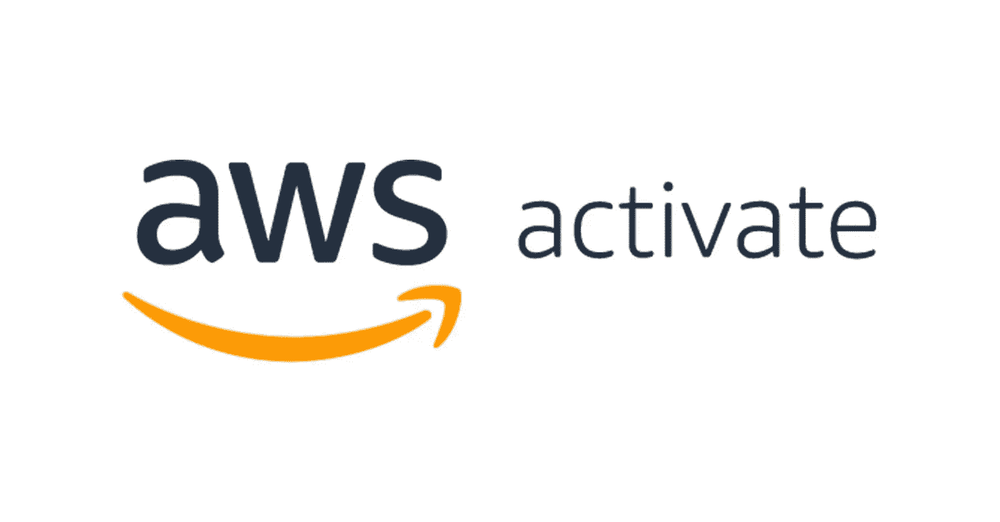

# 如何为你的下一个项目获得 1000 美元的 AWS 积分？

> 原文：<https://medium.com/geekculture/how-to-get-1000-in-aws-credits-for-your-next-project-227d0703e277?source=collection_archive---------9----------------------->

AWS(亚马逊网络服务)正在积极推动和支持创业公司。如果您正在构建任何新产品并希望使用 AWS 服务，您可以从 AWS 中获益。

AWS 有一个名为 AWS Activate 的计划，该计划旨在获得 AWS 对初创公司的支持。在这个程序中有两个选项。

第一种选择是处于早期阶段并希望从 AWS 获得初步支持的初创公司。此选项将为您从 AWS 获得 1000 美元的 AWS 服务积分。

另一个选择是规模较大或已经成为 AWS partnered included 计划一部分的初创公司。

在这篇文章中，我将向您展示如何获得 1000 美元的 AWS 积分来用于您的产品。

前往 AWS 控制台[https://console.aws.amazon.com/console](https://console.aws.amazon.com/console)并搜索“激活”。一旦你进入激活主页，你只需要通过添加关于你的创业公司、创始人和他们的 Linkedin 个人资料的所有细节来创建你的公司个人资料。

最后，AWS 将询问您需要 AWS 支持的字段，您可以填写您认为正确的任何内容(此选择仅供参考，在学分评估过程中不具有任何价值。)

提交回复后，AWS 团队将评估您的请求，如果一切顺利，您将在您的 AWS 帐户中获得 1000 美元的积分，您可以使用这些积分使用任何 AWS 服务，这些积分的有效期为 2 年。

AWS 团队还会打电话给创始人，询问 AWS 如何支持他们。我认为这是 AWS 的一个非常好的举措，可以支持那些处于初始阶段、需要资金支持服务器的初创公司。

> 注意:这不是任何推荐类型的帖子。我写这篇文章是为了让任何刚开始使用他们产品的创业者都能了解这个项目，并从 AWS 中获益。

如果你喜欢这篇文章。请考虑关注我关于技术、编程、创业和金融的文章。

干杯！