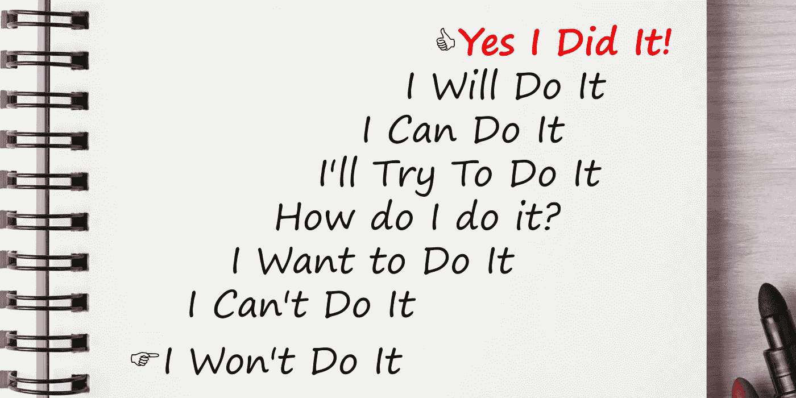
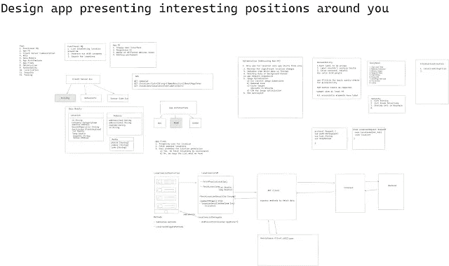

# 如何在苹果公司找到工作

> 原文：<https://medium.com/geekculture/how-to-get-a-job-at-apple-1cdb43a9b5be?source=collection_archive---------2----------------------->

## 破解手机工程师面试的终极指南

## 破解苹果 iOS 面试指南

作为工程师，我们都有梦想中的公司，我们想为之工作，并通过影响数百万人的生活而留下我们的印记。苹果是我一直想为之工作的梦想公司。我在这里…我成功了！以下是我的故事——这一切都要追溯到 2009 年我买第一部 iPhone 的时候。我只是爱上了产品的体验和易用性。就在那时，我决定学习 iPhone 应用程序开发，并制作这些漂亮的应用程序。因此，我在攻读硕士学位期间买了一台 Mac Book Pro，考虑到我的经济状况，这对我来说很难。但我很高兴我这样做了，十年后，我是一名成功的 iOS 开发者，现在将在苹果公司工作！

**我是这样准备的**

在我看来，当谈到对移动开发者的期望时，公司会在以下几个方面测试你:

**1。数据结构和算法**

这一部分着重于你思考、比较(权衡利弊)和用数据结构解决逻辑问题的能力。就时间和空间复杂性而言，每种数据结构都有不同的优点和缺点。数据结构的范围从简单的数组和字典(map)到复杂的树和图。我在第一次面试前准备了一个半月，每天在 Leetcode.com 上回答 5-10 个问题。

我的建议是:当你在准备之初练习编码问题时，尝试相同数据结构的问题，以便你真正理解某种数据结构及其细微差别。随后，将实践发展为包含一组跨越多个不同数据结构的混杂问题。

**2。手机 App 系统设计**

这一部分着重于你作为一名工程师从整体水平而非个别细节来看待/理解应用程序设计的能力。因此，您从一个高层次的视图开始，然后深入到各个组件。当我在网上浏览时，我找不到面向移动开发者的系统设计教程。所以我看了不同种类的系统设计面试教程，并制作了自己的定制脚本，这对我这个移动开发人员来说很有意义。这里是我用来解决系统设计问题的不同部分的概要。我发现它对大多数问题都有效。

这里是详细介绍这一点的博客的链接。

这里有一个快速浏览的例子，设计一个显示你周围有趣位置的应用程序。

1.功能需求——定义用例以及一些特性

2.非功能性需求—定义性能、体验和规模需求。

3.假设—定义问题的边界、任何规模限制、特征等。

4.客户端-服务器通信—定义连接选项，如 HTTP 请求、轮询、服务器端事件。

5.API 设计-为您正在构建的功能定义端点。

6.数据模型—定义对象的数据模型字段。

7.应用程序流(用例流)—定义并浏览您正在设计的功能的用户流。

8.性能和工具——定义您将如何收集数据和指标，以了解应用程序的性能——内存利用率、CPU 利用率。

9.ADA——确保您定义了辅助功能以及如何使应用程序具有辅助功能。

10.国际化——随着应用的国际化发展，你将如何应对？

11.安全性—定义如何保护应用程序。

**3。领域知识和语言能力**

这是公司试图衡量你用平台语言制作移动应用的熟练程度和经验的地方。(Swift，iOS 和 Java 的 Objective C，Android 的 Kotlin)。根据我的经验，公司通常会要求你从一个端点获取一些数据并显示出来。这个问题本身非常简单，一个刚开始做移动开发的人也可以做到。一个开发者与另一个开发者的区别在于你如何完成它。比如你的代码是否可读、模块化、可伸缩、遵循可靠的原则等等。这有助于确定开发人员的经验。

**4。行为**

我们在准备时往往不太注意这一部分。根据我在谈判桌两边的经验，这一部分可以决定交易的成败。大部分时间我们在团队中工作。对公司来说，与其他团队成员轻松共事是非常重要的。因此，当他们要求你分享一个你可能遇到的不同情况的故事时，他们正在寻找这些迹象。

我的建议是:坐下来谈谈你过去的经历，记下一些你引以为豪的事情，与一个难相处的人一起工作，与一个难相处的利益相关者相处，帮助一个团队成员取得成功。根据你的经历和你如何应对这种情况以及你取得的成果，准备好这些故事。把这些东西放在你的后口袋里会有所帮助，这样你就不用在面试时手忙脚乱了。这里有一个[链接](https://hackernoon.com/how-to-prepare-for-the-facebook-behavioral-interview-y64037c5)，可以帮助你做行为面试准备。

**什么真正有效**

以下是一些对我有用的方法。

**1。保持一致——一旦你制定了计划，就要坚持下去。你不会在一天或一周内看到你的准备所带来的影响，这将是你以后会经历的复合效应。把你的准备时间分成我上面提到的几个部分，你会越来越好。**

**2。相信你自己**——从我的个人经验来看，我可以说，有几天你会觉得它不起作用，但是相信我，你只需要再坚持一会儿。事情会解决的，坚持下去，相信自己，你能做到。

**3。模拟面试**——试着和你的朋友或你认识的人进行模拟面试，他们可以帮你找出准备工作中的漏洞。这些模拟会议真的很有帮助。这使得接受采访成为第二天性。

**结论**

获得你梦想中的工作是一场需要耐心和坚持不懈的游戏。继续努力工作，总有一天事情会发生，一切都会解决的。也要知道，如果不成功，那是最好的结果！你做的准备会在其他方面发挥它的魔力。