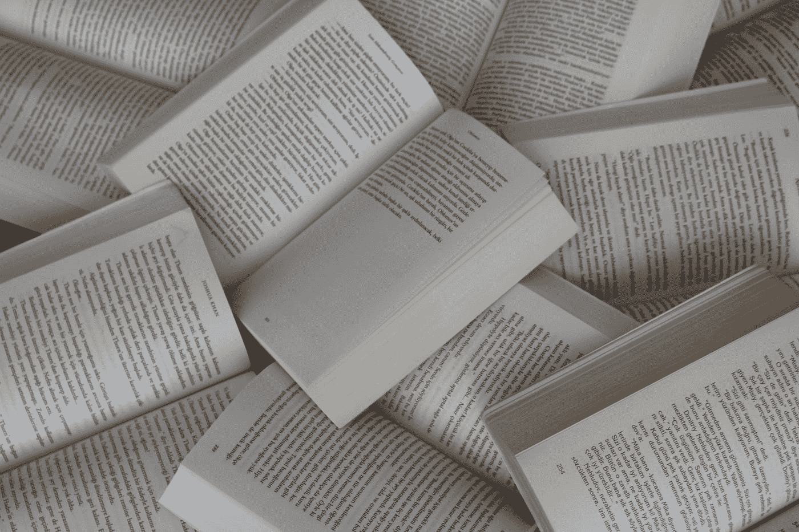

# 提高您的数据科学和机器学习技能的资源

> 原文：<https://medium.com/geekculture/how-to-get-better-in-data-science-and-machine-learning-in-2021-de6f377ca209?source=collection_archive---------54----------------------->

书籍和播客将帮助你在任何水平的经历中变得更好

> 作为一名自学成才的数据科学家和机器学习专家，我在该领域工作了 5 年多，我查阅了大量文献，以提高自己的技能，并成为一名有竞争力的 epxert。

Photo by [Gülfer ERGİN](https://unsplash.com/@gulfergin_01?utm_source=medium&utm_medium=referral) on [Unsplash](https://unsplash.com?utm_source=medium&utm_medium=referral)