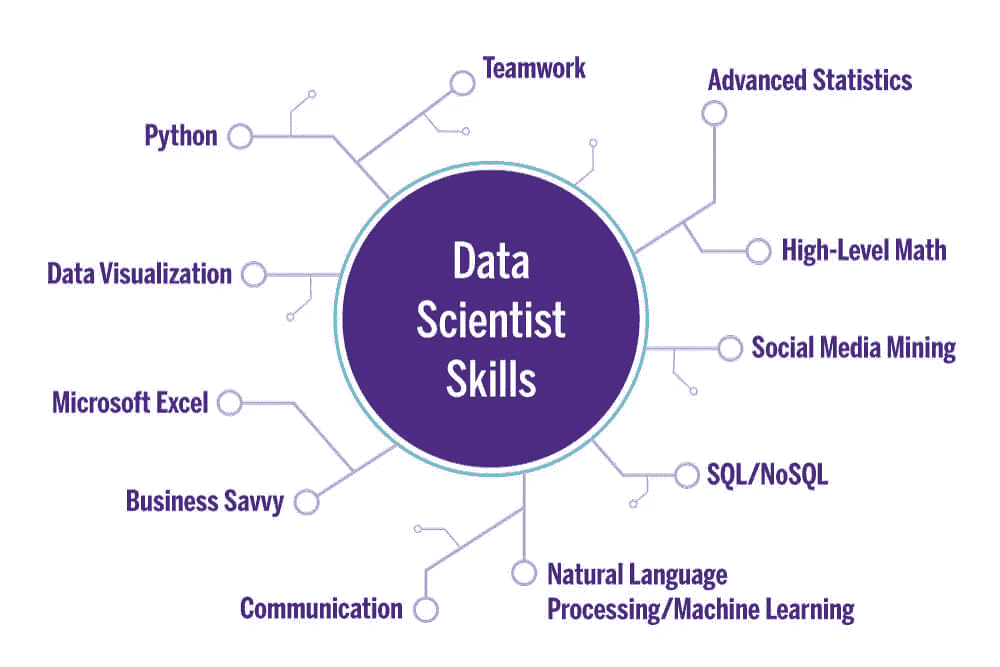

# 2022 年如何获得数据科学家认证？

> 原文：<https://medium.com/geekculture/how-to-get-certified-as-a-data-scientist-in-2022-3fa099e647e8?source=collection_archive---------9----------------------->

作为一名数据科学家，工作可能具有智力挑战性，分析令人满意，并能让你站在新技术进步的最前沿。随着大数据对组织的决策方式越来越重要，数据科学家变得越来越普遍，越来越受欢迎。一个有学问的 [***数据科学专业人士***](https://www.usdsi.org/data-science-certifications/certified-data-science-professional) *决定他们的团队应该问的问题，并找出如何使用数据来回答这些问题。他们经常为理论和预测开发预测模型。数据科学家每天都需要执行以下任务:*

ü *在数据集中寻找模式和趋势以揭示洞察力*

ü *创建算法和数据模型来预测结果*

ü *使用 ML 技术提高数据或产品的质量*

ü *向其他团队和高级职员传达建议*

ü *在数据分析中部署 Python、R、SAS 或 SQL 等数据工具*

ü *站在数据科学领域创新的最前沿*

> *根据 Glassdoor 的数据，截至 2022 年 4 月，一名经验丰富的* ***认证数据科学家*** *在美国的平均工资为 122，499 美元。美国劳工统计局表示，从 2020 年到 2030 年，对数据专业人员、数据科学家和数学科学职业的需求预计将增长 31%，对统计学家的需求将增长 33%。*

高需求与大数据的兴起及其对企业和其他组织日益增长的重要性有关。如果我们谈论任何职业，它需要一些基本的教育资格背景来建立你的职业生涯。在报名参加可信的认证之前，你需要学习所有的技能。有正确的**数据科学认证**在你身边，你就学会了；

o **数据管理** -数据摄取、操作、扩充和处理缺失值

o **探索性分析** -特征工程、数据分析、可视化和数据洞察

o **统计实验** -执行各种统计方法来解决类似的问题

o **机器学习** -预测模型、ML 工作流程、优化模型和实验

o **生产环境编码** -可重用代码、单元测试、模块化，并采用行业标准

o **沟通和报告** -在报告或仪表板中呈现数据，并向技术和非技术利益相关者提供关键信息

# 下面列出了成为数据科学家的快速而简单的技巧:

# **获得数据科学学位**

招聘人员通常希望看到一些学术证书，以确保你拥有应对数据科学工作角色的知识。相关的学士学位肯定有助于提升。

# **磨砺相关技能**

如果你觉得自己可以提高一些硬数据技能，可以考虑参加在线课程或参加相关的训练营。你想要掌握的技能包括编程语言、数据可视化、机器学习、大数据和沟通技巧。

# 获得一份入门级的数据分析工作

虽然成为数据科学家有很多途径，但从相关的入门级工作开始可能是一个良好的开端。寻找大量使用数据的职位，如数据分析师、商业智能分析师、统计师或数据工程师。

# **准备数据科学面试**

数据科学家的职位技术性很强，所以你可能会遇到技术和行为两方面的问题。诸如以下问题:

*线性模型有哪些利弊？*

*什么是随机森林？*

*您如何使用 SQL 查找数据集中的所有重复项？*

*描述你在机器学习方面的经历。*

*举例说明你遇到不知道如何解决的问题的时候。你做了什么？*

成为一名数据科学家可能需要一些培训，但一份受欢迎且具有挑战性的职业可能在隧道的尽头等待着你。互联网上有几个在线数据科学认证课程，但其中很少有真正值得您花费时间和精力的课程。 [**最佳数据科学认证**](https://www.usdsi.org/data-science-certifications) 来自***【USDSI】***、*麻省理工学院、斯坦福大学、哈佛大学*以及其他机构的认证承诺在数据科学领域一飞冲天。这些门户网站上的定时评估测试根据每个问题的复杂程度而有所不同。这些问题测试您使用 PostgreSQL 进行生产编码、统计实验和探索性分析的技能。它还涉及一个编码挑战，测试个人的编码技能和解决数据问题的能力。案例研究、技术报告和非技术演示是今后要遵循的步骤。

*毫无疑问是一个新兴行业，对* [***认证数据科学家***](https://www.usdsi.org/data-science-certifications) *的需求正在上升。它还要求进行质量培训和认证，以产生最优秀的* ***数据科学专业人员*** *。是时候正确评估您当前的技能组合，并选择最值得信赖的* ***数据科学认证*** *来推动您在 2022 年及以后的数据科学职业生涯。*