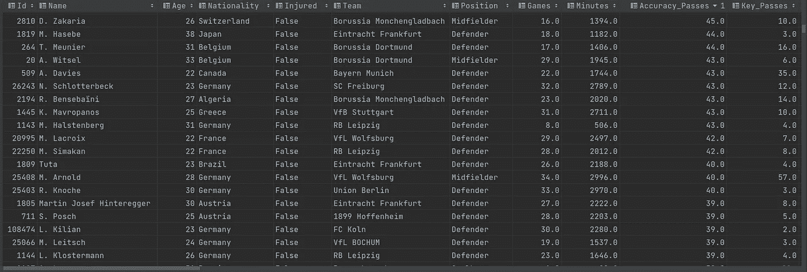

# 如何用 API 足球免费获取优秀的足球数据

> 原文：<https://medium.com/geekculture/how-to-get-excellent-football-data-for-free-with-api-football-1b37d2db5f71?source=collection_archive---------0----------------------->

Photo by [Mitch Rosen](https://unsplash.com/@focusmitch?utm_source=medium&utm_medium=referral) on [Unsplash](https://unsplash.com?utm_source=medium&utm_medium=referral)

你喜欢和**一起玩真实可靠的足球统计**关于你最喜欢的足球运动员、俱乐部或联赛吗？你想在你的足球经理锦标赛中获得更多关于足球运动员的统计数据并给你的同事留下深刻印象吗？或者你想通过 **API** 创建自己的足球数据集，并从可靠的来源获得真实数据？

也许你是一个足球迷，喜欢比较荷甲球员和土耳其超级联赛球员的准确传球。或者你可能是一名热情的球探，需要在丹麦超级联赛中寻找投篮命中率最高的年轻中场球员。

无论你需要收集足球数据的原因是什么，在这篇文章中，你将学会如何快速收集优秀的足球数据，而且是免费的。

# 哪里可以免费找到可靠的足球数据？

Photo by [Mika Baumeister](https://unsplash.com/@mbaumi?utm_source=medium&utm_medium=referral) on [Unsplash](https://unsplash.com?utm_source=medium&utm_medium=referral)

Bref、FiveThirtyEight、WhoScored 或 ELO 俱乐部是一些你可以免费获得可靠足球数据的网站。

你可以从这些网站抓取数据，或者使用提供这些数据的 API。[**API**](https://www.api-football.com/)**Football**project 是一款优秀的工具，可以帮助你快速创建一个立体的足球数据集。API 足球基于免费增值的商业模式。这意味着您可以通过基本计划免费享受它，如果您以后需要更多功能，您可以随时通过付费计划进行更改和升级。

# **我使用什么技术来消费 API？**

Photo by [Hitesh Choudhary](https://unsplash.com/@hiteshchoudhary?utm_source=medium&utm_medium=referral) on [Unsplash](https://unsplash.com?utm_source=medium&utm_medium=referral)

ython 绝对是我现在最喜欢的编程语言。在过去的几年里，我几乎在所有的项目中都使用 Python，因为它的强大和多功能性。有了 *pandas* 、 *requests* 和 *json* 包，您将拥有开发一个从 API 收集数据的简单脚本所需的大部分工具。

# 初始设置

F 首先，一个 **API 密匙**是强制性的，用来认证你是应用开发者。要得到一个，首先你必须注册到**快速 API 平台**。之后订阅 [API 足球数据](https://rapidapi.com/api-sports/api/api-football/pricing)应用的基本方案。此时，基本计划给你每分钟 30 个请求，每天最多 100 个请求。你将能够每天免费获得至少两个充满有价值信息的联赛数据集。

一旦你有了 API 密匙，就有可能与平台连接。*玩家*端点会向我们回复所有关于所选联盟*的*数据* *玩家*。我建议你查看[文档](https://www.api-football.com/documentation)来找到不同的选项。*

Players endpoint (see api football documentation)

Getting an API Football response

# 从你最喜欢的联赛中获取数据

Photo by [Tobias](https://unsplash.com/@herrzett?utm_source=medium&utm_medium=referral) on [Unsplash](https://unsplash.com?utm_source=medium&utm_medium=referral)

一旦你被认证，你将需要设置一个联赛标识符作为查询参数来获取该锦标赛的球员。你会在我的 GitHub 代码中找到一些标识符的例子。

您需要应用一些特征工程技术来转换几个列:Weight 和 Height。我用正则表达式提取了它们后缀的浮点值: *kg* 和 *cm* ，以便对它们进行运算。

Using regex with str.extract() function

Important to control request per minute and sleep process in BASIC plan.

# 创建数据集

Photo by [Mike Petrucci](https://unsplash.com/@mikepetrucci?utm_source=medium&utm_medium=referral) on [Unsplash](https://unsplash.com?utm_source=medium&utm_medium=referral)

当你从 API football(以及几乎所有的 REST API)获得数据时，你必须从 JSON 格式解析它。大概是这样的:

JSON format response example

我们的数据集有 38 列。目标是以 JSON 格式从 API football players 端点响应中获取所有这些数据。因此你必须用 python json 内置包解析 JSON 文档。

 [## 使用 Python - Real Python 中的 JSON 数据

### 在本教程中，您将学习如何使用 Python 读写 JSON 编码的数据。您将看到…的实际操作示例

realpython.com](https://realpython.com/python-json/) 

在本例中，我使用了一个 for 循环，在响应对象中返回了 *n* 个结果，其中每个结果都是一个玩家记录。在这段代码中，我们可以看到一些数据播放器。

Getting data from JSON response.

一旦所有数据都存储在内存中，我们需要将其保存为 csv 格式，以准备分析。您可以创建一个关系数据库并将其存储在那里，但在这种情况下，csv 文件可以帮助我稍后在 [google colab](https://colab.research.google.com/) 或 Jupyter 笔记本中进行 EDA，并轻松导入数据集。

您将在 get_api_data 函数中找到完成所有操作的三个步骤。

Get an API Key, get the data and save it.

# 结论

现在你知道如何从 API Football 平台获得真实和最新的足球数据，转换它们的一些属性，并创建一个包含你最喜欢的联赛的所有球员的数据集。

Bundesliga dataset

从现在开始，你可以对所有这些数据做很多事情:探索性数据分析，创建监督和非监督的机器学习模型(线性回归，分类等)。)或另一个具有更多深层统计信息的 API。

要查看和克隆代码，请进入我的 [**GitHub 资源库**](https://github.com/jordilucas16/api-football-data) 中的 *api-football-data* 项目。如果你觉得这篇文章有趣，我会非常感谢你的掌声。

*感谢[比安卡·霍夫曼](https://www.biancahofman.com/)在出版前编辑我的故事。