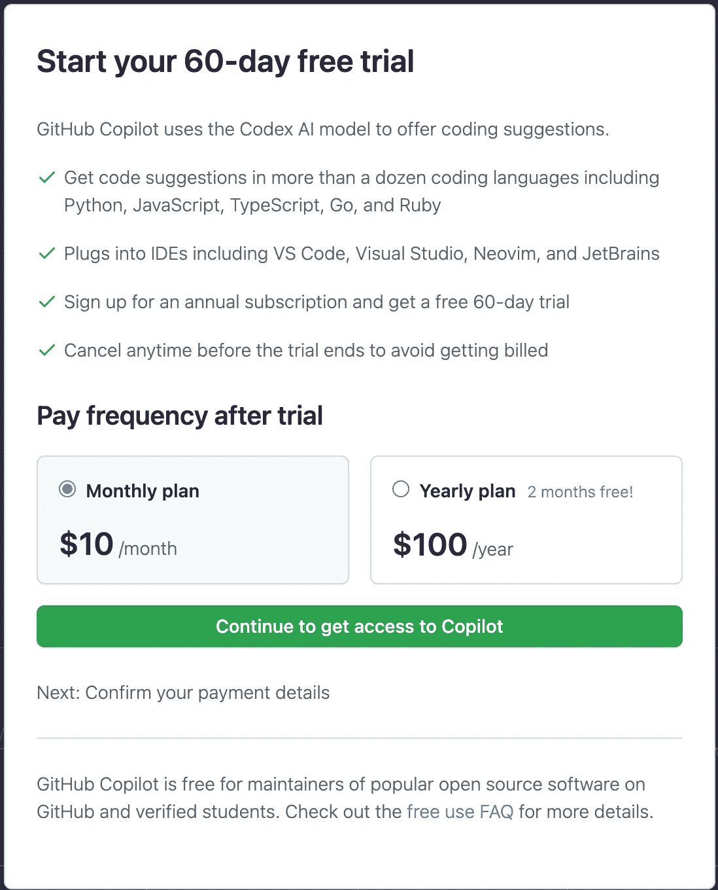

# 如何 100%免费获得 Github Copilot

> 原文：<https://medium.com/geekculture/how-to-get-github-copilot-for-100-free-d25c3b8c3ba4?source=collection_archive---------0----------------------->

相信大部分人都知道 Github 副驾驶是什么，万一你不知道，下面是解释。

" *GitHub Copilot 是一个 AI pair 程序员，可以帮助你更快地编写代码，并且工作量更少。它从注释和代码中提取上下文，即时提示单独的行和整个功能。GitHub Copilot 由 Codex 提供支持，Codex 是 OpenAI 创建的一种生成式预训练语言模型。它作为 Visual Studio 代码、Visual Studio、Neovim 和集成开发环境(ide)的 JetBrains 套件的扩展提供。*

你可以看下面我的视频来了解如何免费获得 Github 副驾驶，或者你可以阅读文章直到最后。

早期的 Github 副驾驶对所有预注册用户都是免费的，这是因为 Github 希望通过跨不同语言和代码库训练副驾驶的人工智能模型，使其尽可能对用户友好。现在 Github 的副驾驶已经达到了**26%左右的准确率。**现在 Github 认为开始对 Github 副驾驶收费是一个不错的准确度。

Github Co-Pilot 目前的订阅费用是多少:

【https://github.com/github-copilot/signup 

虽然这个软件是人类创造的一个辉煌的作品，但不是每个人都负担得起(大多数人习惯于获得免费软件)。所以，我找到了一个合法的途径，免费获得 Github 的副驾驶。

> 以下是免费获得 Github 副驾驶的步骤。

正如 Github 官方[文档](https://docs.github.com/en/billing/managing-billing-for-github-copilot/about-billing-for-github-copilot)中提到的。Co-pilot 对所有开源贡献者和学生都是免费的。

1.  **如果你对开源有很大贡献，**通过创建库或修复现有流行库中的错误。那么 Github 已经知道你了，当你尝试选择 Github 副驾驶订阅时，它将对你免费。
2.  或者，如果你是一名**学生**，就读于授予学位或文凭的课程，如高中、中学、大学、家庭学校或类似的教育机构，那么你可以免费使用 Github Co-pilot。Github 将获取您的教育详细信息并进行验证。如果您提供正确的详细信息，您将可以免费使用 Github Co-Pilot。
3.  **如果你已经在工作，并在某个地方攻读非全日制教育/文凭**，你可能有资格申请学生类别的执照**。但我不太清楚 Github 的审查流程，但值得一试。**

如果任何一个步骤对你不起作用，那么 Github Co-pilot 有多种开源替代方法，如果你想了解它们，请在评论区告诉我，我会写一篇文章解释所有这些方法。

如果你想亲自和我讨论模拟面试，面试或简历审核的技巧和诀窍，你可以在这里预约:

 [## 在 topmate.io 上预订与瓦桑特的时间

### 为世界顶尖人物简化个性化互动

topmate.io](https://topmate.io/vasanth_bhat) 

阅读愉快，下篇见。

同一作者的其他文章。

1.  [90%的人无法解决这个脸书面试问题](https://javascript.plainenglish.io/90-of-you-will-fail-to-answer-solve-this-facebook-interview-question-part-1-282b93e535e1)
2.  [Github 副驾驶终于对所有人开放](https://mevasanth.medium.com/finally-github-co-pilot-is-open-to-all-6804df457a95)
3.  [解决 Meta、亚马逊、谷歌、苹果、微软前端开发者面试问题](/geekculture/solve-meta-amazon-google-apple-microsoft-frontend-developer-interview-question-f492eed948c7)
4.  [解决最近脸书前端开发者面试问题](/geekculture/solve-recent-facebook-frontend-developer-interview-question-4d1b4f73bfa)