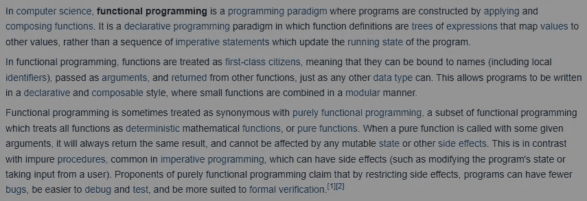
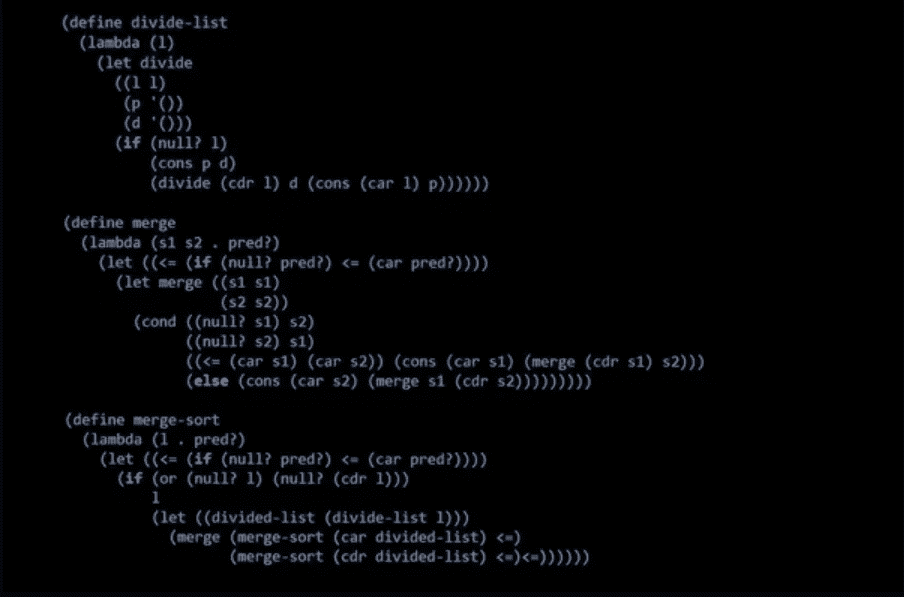
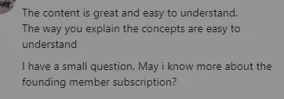

# 如何擅长递归

> 原文：<https://medium.com/geekculture/how-to-get-good-at-recursion-377a64ed65bc?source=collection_archive---------4----------------------->

## 对于您的 FAANG 面试、工作或竞争性编码

递归是很多人纠结的话题之一。在我接触过的许多人当中——通过我的时事通讯、辅导或面对面的交流——这一直是人们最纠结的话题之一。递归似乎既极其琐碎又非常不自然。然而，这是一个至关重要的话题。无论是在编码面试中，还是在技术之旅中，你都需要它。不仅递归本身很重要，而且许多数据结构、算法和范例(回溯、动态编程)都依赖于递归。因此，你必须擅长它。


This is a relatively common problem for many people. If you struggle with these topics, check out my newsletter [https://codinginterviewsmadesimple.substack.com/](https://codinginterviewsmadesimple.substack.com/), proven to get results.

幸运的是，有一种保证的方法可以让递归变得更好。这将为你工作，不管你有多少努力。这种技术可以追溯到递归的根源，并让你的头脑以递归的方式思考。与你将听到的标准的“做很多递归问题，兄弟”相比，这将节省你很多时间。让我们开始吧。

# 为什么人们纠结于递归？

我们的大脑天生不适合递归思考。我举个简单的例子。想象一下，我让你对一个列表的元素求和。大多数人会这样写:

```
def sum(lst):
  sum=0
  for i in lst:
    sum+=i
  return sum
```

这是一个非常好的方法。我敢打赌，你们谁也没想到这一点:

```
def sum(lst, sum=0):
  if lst==null:
   return sum
  else:
   return (lst[1:], sum+lst[0])
```

为什么不呢？简单地说，这不符合我们的思维方式。迭代和循环与我们处理世界的方式更加一致。然而，这可能会在我们没有准备的时候咬我们一口。递归解决方案可能非常优雅，尤其是当涉及到与树、图和回溯相关的某些 DSA 时。更不用说，有些事情是不能用简单的循环来完成的(实际上我将会讲述一个非常有趣的故事，[所以注册邮件列表来保持更新](https://codinginterviewsmadesimple.substack.com/))。那么，让你成为递归坏蛋的灵丹妙药是什么呢？

# 进入功能编程

准备好迎接一次旅行吧。因为事情会变得非常非常奇怪。我要向你介绍一种彻底击垮我的编程方式。它被称为函数式编程。你可以在这里观看这个精彩的视频来了解细节。



Look at all the jargon. There is a lot of theory behind functional programming, which can make it overwhelming without somebody experienced to guide you.

关于函数式编程为何不同，我不会过多地涉及技术细节。不过，我会告诉你一些重要的方法:

1.  函数式编程没有变量。绝对没有。我们声明这些值，然后对它们调用一些函数。这样做是为了不改变机器的“状态”。
2.  我们可以将函数作为参数传递给其他函数。这可能非常强大，并且允许非常小的紧凑代码。
3.  没有循环。函数式编程用递归解决一切问题。
4.  函数式编程中的函数被视为数学中的函数。它们接受一个输入并返回一些输出。就是这样。

如果我只是进入函数式编程的技术细节，我将需要几个小时来解释其中的细微差别。相反，让我们保持事情简单，而是集中在如何使用它来提高你的递归技能。

# 函数式编程实现更好的递归

是时候进入这篇文章的高潮了。如何变得擅长递归？第一步是选择一种函数式语言。我个人推荐 Lisp(如果你想进入人工智能领域，它会对你有所帮助)或者 Haskell(包括脸书在内的几家大公司都在使用它)。如果你找到另一种更好的函数式语言也没关系。他们中的任何一个都会为我们的目的而工作。


接下来，试着用函数风格写出一些有趣的函数。我建议用函数风格写一些代码。这会让你用功能的方式思考。我建议研究以下内容:

1.  列表的排序、搜索、反转和长度。合并列表是另一个好方法。
2.  列出数学。包括向列表中的所有值添加值、对列表的元素求和等。
3.  阶乘、阿克曼和其他经典递归函数。

这些都会是提高你基础的良好基础。它们可能看起来微不足道，但是相信我，以一种功能性的方式来做它们会对你有很大的帮助。它将创建一个递归逻辑的坚实基础，让你从 Leetcode 问题中学到很多。



This might seem very strange at first, but functional programming is great for building recursive logic.

这是我告诉我所有的学生在准备编码面试时要做的事情。结果不言自明:


One of many success stories. Check out my other articles if you are preparing for your coding interviews.

为了得到最好的结果，请查看我的每日简讯，[编码采访变得简单](https://codinginterviewsmadesimple.substack.com/)。它涵盖了算法设计、数学、最近的科技事件、软件工程等主题。[你可以在这里查看时间表。高级订阅每天仅花费 33 美分(26 印度卢比),并取得了巨大的成果。](https://codinginterviewsmadesimple.substack.com/p/new-newsletter-structure?r=4tnbw&s=w&utm_campaign=post&utm_medium=web)


This had amazing ROI. Subscribe now for a 20% discount

我创造了[编码面试，使用通过指导多人进入顶级科技公司而发现的新技术，使面试变得简单](https://codinginterviewsmadesimple.substack.com/)。时事通讯旨在帮助你成功，避免你在 Leetcode 上浪费时间。加入一个程序员社区，通过订阅提高他们的技能并在面试中脱颖而出。



The newsletter has helped a ton of people succeed in tech

为了帮助我写更好的文章和了解你[填写这份调查(匿名)](https://forms.gle/7MfQmKhEhyBTMDUD7)。最多花 3 分钟，让我提高工作质量。

如果你也有任何有趣的工作/项目/想法给我，请随时联系我。总是很乐意听你说完。

以下是我的 Venmo 和 Paypal 对我工作的金钱支持。任何数额都值得赞赏，并有很大帮助。捐赠解锁独家内容，如论文分析、特殊代码、咨询和特定辅导:

https://account.venmo.com/u/FNU-Devansh

贝宝:【paypal.me/ISeeThings 

# 向我伸出手

使用下面的链接查看我的其他内容，了解更多关于辅导的信息，或者只是打个招呼。另外，查看免费的罗宾汉推荐链接。我们都得到一个免费的股票(你不用放任何钱)，对你没有任何风险。因此，不使用它只是失去免费的钱。

查看我在 Medium 上的其他文章。:[https://rb.gy/zn1aiu](https://rb.gy/oaojch)

我的 YouTube:[https://rb.gy/88iwdd](https://rb.gy/88iwdd)

在 LinkedIn 上联系我。我们来连线:[https://rb.gy/m5ok2y](https://rb.gy/f7ltuj)

我的 insta gram:[https://rb.gy/gmvuy9](https://rb.gy/gmvuy9)

我的推特:[https://twitter.com/Machine01776819](https://twitter.com/Machine01776819)

如果你正在准备编码/技术面试:[https://codinginterviewsmadesimple.substack.com/](https://codinginterviewsmadesimple.substack.com/)

获得罗宾汉的免费股票:[https://join.robinhood.com/fnud75](https://www.youtube.com/redirect?redir_token=QUFFLUhqa0xDdC1jTW9nSU91WXlCSFhEVkJ0emJvN1FaUXxBQ3Jtc0ttWkRObUdfem1DZzIyZElfcXVZNGlVNE1xSUc4aVhSVkxBVGtHMWpmei1lWWVKNzlDUXVJR24ydHBtWG1PSXNaMlBMWDQycnlIVXNMYjJZWjdXcHNZQWNnaFBnQUhCV2dNVERQajFLTTVNMV9NVnA3UQ%3D%3D&q=https%3A%2F%2Fjoin.robinhood.com%2Ffnud75&v=WAYRtSj0ces&event=video_description)