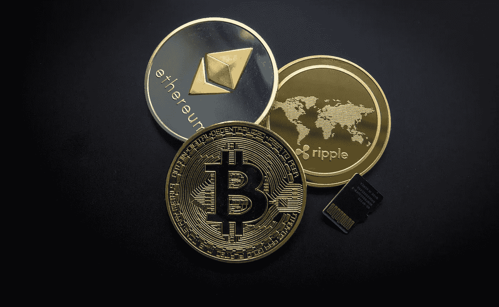

# 如何开始交易加密

> 原文：<https://medium.com/geekculture/how-to-get-started-trading-crypto-ea253360f592?source=collection_archive---------21----------------------->

如果你只是听说过比特币和以太坊等加密货币，并想了解更多，或者如果你已经拥有其中一些货币，但不知道下一步该怎么做，这篇文章适合你。

这篇文章将解释:

什么是加密货币？它们是如何产生的？是什么让它们如此有价值？应该投资哪些？我怎样才能交易它们呢？

关于加密交易所的快速说明——随着 Mt. Gox 最近的内爆，许多人已经不再相信交易所是存储加密货币的安全场所。的确，像这样的黑客攻击造成的损失经常会毁掉人们的全部投资组合。也就是说，虽然加密空间正在以惊人的速度增长，但通过在许多可用的交易所进行交易来参与进来还不算太晚。小心点，先做好调查。

# 加密货币是真实货币吗？

不完全是。事实上，它们根本不是货币。它们是数字资产，这意味着它们纯粹以电子形式存在，而不是由任何政府或其他法律实体(如央行)或黄金等商品创造或支持。相反，加密货币的价值来自稀缺性(如黄金)和有用性(如美元)，还有一个额外的好处是，假设你有互联网服务，它可以通过一个分散的计算机网络几乎即时转移。

# 加密货币是如何创造的？

加密货币背后的基本概念是，它们是数字化、去中心化的货币形式。在大多数情况下，这些货币是通过一个称为挖掘的过程创造出来的，这实质上是一种解决复杂数学难题的行为，以便验证和记录区块链中的交易，这些交易构成了货币的公共分类账。这一过程确保没有任何一个实体或个人能够控制或操纵货币。这些难题如此具有挑战性，以至于你可能要花好几年才能解决它们，结果，你会把它们藏起来留给自己。

# 它们为什么有价值？

有几十种密码，每种都有不同的属性，如价值和效用，以及不同水平的增长潜力。因此，它们不仅相互竞争市场份额和贸易量，而且还争夺公众的注意力。然而，在所有这些硬币中，比特币和以太坊是目前最受欢迎的。事实上，许多人认为，鉴于它们目前的市值，它们可能是我们这个时代最重要的数字资产。那么是什么让这两种货币如此值钱呢？

比特币自 2009 年以来就已经存在，是加密货币的早期先驱之一。这些年来，它的价值和交易量也有一些稳定的增长，这使它成为投资者的避险货币(相对于其他任何货币)。然而，它最重要的方面是它是分散的。由于没有中央银行控制，如果你有一些 BTC，你持有你的钱的私人钥匙，而不是“可信的第三方”可以锁定它或从你那里偷走它。如果这些中央系统真的遭到黑客攻击(或者只是受到政府监管)，你的钱就没了。如果你不想对它的价值抱有任何侥幸心理，比特币就是你的选择。

另一方面，以太坊对于那些愿意投资被许多人称为 2017 年最热门的替代硬币(altcoin)的人来说，具有一些不可思议的潜力。这是因为它基于支持比特币的相同技术，“区块链”。简而言之，以太坊有潜力做任何事情，从提高股票购买效率到实现几乎任何东西的智能合约。它最大的卖点是它可以作为一台“微型计算机”,使用区块链技术执行点对点合同。这意味着企业将能够通过以太坊的网络运行分散的应用程序，并使用以太(以太坊的货币)支付服务费用。

就像比特币一样，你可以用美元购买乙醚，它是分散的，所以你不必担心任何法律实体控制或审查你的交易。然而，以太坊最大的不同在于它提供了成为全球计算机的潜力。因此，比特币的价值和用途可能会在未来几年大幅上升，而比特币的价值和用途则较为有限。如果你有兴趣投资以太坊，可以在比特币基地或其他交易所购买以太(比特币杂志有交易所列表)。

# 应该买哪些加密货币？

现在，你对加密货币及其创建方式有了更多的了解，是时候选择你想要投资的硬币了。选择硬币时，最好的建议是看它的基本面。在这个层面上，比特币的价值基于其技术和效用。它的市值也很小，这意味着更少的供应意味着更高的需求，从而推动其价值上升。

另一方面，以太坊更依赖于开发者为当前正在开发的用例创建智能合约。如果开发人员的数量在未来几年大幅增长，以太坊就有可能像其他加密货币一样腾飞。也就是说，鉴于企业在比特币区块链的基础上实施智能合约有多困难，现在采用比特币不如比特币实用(尽管你可能会购买以太，然后投资于使用以太坊作为软件平台的初创公司)。

如果你想投资以太坊，那就去比特币基地或其他交易所购买以太吧。如果你想获得更多的机会，投资其他加密货币，有几件事你需要考虑。首先，不要把所有的鸡蛋放在一个篮子里，把所有的钱都投入到 BTC 或 ETH。这个想法是，如果一种货币表现良好，其他货币也会如此(至少暂时如此)。因此，多样化是关键。

如果你对其他密码感兴趣，看看哪些交易量最高，并对它们进行一些投资。一个很好的资源是 Coin Market Cap，它列出了所有不同的加密硬币及其当前的市值(价格乘以硬币总数)和过去 24 小时的交易量。如果你想直接进入，在加密查找器上查看一些替代硬币。

如果你想更多地参与加密货币的日常交易，请查看这篇 Reddit 帖子，了解世界各地可用的交易所的信息。如果你正在寻找你所在地区的本地交易所，尝试硬币自动取款机雷达找到你附近的比特币自动取款机。最后，如果你想了解以太坊昨天的表现，请看下面的图表:

如果你有兴趣了解更多关于 ico 的知识，请查看 Investopedia 上的这篇文章。它提供了更多的背景信息，解释了为什么商业人士可能想要投资它们。

如果你觉得我的内容令人愉快，请随时关注我的 [Patreon](https://www.patreon.com/arsenkay) 每周分析和访问我的加密组合。