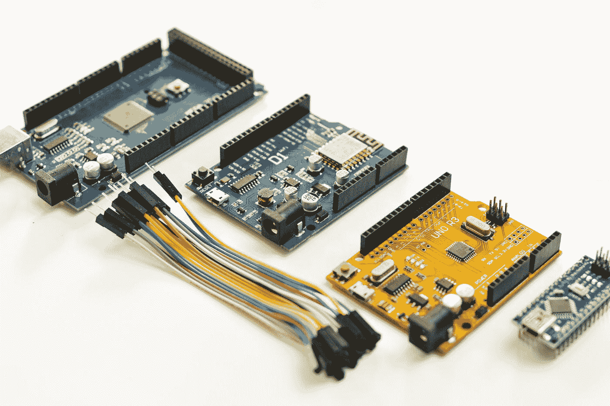

# 爱好电子如何入门

> 原文：<https://medium.com/geekculture/how-to-get-started-with-hobby-electronics-8ae0aef8468?source=collection_archive---------8----------------------->

## 不确定从哪里开始以及需要什么？这是您的完整路线图！

Photo by [Frank Wang](https://unsplash.com/@nicetomeetyou?utm_source=medium&utm_medium=referral) on [Unsplash](https://unsplash.com?utm_source=medium&utm_medium=referral)

从建造调频无线电发射机到可以穿透塑料和木材的自制激光器，可以让小物体随着声音漂浮的声学悬浮装置，到太阳能手机充电器，所有这些项目以及更多项目都是原因…