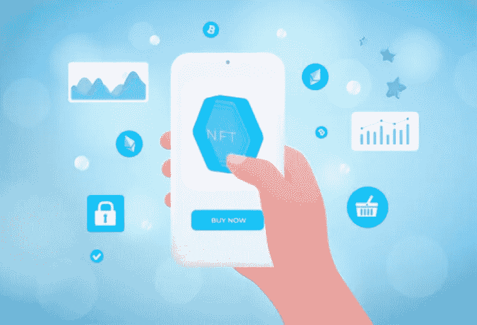
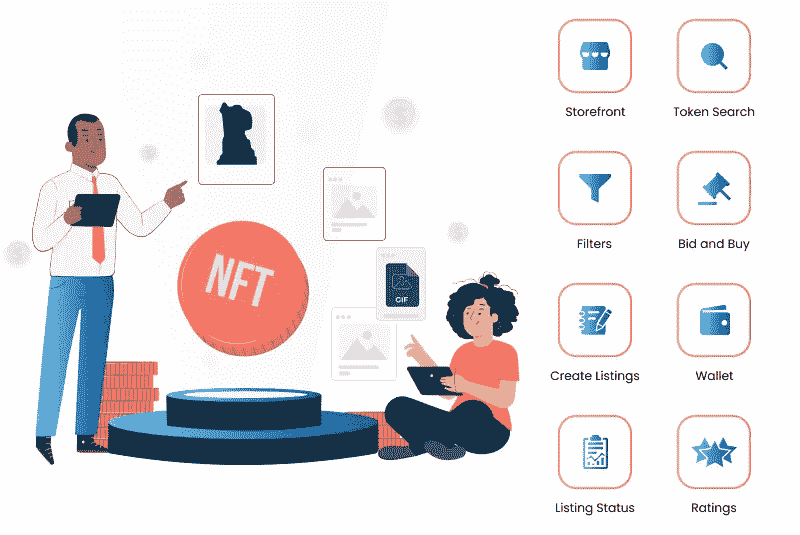

# 如何开始开发 NFT 市场？[故障分析]

> 原文：<https://medium.com/geekculture/how-to-get-started-with-nft-marketplace-development-breakdown-analysis-341e2c764e19?source=collection_archive---------8----------------------->

NFT 市场正在扩大，导致 NFT 销量快速增长。数字创造者和投资者的比例都在大幅度增加。每当 NFT 推出时，NFT 的狂热分子就会蜂拥而至，想要得到它们。非金融交易的更大财富正驱使企业家支持 NFT 交易。NFTs 提供的广泛范围不断激励个人在 NFT 市场留下他们的印记。这里有一个最佳的方法，通过它你可以迅速地打好基础。

[**NFT 市场开发**](https://www.appdupe.com/nft-marketplace-development) 让你为个人推出一个交易 NFT 的平台。这篇博客将带你了解建立一个成功的 NFT 企业的最佳标准。

# NFT 市场细分分析

NFT 市场是一个为铸造和交易不可替代代币建立论坛的平台。像所有的产品和物品一样，非金融交易也需要一个专门的交易平台。NFT 平台被分配用于各种与 NFT 相关的服务。它培育了一系列服务，如创造、铸造、标记、销售、购买和投标。数字创作者将在平台中将他们的资产标记为 NFT。

在 NFT 交易中，有两种方法来实现它们。国家森林公园既可以购买，也可以拍卖。但在大多数情况下，NFT 是拍卖的，个人会对 NFT 出价。另一种选择是以固定价格购买 NFT。你可能想知道企业家会从 NFT 市场得到什么好处？对于每一个 NFT 服务，人们从平台上采纳；这将为平台所有者带来巨大的收入。从非上市公司上市到销售，企业家们将会回报以巨大的收入。现在你应该明白为什么启动 NFT 市场将是一个有利可图的生意。

## NFT 市场的动态

在开发 NFT 平台时，为最终用户引入用户友好的功能非常重要。我们现在正确地理解了 NFT 平台的工作模式。

*   在 NFT 市场要做的第一件事就是在平台上注册。他们可以通过提供他们的用户凭证和通过 KYC 迅速注册。
*   接下来，用户应该注册一个加密钱包，并将其与平台连接起来。
*   创作者可以在平台上上传他们的数字作品，并将它们铸造成不可替代的代币。他们可以给出描述和价格。
*   一旦 NFT 铸造出来，就可以在平台上挂牌出售或竞价。
*   感兴趣的买家可以选择出价和购买。如果他们选择购买，他们可以以固定的价格购买 NFT。
*   竞价过程结束，平台会通知创作者和投资人双方。
*   该平台中的智能合约将把加密货币和 NFT 从卖家的钱包转移到买家的钱包。

# 如何开始发展 NFT 市场？

要开始你的 NFT 市场发展，规划是在这个旅程中引导你的最好的事情。以下是您必须遵循的步骤，以便快速开发您的 NFT 平台 ，

## 决定你的定位

这一步，你必须决定你将专注于 NFT 平台的利基。由于 NFT 的用例非常广泛，您可以对它们进行评估，并最终确定一个完全符合您需求的用例。这是一个集思广益的地方，你在 NFT 创业的想法会在这里迸发出来。但是，您可以最终确定 NFT 平台运行的域。这是发展的基础。

## 关注你平台的 UX/用户界面

在创建 NFT 市场时，UX/UI 架构扮演着重要的角色。用户界面应该是简单的和用户友好的，这样用户会发现在你的平台上导航很容易。所以要更加重视为你的平台开发一个用户友好的界面。

## 前端开发

当你对你的 NFT 平台的 UI/UX 很清楚的时候，把注意力放在前端开发上。你可以采用一个可靠的框架，与你的 NFT 市场目标携手并进。

## 智能合同开发

现在平台前端定型后，是时候专注于你平台的后端开发了。后端开发可以通过选择正确的区块链网络和使用智能合同来快速进行。有几个区块链网络，您可以为您的平台选择一个可靠的网络。

## 测试您的平台

开发完 NFT 市场后，您可以测试运行您的解决方案来消除其中的缺陷。消除这些错误将有助于您的平台高效运行。这项工作完成后，您就可以向公众发布您的 NFT 平台了。

# NFT 市场的显著特征

当你推出 NFT 平台时，它应该是强大的，具有突出的功能，将支持市场的平稳运行。下面是您的平台需要考虑的特性列表，

**店面**——这是一个主要特征，将作为吸引用户到你的平台的基础。它应该列出所有关于 NFT、它们的历史和交易的重要信息和细节。

**高级搜索** —高级搜索选项将使用户能够通过提供 NFT 的相关详细信息来搜索 NFT。他们还可以根据自己想要的类别过滤搜索结果。

**创建列表** —在铸造令牌后，创建者可以在平台上列出他们的 NFT。他们可以对它进行描述，并列出它的价格。

**加密钱包集成** —用户应该首先注册一个加密钱包。这个加密钱包可以与存储和交易 NFTs 的平台集成。

**评分** —交易者可以在平台上进行评分并分享他们的评论。这将有助于其他用户了解 NFTs 的标准。

**出售和出价** —创作者有多种选择，他们可以在出价和出售之间进行选择。如果他们不想以固定价格出售非森林交易，他们可以选择投标。

## 包裹

通过适当的计划和执行发展 NFT 市场。作为一名企业家，你必须寻找 [**最佳 NFT 市场开发公司**](https://www.appdupe.com/nft-marketplace-development) 来推出 NFT 平台。但是，如果能选择白标方案就更好了。