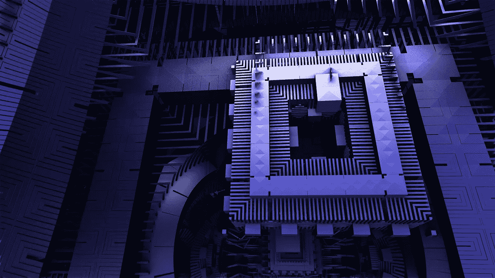
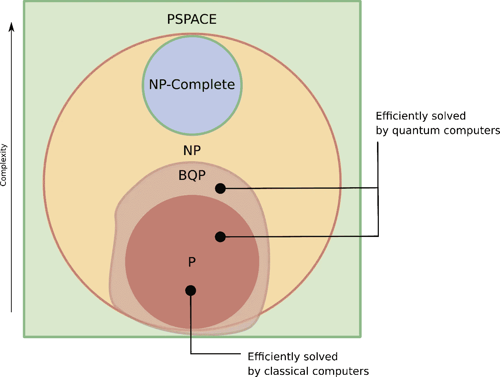
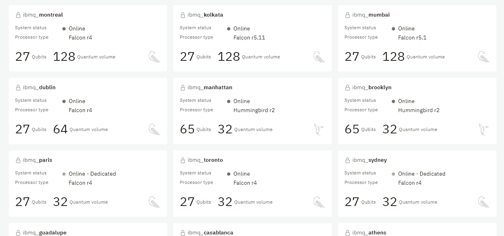

# 如何开始量子计算

> 原文：<https://medium.com/geekculture/how-to-get-started-with-quantum-computing-8318f7da999b?source=collection_archive---------30----------------------->

朋友们好！欢迎阅读我正在撰写的另一篇文章，内容是关于量子计算，它与经典计算有何不同，量子计算机相对于经典计算机的优势，以及如何在 IBM 量子计算机上模拟实验。我们开始吧

Image by Pete Linforth from Pixabay

在经典计算中，我们使用二进制数字系统，信息存储在由状态 0(关)或 1(开)表示的位中。我们在这些位上使用布尔逻辑来实现问题解决方案。我们有像与非门、或非门等通用门，帮助实现布尔逻辑。在低级电路设计中，这些状态被实现为晶体管，其作用类似于执行开或关操作的开关。我们智能设备中的电子电路包含数十亿个充当开关的晶体管，这些晶体管将实现布尔逻辑来执行计算。我们觉得在经典计算世界里一切似乎都很好，但它有自己的局限性。

首先，经典计算机可以解决属于复杂类**【P】**(一台经典计算机能快速解决的所有问题)的问题，验证已经解决的**【NP】**复杂类问题的答案(所有经典计算机不一定能快速解决，但如果给出一个答案就能快速验证一个答案的问题)。

其次，根据摩尔定律粗略地说**计算能力每两年翻一番**，这正在慢慢走向终结，因为与**进一步小型化**相关的根本性技术壁垒。

最后，AI/ML 模型训练需要巨大的计算能力，然而，计算能力持续时间(摩尔定律)的**增加远小于 AI/ML 模型训练计算能力持续时间**的**增加。说到这里，我们将在下面讨论量子计算能提供什么。**

另一方面，量子计算使用**量子位**，它基于量子力学原理工作，如**叠加和纠缠**。叠加——量子系统可以同时存在于**一个或多个状态**。例如，当我们抛出一枚无偏的硬币时，它可以有两种状态:“头”(H)或“尾”(T)。然而，在量子世界中，一枚硬币可以同时存在于“头”和“尾”两种状态。纠缠—**—在一些多粒子叠加态中，一个粒子的状态测量会使其他粒子的状态坍缩**,即使它们位于宇宙的两端。

量子计算的一个特殊优势是由于叠加原理——**使用 n 个量子位的量子计算机并行进行(多达)2^n 计算**。如果我们在计算的基础上使用每个状态的概率振幅来表示 n 个量子位的状态，则存在 2^n 这样的概率振幅。

其次，来到复杂性类，一个新的复杂性类称为 **BQP“有界误差量子多项式时间。”**这包含了量子计算机可以有效解决的所有决策问题——带有是或否答案的问题。另外，除此之外，量子计算机可以解决经典计算机所能解决的所有问题。简而言之，我们可以说 BQP 是 p 的子集

Image from quantum-bits.org

最后，量子计算在各种领域有如此多的应用，如量子化学、量子通信等。其中一个领域是量子机器学习，它可以**加快机器学习**并帮助我们**更快地训练我们的模型。**

到目前为止，我们了解了经典计算机的局限性以及量子计算机如何解决这些局限性。量子计算机确实比经典计算机贵，但是我们可以免费使用。

我们是这样做的。你可以访问[https://quantumcomputing.ibm.com](https://quantum-computing.ibm.com/services?services=systems)并为自己创建一个账户，在那里你会看到目前可用的真正的量子计算机，你可以在你的 IBM 量子 SDK — **Qiskit** 程序中使用它们。我会发布一个如何入门 Qiskit 的教程。

这里是 IBM Quantum 网站上直播的量子计算机列表。

Image from IBM Quantum website

感谢您花时间阅读我关于量子计算的博客。如果你喜欢，请鼓掌支持，并关注我以获得更多与量子计算相关的文章。