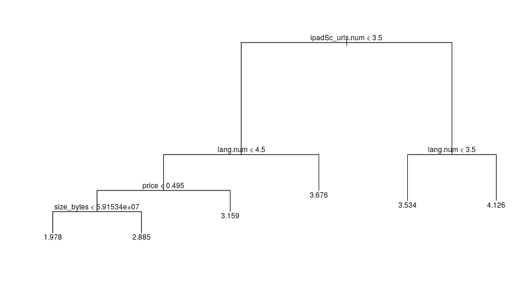
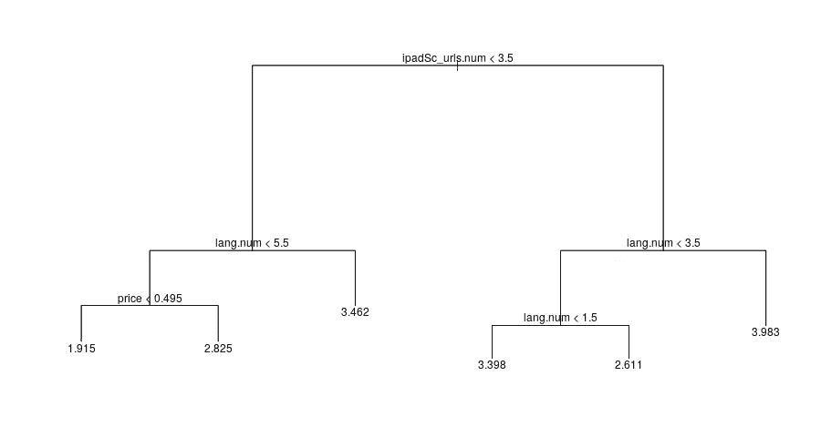

# 如何让你的 IOS 移动应用在 App Store 上排名靠前？

> 原文：<https://medium.com/geekculture/how-to-get-your-ios-mobile-apps-ranking-higher-on-app-store-73840b20313f?source=collection_archive---------25----------------------->

## 你花时间为 iPhone 或 iPad 创建了一个移动应用程序，但如何确保其他人能找到它呢？

Photo by [James Yarema](https://unsplash.com/@jamesyarema?utm_source=medium&utm_medium=referral) on [Unsplash](https://unsplash.com?utm_source=medium&utm_medium=referral)

据统计数据显示，2021 年第一季度，苹果应用商店有 220 万个移动应用。

因此，试图找到一个应用程序就像大海捞针。考虑到特定类别和总数中的移动应用数量，下载次数最多的应用往往会出现在搜索结果的顶部，这并不奇怪。

你可以做一些事情来提高你的应用在 App Store 中的排名，比如在你的应用的标题和描述中使用正确的关键词。但最终，你的应用程序的排名会受到用户的想法和下载次数的影响。

换句话说，你的应用程序的用户评分越高，下载量越大，你的移动应用程序在应用商店的排名就越高。

用户评分和下载量似乎是你无法控制的因素。好消息是，由于数据科学，有可能对你的移动应用程序是否被下载和获得良好评级产生影响。

我使用统计编程语言 r 对超过 7000 个 iOS 移动应用进行了[分析。考虑了以下属性:](https://www.kaggle.com/drpjeyaraj/app-attributes-versus-user-rating-price/data)

*   大小(字节)
*   价格(美元)
*   所有版本的用户评分计数
*   当前版本的用户评级计数(在数据集发布时)
*   所有版本的平均用户评分
*   当前版本的平均用户评级(在发布数据集时)
*   显示的屏幕截图数量
*   支持的语言数量

Classification tree showing relationship between attributes and average user rating across all versions

事实证明，促成更高平均用户评级(在应用程序的所有版本中)的最重要因素是应用程序列表显示中的屏幕截图数量和支持的语言数量。

受支持语言数量的重要性是有道理的。一个应用程序可用的语言越多，理论上使用它的人就越多。

截图的数量很重要，可能是因为它表明了一个应用程序的外观和感觉。那些下载应用程序的用户很可能已经对它有了正面的看法。问题是这款应用的使用是否符合市场营销。

理想情况下，应该有三个以上的截图和三个以上的支持语言，以达到平均用户评分约为四。

如果有三个或更少的截图，那么应该有四种以上的支持语言，以实现所有版本的应用程序的平均用户评级。

单看当前版本的应用程序，截图的数量比支持的语言数量更重要。奇怪的是，当屏幕截图超过三张，但支持的语言数量为三种或更少时，只支持一种语言的应用程序似乎比支持两种或三种语言的应用程序表现更好。

Classification tree showing relationship between attributes and average user rating of current version

有趣的是，应用程序的价格和大小并不是用户平均评分的重要指标。然而，一个成本超过 50 美分、大小超过 50 兆字节的应用程序似乎比更便宜或更小的应用程序表现稍好。

谈到定价，价格与截图数量、应用程序大小、支持的语言数量和支持的设备数量之间的关系很弱。随着支持的设备或语言数量的增加，价格会下降——这可能是因为它们允许更多的人使用应用程序，所以更低的价格是可行的。随着应用程序大小或截图数量的增加，价格也会增加——这可能是因为功能增加了。