# 如何给自己的 iPhone 改头换面？

> 原文：<https://medium.com/geekculture/how-to-give-your-iphone-a-makeover-9ad6fedf136a?source=collection_archive---------24----------------------->

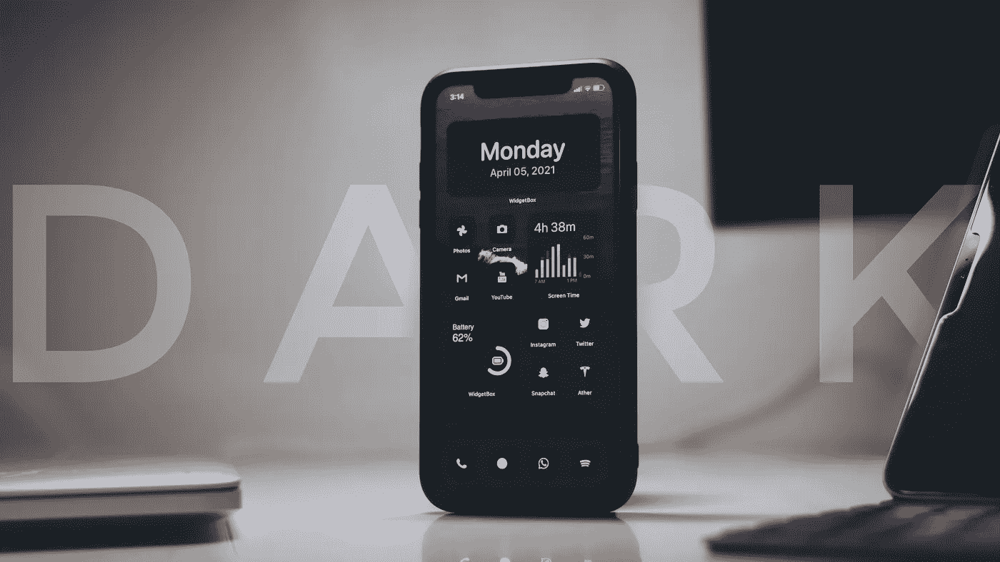

几年前，定制你的 iPhone 特别是主屏幕设置是不可能的。在 iOS 14 发布后，小工具被添加到了 iOS 中——这一功能在 Android 智能手机上已经存在了十年，像往常一样，苹果因迟到而受到抨击。iOS 窗口小部件仍然非常有限，不像 Android 窗口小部件那样可定制，但它们的简单本质可能不会让大多数用户感到害怕。令人惊讶的是，大多数用户仍然不知道如何定制他们的 iPhone，我被询问如何改变主屏幕设置，尤其是那些黑色主题的图标。因此，让我们从如何通过三个步骤让你的 iPhone 变得简单而有趣开始。

## 步骤 1:下载图标包。

这一步真的很简单。你只需要在网上搜索“ <colour of="" your="" choice="">iPhone 图标包”。将链接到我使用的图标包。一旦你下载了你选择的图标包，进入 iOS 文件应用程序并提取。zip”文件。</colour>

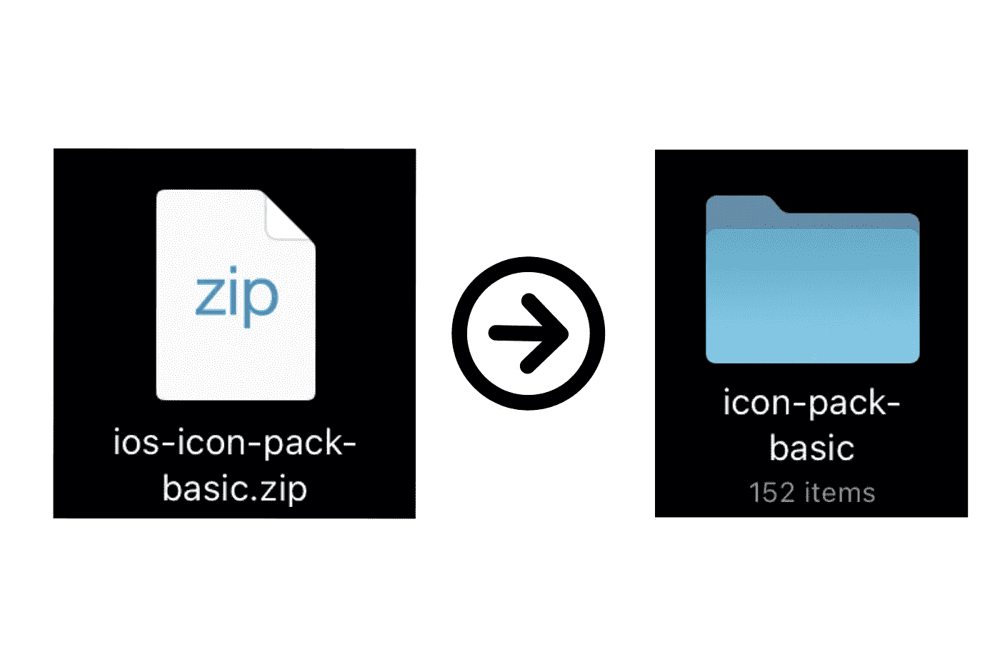

Extracting the compressed folder.

一旦你解压文件夹，如果你发现不同的应用程序的各种图标，这意味着你已经下载正确。

## 第二步:在主屏幕上为你想要的每个应用程序创建一个 Siri 快捷方式。

这一步可能有点耗时，所以我建议你耐心地完成它。让我把这个步骤分成几个部分，这样你更容易理解。

1.  打开“快捷方式”应用。

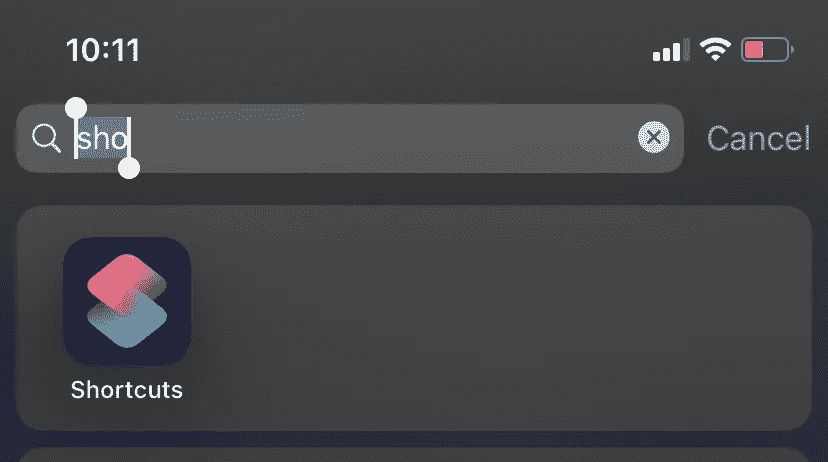

2.点击右上角的“+”图标。

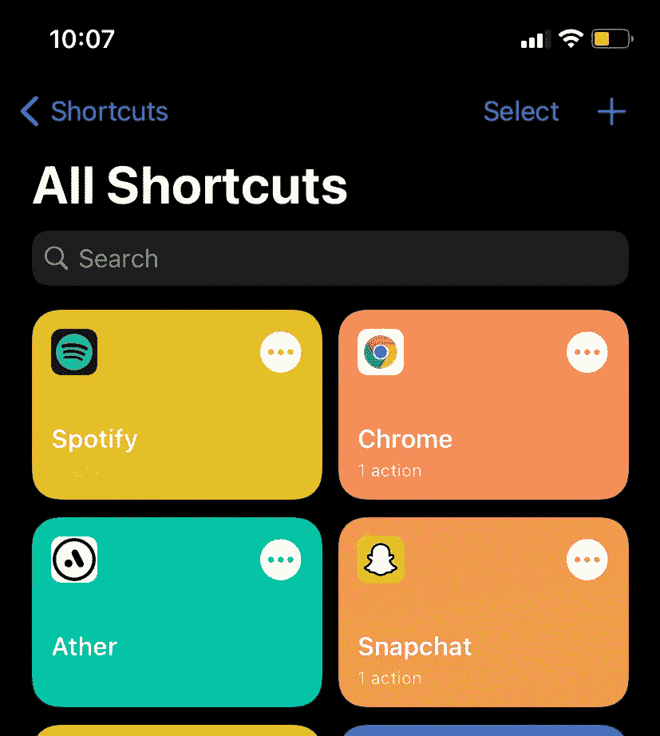

3.在主屏幕上添加您想要的应用程序的“打开应用程序”快捷方式。

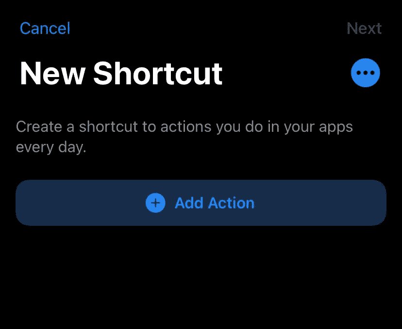

Click on Add Action

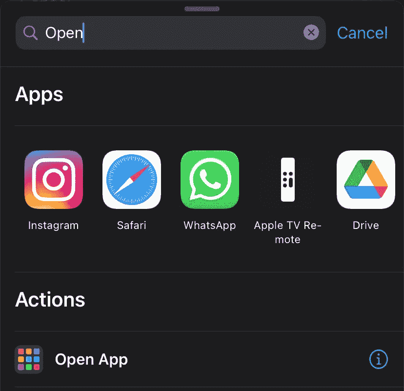

Search for the Open App shortcut.

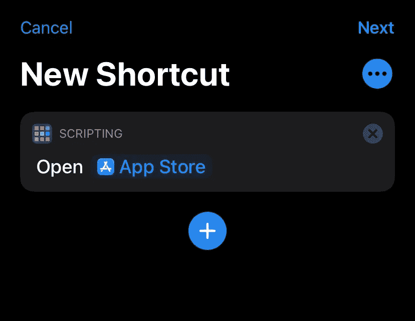

Once you have created the shortcut, click on the 3 dots at the top right corner.

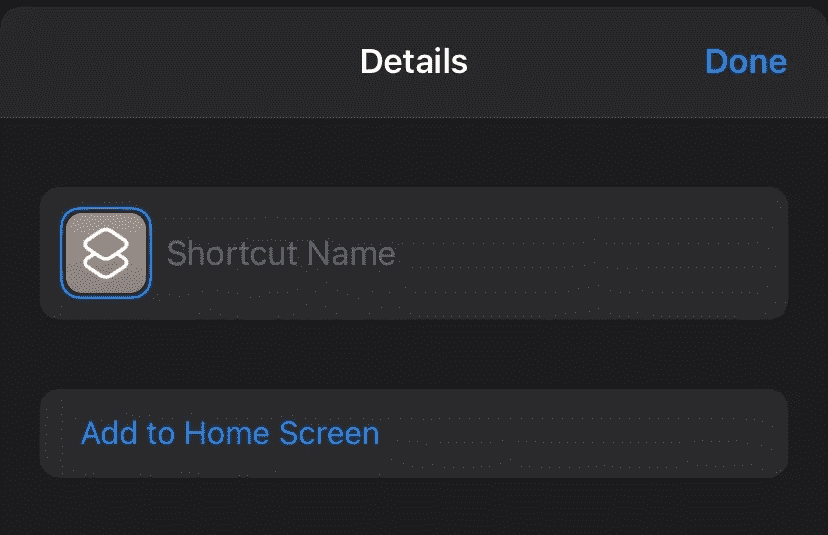

Click on “Add to Home Screen”.

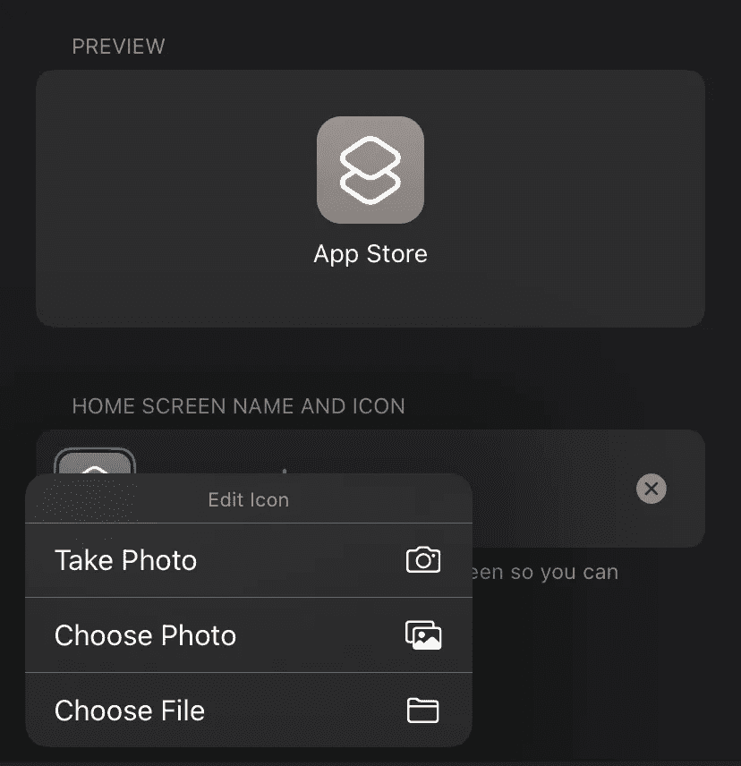

Name your shortcut as the app name. Click on the default icon > Choose File.

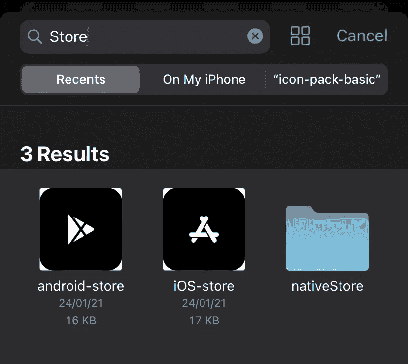

Search for the app icon in the folder you extracted.

Click on Add. Voila! You got your own custom app icon.

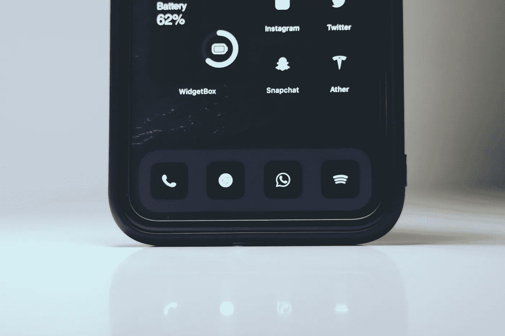

虽然这不是一种方便的改变图标的方法，也不是每个人都有耐心手动改变主屏幕的图标，但对于那些厌倦了每天查看默认应用程序图标并想要一些新东西的人来说，这是一种解决方法。

## 第三步:下载一个 widget 应用。

[WidgetBox](https://apps.apple.com/bb/app/widgetbox-best-ios-14-widgets/id1527561558) 是一款免费下载的应用程序(可以在应用程序内购买)，我强烈推荐它根据你的主题定制你的主屏幕小工具。

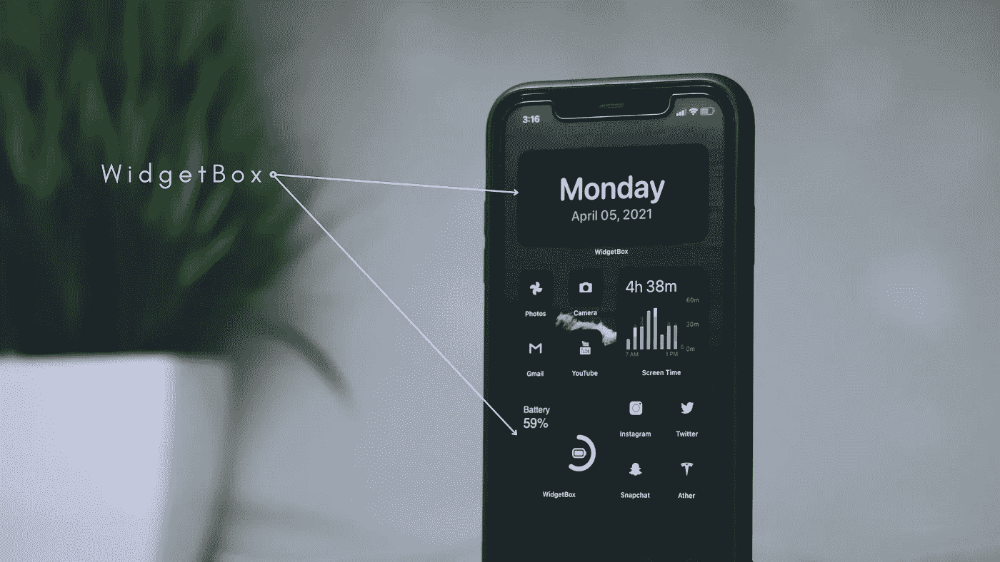

Choose whichever widget that compliments your theme.

你可以从大量的预置插件库中选择，也可以使用这个应用程序创建自己的插件。在我当前的主屏幕设置中，我使用了 WidgetBox 的 2 个小部件。

就是这样。你只用了 3 个简单而漫长的步骤就给你的 iPhone 改头换面了。希望苹果能像安卓一样，增加一键更换 iOS 图标包的解决方案。希望你喜欢阅读这篇文章，并请与其他仍然不知道如何自定义主屏幕的 iPhone 用户分享这篇文章。