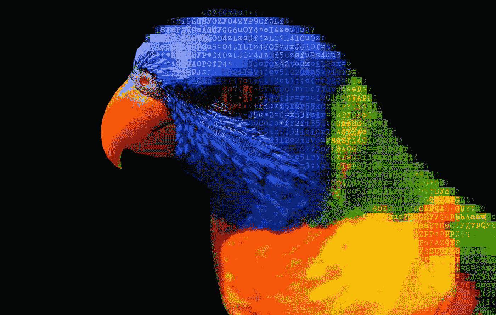

# 如何用 ASCII 艺术(和 Python)给你的图片一点极客的感觉

> 原文：<https://medium.com/geekculture/how-to-give-your-pictures-a-geeky-touch-with-ascii-art-and-python-77420e15b1bc?source=collection_archive---------8----------------------->

## 少数可打印的字符是你看世界所需要的

Image by author (source photo by [David Clode](https://unsplash.com/@davidclode?utm_source=unsplash&utm_medium=referral&utm_content=creditCopyText) on [Unsplash](https://unsplash.com/s/photos/parrot?utm_source=unsplash&utm_medium=referral&utm_content=creditCopyText))

ASCII 艺术是一种早期的图形设计技术，它使用字符而不是像素来生成图像。不久前，这种方法弥补了打印机和计算机终端图形能力的不足。虽然……是事实