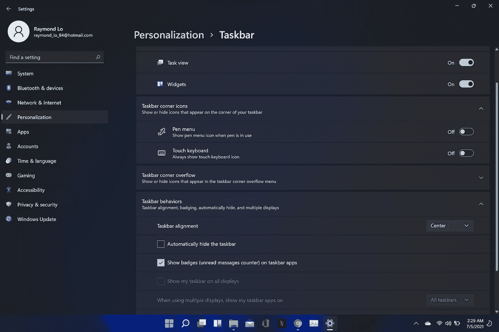
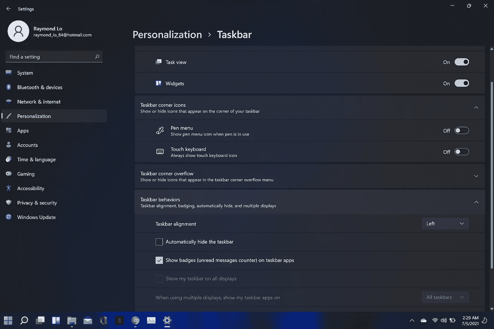
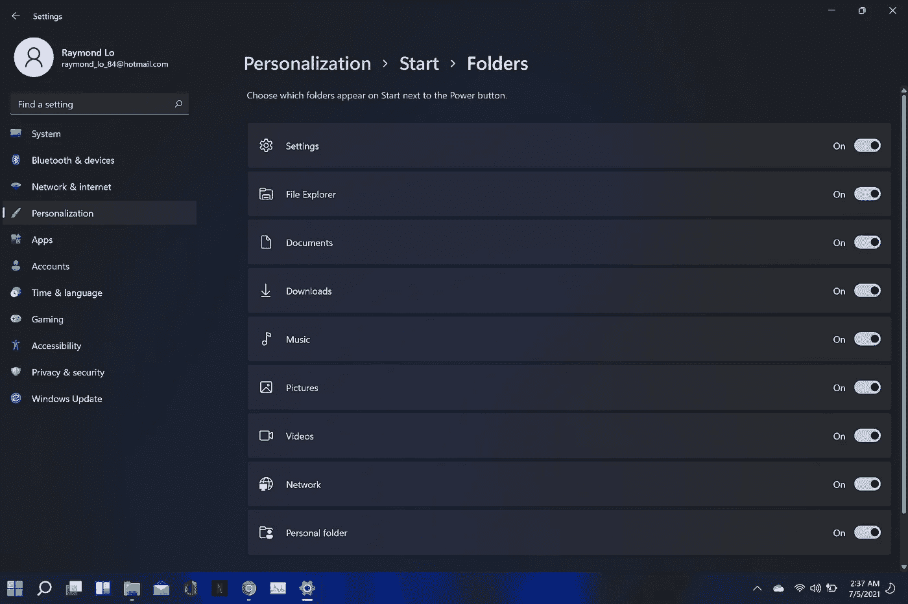
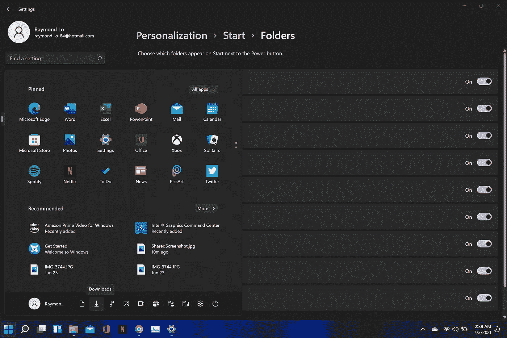

# 如何在 Windows 11 上回到 Windows 10 界面？

> 原文：<https://medium.com/geekculture/how-to-go-back-to-windows-10-interface-on-windows-11-32f9eb81f185?source=collection_archive---------37----------------------->

你也是对新界面感到恼火的人之一吗？我认为最重要的是他们如何把图标移到中间。我的意思是为什么为什么为什么……我的意思是著名的 Windows 开始菜单在左下角工作。为什么为了改变而改变？

好吧，只要按照下面的步骤，他们将修复您的 Windows 11(又名 Windows 10 reskin)体验。

Windows 11 default…

Back to Windows 10…

Enable all the missing icons from start menu…

Finally, I can find things…

亲爱的微软，当我甚至找不到我的任务管理器时，越少越好…