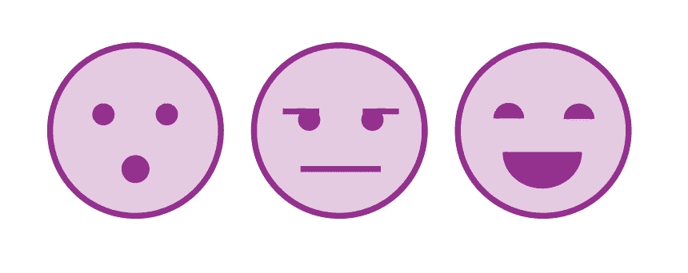

# 如何图形化设计图标

> 原文：<https://medium.com/geekculture/how-to-graphically-design-icons-1ef9ee5c1cf5?source=collection_archive---------15----------------------->

# **什么是平面设计？**

平面设计是创造视觉图像，符号，或图片，很容易翻译的信息给任何人看。平面设计意味着创造艺术，其背后的意义清晰而简洁。平面设计的目标不是为了迷惑消费者，而是为了吸引人的眼球，吸引消费者。这是一个有趣而愉快的过程…