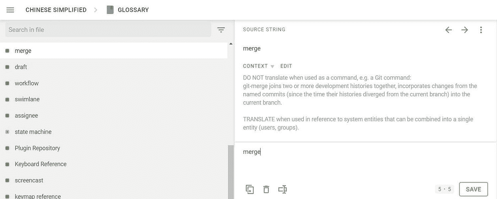
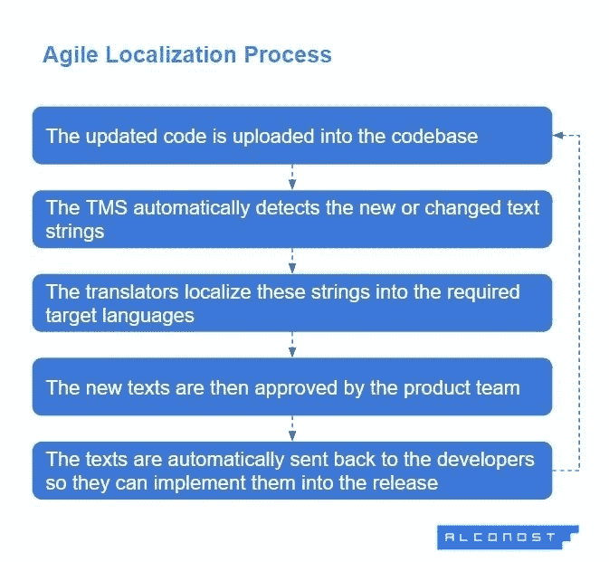
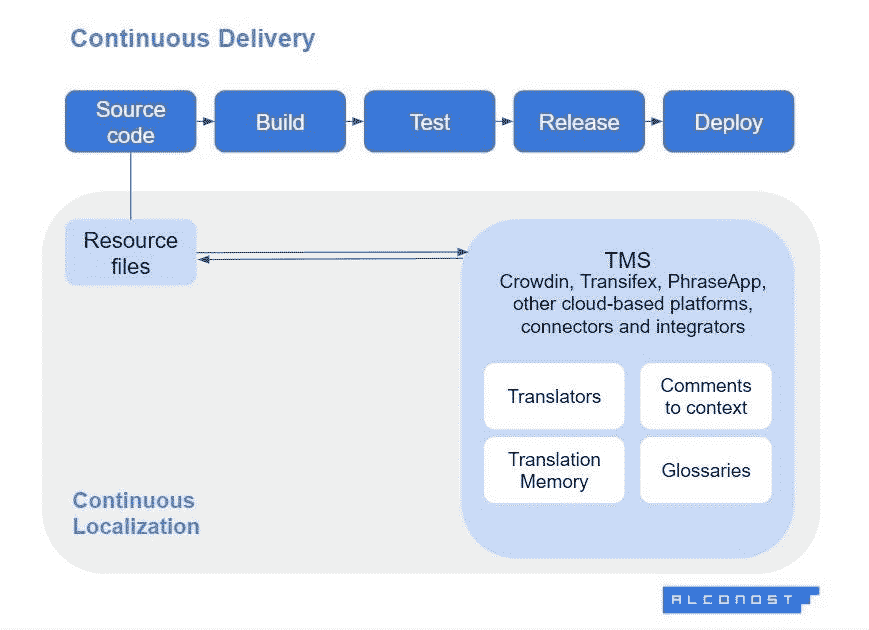
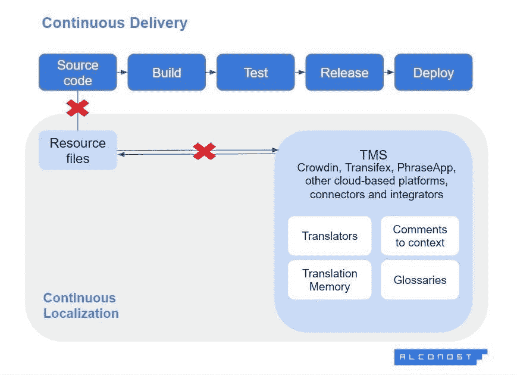

# 如何使用本地化来增加你的应用程序的受众:从小步到大步

> 原文：<https://medium.com/geekculture/how-to-grow-your-apps-audience-using-localization-e3bb53ed49c8?source=collection_archive---------21----------------------->

# 看起来很明显，一些应用程序开发者将本地化视为事后的想法。然而，提前做好充分的准备，并从一开始就在业务流程的其余部分中设计合适的工作流，可以减少大量的工作。

Designed by [alconost.com](https://alconost.com/en/localization?utm_source=medium&utm_medium=article&utm_campaign=app_go_global)

如果你有一个很酷的应用程序或游戏，如果每个人都尝试使用它，你会喜欢的，意思是世界上的每个人。这就是本地化的作用。对于大多数移动应用程序开发人员来说，语言本地化和适应文化差异只是时间问题，而且永远不会白费。

将一个应用程序本地化成 10 种、20 种甚至有时 50 种语言是一件非常值得做的事情。首先，它有助于改善用户体验，从应用程序的商店页面本身开始，一直到高级升级。因此，应用程序本地化增加了用户忠诚度，以及每日活跃用户的数量和他们的终身价值，并最终使您的投资回报最大化。

既然您已经看到果汁是值得压榨的，那么让我们深入研究一下如何建立一个最佳的本地化项目。

# 为本地化做准备

让我们从头开始。没有立即本地化的灵丹妙药，但是适当的常规流程会将您引向正确的方向。

## 1.彻底研究市场

确保本地化你的应用程序是一件值得做的事情。你需要考虑一些重要的方面:

**观众**

> 你的目标受众是谁？他们说不同的语言吗？如果是，哪些语言应该是您本地化的起点？如何在本地市场细分潜在用户？他们的具体需求和偏好是什么？他们真的需要你的产品吗？他们如何从中受益？你的目标受众和你现在的用户有什么不同？需要考虑哪些文化差异和当地指南？你应该本地化你的界面或订阅计划吗？此外，这个市场的付费功能应该与您当前的市场相同吗？什么类型的内容应该本地化，以什么样的顺序？

**竞争对手**

> 当地市场有利基市场吗？有没有竞争对手，他们有没有尝试过产品本地化？从他们的经历中可以吸取什么教训？

市场调查将为调整您未来的本地化工作流程提供有用的见解。首先，你会得到一个国家和语言的列表。确保你把两者都考虑进去了。例如，加拿大人说法语或英语，取决于他们所在的地区。因此，您的本地化计划可能涵盖加拿大英语和法语，与法语(法国)和英语(英国)相比，这两种语言有一些细微的差异。有时，了解最流行的本地化语言也是有意义的。

## 2.确保您的应用程序具有国际化

虽然许多人将这两个术语作为同义词使用，但它们实际上是指两个不同的(尽管相关的)事物。国际化和本地化都旨在使移动应用程序适合特定的地区。然而，国际化更侧重于应用程序开发的技术方面，而本地化则更多地是了解特定文化的细节，并根据该文化调整应用程序的内容。

*本地化*移动应用程序是让它看起来适合某个目标受众的过程。例如，它包括将文本翻译成所需的语言，转换所有必要的度量标准，包含特定文化的视觉元素，以及考虑当地法规。

*国际化*则侧重于为本地化准备应用程序的技术方面，并涵盖与应用程序的结构和架构相关的流程:多语言选项、不同的文本格式以及从源代码中提取文本。

> 规则是在本地化应用程序之前，要确保它有适当的国际化。

## 3.准备本地化套件

本地化套件是高效本地化所需的所有文件和文档的集合。首先，这些是**资源文件**，它们是从源文件(代码)转移过来的，并且需要被翻译。

另一个必不可少的元素是**词汇表**，它应该包含应用程序或游戏中最重要和最大量的单词、短语和术语(角色名称、状态、游戏内物品、位置等)。).词汇表有助于保持整个翻译的一致性，并加快[本地化进程](https://blog.alconost.com/en/localization-process)。翻译人员可以利用它，而不必直接询问应用程序开发人员。术语表可以是独立的文档，也可以是翻译平台界面中的一个部分(如果公司已经选择了一个)。这里是一个词汇表在 [Crowdin 本地化平台](https://alconost.com/en/localization/crowdin-alconost?utm_source=medium&utm_medium=article&utm_campaign=small_steps_giant_leaps)上的样子。

*Screenshot of a glossary from the* [*CrowdIn localization platform*](https://alconost.com/en/localization/crowdin-alconost?utm_source=medium&utm_medium=article&utm_campaign=small_steps_giant_leaps)

根据我们在 Alconost(作为一家专业翻译和本地化公司)的经验，为本地化团队提供**风格的指南简介**也是一个很好的做法。风格指南是一套帮助翻译人员坚持品牌信息并确保翻译准确的说明。它定义了翻译的语气、品牌的声音、特定俚语的使用、正确的形式、缩写等。

此外，lockit(localization kit 的缩写)可能包含**翻译记忆库**(以前翻译的例子)和**文件，这些文件提供上下文**:游戏视频、音轨，甚至(在极少数情况下)产品版本。

## 4.组建本地化团队，选择平台

本地化团队通常包括:

*   负责监控项目工作和截止日期的项目经理
*   本地化工程师，负责组织和管理工作流程
*   质量保证经理，负责本地化产品的质量

本地化过程还包括组建一个翻译团队，有时翻译多达 50 种语言，甚至扩展到特定的方言。

虽然一些开发人员求助于机器或众包翻译，但与专业翻译相比，这些方法不能保证一致的质量。

一些公司有自己的本地化团队，而另一些公司更喜欢外包整个本地化过程。即使你不能召集整个团队，至少有一两个负责任的人也是值得的。

这一步与选择本地化平台密切相关。如果本地化发生在云中，那么很容易跟踪所有更新，并根据需要向尽可能多的团队成员提供同步访问。此外，这使得管理人员、开发人员、翻译人员和编辑之间的交流能够顺利进行。

Excel 表格的优势较小——即使它们被下载到本地化平台上，它们也不支持大型团队内部的实时协作。

***inDriver app***本地化案例分析

*inDriver 是一款交通应用，在 31 个国家运营，支持 11 种语言。它最初是一个小型的本地拼车应用程序。inDriver 团队在本地化过程中面临的最大挑战是:*

*   团队分散和缺乏流程:翻译只负责他们那部分的工作，不知道其他团队成员在做什么。
*   *数量与质量的问题:一些翻译是由社区执行的，他们似乎不愿意翻译少量的文本，同时仍然提供优秀的质量。*
*   稀有语言和方言:社区无法提供这些语言和方言的翻译。

*最后，* [*inDriver 求助于一个基于云的翻译平台*](https://alconost.medium.com/indriver-case-study-how-to-create-the-perfect-ride-sharing-app-for-31-countries-with-different-9d85da7bc754) *，将整个项目转移到那里。这有助于同步整个团队，并允许建立适当的管理流程。该公司还订购了专业的方言翻译，以及社区翻译的额外校对和测试。*

# 本地化您的应用

回到国际化的话题，正如在准备阶段提到的，开发人员应该能够从源代码中提取本地化所需的资源文件。通常，可本地化的字符串在。xml，iOS。字符串，。resx，。阿宝，。json 或其他可转换的格式。如果没有正确地国际化，一个应用程序可能需要特殊的集成来提取和翻译文本。

在我们继续进行本地化流程之前，以下是应用程序本地化的关键组件。

## 1.app store 页面的本地化

app store 本地化背后的想法是让一款应用对当地受众更有吸引力。这需要做些什么:

*   选择关键词是必须的。不同的国家有不同的经常搜索的关键字，简单的翻译是不够的。关键词本地化意味着使用专门的 ASO 工具研究相近的术语并为当地选择最流行的术语。
*   **应用描述本地化**不仅意味着翻译，还意味着通过使用特定文化的关键词、短语、行话等为相关用户群调整描述。Apple App Store 和 Google Play 都允许对一个应用程序进行多种本地化描述。这意味着一个应用程序可能会有一个默认描述(比如英语)和几个本地化描述，这些描述将根据用户的位置显示给用户。根据用户偏好和本地化的应用版本，在不同的描述中突出不同的应用功能也是可以的。
*   **截图本地化**是应用下载的最后一步(但绝不是最不重要的一步)。

如果你的应用或游戏在商店页面上也有视频预览，那么考虑[本地化一个片段](https://blog.alconost.com/en/video-localization-dubbing-subtitles?utm_source=medium&utm_medium=article&utm_campaign=small_steps_giant_leaps)也是一个好主意。除了全视频本地化，还有配音和字幕等选项；如果你预算紧张，可以考虑一下。

***惠普有限公司***

[*这款应用的截图和描述都被翻译成了土耳其语*](https://productcoalition.com/how-to-get-featured-on-google-play-and-adapt-aso-to-different-countries-f5998cbf322d) *，用户访问量增长了 18%。统计数据还显示，用户大多被截图和其中包含的文字所吸引* — *只有一小部分用户真正阅读了应用描述。一旦截图被改编为适合当地观众，应用程序的下载量大幅增长，从而提高了人们对该应用程序的兴趣。*

仅仅翻译屏幕截图的文本是不够的——有些国家可能需要不同的调色板、添加或更改视觉元素等。

*Screenshots of TikTok, fully localized for Russia and Brazil. The color scheme, the people’s faces, and the design have all been adjusted accordingly.*

## 2.应用内文本的本地化

文本本地化不仅仅是翻译，而是让文本对用户来说看起来更“本土”。这意味着使用特定用户群通用的特定短语、单词和行话。

本地化完成后，开发人员组装一个本地化版本的应用程序，并尽可能测试它的错误和翻译流程。让另一双眼睛来执行测试和编辑是个好主意。

联系社交媒体、论坛或技术服务信使上的用户群体，向他们寻求反馈或帮助你解决需要澄清的地方(或者甚至作为你的应用的 beta 测试者)也很重要。尽管社区不能快速翻译大量文本，但它可以提供关于翻译、UX 或 UI 的任何问题的宝贵反馈。

## 3.调整 UX/用户界面

UX/用户界面本地化有许多方面需要考虑。不同的用户群可能更喜欢产品中不同的设计、调色板或视觉元素。此外，应用程序或游戏中图像中的文本也需要本地化。如果这是硬编码，图像将需要从头开始重新设计。

有时，界面元素也需要调整以适应本地语言(在长度或词序方面)。然而，在 UI 元素中，尤其是菜单项和按钮，允许至少 30%以上的空间是一个好习惯。

*For the Korean UX/UI localization of MyCafe, the developers adjusted not only the buttons and dialog boxes but also the background design.*

UX/UI 本地化通常涉及图形设计师、UX/UI 设计师和开发人员。

# 敏捷:它与本地化过程有什么关系

敏捷方法植根于产品开发，非常适合所有的产品开发周期。与瀑布方法相反，非线性敏捷方法允许几个任务同时执行，而不会互相干扰。

> ***在 Alconost，一切能敏捷的都应该敏捷，包括本地化。***

一个重要的需求是[敏捷本地化](https://productcoalition.com/agile-localization-188a5a168bb2)发生在云平台上，所有团队成员，内部的和外部的，都可以协作。

[Agile localization](https://productcoalition.com/agile-localization-188a5a168bb2) process at Alconost

该图显示了 Alconost 的典型[应用本地化流程](https://alconost.com/en/localization/apps?utm_source=medium&utm_medium=article&utm_campaign=small_steps_giant_leaps)的概况。敏捷本地化是有利的，因为它促进了更快的上市时间，使及时发现和修复错误变得更容易，这意味着更少的手动和额外的工作，更快的本地化测试，并因此降低了项目成本。

敏捷是开发友好的，并且与自动化协同工作，自动化是高效本地化过程的另一个关键要素。

最后，因为敏捷本地化允许迭代，所以它完全符合产品开发周期的哲学，并使得一次为几个地区发布新特性成为一个清晰且易于管理的任务。

# 持续本地化是敏捷过程的一个例子

因此，敏捷方法使得不断更新应用成为可能，从而产生其他基本的迭代过程:持续交付、持续集成、持续部署和[持续本地化](https://alconost.com/en/localization/crowdin-alconost?utm_source=medium&utm_medium=article&utm_campaign=small_steps_giant_leaps)。只要说连续本地化应该是连续交付过程的一个完整部分就足够了。

为了使持续本地化成为可能，自动化是必须的。如图所示，资源文件、翻译记忆库和术语表都上传到 TMS(翻译管理系统或平台)，理想情况下是基于云的 TMS，译者和其他团队成员可以在此进行协作。

[Continuous localization process at Alconost](https://alconost.com/en/localization/crowdin-alconost?utm_source=medium&utm_medium=article&utm_campaign=small_steps_giant_leaps)

这个想法是，即使是本地化内容的一小部分，一旦准备好，也可以集成到源代码中，并从构建到部署到后续的应用程序版本中。

***抖音案例***

抖音，*在全球 150 多个国家使用超过 75 种语言，c* [*采用敏捷方法和持续本地化*](https://blog.alconost.com/en/tiktok?utm_source=medium&utm_medium=article&utm_campaign=small_steps_giant_leaps) *作为唯一可接受的本地化选项。该公司需要本地化为一些罕见的语言，如南非荷兰语和他加禄语，该应用程序每周更新一次。*

这些都是极其严格的条件，有时甚至需要 24 小时的周转时间。该公司选择 Crowdin *中基于云的* [*本地化工作流作为其平台，使他们能够满足所有的期限要求，并符合之前的翻译记忆库。*](https://alconost.com/en/localization/crowdin-alconost?utm_source=medium&utm_medium=article&utm_campaign=small_steps_giant_leaps)

# 本地化过程中的瓶颈

虽然乍一看似乎很完美，但这个过程可能会遇到一些瓶颈。让我们看看它们是什么——预先警告意味着预先准备。

## 缺乏整合

如下图所示，当需要从源代码中获取包含翻译文本的资源文件，然后将其下载到翻译平台上时，就会出现流程中最常见的瓶颈之一。这里可能会出现两个问题:

*   该文本无法从源代码中提取。因此，资源文件不包含整个文本。
*   文本是可提取的，但是资源文件的格式与翻译系统不兼容。在这种情况下，需要定制的集成器或连接器，以便在一个平台上进行翻译。

Bottlenecks in continuous localization and continuous delivery processes

这些问题的出现通常是因为缺乏国际化，这是本文开头所描述的技术准备工作。让我们来看看为什么在创建资源文件时文本会部分或全部丢失。

*   **硬编码文本**

代码本身中的文本不能用翻译工具提取，并且在翻译时会丢失。例如，如果您在图像或其他设计元素中硬编码一些文本，这些元素将保持未本地化。无缝地，如果只有部分文本被硬编码，文本将不会被完全翻译，或者一些上下文将会丢失。

*   **串分裂**

如果句子或短语被分成几个部分，或者包含的占位符没有任何上下文，则很容易将它们提取出来作为单独的内容部分进行翻译，或者完全丢失上下文。

例如，当数字与单位分开放置或者占位符中的一些术语在句子之外时，就会发生这种情况。为占位符提供上下文描述是一种很好的做法。

*   **编码问题**

组装本地化版本时会出现这些问题。如果您得到一些“spécél”字符而不是文本，这可能是由编码问题引起的。

为了避免编码错误，最好使用 Unicode(最常见的是 UTF-8)而不是其他编码。

同样的事情也适用于字体。如果某些漂亮的字体不包含所有语言的字形，可能有必要为不同的语言选择不同的字体。

## 缺乏管理和自动化

如果流程没有适当优化，为几十种语言组建一个翻译团队似乎是一场噩梦。首先也是最重要的，对于复杂的项目，最好把所有东西都放在一个在线翻译管理平台上。基于云的平台允许每个人实时查看更新，查看评论，没有任何延迟，并与词汇表或以前翻译的文本(翻译记忆库)同步本地化。

第二件要做的事情是任命一个专门的项目经理来监控截止日期和进度，并作为其他团队成员之间的中间人。

## 缺乏沟通和背景

上下文由词汇表、翻译记忆库、占位符注释、平台上的翻译注释和及时沟通提供。所有这些因素对于准确快速的翻译都很重要。

例如，缺乏沟通可能会导致度量标准和独立 UI 元素的不正确翻译，或者可能有多种含义的术语的错误解释等问题。

## 缺乏相关的翻译经验

这个规则很简单。首先，翻译应该玩游戏或使用应用程序。

> ***游戏本地化，最匹配的是内心是游戏玩家，职业是翻译的人。***

其次，只要有可能，翻译应该有使用移动应用程序的经验。否则，开发人员可能会得到不真实的文本，其中充满了不正确或不寻常的术语。即使是意义上的细微差别也会影响用户体验。

## 缺乏用户反馈

> ***如果语境是女王，那么用户就是国王。***

一旦你组装好了本地化版本，让用户对测试版提供反馈不失为一个好主意。一个重要的先决条件是，你应该有适当的渠道和过程来收集反馈。

例如，您的团队成员可能会在社交媒体上的用户社区中进行讨论，或者查看聊天机器人。这种性质的试射是本地化过程的最后一步(但绝不是最不重要的一步)。

# 结论

为了成功地本地化您的应用程序，您需要了解您的受众和竞争对手，实施国际化，组建一个团队，努力在您的所有流程中应用敏捷方法，并选择一个本地化团队来帮助您完成这一旅程。保持敏捷，伸手摘星。

# 关于作者

*本文由专业翻译和本地化公司*[*Alconost*](https://alconost.com/en/localization?utm_source=medium&utm_medium=article&utm_campaign=small_steps_giant_leaps)*撰写。*

 [## 专业本地化服务— Alconost

### 我们已经将 2000 多种应用程序、游戏、网站和软件本地化为 100 多种语言

alconost.com](https://alconost.com/en/localization) 

# **你可能也会发现有用的**

[用户流量:流行应用和网站是如何开发的](https://productcoalition.com/user-flows-how-popular-apps-and-websites-are-developed-d47afa04a1c7)

[如何在 App Store 和 Google Play 上推广应用](https://alconost.medium.com/how-to-promote-app-a78337a6c150)

[32 iOS 和 Android 应用之间的设计差异](https://uxdesign.cc/ios-vs-android-design-630340a73ee6)