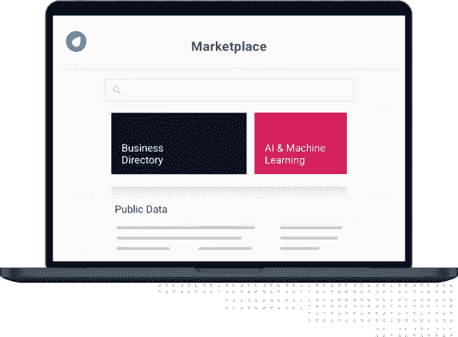
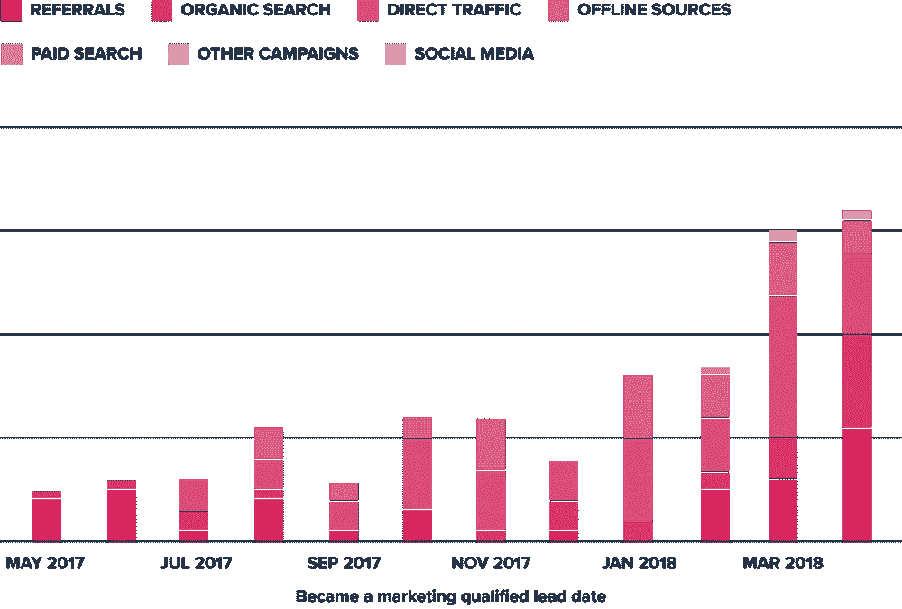
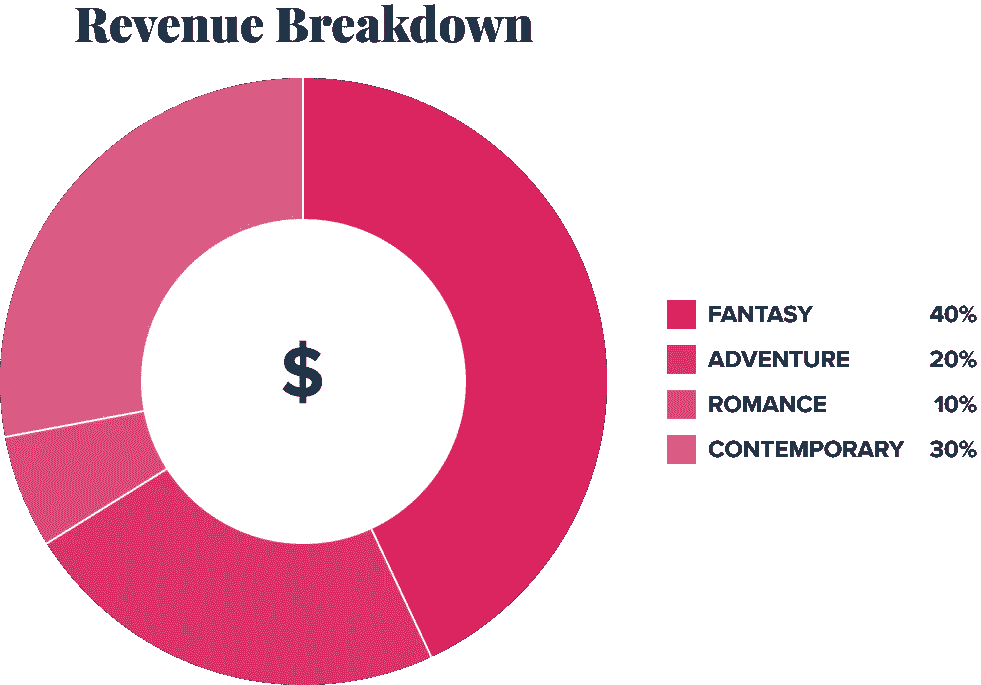

# 如何利用数据发展您的小型企业

> 原文：<https://medium.com/geekculture/how-to-grow-your-small-business-using-data-9c390334731c?source=collection_archive---------5----------------------->

ThinkData Works 使从任何地方访问数据变得容易。我们的“INNERJOIN”系列以协作、集成和思维伙伴为特色。我们提供不同行业思想领袖的观点，以展示数据的价值、灵活性和潜力。

Shakeel Shaikh 是 RBC Ventures 公司 Ownr 的销售代表。

你成为企业家是有原因的。这是一种感觉或本能，推动你建立和创造自己的事业。如此受情绪驱动令人钦佩，但如果你希望发展一个成功的小企业，那么你的决策需要由数据驱动。

数据应该引导你为你的企业所做的每一个决定。没有其他方法可以衡量你是否与你的目标联系在一起，或者是否真正成长了，如果没有对你的度量标准的健康痴迷的话。如何营销，向谁营销，突出哪些产品或服务，以及转向哪个方向，这些都是需要你利用你的指标的因素。这也是我们决定与 ThinkData Works 合作撰写本文的原因之一。他们为组织提供来自最多来源的最佳数据，帮助他们的客户获得竞争优势。

举个例子，纵观加拿大的整个商业景观可能会让人望而生畏。但是有了 ThinkData Works，你可以很容易地找到像 [**加拿大商业目录**](https://app.ee.namara.io/?__hstc=82057097.c44170329b0f6a24ca43003f609ef893.1609787358702.1614785573612.1614952874335.128&__hssc=82057097.8.1614952874335&__hsfp=2940426566#/data_sets/9a2fabfe-8eec-4a16-94d8-110755ac3d9e) 这样的数据产品，或者连接到像 [**加拿大统计局**](https://account.ee.namara.io/users/sign_in?redirect_url=https%3A%2F%2Fapp.ee.namara.io%2F%23%2F) 、 [**Crunchbase**](https://app.ee.namara.io/?__hstc=82057097.c44170329b0f6a24ca43003f609ef893.1609787358702.1614785573612.1614952874335.128&__hssc=82057097.8.1614952874335&__hsfp=2940426566#/) ，或者**[**Owler**](https://app.ee.namara.io/?__hstc=82057097.c44170329b0f6a24ca43003f609ef893.1609787358702.1614785573612.1614952874335.128&__hssc=82057097.8.1614952874335&__hsfp=2940426566#/)这样的数据源。**

****

## **为什么理解数据是发展业务的关键**

**如果你不把结果建立在数据的基础上，就很难确定你的企业是成功还是失败。找到正确的数据并不总是容易的，这是 ThinkData 可以提供帮助的另一种方式，但作为一名企业家，你的部分职责不仅仅是彻底了解你的业务，还要了解整个行业，以及你的业务如何适应该市场。以下是使用数据的帮助:**

****洞察你的客户****

**你的生意从你的顾客开始，也从你的顾客结束。如果你不能洞察他们的行为，那么你将永远难以盈利。当谈到 [**了解你的客户**](https://www.ownr.co/blog/business-target-audience) 时，深入挖掘你的指标可以在几个方面有所帮助:**

*   **了解他们购买产品的原因**
*   **为什么他们选择向你购买而不是向别人购买(反之亦然)**
*   **他们接下来可能会购买什么产品或服务**
*   **他们更喜欢如何购物(在线、店内、由广告引发等)。)**

****紧跟潮流****

**了解你所在的行业当前发生的事情很重要，但企业家也有能力识别和利用趋势。诚然，社交媒体让这项任务变得更加容易。关注 Twitter 话题或特定行业的对话是分析接下来可能会发生什么的简单方法。但你仍然需要意识到，不要仅仅依靠社交媒体来决定你如何规划公司的未来。与研究公司建立联系以更深入地了解行业预测是一种积极主动的方式。作为一名企业家，停滞不前就像是在倒退。**

****提高业务水平****

**从一个非常简单的角度来看，数据让你在业务上变得更好。如果您不断地分析您的运营，您将会发现效率和机会，从而为外部客户和内部团队提供更好的产品或服务。利用数据还可以引入新的创收方式或与客户联系的方式。例如，如果你拥有一家理发店，并通过数据确定 80%的客户更喜欢预约而不是上门服务，那么也许是时候 [**为你的企业建立一个新网站**](https://www.ownr.co/blog/best-website-builders-for-canadian-businesses/) 并引入允许他们预约的技术了。现在，您能够更好地预测每天的现金流，并且满足了客户的需求。**

****要考虑的指标和数据点****

**既然您已经理解了为什么数据对您的业务增长如此重要，那么让我们来思考一些真正重要的数据点。每个企业都是不同的，应该自己决定要考虑哪些指标，但是有一些通用指标对大多数小型企业都有意义。**

****兑换率****

**转换率衡量你如何将目标转化为客户。假设你做了一个广告，目标人群是 100 个人，其中两个人真的买了你的产品。那么你就有了 2%的转化率(其实还不错)。特别是对于任何经营电子商务业务的企业家来说，你的转化率会更低，因为从理论上讲，你通过广告或有机手段产生的流量将远远高于经营本地书店的人。不过，无论是哪种情况，你都想衡量自己的转化程度，以便找到改进的方法。考虑转换率的其他方面也是值得的:**

*   **流量从哪里来(广告，有机流量，步行流量等。)**
*   **你的流量中回头客相对于新客户的比例是多少**

**第二点对于**在线企业来说更容易做到，但实体企业可以使用店内策略，如询问电子邮件地址来获取数据的核心。****

********

## ****你的数据来自哪里？****

****很明显，知道你创造了多少收入是很重要的，但是你也必须知道这些收入来自哪里。如果你只有一种产品(以书店为例)，那么你需要知道相对于新顾客，你的收入中有多少来自回头客。但是你也可以用你的数据获得微观数据，找出哪种类型的书籍表现更好，并尝试以创造性的方式展示这些书籍。对于那些提供多种产品的企业，你需要对你的收入进行细分。也许你经营一家咖啡馆；你需要知道你出售的每种食品或饮料产生了多少收入，这样你就可以做出明智的决定，决定哪些商品需要继续销售、展示或停止销售。****

********

## ****今天就用 Ownr 和 ThinkData Works 开始你的事业****

****除非你先注册，否则你无法发展你的业务。这就是 Ownr 可以提供帮助的地方。我们使 [**企业注册**](https://www.ownr.co/) 或公司成立变得简单而划算。启动您的业务，创建一个定制品牌，并利用 Ownr 优惠来节省整个过程中的资金。****

****现在，您已经注册了您的企业，下一步是找到有助于指导您的数据战略的工具和资源。ThinkData 是一家总部位于多伦多的数据访问解决方案公司，它使从任何地方使用数据变得容易。他们是协调业务和数据战略的专家，确保其客户组织充分利用数据。ThinkData Works 的 Namara Marketplace 是世界上最大的开放、公共和合作伙伴数据市场，因此它是查找产品就绪数据的绝佳资源。****

****在您的业务战略中利用数据的机会是无限的。随着生成的数据量继续增长，我们可以期待看到更多的部门用例。如果您的组织希望保持领先，那么采用这些最佳实践是成功的关键。****

******关于 ThinkData Works**
发现、管理和利用推动企业发展的数据。ThinkData Works 提供灵活的企业数据目录，旨在确保数据生命周期每个阶段的数据质量和法规合规性。要了解更多信息，请访问 ThinkData Works，并在 Twitter 和 LinkedIn 上与我们联系。****

******关于 Ownr**
Ownr 是一家 RBC Ventures 公司。有了 Ownr，您的业务正规化比以往任何时候都更容易。Ownr 提供最简单、最方便的方法来注册或合并您的企业，并提供强大的工具，可以帮助您更快地开展业务。****

****本文仅提供一般信息，无意作为法律、金融或其他专业建议。关于你的具体情况，应该咨询专业顾问。虽然所提供的信息被认为是真实的和最新的，但其准确性不能得到保证，也不应被视为对所讨论主题的完整分析。所有观点表达反映了作者在出版之日的判断，可能会有所改变。加拿大皇家银行或其附属机构不明示或暗示对任何第三方或其建议、意见、信息、产品或服务的认可。****

*****原载于*[*https://blog.thinkdataworks.com*](https://blog.thinkdataworks.com/how-to-grow-your-small-business-using-data)*。*****