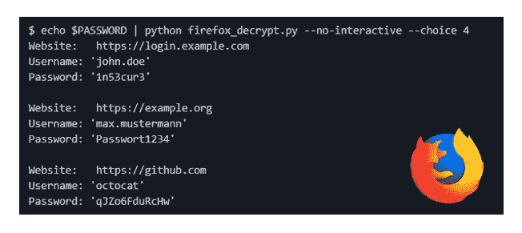
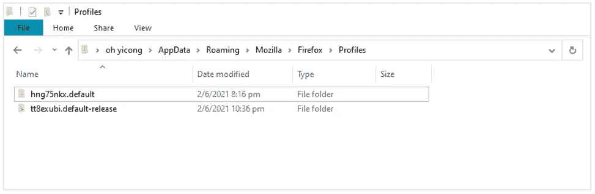
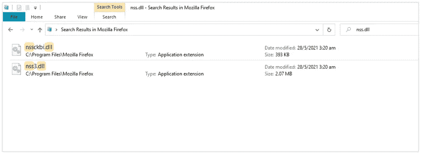
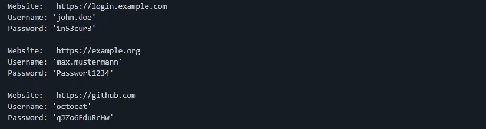

# 如何用 Python 破解火狐密码？

> 原文：<https://medium.com/geekculture/how-to-hack-firefox-passwords-with-python-a394abf18016?source=collection_archive---------5----------------------->

> 你认为把你的密码储存在火狐浏览器中安全吗？简而言之就是 ***【否】*** *。任何能够进入你的笔记本电脑的攻击者都能够在几秒钟内解密你的所有密码。*



Decrypted Firefox password with Python

Python 是一种多功能语言，可用于开发许多有用的应用程序来改善我们的日常生活，但是，它也可用于利用系统漏洞，导致数据和隐私的丢失。

之前，我写过一篇关于“[如何用 python](https://ohyicong.medium.com/how-to-hack-chrome-password-with-python-1bedc167be3d) 破解 Chrome password”的文章，由于提供了非常宝贵的信息，从我的读者那里收到了很多积极的反馈。在知道它的漏洞后，许多人停止使用 Chrome 上的自动保存密码功能，因为它很容易被我的 python 脚本破坏。

出于好奇，我研究了火狐浏览器，发现它也不能幸免于这个漏洞。在这篇文章中，我将分享我的知识，并描述损害 Firefox 保存的密码的步骤。

# 破解火狐密码的步骤

破解火狐密码有三个主要步骤。

1.  确定保存的用户名和密码的位置
2.  加载网络安全服务(NSS)库
3.  解密保存的用户名和密码

**步骤 1:识别保存用户名&密码**的位置

对于不同的操作系统，它保存在不同的文件位置，如下所示:

```
**Windows**: C:/Users/<PC Name>/AppData/Roaming/Mozilla/Firefox/Profiles**Mac**: ~/Library/Application Support/Firefox/Profiles**Linux**: ~/.mozilla/firefox/Profiles
```

打开文件夹后，您会看到里面有一些个人资料。相应的配置文件属于以前登录过 Firefox 的用户。



Two user profiles are shown in the Windows PC

让我们进入任何概要文件并找到 **logins.json** 文件。打开文件后，您将能够看到以下信息。

```
{“id”:1,”hostname”:”https://login.ebay.com","encryptedUsername":"KoZIhAAAAAAAAAAAA","encryptedPassword":"HoktY1AAAAAAA","guid":"{92071111-e714-1192-a293-1222d2d5237}"
```

恭喜，您找到了三条重要信息:

1.  主机名
2.  加密用户名
3.  加密密码

**步骤 2:** 加载网络安全服务(NSS)库

用户名和密码使用 PKCS #11 加密标准加密，该标准使用您的设备作为加密和解密的“加密令牌”。Firefox 开发了 NSS 库，在浏览器中采用这一标准。

以下是各个操作系统的 NSS 库名称。

```
**Windows**: nss3.dll**Mac**: libnss3.dylib**Linux**: libnss3.so
```

在 Mozzila Firefox 应用程序目录中可以很容易地找到它。



NSS library found in Windows PC

**第三步:**解密保存的用户名&密码

载入库后，就该用它来解密了。希望下面的伪代码能让你对整个解密过程有一个直观的认识。

```
#step 1: convert data (i.e. usernames/password)from base64 to string 
data = b64decode(data64)#step 2: pass the string data into the SECItem object as input data
input = SECItem(0, data, len(data))#step 3: create a SECItem object to store the decrypted output data
create a output = SECItem(0, None, 0)#step 4: perform PK11 decryption
PK11SDR_Decrypt(inp, out, None)
```

**将所有东西放在一起**

在理解了解密过程背后的直觉之后，您可以分析这个 [GitHub 存储库](https://github.com/unode/firefox_decrypt)中的 firefox_decrypt.py 源代码，以便更好地理解整个过程。

键入以下命令来执行源代码:

```
python firefox_decrypt.py
```



Results from using the decryption tool

恭喜你已经学会了如何解密你的火狐密码！感谢 **unode** 开发出如此有趣的工具。

**其他有趣的文章**

要了解如何破解 chrome 密码，请访问:[https://ohyi cong . medium . com/how-to-hack-chrome-password-with-python-1 bedc 167 be 3d](https://ohyicong.medium.com/how-to-hack-chrome-password-with-python-1bedc167be3d)

**免责声明**

我分享这些知识是为了提高人们对这一漏洞的认识，并展示利用这一漏洞是多么容易。您不应在未经授权的设备上使用此工具。干杯！