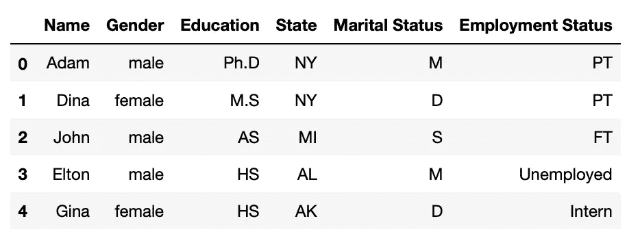
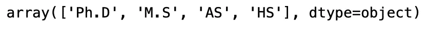
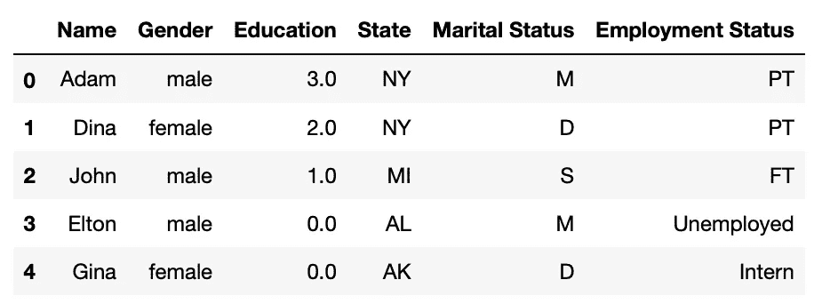
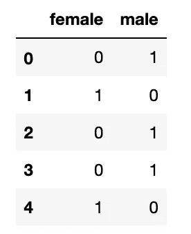
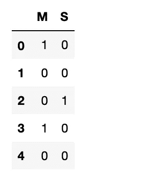
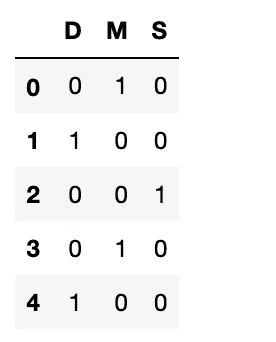
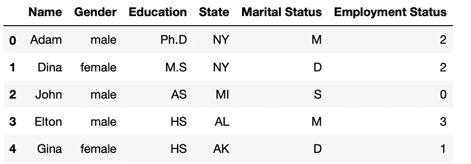

# 如何处理分类变量？

> 原文：<https://medium.com/geekculture/how-to-handle-categorical-variables-7c1ee198c55c?source=collection_archive---------9----------------------->


Photo by [Daniel Lanner](https://unsplash.com/@daniellanner?utm_source=unsplash&utm_medium=referral&utm_content=creditCopyText) on [Unsplash](https://unsplash.com/s/photos/binary-code?utm_source=unsplash&utm_medium=referral&utm_content=creditCopyText)

数据科学是解决现实世界问题和做出数据驱动的决策的艺术和科学。它主要处理各种结构化或非结构化数据。从广义上讲，数据可以分为两种类型，即数值型和分类型。大多数数据科学模型都配备了处理数字数据的功能；然而，当我们必须处理分类数据时，事情变得有趣了。

## 什么是分类数据？

分类数据是一种在有限的离散类集合中取值的数据形式。很难用数字来计算或测量分类数据，因此它们被分成不同的类别。分类数据的一个例子是人的性别。它只能接受男性、女性和其他人之间的值。

有两种类型的分类变量:

一.序数变量

二。名义可变因素


Photo by [Martin Sanchez](https://unsplash.com/@martinsanchez?utm_source=unsplash&utm_medium=referral&utm_content=creditCopyText) on [Unsplash](https://unsplash.com/s/photos/level?utm_source=unsplash&utm_medium=referral&utm_content=creditCopyText)

## 一.序数变量:

这些变量在其值的类别中保持自然顺序。如果我们考虑教育水平，那么我们可以很容易地根据他们的教育标签按照高中的顺序对他们进行排序

## 1-序数编码:

序数编码主要是将序数类别编码成有序的数值。序号编码根据顺序或等级将每个唯一的类别值映射到特定的数值。考虑给定数据框中的教育列。这里，我们定义了使用 sklearn 创建顺序编码器时类别的排序。因此，在本例中，我们将类别中的顺序排列为一个升序列表。首先，我们有*高中*接着是*副学士*、*硕士、*然后是*博士*。最后。

## [OrdinalEncoder( **类别** =[['HS '，' AS '，' M.S '，' ph . d . ']]]]

序数编码器是对序数变量进行编码的最合适的选择。它帮助机器学习模型建立分类列和目标列之间的关系。例如，如果我们想预测一个雇员的工资，这将取决于不同的特征，而教育水平将是这些特征之一。现在，从逻辑上讲，拥有博士学位的人会比拥有高中学历的人薪水更高。因此，模型将了解到数据框中值为 3 的博士比值为 0 的高中学历的博士权重更大。通过这种方式，模型将了解到，当教育水平提高时，工资也会增加，反之亦然。

2.一个热门编码:

如果分类变量之间没有顺序关系，那么顺序编码可能会误导模型。这是因为顺序编码器会试图强制变量之间的顺序关系采用自然排序，从而导致性能下降。

在这种情况下，应该使用一个热编码器来处理我们的分类变量。它将通过将 N 个类别转换成 N 个特征/列来创建虚拟变量。考虑到 ***性别*** 再列。如果我们在第一行有一个男性，那么它的值是 1。同样，如果我们在第二行有一个女性，那么它的值是 0。每当类别存在时，其值为 1，不存在时为 0。我们可以用两种方法一次性编码分类变量。第一，在熊猫中使用 **get_dummies** ，第二，使用 sklearn 的**onehotencode**。

再比如婚姻状况。这里，我们有三个不同的类别:已婚:M、离婚:D 和单身:s。我们可以通过使用:" **drop_first=True** "来减少一列的维数，这意味着列的数量将比类别的数量少一。

在上表的第二行，我们用零表示已婚和单身，这实际上意味着已经离婚。

如果我们指定 drop_first =False，那么我们仍然有三列:已婚、单身和离婚。

如上所述，我们也可以通过 sklearn 的 **OneHotEncoder** 实现一键编码。

如果我们在一个列中有大量的分类变量，那么我们应该避免使用一次性编码。这将导致相应列的数量增加，这将引起称为“维数灾难”的问题。

**3 标签编码:**

标签编码器会将每个类别转换成唯一的数值。如果使用 Sklearn 实现，则该编码器应该用于编码输出值，即 y，而不是输入 x。它类似于顺序编码器，只是这里的数值是自动分配的，不遵循任何自然顺序。通常，分类值的字母顺序用于确定哪个数值先出现。考虑到我们的目标变量“工作状态”列有四个不同的类别。对该列应用标签编码后，四个不同的类别被映射成整数 0:全职，1:实习生，2:兼职，3:失业。由此，可以解释为，在训练模型时，失业人员比兼职人员、全职人员和实习生具有更高的优先级，而这些状态之间没有这种优先级或关系。我们不能用标签编码技术定义标签的顺序。

```
df.head()
```



## 标签编码的缺点是它给出了分类值的顺序，这可能不适合一些机器学习算法，如线性回归，因为它们对值太敏感；在这种情况下，一个热编码提供更好的结果。
另一方面，标签编码适用于决策树和随机森林算法，因为它们不依赖于分类变量的值。

结论

我们了解了分类数据，以及在将数据输入模型之前必须如何处理它们。我们看到了不同类型的分类数据，以及将这些分类特征转换成数字特征的多种编码技术。理解什么时候使用哪种分类技术是很重要的。事实证明，好的编码技术对模型的性能至关重要。

```
df['Education'].unique()
```



```
from sklearn.preprocessing import OrdinalEncoder
ordinal = OrdinalEncoder(categories=[['HS', 'AS', 'M.S','Ph.D']])
df['Education'] = ordinal.fit_transform(df[['Education']])
df.head()
```



感谢阅读！

## 2\. One Hot Encoding:

If there is no ordinal relationship between the categorical variables then ordinal encoding might mislead the model. This is because the ordinal encoder will try to force an ordinal relationship on the variables to assume a natural ordering, thus resulting in poor performance.

In this case, One Hot encoder should be used to treat our categorical variables. It will create dummy variables by converting N categories into N features/columns. Considering the ***gender*** column again. If we have a male in the first row, then its value is 1\. Also if we have a female in the second row then its value is 0\. Whenever the category exists its value is 1 and 0 where it does not. We can one-hot encode categorical variables in two ways. One, by using **get_dummies** in pandas and two, by using **OneHotEncoder** from sklearn.

```
pd.get_dummies(df['Gender']).head()
```



Another example is Marital Status. Here, we have three different categories Married: M, Divorced: D, and Single: S. we can reduce the dimensionality by one column by using: “**drop_first=True**” meaning the number of columns will be one less than the number of categories.

```
pd.get_dummies(df['Marital Status'],drop_first=True).head()
```



In the second row of the table above, we have zero for married and single, which effectively means that it is Divorced.

If we assign drop_first =False, then we still have three columns: Married, Single, and Divorced.

```
pd.get_dummies(df['Marital Status'],drop_first=False).head()
```



As mentioned, we can also implement one-hot encoding through **OneHotEncoder** from sklearn.

```
from sklearn.preprocessing import OneHotEncoder
ohe = OneHotEncoder(sparse=False)
ohe.fit_transform(df0[['Marital Status']])
```

If we have a high number of categorical variables in a column, then we should avoid using one-hot encoding. It will result in an increase in the number of corresponding columns which will give rise to a problem called “Curse of Dimensionality”.

**3- Label Encoding:**

The label encoder will convert each category into a unique numerical value. If implemented with Sklearn, then this encoder should be used to encode output values, i.e. y, and not the input X. It is similar to the ordinal encoder except, here the numeric values are assigned automatically without following any sort of natural order. Generally, the alphabetical order of the categorical values is used to determine which numerical value comes first. Considering our target variable “Job Status” column has four different categories. After applying label encoding to this column the four different categories are mapped into integers 0: Full Time, 1: Intern, 2: Part-Time, and 3:Unemployed. With this, it can be interpreted that Unemployed have a higher priority than Part-Time, Full Time, and Intern while training the model, whereas, there is no such priority or relation between these statuses. We can’t define the order of labels with the label encoding technique.

```
from sklearn.preprocessing import LabelEncoder 
lbe = LabelEncoder()
df['Employment Status']= lbe.fit_transform(df['Employment Status']) 
df.head()
```



The disadvantage to label encoding is that it gives an order to the categorical value, which might not be suitable to some machine learning algorithms such as Linear Regression, as they are too sensitive to the values; in such case, one hot encoding provides better results.
On the other hand, label encoding is suitable with Decision Tree and Random Forest algorithms because they don’t depend on the values of the categorical variables.

## Conclusion

We learned about the categorical data and how we must treat them before feeding it to a model. We saw different types of categorical data and also multiple encoding techniques to convert those categorical features into numerical features. It is important to understand which categorical technique to be used and when. A good encoding technique proves vital to the performance of your model.

Thanks for reading!