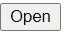

# 如何用自定义钩子处理在一个 div 之外的点击

> 原文：<https://medium.com/geekculture/how-to-handle-click-outside-a-div-in-react-d2283dc4ed57?source=collection_archive---------13----------------------->


这是一件非常重要的事情，尤其是在创建下拉菜单的时候。用户希望当他们在下拉菜单外单击时，下拉菜单会关闭。所以我们要看看如何做到这一点。

# 创建新的 react 应用程序

创建 react 应用程序的先决条件-

*   [Node.js](https://nodejs.org/) (推荐最新版本)

安装节点后，您需要运行以下命令-

```
npx create-react-app handle-click-demo # you can name it anything you want
```

# 启动应用程序-

```
# npm
npm start
# yarn
yarn start
```

# 清理过程

*   删除 App.js 中 div 内部的所有内容，并删除顶部 logo.svg 的导入。
*   删除 App.test.js，SetupTests.js，logo.svg 文件。
*   删除 App.css 中的所有内容。
*   在 index.css 中，在顶部添加这一行-

我们将创建自己的下拉列表，而不是使用 select 标记。

## 创建下拉列表

我们将创建一个按钮来打开和关闭下拉菜单。

```
<button>Open</button>
```

我们可以在屏幕的左上角看到这个按钮。



现在我们将创建一个状态来检查下拉菜单是打开还是关闭。

现在我们将在按钮上添加一个 onClick 事件。

如果状态为真或假，我们将使用三元运算符更改按钮的文本。

最后，我们将创建下拉菜单。

我在按钮下面创建了一个简单的下拉菜单，有 3 个选项。

我对下拉菜单和应用程序 div 应用了一些基本的样式，以使元素居中。

## 基于单击按钮呈现下拉列表

这段代码的作用是，如果 isOpen 为真，则显示下拉列表，否则不显示任何内容。

但是这有一个问题，如果你在 div 之外点击，下拉菜单不会关闭。

## 创建自定义挂钩

我们将创建一个名为 useComponentVisible 的自定义挂钩。因此，在 src 目录中创建一个文件 useComponentVisible.js，并添加以下代码片段。

这段代码使用了状态，并做了与我们创建下拉菜单时类似的事情。然后添加和删除事件监听器。

## 使用自定义挂钩

现在，我们将在应用程序中使用自定义挂钩。

呼叫钩子。我们将用这个替换使用状态。现在这会产生一些错误。

导入挂钩。

```
import useComponentVisible from "./useComponentVisible";
```

现在，我们将把 ref 附加到按钮和下拉容器上，因为我们希望当我们单击其他位置时下拉容器关闭。

我们将把 isOpen 改为 isComponentVisible，把 setisOpen 改为 setIsComponentVisible，如下所示

现在我们的下拉菜单运行良好。

希望你从这篇教程中学到了什么。让我知道你接下来想看什么。✌

有用的链接-

[Github 资源库](https://github.com/avneesh0612/handle-click-outside-div)

[反应堆文件](https://reactjs.org/)

[所有社交](https://avneesh-links.vercel.app/)