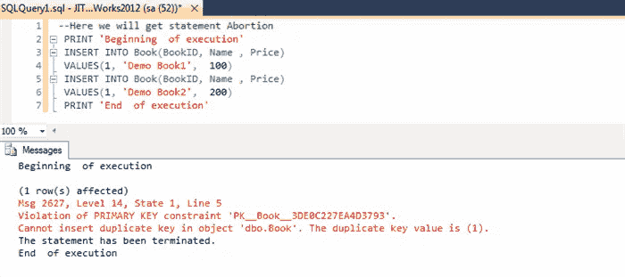

# 如何处理 SQL Server 中的错误

> 原文：<https://medium.com/geekculture/how-to-handle-errors-in-sql-54208958cd6?source=collection_archive---------18----------------------->



Sample error message. [Source](https://www.codeproject.com/Articles/809083/SQL-server-error-details)

在我之前的[博客](/geekculture/how-to-clean-data-in-sql-server-76a4103010a)中，我谈到了我想如何发展我的 SQL 技能的某些方面。我想了解更多的一个方面是在执行 SQL 脚本时如何处理错误。在运行 SQL 脚本时，可能会出现无法正常执行的情况，了解为什么会出现这种情况以及如何调试这种情况非常重要。

在这篇博客中，我将使用 DataCamp 的“SQL Server 中的事务和错误处理”课程中的信息来讨论 SQL 中的错误处理。本课程中使用的数据集基于一个电动自行车商店，包含关于`Products`、`Buyers`、`Staff`和`Orders`的信息。

# 错误剖析

在谈论如何处理错误之前，我应该先谈谈什么是错误。当 SQL 脚本由于某种原因无法完全执行时，就会发生错误。这个原因可能是表不存在，也可能是软件有问题。

在错误消息的第一行，我们有关于错误细节的有价值的信息。

```
Msg #, Level #, State #, Line #
```

第一个值对应于从 1 到 49999 的错误号。用户创建的错误从 50001 开始，但是我将在博客的后面更多地讨论这些错误。每个错误及其细节的完整列表可以在[这里](https://docs.microsoft.com/en-us/sql/relational-databases/errors-events/database-engine-events-and-errors?view=sql-server-ver15)找到。

第二个值是错误的严重性级别。级别 0-10 是信息性消息，更多地用作警告。级别 11–16 对应于用户可以修复的错误，如语法错误或对象不存在。级别 17-24 是最严重的，它们对应于软件资源不足或操作系统问题等问题。

第三个值是错误的状态。第四个值指示错误发生在代码的哪一行，这对于在代码出错时调试代码很有用。

在 SQL Server 中，有一些预构建的函数能够从错误消息中返回详细信息。这些函数是根据它们将从错误消息中返回的特性来命名的。`ERROR_NUMBER()`返回错误号，`ERROR_SEVERITY()`返回错误严重性，依此类推。这些函数通常在`TRY…CATCH`语句中使用。

# **试试……接住**

假设在我们的`Products`表中，有一个名为`product_name`的列，我们在其中放置了一个惟一的约束。现在，假设我试图向`Products`中插入一个表中已经存在的带有`product_name`的新条目。我将收到一条错误消息，指出:

```
Violation of UNIQUE KEY constraint 'unique_product_name'. Cannot insert duplicate key in object 'dbo.Products'.
```

防止这种错误发生的一种方法是使用`TRY…CATCH`语句。这种类型的语句由两个代码块组成，在这两个代码块中，我们将`TRY`一段代码，如果由此产生错误，控制将传递给`CATCH`块。一个`TRY`块以`BEGIN TRY`开始，以`END TRY`结束。相同的语法适用于`CATCH`，其中`BEGIN CATCH`和`END CATCH`分别表示`CATCH`块的开始和结束。如果在执行完`TRY`块中的代码后没有出现错误，则`CATCH`块将被完全跳过。

```
BEGIN TRY
    {sql_statement | statement_block}
END TRY
BEGIN CATCH
    [{sql_statement | statement_block}]
END CATCH
```

也可以将`TRY…CATCH`语句嵌套在一起。在一个 CATCH 块中，我们可以有另一个`TRY`和`CATCH`块。在下面的例子中，我们试图在`buyers`表中输入一个新的买家。如果在尝试插入买方时出现错误，我们希望在名为`errors`的表中插入一个新条目。如果输入错误失败，我们将打印一份声明，确认未能插入`errors`。

```
-- Set up the first TRY block
BEGIN TRY
    INSERT INTO buyers (first_name, last_name, email, phone)
        VALUES ('Peter', 'Thompson', 'peterthomson@mail.com',              '555000100');
END TRY-- Set up the first CATCH block
BEGIN CATCH
    SELECT 'An error occurred inserting the buyer! You are in the first CATCH block';-- Set up the nested TRY block
    BEGIN TRY
        INSERT INTO errors
            VALUES ('Error inserting a buyer');
        SELECT 'Error inserted correctly!';
    END TRY-- Set up the nested CATCH block
    BEGIN CATCH
        SELECT 'An error occurred inserting the error! You are in the nested CATCH block';
    END CATCH
END CATCH
```

虽然这个语句很有用，但是有些错误是`TRY…CATCH`语句无法捕捉的。严重性低于 11 的错误是不可捕捉的，因为它们只是警告。此外，如果严重性超过 20 的错误停止连接，则不会被捕获。如果我们有编译错误，比如在不存在的表上或列上执行脚本，那么`TRY…CATCH`语句也将不起作用。

# 引发和抛出错误

我们也有能力提出自己的错误。SQL Server 提供了两个函数来引发错误:`RAISERROR()`和`THROW()`。

```
-- Syntax for SQL Server and Azure SQL Database. Taken from [link](https://docs.microsoft.com/en-us/sql/t-sql/language-elements/raiserror-transact-sql?view=sql-server-ver15)   
RAISERROR ( { msg_id | msg_str | @local_variable }       
{ ,severity ,state }
[ ,argument [ ,...n ] ] )
[ WITH option [ ,...n ] ]
```

在`RAISERROR()`函数中，我们有多个参数用于消息 ID、错误的严重性和状态，以及其他参数，如字符串或数字。

在下面的例子中，我们试图从`products`表中选择一个给定`product_id`的产品。如果`SELECT`语句没有找到产品，它将引发一个错误，指出“没有找到 id 为 5 的产品”，严重性级别为 11，状态为 1。注意在`RAISERROR()`中，我们被允许使用参数占位符，如%s 和%d，不像`THROW`。

```
-- RAISERROR example
DECLARE @product_id INT = 5;IF NOT EXISTS (SELECT * FROM products WHERE product_id = @product_id)
    RAISERROR('No product with id %d.', 11, 1, @product_id);
ELSE
    SELECT * FROM products WHERE product_id = @product_id;
```

对于一个`THROW`语句，我们传入的参数是错误号、错误消息和错误状态。如果我们不为我们的`THROW`语句指定参数，它将重新抛出原来的错误语句。关于语法的一个关键注意事项是`THROW`不允许您指定错误的严重性，将其设置为 16。

```
-- Throw statement syntax. Taken from [link](https://docs.microsoft.com/en-us/sql/t-sql/language-elements/throw-transact-sql?view=sql-server-ver15)
THROW [ { error_number },  
        { message },  
        { state } ]   
[ ; ]
```

在`CATCH`语句中使用`THROW`时，另一个关键的注意事项是顺序很重要。如果我们将`THROW`放在`CATCH`语句中的任何一行代码之前，它将重新抛出原来的错误，忽略`CATCH`语句中它之后的代码行。但是，如果它被放在后面，那么它前面的任何代码都将运行，然后它将`THROW`这个错误。

在下面的例子中，我们试图用一个特定的`staff_id`从`staff`中获取关于一个成员的所有信息。如果语句没有找到具有相应`staff_id`的成员，我们将`THROW`一个错误，错误号为 50001，错误消息为“没有具有该 id 的成员”，状态为 1。

```
DECLARE @staff_id INT = 4;IF NOT EXISTS (SELECT * FROM staff WHERE staff_id = @staff_id)
    -- Invoke the THROW statement with parameters
    THROW 50001, 'No staff member with such id', 1;
ELSE
    SELECT * FROM staff WHERE staff_id = @staff_id
```

我之前提到过`THROW`在生成错误消息时不允许占位符参数。但是，我们能够通过其他方式生成定制的错误消息。如果我们生成自定义错误消息并将其声明为变量，那么我们可以在消息参数中传递该变量。我们可以通过利用`CONCAT()`或`FORMATMESSAGE()`来帮助生成带有参数的消息来实现这一点。

```
DECLARE @first_name NVARCHAR(20) = 'Pedro';-- Concat the message
DECLARE @my_message NVARCHAR(500) =
    CONCAT('There is no staff member with ', @first_name, ' as the first name.');IF NOT EXISTS (SELECT * FROM staff WHERE first_name = @first_name)
    -- Throw the error
    THROW 50000, @my_message, 1;
```

这些是我从本课程中学到的在 SQL Server 中处理错误的方法。在我的下一篇博客中，我将关注更多关于 SQL 事务如何工作以及如何使用 SQL 脚本确保并发性的内容。感谢您的阅读！