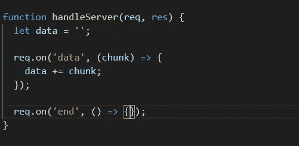
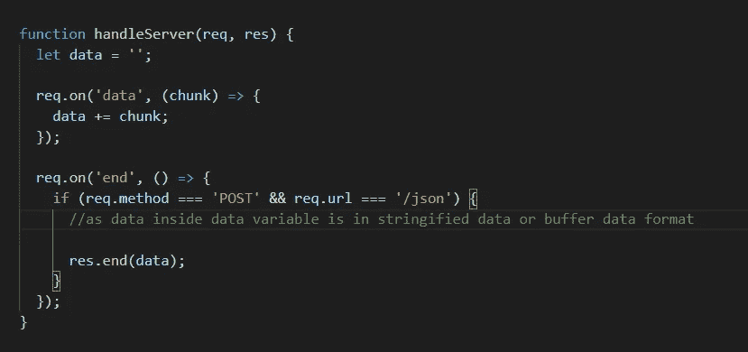
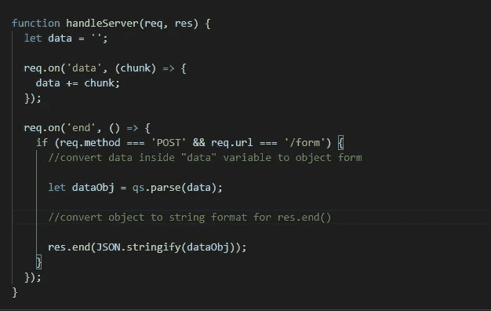
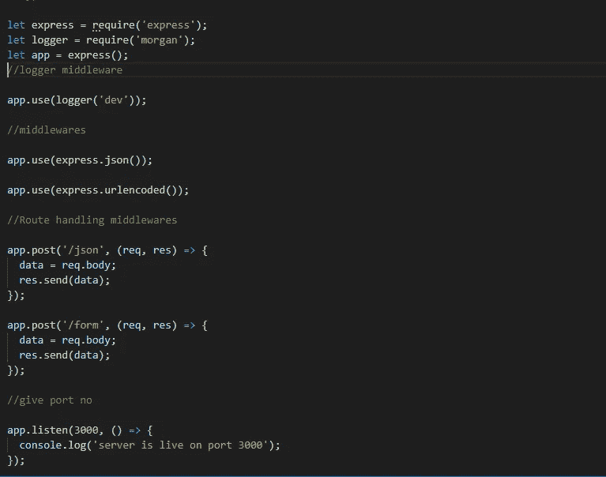

# 如何处理节点中 URL 主体的 JSON/form 数据。JS 和 express。

> 原文：<https://medium.com/geekculture/how-to-handle-json-form-data-from-the-body-of-the-url-in-node-js-and-express-4193837c39c7?source=collection_archive---------5----------------------->

# 1)使用“节点”处理请求对象主体内的数据。JS ":———

*   首先，我们必须使用 node 创建一个服务器。JS。点击此链接:- " [***了解如何使用 node 创建服务器。JS***](/geekculture/how-to-create-a-basic-server-using-node-js-b696ce54c90a) ”。
*   一旦创建了服务器，现在我们必须创建一个名为" **data** 的新变量来存储来自**请求**对象的**主体**的输入数据。
*   我们知道 request 也是一个 eventEmitter，所以我们可以使用它的 req.on()方法。
*   req.on()也有两个方法 1) **数据** 2) **结束。**

**1)**当数据开始以小块的形式传入时，将调用“data”，并重复执行，直到数据停止传入。

**2)“end”**将在数据停止到来时被调用。

creating req.on methods.

*   在“**数据**方法中，我们必须将它存储在数据变量中以备后用。

## 情况 URL 主体中的传入数据是 JSON 格式的。

*   现在，我们必须处理"**POST**" request on route "**/json**"，它们在格式 JSON 的主体中有传入的数据。
*   我们可以编写如下图所示的条件:-

handling POST request for JSON data format.

*   这里我们知道 **res.end()** 只接受**字符串数据**或**缓冲区数据**，传入的数据是格式字符串，这就是为什么我们可以将它直接传递给 res.end()。

## 情况 URL 主体中的传入数据是“form/urlencoded”格式。

*   现在，我们必须处理"**POST**" request on route "**/form**"它在格式 urlencoded/form 的主体中有传入数据。
*   我们可以编写如下图所示的条件:-

handling POST request for form/urlencoded data

*   这里，传入的数据是"**urlencoded/form**data "格式，所以首先我们必须使用 **fs 模块**及其" **fs.parse()"** 方法将其转换为对象形式。
*   解析之后，它被存储在变量“ **dataObj** 中。
*   现在，我们可以对" **dataObj"** 对象中的数据做任何事情。
*   如果我们必须将其作为响应发送，那么我们必须使用对象上的 **"JSON.stringify()"** 方法将其转换为 stringified 格式。
*   现在，我们可以将这些数据传递给" **res.end()** "方法。

# 2)使用“expressJS”处理请求对象主体内部的数据

*   首先，我们必须使用 express 创建一个服务器。我的博客链接是:- " [***点击这里学习如何使用 express***](/geekculture/express-server-using-npm-and-handling-routes-524d7a6205a7) 创建服务器。
*   现在，我们必须安装 npm 包“morgan”来记录关于请求的信息。命令:- " ***npm 我摩根--保存*** "。
*   现在，我们可以使用 morgan 作为第一个中间件，它将在每次发出请求时执行。
*   现在，要在 URL 的主体中添加数据，需要将其转换为对象，还需要添加到“**req . body”**中。
*   Express 允许我们使用以下方法完成上述所有步骤

I)***app . use(express . JSON())***。

ii)***app . use(express . urlencoded())***。

*   上面提到的代码会将 URL 正文中的数据转换为对象格式，并将其添加到“ **req.body** ”中。
*   现在我们可以在路由中间件中使用“ **req.body** ”来访问对象。

handling JSON/form-data inside body or URL using express in node.js