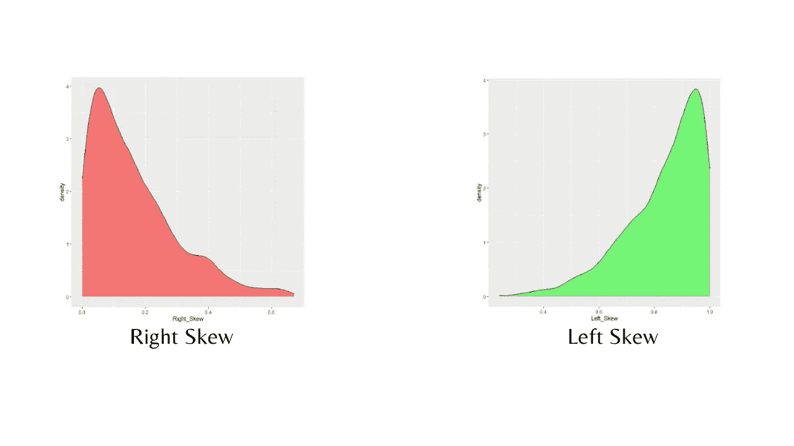
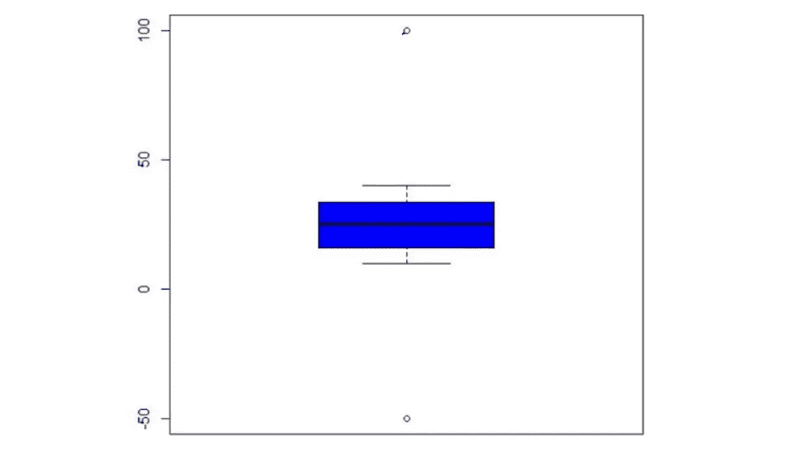
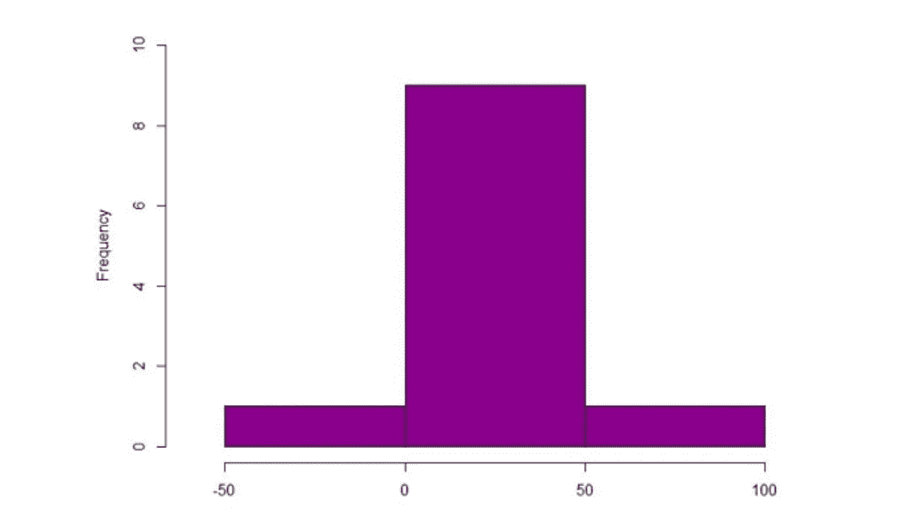

# 如何处理数据中的异常值？

> 原文：<https://medium.com/geekculture/how-to-handle-outliers-in-data-c0b512460acf?source=collection_archive---------7----------------------->


让我们首先了解什么是异常值以及如何识别异常值。简而言之，离群者是一个与众不同的人或从一大群人中脱颖而出的人。在统计学中，离群值是指与其他数据点相差很大的任何数据点。它们很重要，因为它们可以改变我们数据分析的结果。因此，我们必须学会如何处理数据中的异常值。

异常值是极端值。如果我们的数据集有极高或极低的值，那么这些数据点被称为异常值。它表示值要么严重拖尾，要么高度偏斜。这可能是由于测量的可变性或实验误差造成的。

异常值表示[分布](https://aichapters.com/types-of-statistical-distribution/)严重拖尾或高度偏斜。



如果一个值非常高，远远超出预测范围，分布将向右移动，使曲线**向右或正向倾斜**。如果值非常低，分布将向左移动，导致曲线向左**或** **负偏**。

# 异常值分为三种类型:

*   **集体异常值**:它们是一组不寻常的发现，由于其可比的异常值而看起来彼此相似。在时间序列图中，这可能表现为在季节序列正常的时间段之外出现的典型峰值和谷值。
*   **上下文异常值**:如果一个数据点的值与相同上下文中的其余数据点有很大的偏差，则称该数据点为上下文异常值。
*   **集体异常值**:它们是一组不寻常的发现，由于其可比的异常值而看起来彼此相似。

# 如何处理数据中的异常值

为了演示，我创建了一个只有一列(年龄)的数据集。我包含了两个值:一个是高值(100)，另一个是低值(-50)。

```
Sample Dataset: 10,12,34,25,20,22,30,33,40,100,-50
```

# 箱形图

箱形图是对[统计数据](https://aichapters.com/introduction-to-statistics-and-probability/)分布的图形描述。它利用了中位数以及上下四分位数。箱线图可以很容易地发现数据集中的异常点，因为胡须上方或下方的任何点都是异常点。有时被称为“单变量方法”

箱线图是将描述性统计数据可视化的统计图(**均值**，**中位数**， **Q1** ， **Q2** ， **IQR** ，**最小值**，**最大值**)。我将使用 R 软件。

```
#First install "readxl" package to read excel file into R
install.packages("readxl")
#load readxl package 
library(readxl)
my_data <- read_excel("Outlier.xlsx")
boxplot(my_data)
```



Box Plot

# 柱状图

一个直方图，其中大部分信息在一侧，而一些观察值出现在远离主组的地方，这种直方图被称为异常值。观察异常值。

直方图也检测异常值。生成直方图的 r 代码。

```
Age<- my_data$Age hist(Age,xlab = “Age”,col=”darkmagenta”, xlim = c(-60,100), ylim = c(0,10),main=”Outlier Detection using Histogram”)
```



Histogram

# 四分位数间距(IQR)

四分位间距规则对于发现异常值非常重要。四分位数范围得分或中间 50%或 H-spread 是统计离差的一种度量，等于第 75 个百分位数和第 25 个百分位数之间的差值，即第三个四分位数(Q3)和第一个四分位数(Q1)

**IQR=Q3-Q1**

我们将异常值定义为小于**【Q1-(1.5 * IQR)**或大于 **Q3+(1.5 * IQR)** 的值

```
#Install "readxl" package
install.packages("readxl")
#load readxl package 
library(readxl) 
#Read the excel file 
my_data <- read_excel("Outlier.xlsx") 
#summary() computes summary statistics of data and model objects.
summary(my_data) 
      Age
 Min. :-50.00
 1st Qu.: 16.00
 Median : 25.00
 Mean : 25.09 
 3rd Qu.: 33.50 
 Max. :100.00 
#Assigning Values 
 Q1<-16.00 
 Q3<-33.50 
#Calculating IQR 
 IQR<-Q3-Q1 
 IQR 
 [1] 17.5 
 Lower=Q1-(1.5*IQR)
 Upper=Q1+(1.5*IQR) 
 Lower
 [1] -10.25
 Upper 
 [1] 42.25 
#Any number smaller than this is an outlier        my_data[my_data$Age<Lower,] -50 
#Any number larger than this is considered an outlier my_data[my_data$Age>Upper,] 100
```

# 标准偏差

对数据集中的值如何变化或偏离平均值的一种度量。

我们将异常值定义为小于(**平均值— 3*SD** )或大于(**平均值+ 3*SD** )的值。

计算标准偏差的 r 代码

```
#load the readxl library
library(readxl) 
#Read the excel file 
my_data <- read_excel(“Outlier.xlsx”) 
#summary() computes summary statistics of data and model objects. summary(my_data) 
    Age 
Min. :-50.00
1st Qu.: 16.00
Median : 25.00 
Mean : 25.09 
3rd Qu.: 33.50 
Max. :100.00 
#calculates the standard deviation 
sd(my_data$Age) 
[1] 34.74609 
#Values greater than Mean + 3*sd are considered as outlier my_data[my_data$Age > Mean + (3*sd),]
 100 
#Values less than Mean — 3*sd are considered as outlier my_data[my_data$Age < Mean — (3*sd),]
 -50
```

# 散点图

散点图有助于确定两个数值变量之间的相关程度，例如 X 和 y 之间的简单线性关系。异常值是指任何偏离正常值的观察值。

# ML 模型和异常值

在[机器学习](https://aichapters.com/what-is-machine-learning/)中，离群值通常会从整体上误导对数据的解读，导致训练过程中模型不太准确，结果不正确。虽然不是所有的机器学习模型都对异常值敏感。对下列异常值敏感的 ML 模型。

*   线性回归
*   逻辑回归
*   k 均值
*   等级体系的
*   主成分分析

# 如何处理异常值？

*   计算 Minkowski 误差可以减少异常值对模型的影响。
*   从数据集中完全删除这些记录，以减少分析过程中引起的偏斜。
*   给这些记录赋予新的价值可以产生有利的结果。
*   转换值可以消除异常值。缩放、对数变换、立方根归一化和其他技术消除了异常值。
*   输入异常值并分别对待。

# 结论

在数据集中，并不是所有的异常值都是麻烦的。例如，在信用卡欺诈检测中，注意已经发生的任何异常交易被认为是重要的，并且在股票预测中，必须考虑任何异常峰值。因此，在处理异常值之前，理解数据集和问题陈述是非常重要的。

如果你觉得这篇文章有帮助，那么请把它发给其他人。

https://youtu.be/OSwuhYfMwWY ✅learn 过着社交焦虑的生活⇾