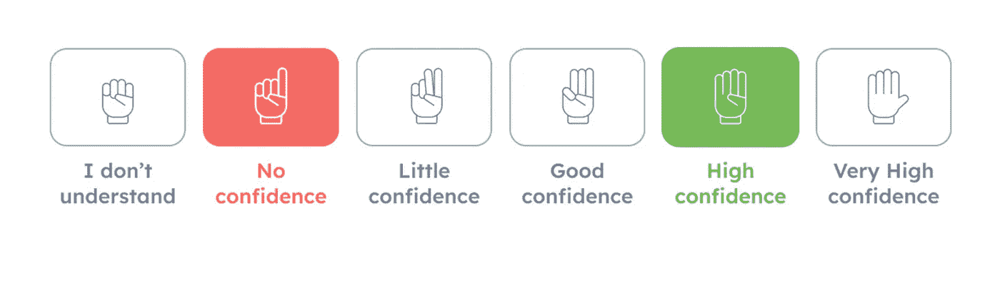
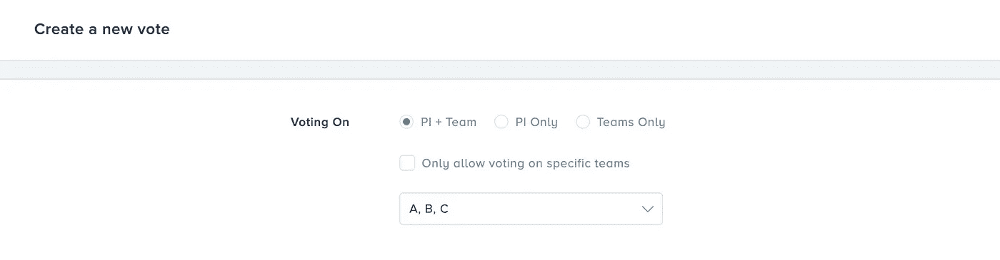
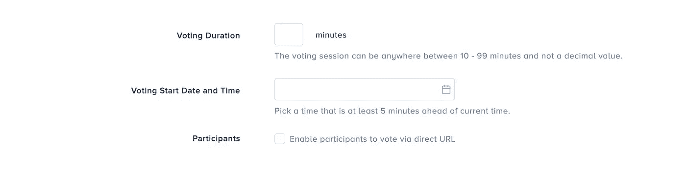
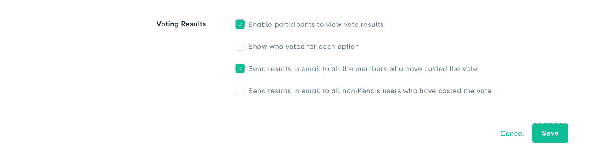
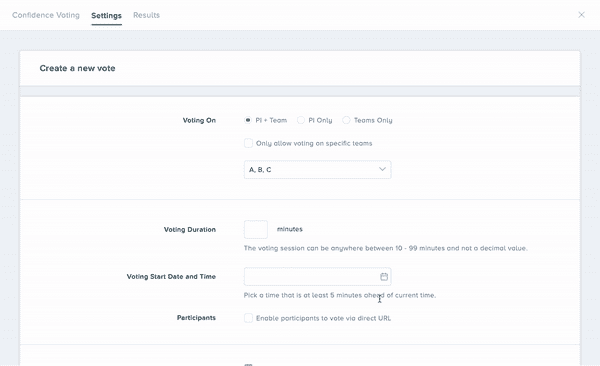
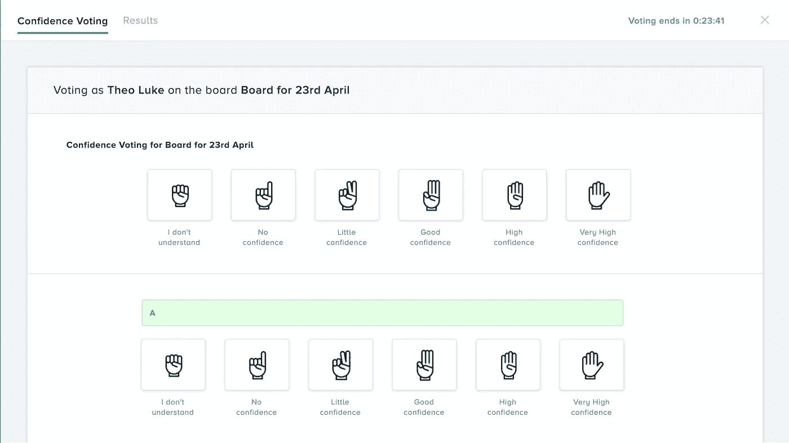
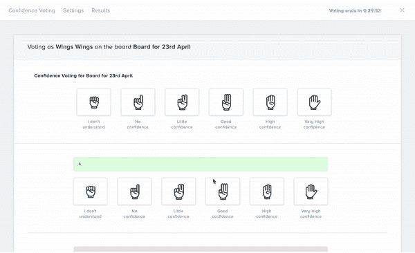
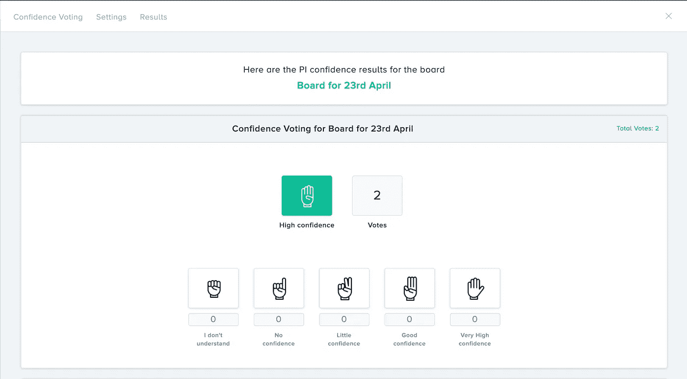
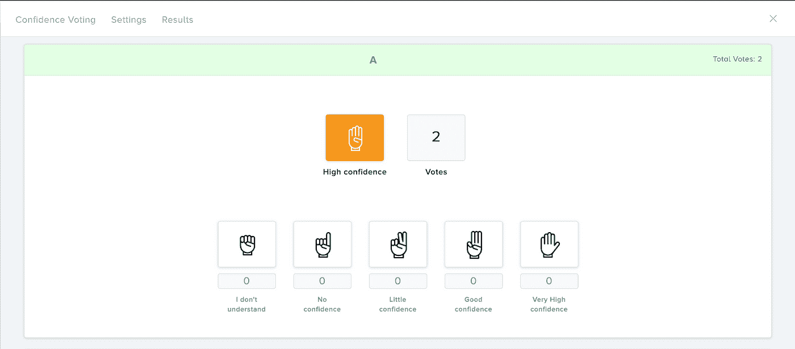

# 如何进行第一次远程信任投票？

> 原文：<https://medium.com/geekculture/how-to-have-your-first-remote-confidence-vote-session-5911dedcc20b?source=collection_archive---------46----------------------->

Kendis — PI Confidence Vote

信心投票是在计划增量(PI)规划会议中进行的活动，旨在评估团队在 PI 期间交付进展的信心程度。它是在计划增量的目标之后完成的，这些目标需要在 PI 过程中实现，并对所有的特性和用户故事进行优先排序和评估。

当这个环节开始时，敏捷发布系列的所有团队成员举手并用手指投票，表明他们对正在完成的 PI 目标的信心水平。

Kendis 现在用新的**信任投票**功能出色地模拟了这一活动。在本文中，我们将向您展示如何在 kendis 中进行信任投票。

# 创建您的第一个信任投票环节

信任票只能由**超级管理员**、拥有**管理员**权限的用户或者拥有**编辑版块**权限的用户创建。您可以对下面提到的三种类型中的任何一种进行信任投票:

# 1.PI +团队

为整个 PI 和所有相关团队投票。

# 2.仅 PI

只对项目进展进行投票。

# 3.仅限团队

只对团队在计划增量中的表现进行投票。

一旦您选择了一个选项，您将选择允许参加的团队。当您选择 **PI + Team** 或 **Teams** 选项时，会显示一个复选框，上面写着“**仅允许对特定团队**投票”。这将使您能够为您选择的团队创建一个单独的 URL，该 URL 可以与不属于 Kendis 的团队成员共享。

# 设置时间和日期

只能以分钟为单位设置会话持续时间，以及您希望开始信任投票会话的日期。

# 显示结果的设置

设置好时间、日期和团队后，您现在可以选择如何处理投票结果。

默认情况下，**超级管理员**，拥有**管理员**权限的用户或者拥有**编辑版块**权限的用户可以查看投票结果和投票的个人。

但是在选择选项“**使参与者能够查看结果**后，没有管理员权限的团队成员可以查看会话的结果。类似地，如果选择了选项“**显示谁为每个选项**投票”，那么没有管理员权限的用户也可以看到哪个团队成员投了什么票。

信任投票的结果也可以发送到 Kendis 内部或外部的团队成员的电子邮件中。

# 开始信任投票环节

在开始您的信任投票之前，您需要保存您的所有设置。保存设置后，您现在可以开始信任投票环节。

Kendis 团队的所有成员都可以选择投票。

# 如何投票？

一个按钮应在顶部可见，紧挨着董事会视图选择器，显示投票正在进行中。点击后，将显示投票屏幕。您可以从以下五个选项中进行选择。

只要会话正在进行，您也可以更改您的投票。一旦时间结束，您将无法编辑您的投票。

# 查看信任投票环节的结果

*选择 PI +团队选项的整个 PI 的投票结果*

会话结束后，可以查看信任投票的结果。如果选择了**允许参与者查看结果**或**显示每个选项**的投票者，那么除了**超级管理员**之外的用户、拥有**管理员**权限的用户或拥有**编辑板**权限的用户都可以查看结果和投票者。但是，如果这些选项没有被选中，那么只有超级管理员或管理员可以查看结果。

*选择 PI +团队选项的 A 队投票结果*

# 外卖食品

参与信任投票对一些人来说可能是一个巨大的负担。这些人可能会感到犹豫，并在同龄人的压力下投票。但要投信任票，首要要求是创造一个让人民自由表达自己的环境。

Kendis 通过革新信任投票的方式铺平了道路。它恰好是目前唯一无缝实现这一点的工具。这确实有助于创造一种环境，让人们能够舒服地分享和表达自己的观点，最终提高团队成员的士气，因为他们觉得自己的观点受到了重视。