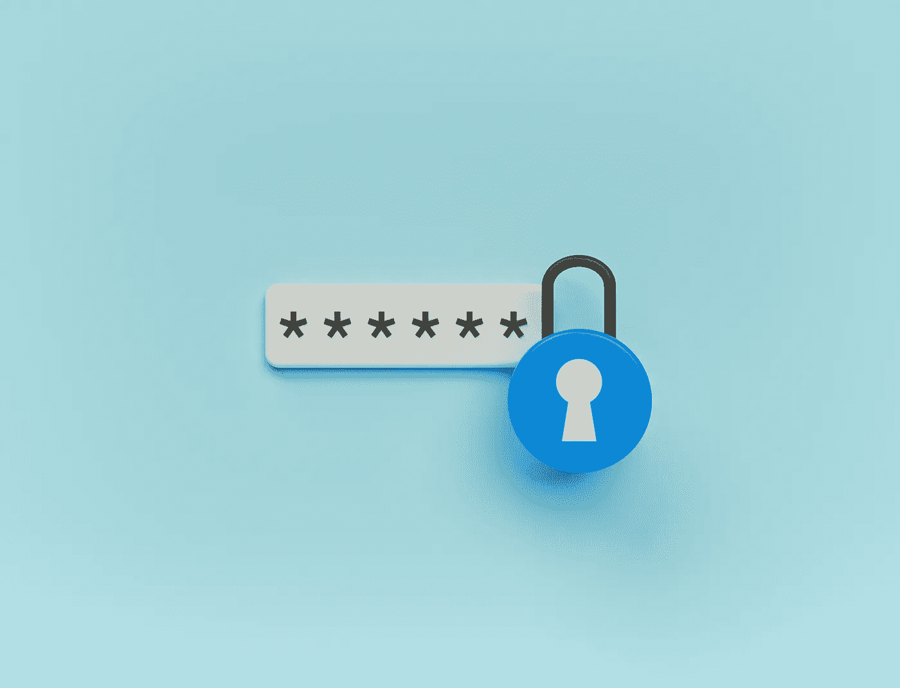

# 如何在 Python 脚本中隐藏密码和密钥

> 原文：<https://medium.com/geekculture/how-to-hide-passwords-and-secret-keys-in-your-python-scripts-a8904d5560ec?source=collection_archive---------0----------------------->

## 永远不要在 Python 脚本中泄露密钥

Image via Shutterstock under license to Frank Andrade

在制作了许多 Python 教程后，我意识到隐藏脚本中的任何密钥是多么重要。

相信我，你不希望你的同事或任何与你共享 Python 脚本的人看到你的 API 密匙或账户密码。他们…