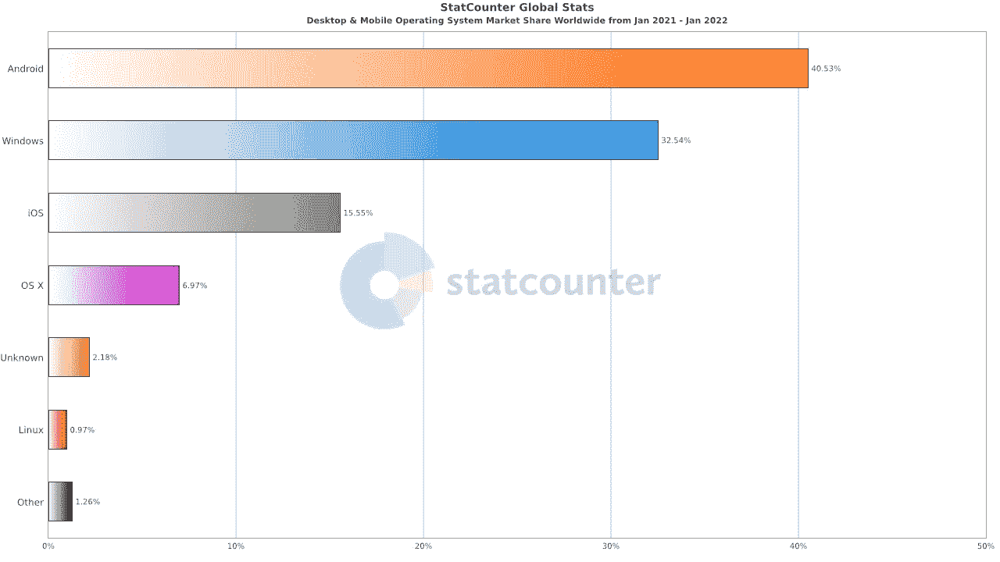
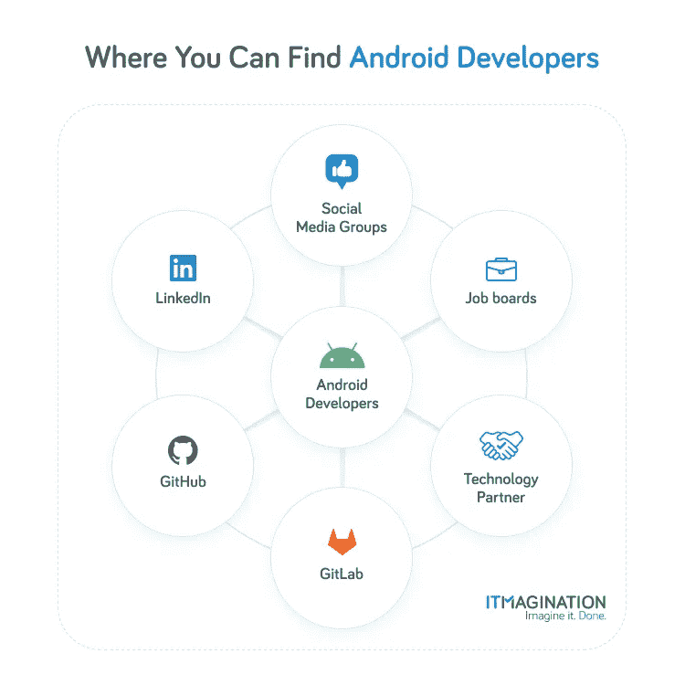
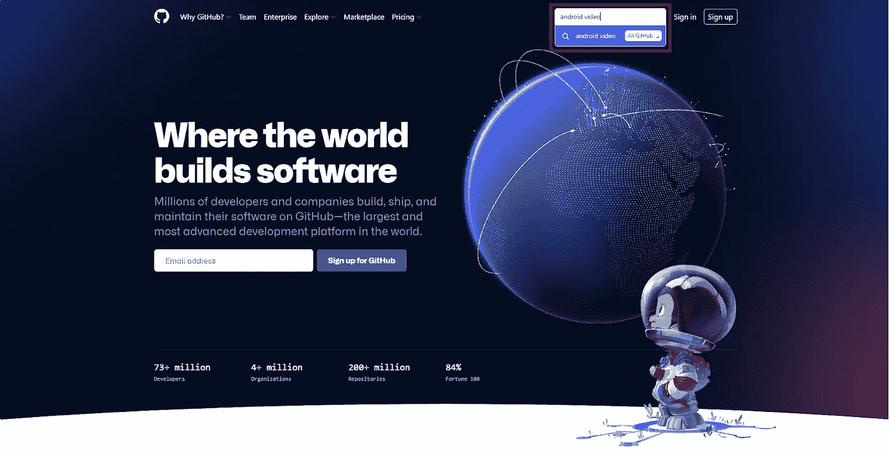
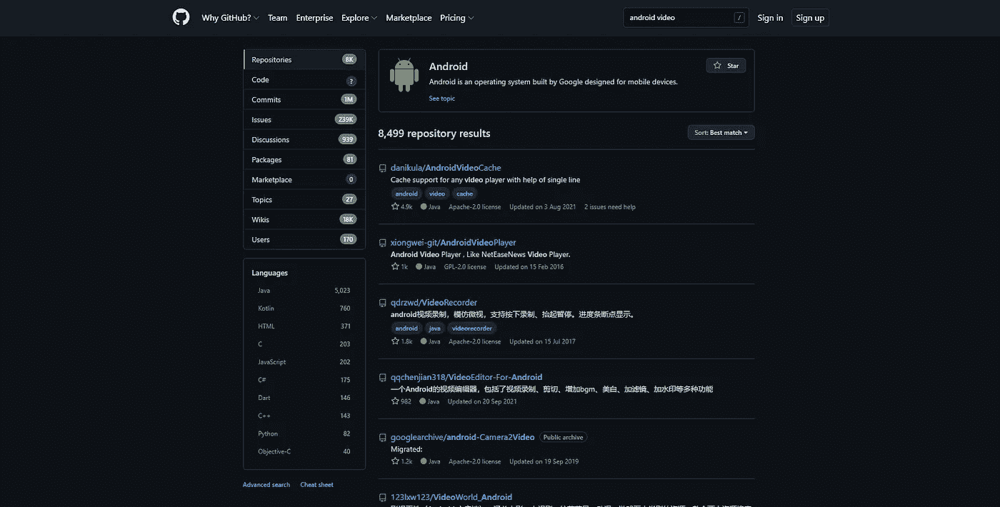
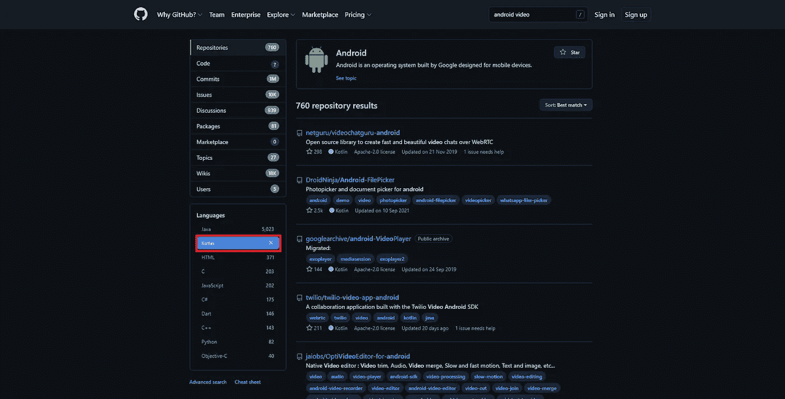
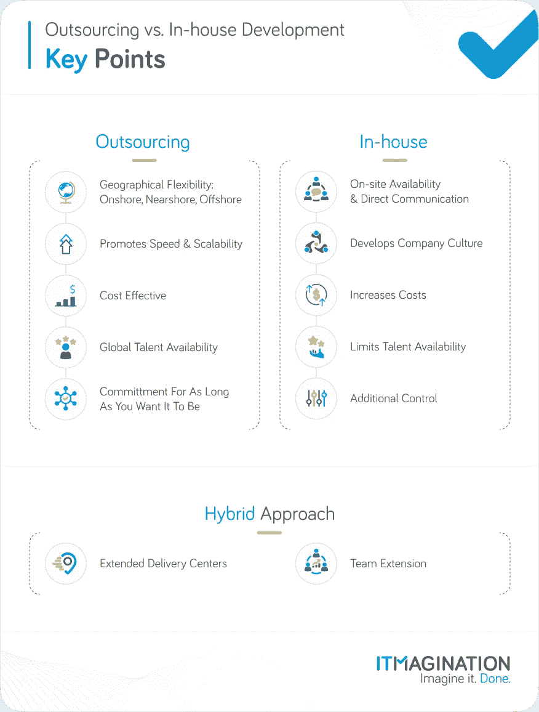

# 如何雇佣 Android 开发人员:一次搞定的 7 个技巧

> 原文：<https://medium.com/geekculture/how-to-hire-android-developers-7-tips-to-get-it-right-the-first-time-46a070ba9817?source=collection_archive---------20----------------------->

‍ **总结**

*   “我如何才能雇佣优秀的 Android 开发人员，并从一开始就把它做好？”当他们的产品包含原生 Android 应用时，这是业务和技术经理无数次问自己的问题。我们在这里是为了让您的过程更容易；
*   网上有几个地方可以让你的搜索变得更容易:LinkedIn、求职公告板、社交媒体群或 GitHub。您也可以通过技术合作伙伴雇佣员工；
*   招聘不是一件容易的事情，因为有许多事情要记住。我们将讨论 7 个最需要寻找的东西；
*   你可能没有意识到，但在评估候选人时，你确实有一种潜意识的偏见。我们有如何中和它的指南；
*   如果你不想自己做所有的事情，或者如果你现在就需要优秀的开发人员，[我们可以帮助你。](https://www.itmagination.com/services/custom-software-development/mobile-application-development)

手机市场是谷歌和苹果之间的对峙。你会看到运行 Android 的手机比 iOS 多很多；事实上，这个绿色的小机器人出现在屏幕上的次数比标志性的 Windows 标志还要多。

“Operating System Market Share Worldwide.” Source: [https://gs.statcounter.com/os-market-share](https://gs.statcounter.com/os-market-share)

我如何向所有这些人推销我的产品？解决方法那么多，很容易迷路。我们以前写过关于这种困境的文章。答案是:最安全的赌注是[写一个原生应用](https://www.itmagination.com/blog/native-mobile-apps)。这不是唯一的解决方案，其他的有[跨平台移动应用](https://www.itmagination.com/blog/cross-platform-mobile-apps)或[渐进式网络应用(PWA)](https://www.itmagination.com/blog/cross-platform-mobile-apps-pwa) 。

从大的方面来看，你最终采取的方法无关紧要。无论你的 app 概念有多棒，或者你的项目有多先进，你都需要优质的开发者。它们才是真正重要的:你的产品将和你的工程师的经验总和一样好。即使是最好的项目范围也可能是无用的，除非你有能够有效实施它们的专家。“哪里能找到好的开发者？”你可能会问。我们很高兴你这么做了。

> 你的产品会和你的工程师的经验总和一样好。

# Android 开发人员以及在哪里可以找到他们？

## 商务化人际关系网

这是你寻找优秀 Android 开发者的第一个地方，这是有充分理由的。如今，每一个想要在该领域受到尊重的专业人士都会觉得有必要在 LinkedIn 上拥有一个账户。

你可以利用这一点。使用标准搜索框查找潜在候选人可能不是最佳选择。专业社交网络不允许这样做也是有原因的。有一种面向招聘人员的服务，叫做(惊喜)“LinkedIn Recruiter”，让筛选潜在候选人变得轻而易举。

它是如何工作的？美国服务为您提供了使用关键词、过滤器等缩小搜索范围的选项。你也可以伸出手来，分析你行动的有效性。

## 工作公告板

外面有很多求职公告板。有一般受众的，比如 [Glassdoor](https://www.glassdoor.com/Interview/ITMAGINATION-Interview-Questions-E1328583.htm) ，也有针对特定细分市场的小众，比如 [Remote3](https://remote3.co/) ，发布 Web3 远程机会的地方。你还必须记住，一些小众网站可能会将他们的影响范围限制在某个特定的地区——比如 No Fluff Jobs 针对的是东欧的专业人士。

在哪里张贴您的报价？这完全取决于你公司的规模和选择的地理区域。如果你是一家大公司，你会发现 Dice.com 非常适合。具体来说，对于初创公司，有两个很好的目的地 [AngelList](https://angel.co/jobs) (各种规模的初创公司)，以及[独立黑客](https://www.indiehackers.com/jobs)(中小型初创公司)。如果你是一家规模较小，但已建立的公司，寻找目标受众较窄或规模较小的网站，如 [Authentic Jobs](https://authenticjobs.com/) 。

然而，不要仅仅依赖我们的建议。正如我们已经提到的，有一些网站是针对你选择的我们可能不知道的地区的:熟悉那里所有的网站是不可能的。它们也可能是外语，如法语，如果你是一家在本地招聘的魁北克公司。快速搜索可以创造奇迹，所以不要害怕这样做！

## 社交媒体团体

这一点很难实现，尽管如果你做对了，它可能会给你带来巨大的好处；你将不得不在寻求招募开发者的过程中小心翼翼地浏览版主和开发者。在脸书，有专门为开发者服务的团体，那里会有数百甚至数千人。

然而，要注意不要打破群体的规则。如果他们要求不要发布工作邀请的链接，那就不要发布。他们不仅会被删除，而且你可能会被禁止进入社区。如果你不能发帖，那就对你的目标细分市场做一些研究。熟悉那里的专家，观察并做出贡献。

你没看错最后一句话:不管小组的规则如何，努力参与讨论，并不时发布与**相关的**内容。它还会使自己成为社区的一部分，而不是一个“充满敌意”的局外人。无论如何，你也可能会找到对为你工作感兴趣的人。不要放弃，发不出来也要努力去做人脉。

# Git 仓库。GitHub & GitLab。

程序员喜欢与世界分享他们的代码。有时候只是为了炫耀自己很酷的项目，有时候是因为想帮助别人。无论是哪种情况，您都可以通过语言、名称和其他标准来查找项目。

我们开发了一个关于如何在 GitHub 上找到 Android 开发者的指南，其步骤简单易懂。

**如何在 GitHub 上找到优秀 Android 开发者的指南**

**第一步**

在您选择的网络浏览器中导航至[GitHub.com](https://github.com/)

**第二步**

在页面顶部的搜索栏中键入您的搜索短语。比方说，你正在寻找在创建以视频内容为重点的应用程序方面有经验的开发人员。我们使用搜索短语“Android 视频”只是作为一个例子。按回车键。

**第三步**

现在，您应该会看到与您的搜索结果相关的结果列表。

限制存储库只能看到那些使用 Kotlin 作为主要语言的库是个好主意。或者，选择 Java，尽管我们建议坚持使用 Kotlin。

从这里开始，您可以继续寻找最近更新的项目，因为它可能会让您对开发人员的参与情况有一个大致的了解。当然，这不是一个完美的指示，但是，我们必须记住，为了准确地确定人们有多活跃，我们需要更多的数据点。

还有一个可选的步骤可以让你更有效率。

**步骤 4a(可选，但推荐)**

点击页面左下角的“高级搜索”。

**步骤 4b**

你现在应该会看到过多的选项，你可能会找到你想要的项目。假设我们要找用 Kotlin 写的代码，从 2019 年到现在(> 2019)。我们必须确保它是最近更新的，所以假设我们希望最近一次更新是在几个月前(> 2021–10)。

结果将在顶部可见，如下所示:

z

点击搜索，瞧！

## 聘请技术合作伙伴/专业服务公司

另一种选择是与技术合作伙伴合作，也称为专业服务公司、外包公司或软件公司。这些术语适用于那些手头有开发人员的公司，这些开发人员将为您的项目工作一段时间，并且几乎随时准备加入。

这些技术合作伙伴充当(通常)在最佳技术和架构实践以及产品开发方面具有行业特定知识的代理。

[聘请技术合作伙伴](https://www.itmagination.com/blog/outsourcing-versus-in-house-software-development-pros-cons)开发你的安卓应用有什么好处？

*   更快的雇佣时间
*   降低招聘和管理费用
*   快速可扩展性
*   全球人才可用性

很难决定你是想要[内部招聘还是外包开发](https://www.itmagination.com/blog/outsourcing-versus-in-house-software-development-pros-cons)。最棒的是，这不一定是一个非此即彼的选择，而是两者的结合，你[建立交付中心来帮助你快速扩大和缩小规模](https://www.itmagination.com/services/it-outsourcing-nearshoring-offshoring/it-delivery-center-poland)，同时仍然发展你的内部能力。

下面，我们将概述雇用 Android 开发人员时需要注意的事项，无论是在内部还是通过寻找技术合作伙伴。

# 招聘安卓开发者需要注意什么

你现在有一个你想接触的开发人员的名单，或者你已经接触了一些。有些事情你必须牢记在心:

## 一种尺寸不适合所有人

并非所有的开发人员都符合您的要求。开发者不会专攻应用开发的所有领域，就像化学工程师可能对机械工程一无所知一样。

这都是因为掌握复杂的原生应用程序开发领域所需的主题的深度。具有完成消息应用项目经验的开发人员可能不是创建视频编辑应用的最佳人选。这是因为如何有效地发送和接收短信的知识在创造完美和直观的创作体验方面没有用处。确保你对自己正在做的东西有一个清晰的轮廓，并在过程的每个阶段都牢记在心。

## 良好的沟通技巧是无价的。编码不是开发人员唯一要做的事情

独自坐在光线昏暗的地下室里的开发人员就像独角兽一样神秘。除了编码，今天的专家需要参加会议，与你交谈，并且能够告诉你他们是否需要某些东西来完成他们的任务。

当一个人上线时，良好的线下沟通技巧是有用的。团队成员之间的互动方式、在外部会议中的行为方式以及传达公司文化的方式至关重要。

确保你评估了 Android 开发者需要具备的软技能和技术技能。

# 对所需的知识要现实

许多人都见过，需要四年以上的经验来处理一个只存在了一年半的图书馆。

另一个例子是当你对你的候选人要求太多的时候。在从事 Kotlin 项目时，Java 编程的经验并不遥远。然而，要求 Haskell 知识可能太多了。

在将工作说明书发布到网上之前，确保有深入技术知识的人查看了该工作说明书**，**你应该**没有这方面的知识。这可能会省去你许多麻烦，并且不会错过一些非常合格的候选人。让你的工作规范成为一个迷因不是你想要的。**

## 跟上最新的标准很重要

编程标准随着时间的推移而变化，编程时代比非编程时代持续的时间要短得多。不久前，你可以创建你的 Android 应用程序的唯一语言是 Java。现在，谷歌鼓励你用 Kotlin 写代码。

这些年来发生的另一个大变化是开发人员如何创建用户界面。它过去在概念上类似于 HTML 的工作方式——你用结构块(可扩展标记语言)创建每个屏幕。添加积木会让屏幕充满不同的形状和颜色。现在，你完全在 Kotlin ( [Jetpack Compose](https://github.com/itmaginationdemos/Jetpack-Compose) )中定义你的屏幕应该是什么样子。

即使开发人员在使用这些旧标准的同时保持他们的项目工作和更新，他们也可能不适合您。[当然，除非你正在更新旧的应用程序以符合最新的标准](https://www.itmagination.com/blog/refactoring-code)，或者你的旧应用程序运行良好，并为你创造价值。

## 如果开发人员以前有过开源项目的工作经验，这将是一个加分项

[全球约 78%的企业使用开源软件](https://www.zdnet.com/article/its-an-open-source-world-78-percent-of-companies-run-open-source-software/)。还记得 SpaceX 吗？他们的 2019 年火箭运行在修改后的 Linux 发行版上，宇航员将使用运行在 Chrome 上的界面。在线分享你的代码并让人们免费使用它是推动人类前进的动力。

这也是一个很好的窗口，让你了解开发人员处理批评、讨论的方式，你可以很容易地看到他们的代码有多好。雇用开源维护者或创造者还有另一个好处。这是雇主品牌，以及纯粹的品牌认知度。

 [## LinkedIn 上的 Sami gho che:FastAPI 在 StackShare 的 100 大开发工具中遥遥领先

### FastAPI 在 StackShare 的 100 大开发工具中遥遥领先！！很难夸大这是多么不可思议的一个…

www.linkedin.com](https://www.linkedin.com/feed/update/urn:li:activity:6895605774416969728/) 

再说一次，不是一个引人注目的程序员并不是拒绝某人的理由。这并不意味着你的候选人会变得不称职或不适合。我们想重申:人们可能有他们不发表自己作品的理由，比如人们可能更喜欢保持自己作品的私密性。

## 将应用程序作为他们投资组合的一部分，表明他们完全知道从头开始构建一个应用程序需要什么。

首先，我们不认为在 Google Play 上发布一个应用程序是证明你是一个伟大的专家的必要条件。人们很重视这一点是很正常的，尽管一个公开的应用程序本身并不能告诉你太多。

当然，如果 Google Play 上发布了一个应用程序，这是一个很好的选择。但是，请记住，您也可以在其他地方发布应用程序。比如，可能有人不愿意公开他们的应用程序，而会给你发一个带有代码的私人链接。

人就是人，所以只要你能看到一个高质量的应用程序，它在哪里可用并不重要:GitHub、Play Store、私人投资组合或 F Store 都只是达到目的的手段。一个有价值的建议是总是询问源代码:代码工作的事实并不能证明它是高质量的。

## 简历中的空白不一定会对候选人不利。

有时候，在精疲力竭的工作之后，人们需要重新调整心态，重新充电。有很多情况下，人们最终会筋疲力尽地离开自己的工作。休息是最自然的，有时甚至是双方都希望的。我们不想要一个完全筋疲力尽的候选人，对吗？

## 智胜自己

你有时会想这是怎么回事吗，你就是不喜欢某些人，你不知道为什么？也许你马上就喜欢上了其他人？这是潜意识的偏见在起作用。

诺贝尔奖得主丹尼尔·卡内曼写了一本名为《思考，快与慢》的书，他在书中解释了一个人是如何思考的，以及一个人是如何得出某些结论的。你可能没有足够的时间来浏览它，所以这里有一个简单的指南来帮助你:

**第一步**

选择几个你认为是工作成功的关键要求的特质。这里的限制是六个。确保它们没有重叠:我们想在尽可能大的范围内看看它们有多好。

高效的沟通、应用程序中常用的库中的知识和经验，以及可靠性只是一些例子。

**第二步**

想出一些问题(或许还有测试)来根据你在上一步中定义的方面来评估候选人。你可以要求他们写一个简单的应用程序作为“作业”，并进行技术面试。

**第三步**

现在你已经想好了你的问题和任务，考虑一下你将如何给每个候选人打分。最好的情况是有候选人的定性数据，而不是定性的。

**第四步(可选)**

让每个有机会与候选人交谈的人按照相同的预定义标准对他进行评估。然后，确定每位专家的平均值。那可以是你的七年级，虽然不一定要这样。

**第五步**

现在，面试每个候选人，选出分数最高的专家。这是更可靠招聘的关键；更准确地预测某人是否是一个好雇员。

# 不要让你的技术招聘碰运气。

如果你不确定要找什么或者你是否会做出一个好的选择，雇佣一个外部公司来帮你解决这个问题可能是个好主意。另一种选择是项目外包。一个好的规则是“专注于你做得最好的，把其他的外包出去。”如果您需要有经验的合作伙伴与您一起开发项目，我们就在这里。

当然，如果你更喜欢自己雇佣 Android 专家，我们上面给你的建议会帮助你做出正确的选择。

祝你好运！

*原载于*[*https://www.itmagination.com*](https://www.itmagination.com/blog/how-to-hire-android-developers-7-tips-to-get-it-right-the-first-time)*。*