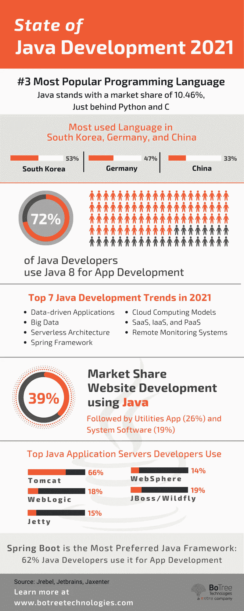

# 如何为你的 Web 开发项目雇佣 Java 开发人员？

> 原文：<https://medium.com/geekculture/how-to-hire-java-developers-for-your-web-development-project-5348f57dae68?source=collection_archive---------14----------------------->

# 技术的选择取决于业务需求。然而，现在有一种技术经受住了时间的考验。Java。

商业和 Java 的浪漫是一个轰动的故事。Java 已经被证明是最重要的平台之一，是一种流行的编程语言，跨越了 web、电子设备和服务器。为了满足他们的特定需求，组织要么雇佣 java 开发人员，要么将工作外包给外部的 Java 开发服务。

Java 是一种受欢迎的面向对象的编程语言，它快速、安全、可靠并且对从移动到超级计算机的各种设备都非常友好。因此，组织试图从庞大的开发人才库中雇佣最好的 java 专家。

# 阅读更多:[了解 Java 软件开发的利与弊](https://morioh.com/redirect?id=6229da8a803013ff63f2c159&own=5e82f73074431563388408ec&l=https%3A%2F%2Fwww.botreetechnologies.com%2Fblog%2Fpros-and-cons-of-java-software-development%2F)

这篇文章讨论了为什么要雇佣 java 程序员，以及如何选择和雇佣他们。

# 什么是 Java 开发人员，他们的角色是什么？

任何合格的专家，对 Java 开发相关的所有复杂问题都有扎实的技术知识。他们是这种语言的专家，因此可以根据任何组织的需求提供定制的 [java 软件开发服务](https://morioh.com/redirect?id=6229da8a803013ff63f2c159&own=5e82f73074431563388408ec&l=https%3A%2F%2Fwww.botreetechnologies.com%2Fjava-development-company)。

培养一个对语言有经验的优秀 java 团队将有助于一个组织快速有效地改进他们的流程、服务和产品。

# 为什么要考虑雇佣 Java 开发人员？

Java 是一种非常通用的语言。在这种语言的帮助下，java 工程师可以为多种目的构建不同的应用程序。Java 被用作设计的流行解决方案:

1.  ERP 平台
2.  Android 操作系统的移动应用
3.  区块链和智能合约机制
4.  金融应用
5.  媒体和娱乐应用

Java 是市场上许多最佳定制软件开发公司的首选。根据 Stackoverflow 的调查，Java 在 2020 年以 38.4%的份额保持了其作为五大常用编程语言的地位。即使在不可预测的新冠肺炎疫情时期，Java 仍然保持着稳定可靠的平台地位。

基于 Java 开发的一些主要的知名应用程序包括 Spotify、Twitter、PayPal、通用汽车、美国运通等。

# 如何为你的公司雇佣 Java 开发人员？

最近的 [CodinGame 开发者调查 2021](https://morioh.com/redirect?id=6229da8a803013ff63f2c159&own=5e82f73074431563388408ec&l=https%3A%2F%2Fwww.codingame.com%2Fwork%2Fcodingame-developer-survey-2021%2F%3Futm_source%3Dpress%26utm_medium%3Dreferral%26utm_campaign%3Ddeveloper-survey-2021%26utm_content%3Db2b) 报告称，大约 59%的招聘经理对 java 解决方案提供商有很高的需求。这显然意味着你不是唯一一个寻找有经验的 [java web 应用开发](https://morioh.com/redirect?id=6229da8a803013ff63f2c159&own=5e82f73074431563388408ec&l=https%3A%2F%2Fwww.botreetechnologies.com%2Fblog%2Fwhy-is-java-application-development-popular%2F)服务的企业。

根据同一项调查，虽然大约 60%的公司需要 Java 和 JavaScript 开发人员，但超过一半的开发人员知道如何用这些语言编码。

考虑到招聘 java 顾问的激烈竞争，招聘人员需要遵循巧妙的技巧来吸引最优秀的人才。

*   **分析 Java 开发者的需求:**
*   所有开发人员都有不同的技能和优势。合乎逻辑的第一步是列出你在开发人员身上寻找的品质。这些规范应该与公司的目标相匹配，以确保最终满足所有期望。
*   开发任何 Java 应用程序的第一步都是理解需求并采取相应的行动。一旦你知道你的要求，你就可以很容易地缩小候选人的范围。
*   记住，努力应该是将合适的人安排到合适的岗位上。
*   **定义您的 Java Web 开发项目的类别:**
*   在启动项目之前，有几个必要的问题需要在项目开始时回答。例如，你想开发什么类型的软件？每个 [Java web 开发](https://morioh.com/redirect?id=6229da8a803013ff63f2c159&own=5e82f73074431563388408ec&l=https%3A%2F%2Fwww.botreetechnologies.com%2Fblog%2Fwhat-does-the-future-of-java-web-development-look-like%2F)项目都有自己的需求和挑战，因此每个项目都有自己的天赋和技能需求。
*   组织既可以雇佣具有特定技能的开发人员，也可以与外部的 Java web 开发服务企业合作。在雇佣全职人员或将你的开发项目外包给第三方之前，检查一下开发者的任何 [Java 项目实例](https://morioh.com/redirect?id=6229da8a803013ff63f2c159&own=5e82f73074431563388408ec&l=https%3A%2F%2Fwww.botreetechnologies.com%2Fblog%2Fjava-applications-examples%2F)。
*   **去哪里找专业开发者:**
*   要找到一个专业的 Java 开发人员，有时传统的方法是不够的。为任何 Java web 服务项目寻找专业开发人员的一种不寻常但有效的方法是查看专业网站，如 Clutch、Upwork、LinkedIn、脸书等。因为你已经知道你在寻找一个开发人员的品质，将它们与开发人员的简介相匹配，并列出你的第一份候选人名单。
*   **获得 IT 招聘人员的服务:**
*   如果你发现自己很难招聘到优秀的开发人员，或者没有足够的带宽，那么就去找一个有能力的 it 招聘人员吧。这样的公司可以帮助组织寻找软件开发专家来处理 java web 开发项目。IT 招聘人员不仅会招聘 java 开发人员，还会代替你进行有效的面试，并填补你公司的永久职位。这个选项包含一些费用，完全值得。
*   **参加黑客马拉松等科技活动:**
*   这类事件是判断 Java 开发人员技能的绝佳场所。由于许多开发人员绞尽脑汁在他们的技能和专业知识的帮助下解决复杂的 IT 问题，这些地方是雇佣一个久经考验的 Java 战士的好地方。

由于许多技术网站和活动页面都用这些活动的信息进行了更新，因此可以很容易地在互联网上找到关于这些有趣活动的信息。

# 一个 Java 开发者需要哪些技能？

Java 开发人员必须能够用 Java 编写代码，并使用这种语言创建实用程序。他们必须知道应用程序架构是如何工作的，以便它是可伸缩的，并且易于所有开发人员学习和使用。任何通过 Java 开发人员路线图的开发人员还必须了解 Spring 框架、Hibernate 和其他工具。

# 结论

Java 是全球开发者中流行的编程语言。根据 Mangosoft 的调查，大约 58%的组织信任并使用 Java 进行他们的 web 开发项目。因此，雇佣 Java 开发人员对任何组织都有广泛的好处。它可以给他们带来低成本、最新技术和高运营效率的好处。

找到一个可靠的人才带领你走过 Java 浪潮的挑战是不容易的，但也是值得的。你只需要使用正确的招聘计划。

如果您的企业需要 Java java 软件开发最佳实践，领先的 Java 软件开发公司 [BoTree Technologies](https://morioh.com/redirect?id=6229da8a803013ff63f2c159&own=5e82f73074431563388408ec&l=https%3A%2F%2Fwww.botreetechnologies.com%2F) 可以为您提供帮助。

[联系我们](https://morioh.com/redirect?id=6229da8a803013ff63f2c159&own=5e82f73074431563388408ec&l=https%3A%2F%2Fwww.botreetechnologies.com%2Fcontact)今天免费咨询。

*原载于 2022 年 3 月 10 日 https://morioh.com/**。*