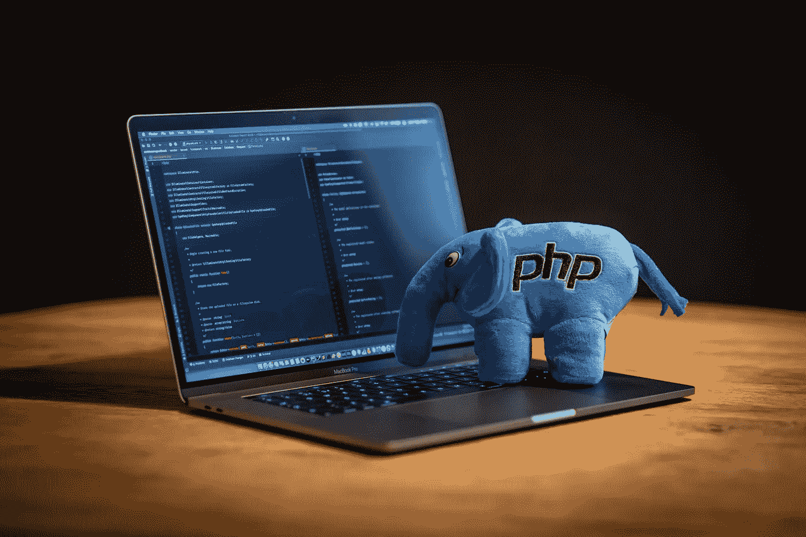
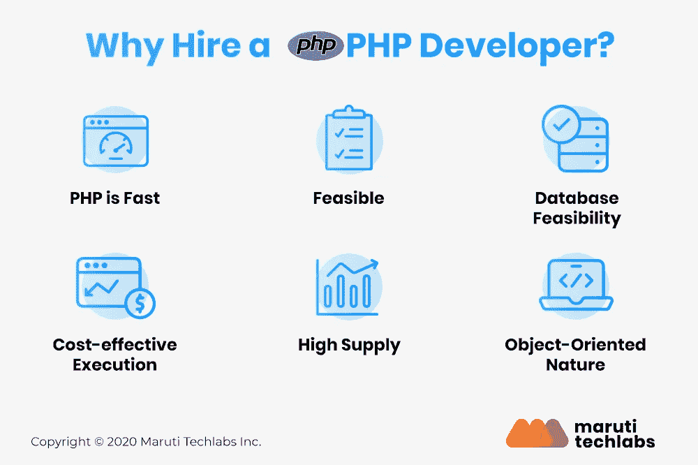
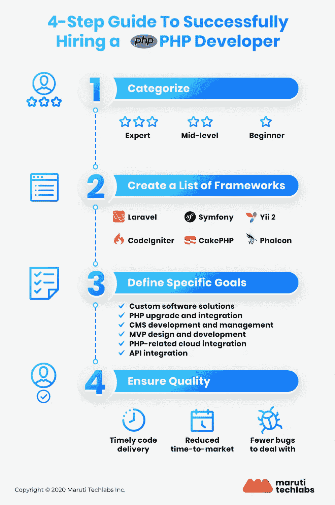

# 如何雇佣 PHP 开发人员:指南

> 原文：<https://medium.com/geekculture/how-to-hire-php-developers-a-guide-b82f9a09aa90?source=collection_archive---------20----------------------->

PHP 对于你的企业的数字化非常重要。它功能多样，用户友好，因此是新手和行业专家的热门选择。PHP 是最敏捷和最有价值的 web 开发语言之一。因此，软件组织需要雇佣专门的 PHP 开发人员来确保活动 web 应用程序的进步。

在这篇文章中，你将在雇佣 PHP 开发人员之前理解关键点。

# 为什么要在印度雇佣 PHP 开发人员？

让我们理解为什么在印度雇佣 PHP 开发人员是必不可少的。

*   PHP 快速高效。
*   它很容易在任何默认服务器上运行
*   它可以链接到许多数据库服务器
*   成本效益高的过程
*   PHP 程序员包括熟练和精通的人。
*   本质上面向对象

# 理解成功雇佣 PHP 开发人员的 4 步指南

PHP 开发的本质是它的灵活性和用户友好性。

这里有一个 4 步指南，让你雇佣 PHP 程序员。这些技术驱动的成员可以帮助你在未来做出懂技术的战略决策。

# **1。对 PHP 开发人员进行分类**

根据您的 PHP 项目的需求，您可以将 PHP 开发人员分类如下:

## 初级水平

初级 PHP 开发人员是指刚刚开始 PHP 项目的人。当你为你的组织建立一个内部团队时，他们会很有帮助。然而，他们不能在您的开发过程中提供有经验的行业特定实践。

## 中级

一个中级开发人员将有一定水平的行业经验，可以在有限的预算下执行您的项目。他们可以用更少的预算获得最佳结果。

## 专家级

当你需要高行业经验和熟练的专业人士时，这是你应该首选的类别。他们可以将你的创意转化为强大的功能。它们是最好的类别，因为它们将帮助你在竞争激烈的市场中脱颖而出。

# 2.制定一个框架列表

在决定了类别之后，您需要为您的组织起草一个 PHP 框架列表。这是至关重要的，因为如果你知道框架，搜索你需要的项目开发速度、熟练程度和技能集会更简单。

原始 PHP 框架适合于快速创建软件产品，以便在前期获得最终用户的反馈。代码可读性差是一个缺点，但如果您需要一个快速且经济的 PHP，基本框架是一个可行的选择。

如果你正在开发一个大规模的项目，你可以选择 Laravel 框架。它支持在众多 PHP 托管设施上快速开发应用程序。它还提供了本地开发引擎、路由系统等。

# 3.定义准确的目标

在你选择了你的 PHP 框架之后，在雇佣 PHP 开发人员之前，确定项目的确切目标。它将帮助您缩小项目开发所需的功能范围。

以下几点是项目开发的目的和目标:

*   PHP 开发中的定制软件解决方案
*   CMS 开发和控制
*   PHP 升级和无缝集成
*   MVP 设计和开发
*   基于 PHP 的云集成
*   项目中的 API 集成

进一步来说，为产品定义一个指南提供了项目范围的极好的知识。考虑项目开发结束后将会出现的额外维护工作。一个定义良好的方法将消除故障。

# 4.专注于质量

软件开发将包括多个跨职能团队，因此关注质量是至关重要的。当你雇佣 PHP 开发人员时，他们应该确保以下几点:

*   代码按时交付
*   产品更快进入市场
*   更少的错误

# 从哪里可以雇佣专门的 PHP 开发人员？

以下是你如何雇用专门的 PHP 开发人员:

*   你可以联系相关机构，他们会帮助你雇佣全职 PHP 开发人员。代理处会给你提供资源。
*   你可以在 LinkedIn 上浏览，寻找合适的 PHP 程序员。
*   PHP 在市场上有很大的社区，你可以通过这些社区寻求开发者。
*   可以通过软件开发公司雇佣 PHP 程序员。

# 结论

你是为你的组织做决策的正确人选。如你所知，市场上不缺 PHP 开发者。然而，选择一个真正的开发商是令人费解的。本文提到的所有参数将帮助你在印度雇佣 PHP 开发人员。

[马鲁蒂科技实验室](https://marutitech.com/hire-php-developers/?utm_source=medium&utm_medium=content_promotion&utm_campaign=Hire_PHP_Developers)为您提供一个专门的、充满激情的团队，由训练有素的 PHP 开发专业人员组成。我们可以通过成功执行您的项目来帮助您实现业务目标。

想了解更多关于在印度雇佣 PHP 开发人员的信息吗？点击阅读详细指南[。](https://marutitech.com/hire-php-developers/?utm_source=medium&utm_medium=content_promotion&utm_campaign=Hire_PHP_Developers)