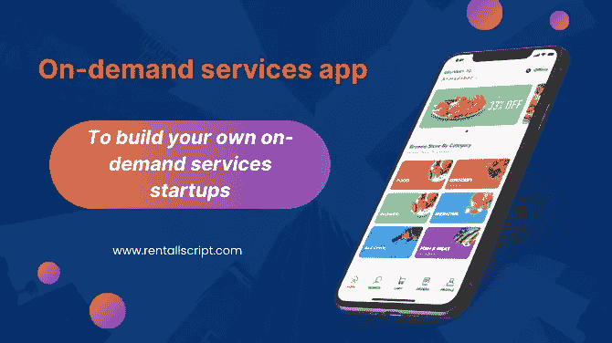

# 如何聘请最好的公司开发按需交付应用程序

> 原文：<https://medium.com/geekculture/how-to-hire-the-best-company-to-develop-an-on-demand-delivery-app-e4b9ec1536c?source=collection_archive---------10----------------------->

On demand delivery app

一段时间以来，按需交付一直是一个热门话题。它对食品、出租车、医药等各行各业都产生了重大的积极影响。人们越来越感兴趣的是，只需在智能手机上轻点几下，商品就能送到家门口。

按需交付企业在构建交付应用程序方面进行了大量投资，以利用在线交付行业的前景。因此，由于每个企业都想雇佣最好的应用程序开发公司，对开发人员的需求激增。然而，随着互联网上不同应用程序开发公司的丰富，这些企业很难选择理想的一个来创建他们的应用程序。

因此，我们将讨论您在选择按需交付 app 开发公司之前应该考虑的因素。

# 寻找最佳公司开发按需交付应用的步骤

## 在不同平台上搜索

如果你不确定从哪里开始寻找移动应用开发公司，这里有一个解决方案。有几个平台可以参考，而不是只依赖谷歌搜索结果。众所周知，Google 根据公司使用的 SEO 技术来显示结果。因此，最好的结果并不总是最好的。这就需要对其他平台进行额外的研究，比如 Clutch、Good Firms、LinkedIn 等等。

例如，Clutch 是一个为移动应用开发公司提供评级和评论的网站。你甚至可以在 LinkedIn 上联系公司，或者向联系人寻求推荐。

## 分析公司背景

一旦你确定了几家公司的候选名单，就要调查他们的背景。找公司有多少年的经验，做过多少项目。此外，你还可以调查已完成项目的质量，以及是否有任何值得注意的名字。此外，还要看看公司在多少个国家开展业务，为多少客户提供服务。

## 客户端概述

下一步需要你更多地了解公司的客户。检查公司网站以及 Clutch 等平台上发布的客户评论和评论。利用顾客的评价来分析公司的服务质量。客户对交付的产品满意吗？公司的客户留存率是多少？这些问题的答案将帮助你确定该公司是否能够满足你的期望。

## 日程咨询

在对公司有了更多了解后，你可以将搜索范围缩小到 2-3 家公司。安排一次与这些公司的协商，计算出开发按需交付应用程序的成本。只有在彻底了解你的项目并讨论你需要的软件类型，包括特性、功能、平台和设计之后，公司才会提供成本估算。还可以查询公司的开发团队规模、开发流程、技术栈等。

## 雇佣最好的

咨询入围的公司将有助于你确定最适合你需要的公司。不要仅仅依靠最低开发成本来做出决定，因为这可能会损害应用程序的质量。检查哪家公司更了解你的业务，并研究了你的市场和消费者，为你提供领先于潮流的最佳交付业务应用程序。

以上是你在选择手机 app 开发公司之前要考虑的因素。

# 开发按需交付应用的最佳公司

RadicalStart 是一家领先的按需应用程序开发公司，在行业内拥有超过 6 年的经验。它为企业提供送货应用和租赁应用解决方案，以立即启动自己的创业公司。它在 google my business 上有一些令人印象深刻的客户评论，揭示了其移动应用开发服务的质量。

它培养了一个由精通不同学科的高技能开发人员组成的大型团队。它对交付应用程序的贡献之一是 Wooberly SuperDelivery — [**按需交付应用程序**](https://www.rentallscript.com/multi-delivery-super-app/) 解决方案，帮助初创公司通过单个应用程序提供多种服务，如食品交付、杂货交付等。它包括一个面向客户和配送合作伙伴的专用应用程序，以及一个面向管理员和商店的网络面板，用于执行无缝配送服务。它降低了每项服务的应用程序开发成本和启动时间。此外，它还帮助您利用按需交付行业中的商机。

## 结论

现在，您已经知道如何为您的企业选择正确的交付应用程序开发公司，并拥有了最好的按需交付应用程序开发公司，您可以开始设计自己的应用程序了。