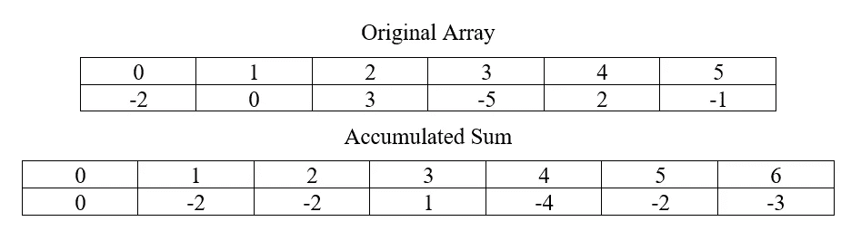
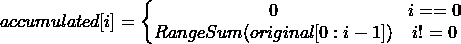
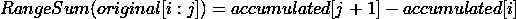
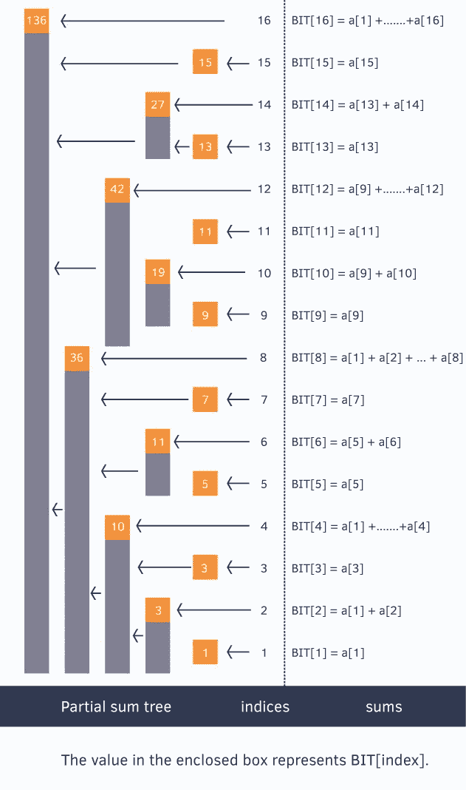
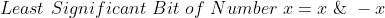
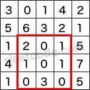

# 如何用一棵树保存整个矩阵

> 原文：<https://medium.com/geekculture/how-to-hold-a-whole-matrix-with-one-tree-df25a0270434?source=collection_archive---------14----------------------->


## 1989 年俄罗斯研究人员 Boris Ryabko 发明了二叉索引树数据结构；今天，本发明被大规模系统用来有效和正确地排列和矩阵，以及在编程面试中询问候选人。在接下来的文章中，我将揭开这一独创性发明的神秘面纱，并采访发明者，了解这一创意的灵感来源。

即使你已经在 LeetCode 上解决了 50 多个关于回溯、动态编程、设计和图表的问题，为下一次面试做好了准备，这个问题还是会让你大吃一惊😀

这篇文章将为你的工具箱添加一种新的解决方法，所以首先我们将从问题的一维版本开始，然后继续二维方法，最后，这种巧妙的数据结构的发明者与我们分享这种创造性想法的背景和动机。

## 如何有效地对一维可变数组进行范围求和

我们的问题是[leet code # 307](https://leetcode.com/problems/range-sum-query-mutable/)；给定一个数字数组，我们将支持三个操作:初始化，用一个值更新一个特定的索引，以及给定索引的范围求和子数组。

对于范围和运算，这个问题可以用 O(n)时间复杂度天真地解决，但对于现实生活中的大规模系统，这就太多了。

我们能做得更好吗？

让我们首先检查如果数组是不可变的，我们将如何有效地进行 range sum，就像在 [LeetCode #303](https://leetcode.com/problems/range-sum-query-immutable/) 中一样；

我们可以通过保持阵列的累积和来避免子阵列和的重复计算:



在累加和数组中，0-索引将包含 0(表示没有元素被求和)，从那里开始，第`i`个索引保存原始子数组[0:i-1]的和:



因此，为了计算原始子阵列[i:j]的范围和，我们将返回:



这样我们就可以在 O(1)中回答范围和查询。

然而，在可变版本中，没有使用累加和，因为更新会使它无效。

我们如何以一种既能快速更新又能快速查询的方式来维护累积的总和？

在这里，二进制索引树的巧妙发明派上了用场！

让我们创建另一个名为 BIT 的数组，它应该保存累加和——但每个索引不会从一开始就保存整个子数组的和——而是保存它的特定部分。

哪些部分？

二进制索引树将从 1 开始，它的第`i`个索引保存由该索引的二进制表示定义的原始数组中元素的总和。

***实际上是怎么做到的？***

这个算法听起来很抽象——所以相信你会理解的，下面是详细的例子！

**当我们更新原始数组中的值时，我们将更改传播到二进制索引树:**

1.  我们计算以前的值(最初为 0)和更新后的值之间的差——从现在开始将被称为`difference`——这是我们必须添加到二叉索引树的节点的数量。
2.  将`index_to_update`设置为更新的索引。

3.而`index_to_update` 小于或等于数组总大小。

3.1.将`difference`添加到二进制索引树的`index_to_update` 索引处。

3.2.将`index_to_update.`的最低有效位值加到`index_to_update`

*例如*

给定一个大小为 16 的数组，我们将把第 11 项(基于 1 的索引)更新为值 7——并将该变化反映到保存部分和的二进制索引树中。

*(1)初始值为 0(添加项目时)，所以要传播的值为* `diffrence=*7–0=7*` *。*

(2)设置`index_to_update = 11 (01011)`

(3) `index_to_update = 11 <= 16`

(3.1)在索引`index_to_update = 11`处将`diffrence=*7*`添加到二进制索引树

(3.2)`index_to_update = 11 (01011)` 的最低有效位值是`1 (00001)`，因此新的`index_to_update=11+1=12`

(3) `index_to_update = 12 <= 16`

(3.1)在索引`index_to_update = 12`处将`diffrence=*7*`添加到二进制索引树

(3.2)`index_to_update = 12 (01100)` 的最低有效位值是`4 (00100)`，因此新的`index_to_update=12+4=16`

③`index_to_update = 16 <= 16`

(3.1)在索引`index_to_update = 16`处将`diffrence=*7*`添加到二叉索引树

(3.2)`index_to_update = 16 (10000)` 的最低有效位值是`16 (10000)`，因此新的`index_to_update=16+16=32`

③`index_to_update = 32 **IS NOT <=** 16`和我们完成。

**当我们想要从原始数组的开始直到特定结束索引的总和时，我们以下面的方式对二进制索引树求和:**

1.  将`index_to_sum`设置为要求和的范围的结束索引。
2.  而`index_to_sum`则大于零。

2.1.在`index_to_sum`相加，对二叉索引树的值求和

2.2.从`index_to_sum`中减去`index_to_sum`的最低有效位值。

*例如*

给定一个大小为 16 的数组，我们将从开始到第 11 项(从 1 开始的索引)对子数组求和。

(1)设置`index_to_sum = 11 (01011)`

②`index_to_sum = 11 > 0`

(2.1)将`index_to_sum = 11`处的二进制索引树的值相加求和(保存原始数组中第 11 项的和)，因此当前:

```
subarray_sum = arr[11]
```

(2.2)从`index_to_sum = 11 (01011)`中减去最低有效位值`1 (00001)`，因此新的`index_to_sum=11-1=10`

(2) `index_to_sum = 10 > 0`

(2.1)将`index_to_sum = 10`处的二进制索引树的值相加求和(保存原始数组中第 9 项和第 10 项的和)，因此当前:

```
subarray_sum = 
arr[9]+arr[10]+
arr[11]
```

(2.2)从`index_to_sum = 10 (01010)`中减去最低有效位值`2 (00010)`，因此新的`index_to_sum=10-2=8`

(2) `index_to_sum = 8 > 0`

(2.1)将`index_to_sum = 8` 处的二进制索引树的值相加求和(保存所有项的和，直到原始数组中的第 8 项)，因此当前:

```
subarray_sum = arr[1]+arr[2]+arr[3]+arr[4]+arr[5]+arr[6]+arr[7]+arr[8]+
arr[9]+arr[10]+
arr[11]
```

(2.2)从`index_to_sum = 8 (01000)`中减去最低有效位值`8 (01000)`，因此新的`index_to_sum=8-8=0`

`index_to_sum = 0 **IS NOT** **>** 0` 和我们完成②。

如果你对一棵树的样子感兴趣，这张图片比 1024 个单词更好:



Source: [HackerHearth](https://www.hackerearth.com/practice/notes/binary-indexed-tree-or-fenwick-tree/)

正式定义不太直观，但为了完整起见:

> 索引`*i*`是 2 的幂的每个元素包含前`*i*`个元素的和。索引是 2 的两个(不同的)幂的和的元素包含从 2 的前一个幂开始的元素的和。一般来说，每个元素都包含自其在树中的父元素以来的值的总和，并且通过清除索引中的最低有效位来找到该父元素。

你可能会想，好吧，这是一个聪明的想法，但是在面试环境中如何实施呢？！

幸运的是，代码可以简单而优雅地编写，利用了这样一个事实，即我们可以通过添加或减去最低有效位来向上(当设置值时)或向下(当对子数组求和时)推进二进制索引树。

最低有效位可以通过这个神奇的公式轻松获得:



这个公式是正确的，因为计算机中的数字由[二进制补码](https://en.wikipedia.org/wiki/Two%27s_complement)表示，因为负值是通过反转数字并加 1 来计算的，所以当数字与其负数进行 and 运算时，只有最低有效位保留下来。

瞧啊。下面的代码范围对 O(log n)中的一个子数组求和！

## 如何有效地对二维可变数组进行范围求和

现在我们已经熟悉了二叉索引树，我们可以面对如何在矩阵中支持范围和的更复杂的问题。

这个臭名昭著的难题被称为[leet code # 308](https://leetcode.com/problems/range-sum-query-2d-mutable/)；

> G 给定一个 2D 矩阵*矩阵*，求其左上角(*行* 1，*列* 1)和右下角(*行* 2，*列* 2)所定义的矩形内的元素之和。



> 上面的矩形(带有红色边框)由(row1，col1) = **(2，1)** 和(row2，col2) = **(4，3)** 定义，其中包含 sum = **8** 。

我们将构建二进制索引树作为一个二维矩阵，每次都在行方向和列方向进行更新和查询:

## 二叉索引树是如何诞生的——发明者访谈

二进制索引树早在 1989 年由俄罗斯研究员鲍里斯·里亚布科发明。

当我问他这种数据结构的灵感来源时，他回忆道:

> 我从 1970 年(当我还是学生的时候)就知道 AVL 树和其他搜索树，并从 20 世纪 70 年代末开始研究源代码编码(或数据压缩)。所以二叉索引树就是基于这样的背景。事实上，这是一种顿悟，因为很难添加一些东西。

这是另一个例子，说明了两个看似不相关的领域是如何紧密联系在一起的，并可以用来优雅地解决复杂的问题。

***喜欢这篇文章吗？随意长按👏下面的按钮😀***