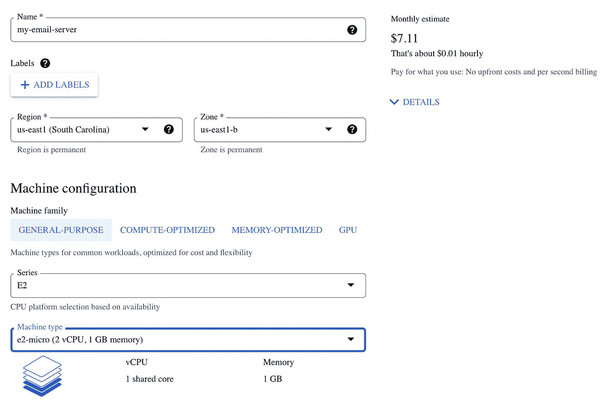
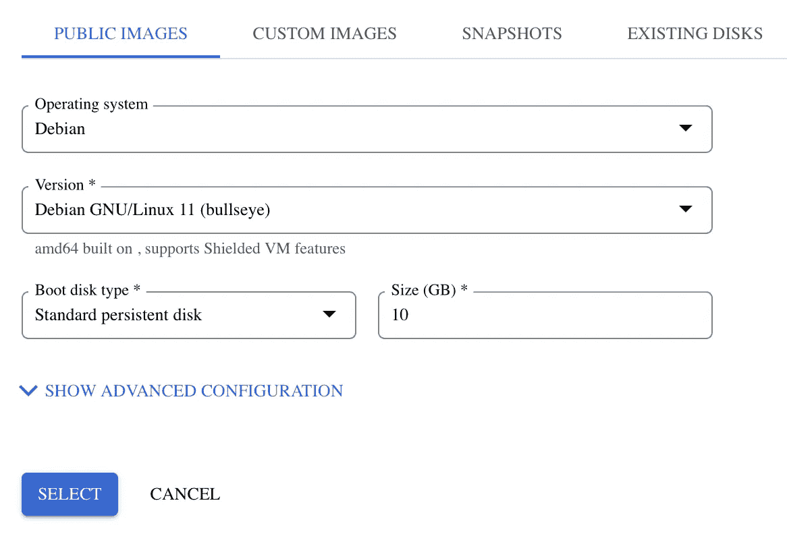
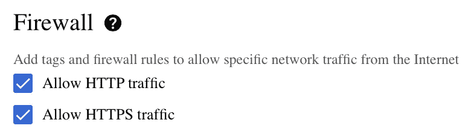
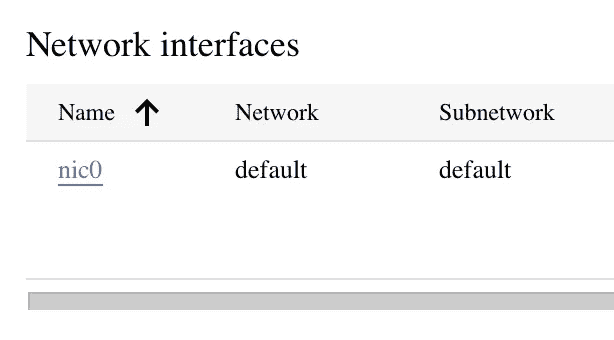
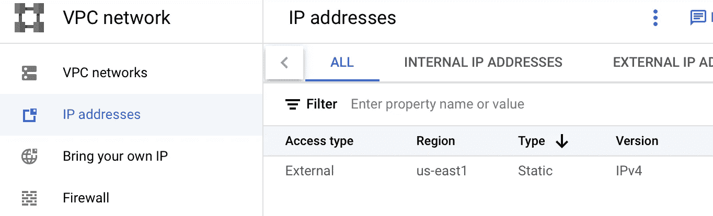
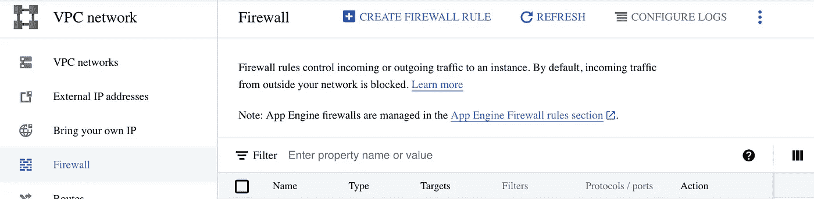
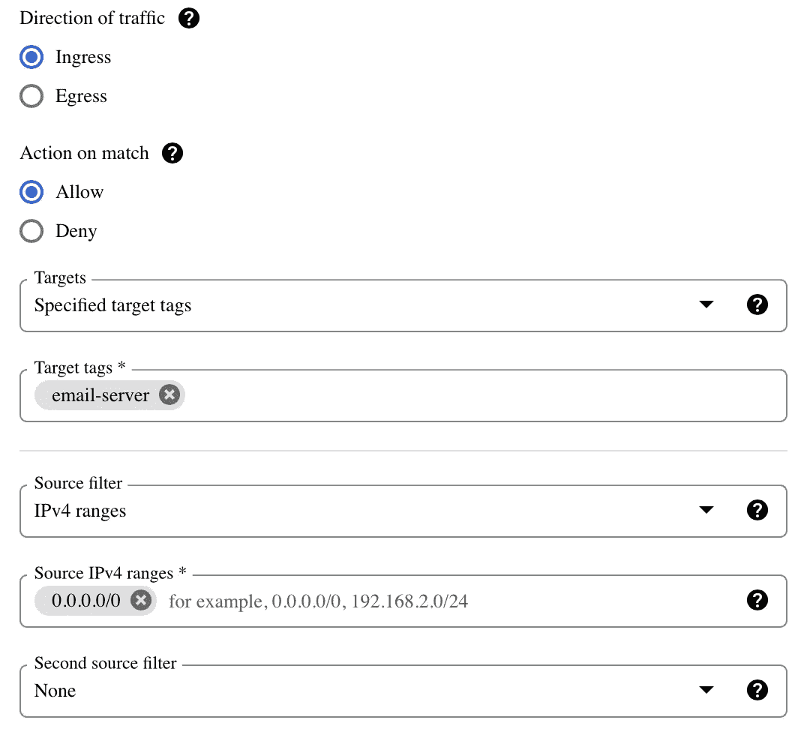
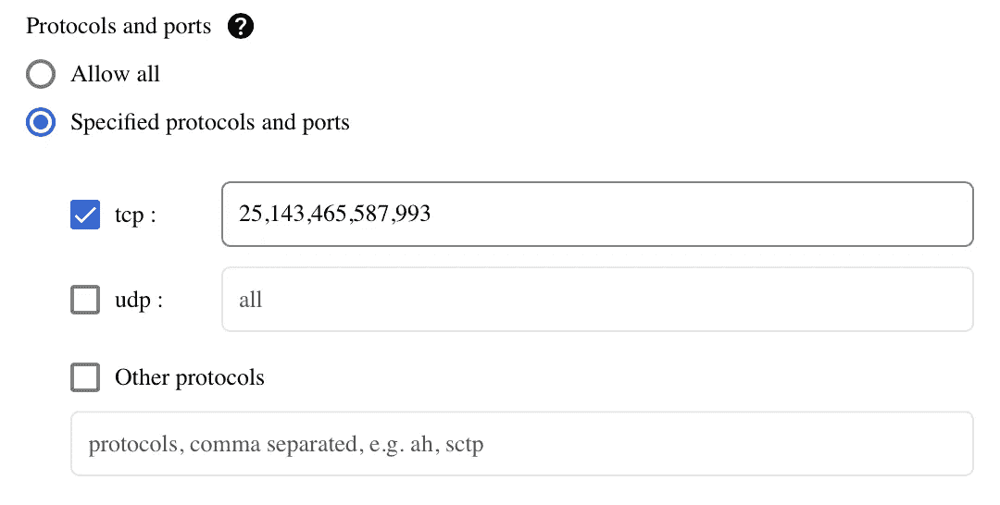
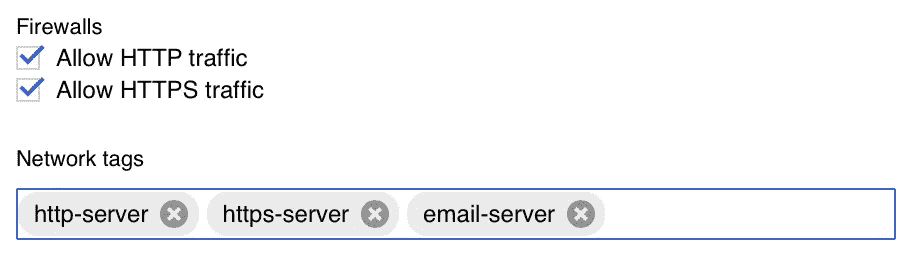
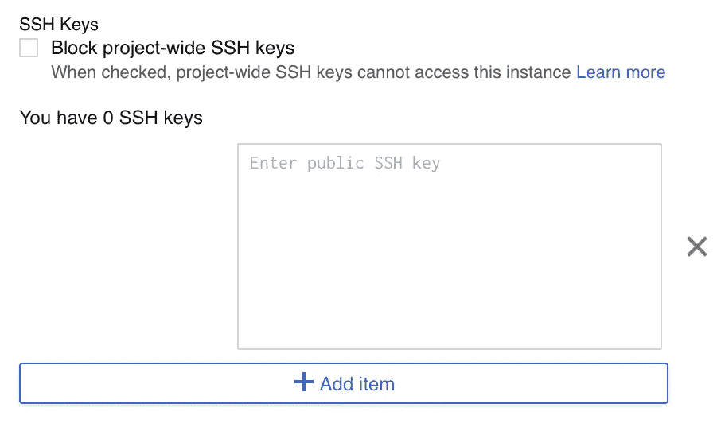

# 如何在 Google Cloud 上托管个人邮件服务器(免费！):第一部分

> 原文：<https://medium.com/geekculture/how-to-host-a-personal-email-server-on-google-cloud-for-free-part-i-8124d65d1d25?source=collection_archive---------2----------------------->

## 简介和 GCP 设置


# 本系列文章

1.  ***简介& GCP 设置***
2.  [配置后缀、邮件枪、& DNS 记录](https://lp3.medium.com/how-to-host-a-personal-email-server-on-google-cloud-for-free-part-ii-20aaeb0ae9eb)
3.  [配置鸽笼&加密](https://lp3.medium.com/how-to-host-a-personal-email-server-on-google-cloud-for-free-part-iii-15e2db1f1f8e)
4.  [使用 MariaDB & Postfixadmin](https://lp3.medium.com/how-to-host-a-personal-email-server-on-google-cloud-for-free-part-iv-1b5142cab9c) 管理虚拟邮箱
5.  [使用 Roundcube 托管网络邮件](https://lp3.medium.com/how-to-host-a-personal-email-server-on-google-cloud-for-free-part-v-f9a4b3643622)
6.  [用 Rspamd &筛子过滤垃圾邮件](/geekculture/how-to-host-a-personal-email-server-on-google-cloud-for-free-part-vi-6ea09f18d7df)

# 介绍

在这个系列中，我们将经历在运行于*谷歌云平台(GCP)* 上的*虚拟机(VM)* 上设置和运行我们自己的电子邮件服务器所需的所有步骤。更好的是，我们将在 GCP 免费层的一个实例上运行它，这意味着，最终，我们将自豪地拥有一个免费的*私人电子邮件服务器(*不包括域名的成本)。

在第 1 部分中，我们将回顾设置一个 GCP 虚拟机实例和接收电子邮件所必需的*防火墙*规则，以及如何 *SSH* 进入我们的实例，但是首先，简要介绍一下我们将在虚拟机上安装的&软件。

*   **后缀**，收发邮件
*   **鸽笼**，用于 IMAP 访问我们的邮箱
*   MariaDB ，作为我们存储用户和其他必要数据的数据库
*   **Rspamd** ，检测垃圾邮件
*   **筛选**，(一种脚本语言)将垃圾邮件移动到垃圾文件夹
*   **Postfixadmin** ，作为易于管理的管理网络界面
*   **Roundcube** ，作为我们的网络邮件客户端
*   **Nginx** 和 **PHP-FPM** ，通过 web 服务于 Roundcube & Postfixadmin

我们将在本系列的后续部分中介绍所有软件的安装和配置，以及我们的*域*的 *DNS* 配置。我们还必须使用提供的几种服务之一来设置邮件中继，因为 GCP 会阻止端口 25 上的所有传出流量，该端口由 *SMTP* 用于电子邮件传递。在这个系列中，我们将使用*射枪*，但也有其他选项。

如果你熟悉设置个人邮件服务器的流程或者这个软件列表，你可能会注意到我省略了一个经常包含的软件: **ClamAV** (杀毒)。这是因为 GCP 的自由层没有为虚拟机提供足够的内存来有效运行 ClamAV。

大多数管理员会告诉你，运行电子邮件反病毒程序更多的是为了安心，而不是实际利益，以及通过覆盖所有基础，在发生事故时保护自己免受更高的攻击。我相信(也希望)如果你准备好开始建立自己的电子邮件服务器的旅程，你可能有足够的知识和责任心来避免任何病毒，软件将有效地保护你。如果你觉得你的服务器需要病毒防护，你可以遵循这个指南，选择一个更高层次的虚拟机，每月花费很少。ClamAV 需要 2GB 的内存，因此您应该选择至少 4GB 的虚拟机。

# 设置计算引擎

如果你还没有 GCP 账户，你可以在这里用你的 Gmail 账户[免费注册。我们需要激活**计算引擎 API** 来设置一个虚拟机实例。这将需要设置一个*计费账户*，但是请放心，只要你按照本指南设置你的虚拟机，你将不会被计费。](https://console.cloud.google.com/freetrial)

设置好您的付费账户后，通过导航抽屉导航至*计算引擎>虚拟机实例*。启用 API。然后，按下*创建实例*按钮。

现在我们需要命名我们的服务器，选择我们希望托管的区域，并选择我们希望部署的虚拟机类型。您可能希望选择一个离您最近的地区，但并非所有地区都支持我们想要部署的 *e2-micro* 虚拟机，因此您可能需要稍微调整您的选择。我们想要部署一个*通用 e2-micro* VM 实例。



**注意:**你会看到一个每月估计成本。这是因为这一层通过每月支付虚拟机实例成本的信用额度是免费的。

接下来，我们需要向下滚动到*引导盘*部分并选择*改变*。将*版本*改为 *Debian GNU/Linux 11(牛眼)*，将*引导盘类型*改为*标准持久盘*。保留默认引导磁盘类型(*平衡持久磁盘*)每月会产生少量费用，因为磁盘平衡不是免费服务。按下*选择*保存我们的更改。



最后，允许 *HTTP* 和 *HTTPS* 流量通过*防火墙*。我们将使用 *Nginx* 来确保所有流量都通过 *HTTPS* 发送。按下 *Create* 按钮来部署我们的新 VM 实例。



GCP 完成虚拟机部署后，通过单击名称从列表中选择虚拟机。导航至*网络接口*部分，点击网络接口名称( *nic0* )。



目前，我们被分配了一个*短暂的* IP 地址，这意味着如果我们临时关闭或重新启动实例，一个新的地址将在启动时被分配。为了确保我们在需要重启时不会失去对电子邮件的访问，我们可以*保留*当前的 IP 地址，将其转换为*静态* IP 地址。从导航抽屉中选择 **IP 地址** 页面。



在分配给您的电子邮件服务器的 IP 地址所在的同一行，单击**保留**。然后为地址提供一个名称，并点击**保留**。

```
**NOTE:** This will bump the IP address resource to the *Premium Network Service Tier*, but this alone does not incur any cost. So long as you have the IP address assigned to a free tier VM that is up and running, it is free. If you were to "sit on" the reserved IP without using it or assign it to non-free resources, there may be a small additional cost.
```

在导航抽屉中，选择**防火墙**。然后，按页面顶部附近的**创建防火墙规则**按钮。



我们称这个规则为 *allow-mail-in* ，因为我们将打开所有接收邮件和连接&从邮件客户端提交邮件所需的传入端口。我们将通过*标签*设置*目标*。输入*电子邮件服务器*作为标签。在*源 IPv4 范围*下，输入 *0.0.0.0/0* 。这将允许 *SMTP* 和 *IMAP* 跨网络连接。



最后，我们需要指定要打开的端口。我们将列出 *SMTP* 和 *IMAP* 连接所需的所有端口:25、143、465、587、993。



现在点击*创建*保存新规则。然后，回到我们的虚拟机实例，从顶部菜单中选择*编辑*。如果您的浏览器窗口没有展开，这可能位于从 3 个垂直点访问的下拉菜单中。向下滚动到*网络标签*并添加*电子邮件服务器*以将我们的新防火墙规则应用到该虚拟机。



既然我们的虚拟机已经启动并运行，我们的防火墙也已经设置好，我们只需要确保可以通过 *SSH* 访问我们的虚拟机，以便对其进行远程配置。在 MacOs 或 Linux 上，我们可以用下面的命令生成一个 *SSH 密钥对*:

```
ssh-keygen -t rsa -b 2048 -C ***someone@gmail.com***
```

用您的 Gmail 地址替换，`*someone@gmail.com*` 。系统将提示您输入保存密钥的位置和保护密钥的密码。在 Windows 上，您可以使用诸如 *PuTTY* 之类的客户端来创建密钥并连接到实例。

接下来，在 *VM 实例细节*编辑页面的 *SSH 密钥*部分添加 **public** 密钥。在 MacOS/Linux 上，您可以使用`*cat*`命令查看密钥，然后复制&粘贴。



现在我们可以通过 SSH 连接我们的服务器了。在 MacOS/Linux 上，使用以下命令:

```
ssh -i ***path/to/private_key*** ***username****@****external_ip***
```

将`*path/to/private_key*`替换为您的**私有**密钥的路径，将`*username*` 替换为您的用户名(不带@gmail.com)，将`*external_ip*`替换为您之前记录的外部 ip。同样，这个过程有点不同，所以根据您的 SSH 客户端进行调整。

## **亲提示**

通过花几分钟时间为我们的登录创建一个 SSH 配置，我们可以使我们的生活变得容易得多。同样，Windows 上的方法将取决于您的 SSH 客户端。在 MacOS/Linux 上，用您最喜欢的编辑器打开`~/.ssh/config`，如果文件不存在就创建它(不需要`sudo`)。然后为我们的连接创建一个条目。

```
Host *email-server*
  HostName *external_ip*
  User *username*
  IdentityFile */path/to/private/key*
```

`*email-server*`将是我们在终端中访问连接时使用的名称。`*external_ip*`和`*username*`是我们之前提到的值。`*/path/to/private/key*`应该是我们之前创建的私钥的路径。

如果您确实以`root`身份运行，请通过运行以下命令确保该文件只对用户可读和可写

```
sudo chmod 600 ~/.ssh/config
```

现在要连接到我们的服务器，我们只需输入:

```
ssh email-server
```

# 结论

恭喜你！我们现在有一个免费的虚拟机实例在 GCP 上运行。所有的防火墙规则都根据我们作为电子邮件服务器使用的需要进行了配置，我们可以通过 SSH 进行远程连接。在本系列接下来的部分中，我们将使用 SSH 连接到我们的 VM 来安装和配置必要的软件，以便从我们的服务器发送和接收电子邮件。然后，我们将设置 Mailgun 作为邮件中继，并设置我们域的 DNS，以确保电子邮件通过邮件中继发送到我们的服务器并得到验证。

感谢您的阅读！如果你觉得这篇文章很有帮助，并且有兴趣继续关注这个系列的其他部分，请鼓掌并关注即将发布的文章。