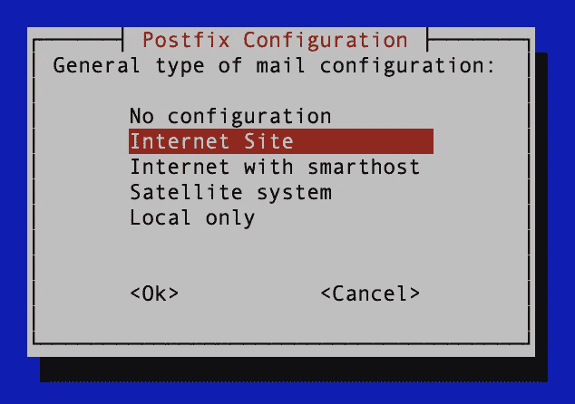
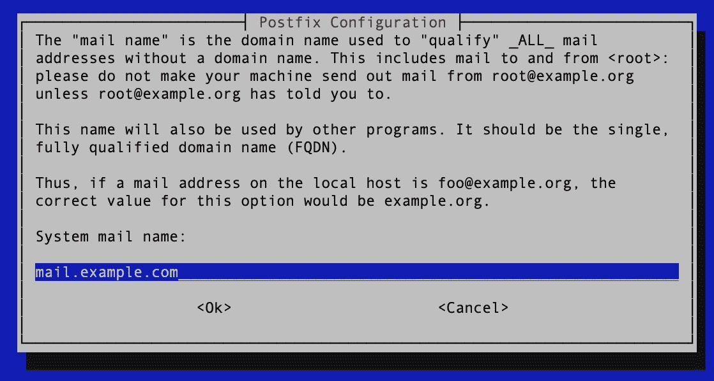
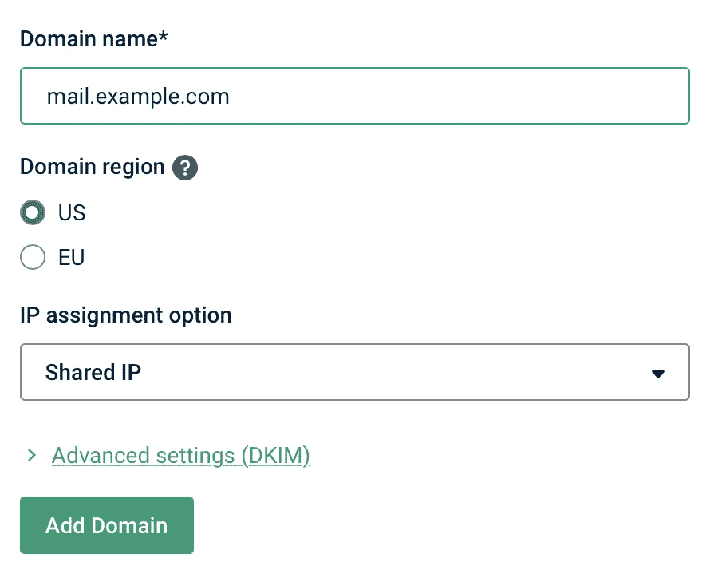
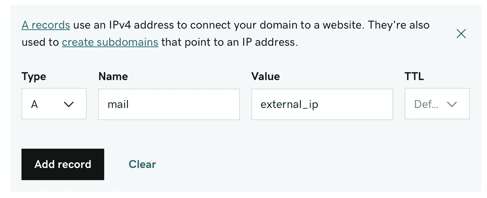
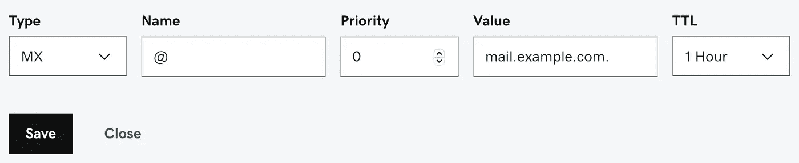
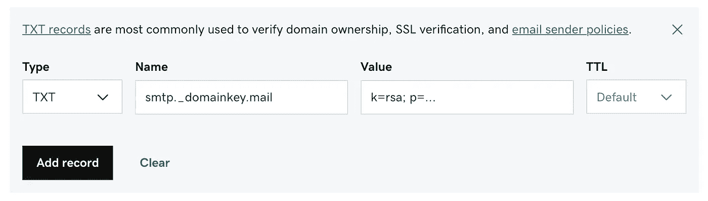

# 如何在 Google Cloud 上托管个人邮件服务器(免费！):第二部分

> 原文：<https://medium.com/geekculture/how-to-host-a-personal-email-server-on-google-cloud-for-free-part-ii-20aaeb0ae9eb?source=collection_archive---------2----------------------->

## 配置后缀、邮件枪和 DNS 记录


# 本系列文章

1.  [简介& GCP 设置](https://lp3.medium.com/how-to-host-a-personal-email-server-on-google-cloud-for-free-part-i-8124d65d1d25)
2.  ***配置后缀、邮件枪、& DNS 记录***
3.  [配置鸽笼&加密](https://lp3.medium.com/how-to-host-a-personal-email-server-on-google-cloud-for-free-part-iii-15e2db1f1f8e)
4.  [使用 MariaDB & Postfixadmin](https://lp3.medium.com/how-to-host-a-personal-email-server-on-google-cloud-for-free-part-iv-1b5142cab9c) 管理虚拟邮箱
5.  [使用 Roundcube 托管网络邮件](https://lp3.medium.com/how-to-host-a-personal-email-server-on-google-cloud-for-free-part-v-f9a4b3643622)
6.  [用 Rspamd &筛子过滤垃圾邮件](/geekculture/how-to-host-a-personal-email-server-on-google-cloud-for-free-part-vi-6ea09f18d7df)

在本系列的第 1 部分[中，我们在 GCP 上设置了我们的 VM 实例，配置了防火墙规则来打开发送&接收电子邮件所需的端口，并设置了对我们的 VM 的 SSH 访问。现在我们将安装**后缀**，设置我们的 DNS 记录，并将 **Mailgun** 配置为我们的邮件中继。请记住，最后一步是必要的，因为 GCP 会阻止 SMTP 端口 25 上的所有出站流量，以防止滥用。幸运的是，这种方法的一个好处是，我们不需要维护发送电子邮件的 IP 信誉。这由 Mailgun 处理。这有助于确保人们在收件箱中收到我们的电子邮件。](https://lp3.medium.com/how-to-host-a-personal-email-server-on-google-cloud-for-free-part-i-8124d65d1d25)

**注意:** Mailgun 允许我们每个月免费发送多达 30k 封邮件，这对于我们的需求应该绰绰有余。

让我们从*终端* (MacOS/Linux)或 *SSH 客户端* (Windows)连接到我们的虚拟机。在终端中，运行以下命令:

```
ssh -i ***path/to/private_key*** ***username****@****external_ip***
```

将`*path/to/private_key*`替换为您的**私有密钥**的路径(在第 1 部分中创建)，将`*username*` 替换为您的用户名(不带@gmail.com)，将`*external_ip*`替换为您之前提到的外部 ip。同样，这个过程有点不同，所以根据您的 SSH 客户端进行调整。

像往常一样，在 Linux 上安装新软件时，我们应该首先从我们的库更新我们的包列表，并升级任何已安装的软件。(如果它在*上暂停一会儿，请不要惊慌。)*

```
sudo apt update && sudo apt upgrade -y
```

如果您希望设置虚拟机的时区，可以使用以下命令:

```
sudo dpkg-reconfigure tzdata
```

接下来，安装后缀和依赖项。

```
sudo apt install postfix -y
```

出现提示时，选择默认配置`*Internet Site*`。这告诉 Postfix 我们将使用它来发送和接收来自其他*邮件传输代理(MTA)*的电子邮件。



如果你还不是一个值得骄傲的域名的拥有者，现在是时候去购买一个域名了。为您的服务器将*系统邮件名称*更改为*完全限定域名(FDQN)* 。这方面的惯例是您的域名前面加上`*mail*` *子域*。



安装完成后，打开`/etc/postfix/main.cf`并设置`myhostname = *mail.example.com*`，使用你的邮件子域的值。将我们的更改保存到此文件。

# 邮件枪和域名系统

我们稍后将回到这个文件，但是首先让我们设置 Mailgun 和我们的 DNS 记录。如果您没有 Mailgun 帐户，请创建一个。如果您喜欢使用 SendGrid 或 Mailjet 作为您的邮件中继，您可以按照 SendGrid 的说明[或 Mailjet 的说明](https://cloud.google.com/compute/docs/tutorials/sending-mail/using-sendgrid)[调整接下来的几个步骤。](https://cloud.google.com/compute/docs/tutorials/sending-mail/using-mailjet)

在 Mailgun nav 抽屉中，选择*发送>域名*，然后*添加新域名*。输入您的子域，然后选择*添加域*。



现在转到您的域提供商，导航到您的域的 DNS 设置。(我在图片中使用 GoDaddy。)添加一个名为 *mail* 的新 *A 记录*，并提供您的 VM 的*外部 ip 地址*作为值。可以保留默认的 *TTL* 。这将把我们的*邮件*子域的所有流量定向到我们的虚拟机。



然后，添加一个 *MX 记录*，名称:【邮件】*，*优先级: *0* ，值:*你的域*，*默认* TTL。



**注意:**创建这两个记录，而不仅仅是一个名为 *mail* 的 *MX 记录*，将允许我们稍后托管我们的 webmail 接口。

*MX 记录*用于将您的域的传入邮件定向到您的服务器。现在按照 Mailgun 说明的第 2 部分中的步骤，设置允许从您的域发送验证邮件所需的两个 *TXT 记录*。这些记录用于验证通过 Mailgun 从您的服务器发送的电子邮件确实是您发送的。



接下来，我们需要设置从 Postfix 到我们的 Mailgun 帐户的认证。在 Mailgun 上选择您的*域设置*下的 *SMTP 凭证*选项卡。您的登录用户名将类似于***postmaster@mail.example.com***。点击*重置密码*并复制其创建的密码。我们将使用我们的凭证创建一个文件，然后使用`postmap`创建一个将被 Postfix 使用的散列表。使用您最喜欢的编辑器，创建`/etc/postfix/sasl_passwd`并添加以下行(用 Mailgun 提供的用户名和*密码*替换*用户名和*密码】:**

```
[smtp.mailgun.org]:2525    *username*:*password*
```

现在创建哈希表。

```
sudo postmap /etc/postfix/sasl_passwd
```

然后，删除包含凭据的文件。

```
sudo rm /etc/postfix/sasl_passwd
```

在你的`.db`文件上设置权限。

```
sudo chmod 600 /etc/postfix/sasl_passwd.db
```

在`/etc/postfix/main.cf`中添加或编辑这些行:

```
relayhost = [smtp.mailgun.org]:2525smtp_sasl_auth_enable = yes
smtp_sasl_password_maps = hash:/etc/postfix/sasl_passwd
smtp_sasl_security_options = noanonymous
```

我们在这里所做的是告诉 Postfix 使用 Mailgun 作为我们的外发邮件中继，并通过端口 2525 发送外发邮件(因为 GCP 阻塞了默认端口 25 上的外发流量)。所配置的密码映射指示 Postfix 使用 Mailgun 提供的凭证来验证对所述中继主机的所有请求。我们需要重新启动 Postfix 服务来应用更改。

```
sudo service postfix restart
```

现在，我们可以向我们的谷歌帐户发送一封测试电子邮件。

```
echo 'Test passed!' | sudo sendmail -s *username@gmail.com*
```

如果您正确遵循了本指南，您应该会收到这封电子邮件。如果有问题，确保你没有错过一个步骤或包括在错别字。检查邮件日志`/var/log/mail.err` & `/var/log/mail.log`来查明问题。如果您仍然不知道问题出在哪里，请随时联系我。

**注意:**如果您希望在此服务器上托管多个域的电子邮件，请查看补充指南 [**为多域邮件中继配置 Postfix**](https://lp3.medium.com/configuring-postfix-for-multi-domain-mail-relay-d33cd236298a)，了解一些需要进行的更改。完成这个系列后，这很容易实现。

# 结论

干得好！您离在云端托管自己的电子邮件又近了几步！让我们回顾一下本文中所涉及的内容。

*   我们安装并配置了 Postfix 来发送和接收邮件。
*   我们设置 Mailgun 作为我们的电子邮件中继，因为 GCP 阻止端口 25 出站。
*   我们配置了我们域的 DNS 记录，将电子邮件流量定向到我们的服务器，并通过 Mailgun 验证来自我们服务器的电子邮件流量。

在下一篇文章中，我们将设置 Dovecot 来管理我们的邮箱并通过 IMAP 连接到我们的服务器，允许从电子邮件客户端向 Postfix 提交邮件，并加密我们的流量。

感谢您的阅读！如果你觉得这篇文章很有帮助，并且有兴趣继续关注这个系列的其他部分，请鼓掌并关注即将发布的文章。