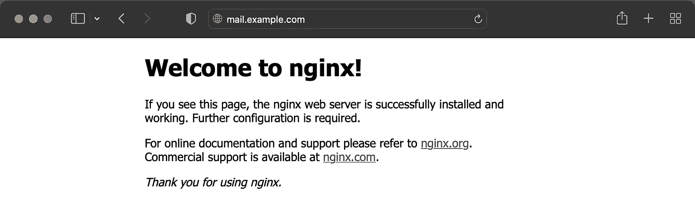
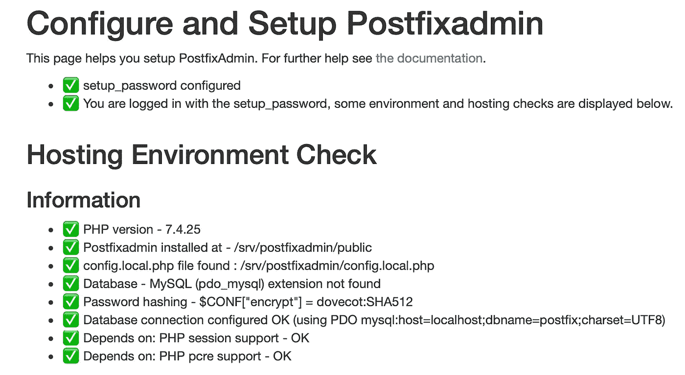
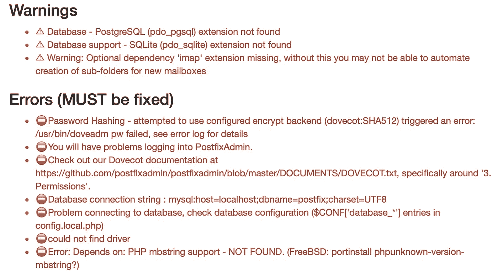
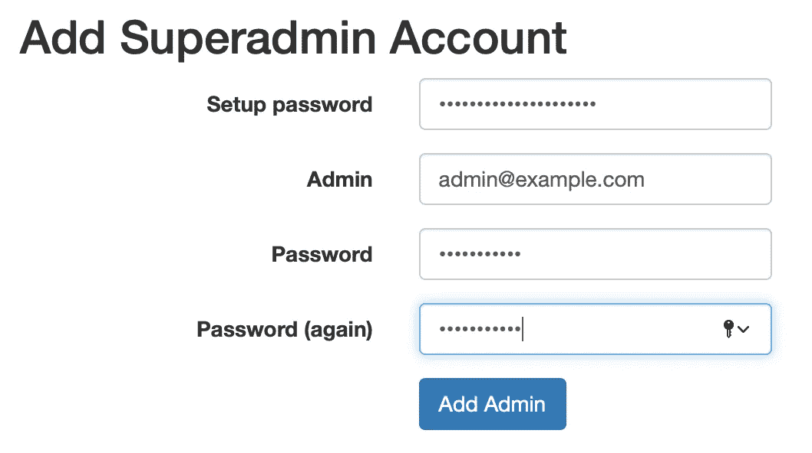
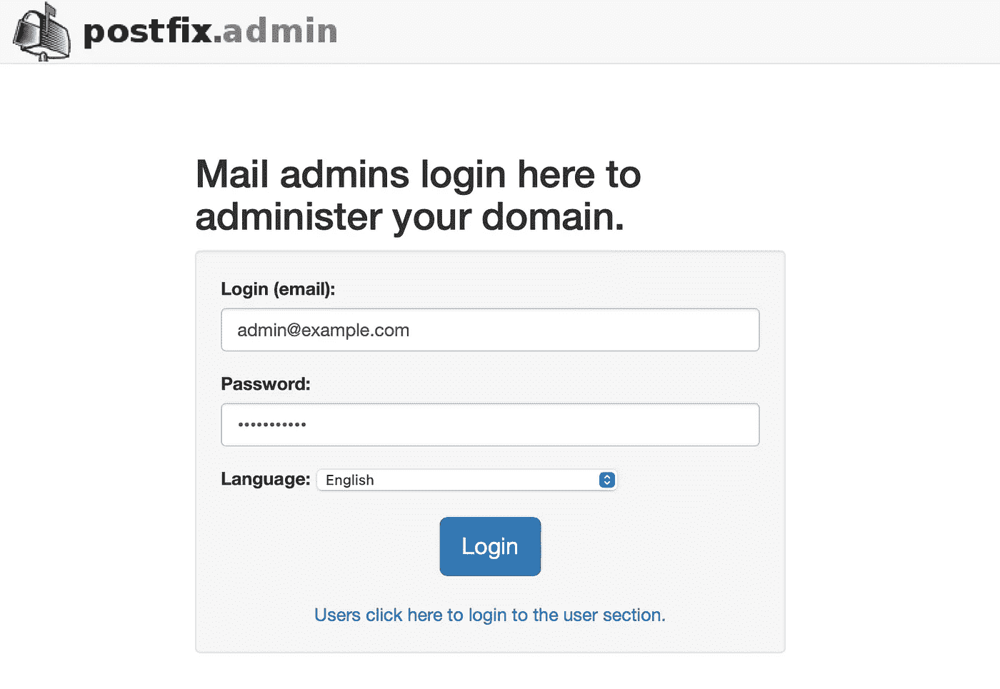
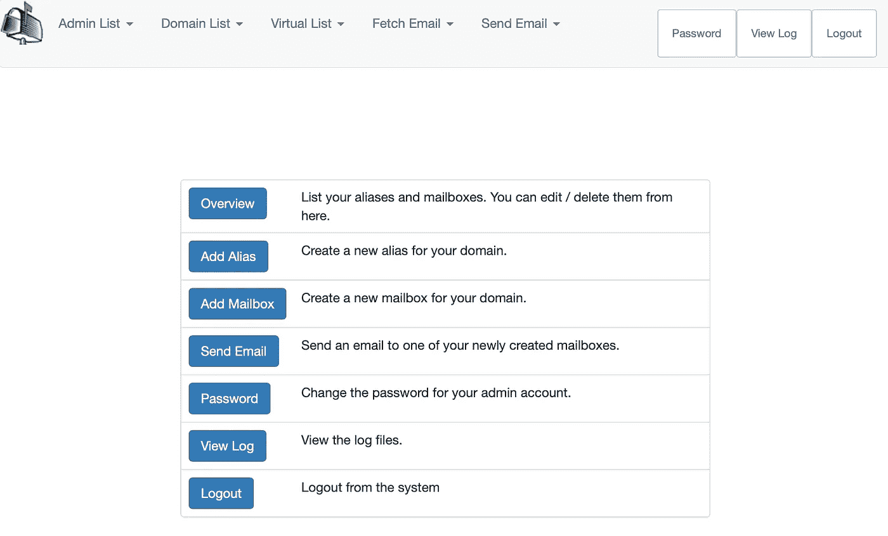
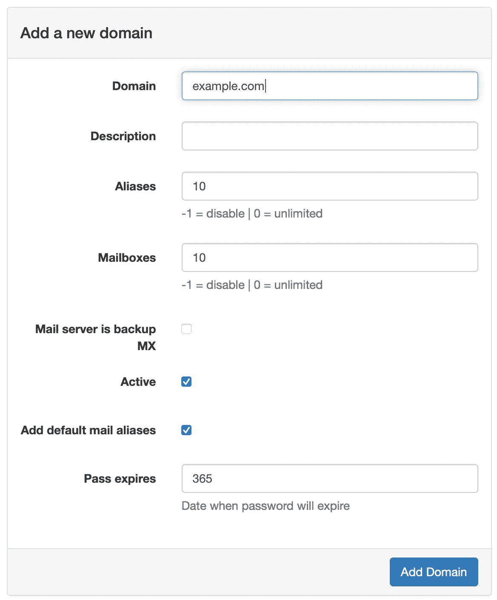

# 如何在 Google Cloud 上托管个人邮件服务器(免费！):第四部分

> 原文：<https://medium.com/geekculture/how-to-host-a-personal-email-server-on-google-cloud-for-free-part-iv-1b5142cab9c?source=collection_archive---------3----------------------->

## 使用 MariaDB 和 Postfixadmin 管理虚拟邮箱


# 本系列文章

1.  [简介& GCP 设置](https://lp3.medium.com/how-to-host-a-personal-email-server-on-google-cloud-for-free-part-i-8124d65d1d25)
2.  [配置后缀、邮件枪、& DNS 记录](https://lp3.medium.com/how-to-host-a-personal-email-server-on-google-cloud-for-free-part-ii-20aaeb0ae9eb)
3.  [配置鸽笼&加密](https://lp3.medium.com/how-to-host-a-personal-email-server-on-google-cloud-for-free-part-iii-15e2db1f1f8e)
4.  ***使用 Maria db&Postfixadmin***管理虚拟邮箱
5.  [使用 Roundcube 托管网络邮件](https://lp3.medium.com/how-to-host-a-personal-email-server-on-google-cloud-for-free-part-v-f9a4b3643622)
6.  [用 Rspamd &筛子过滤垃圾邮件](/geekculture/how-to-host-a-personal-email-server-on-google-cloud-for-free-part-vi-6ea09f18d7df)

如果您还没有阅读本系列的前几篇文章，请按照上面的链接进行阅读。此时，我们已经将运行在 GCP 上的服务器配置为通过 SMTP 协议发送和接收电子邮件，并允许 IMAP 连接，使用 TLS 加密流量。此外，我们的 DNS 记录配置正确，以确保电子邮件发送给我们和从我们这里发出。下一步是设置*虚拟邮箱*。为此，我们将安装 *MariaDB* 数据库软件和 *Postfixadmin* ，用于管理虚拟电子邮件域、用户、&别名的软件。让我们开始吧！

# 安装 MariaDB

我们需要一个地方来存储我们的虚拟域、邮箱/用户和别名。为此，我们将建立一个数据库。我选择了 MariaDB，因为它占用的内存很少，而且在我们的 GCP 自由层虚拟机上，RAM 是一种很有价值的商品。如果您愿意，可以选择另一个数据库解决方案，并相应地调整下面的步骤。现在让我们安装 MariaDB。

```
sudo apt install mariadb-server -y
```

然后，运行提供的安全脚本来保护我们的 MariaDB 安装。

```
sudo mysql_secure_installation
```

当提示输入*根*的密码时，只需按 Enter 键，因为没有设置密码。系统会告诉您，您的 *root* 帐户已经受到保护，因此您可以安全地回答下面两个问题的‘n’*。在 MariaDB 10.4.3 和更高版本中，默认情况下为 *root* 启用`unix_socket`身份验证(一种无密码的身份验证机制)，因此对这些问题回答‘n’不会改变任何事情。对剩余的四个问题回答“y”以*移除匿名用户*、*不允许远程 root 登录*、*移除测试数据库并对其进行访问*，以及*重新加载特权表*。这将加强我们的安全性，并删除预安装的“测试”数据库。*

# *安装 Postfixadmin*

*Postfixadmin 是一个用 PHP 编写的门户网站，因此我们需要安装 web 服务器软件来托管它和 PHP。我将使用 *Nginx* ，但是如果你希望使用 *Apache* ，你可以在学习过程中调整指令。让我们安装必要的软件。*

```
*sudo apt install nginx php-fpm -y*
```

*现在，我们可以在浏览器中输入我们的邮件子域名，迎接我们的是 Nginx 欢迎页面！*

**

*Nginx 创建了路由`/var/www/html/`。你通过 Nginx 托管的任何文件都应该位于`/var/www/`目录中。让我们继续前进，导航到`/var/www/`，并将`html`目录重命名为`mail`，因为我们将从这里只提供与电子邮件相关的文件。我们现在可以留下`index.nginx-debian.html`文件。*

```
*cd /var/www/
sudo mv html/ mail/*
```

*接下来，我们将从 Github repo 下载并安装 Postfixadmin。为了下载文件，我们需要安装`wget`。*

```
*sudo apt install wget*
```

*然后，导航到`/srv/`目录并运行以下命令来下载、解压缩和解归档 Postfixadmin 文件。*

```
*cd /srv/
sudo wget -O postfixadmin.tgz https://github.com/postfixadmin/postfixadmin/archive/postfixadmin-3.3.10.tar.gz
sudo tar -zxvf postfixadmin.tgz*
```

***注:**在撰写本文时，Postfixadmin 的最新版本是 *3.3.10* 。您可能希望更新以前的命令，以下载您可以使用的最新版本。*

*删除 zip 文件，并将文件夹重命名为`postfixadmin`。然后，在我们的`/var/www/mail/`目录中创建一个*符号链接*到`/srv/postfixadmin/public/`文件夹，以便在*mail.example.com/admin*托管我们的管理门户。*

```
*sudo rm postfixadmin.tgz
sudo mv postfixadmin-postfixadmin-3.3.10/ postfixadmin/
sudo ln -s /srv/postfixadmin/public/ /var/www/mail/admin*
```

# *设置数据库*

*现在我们需要为所有的邮件软件创建一个数据库和用户。运行`mysql`。*

```
*sudo mysql*
```

*然后，运行以下命令来创建我们的数据库和具有适当权限的用户。用你选择的密码替换*密码*。*

```
*CREATE DATABASE postfix;
CREATE USER postfix@localhost IDENTIFIED BY '*password*';
GRANT ALL PRIVILEGES ON postfix.* TO postfix@localhost;
flush privileges;
exit;*
```

# *配置 Postfixadmin*

*接下来，我们需要配置 Postfixadmin 来使用数据库。创建包含本地配置的文件`/srv/postfixadmin/config.local.php`。*

```
*<?php
  $CONF['database_type'] = 'mysqli';
  $CONF['database_host'] = 'localhost';
  $CONF['database_user'] = 'postfix';
  $CONF['database_password'] = '*password*';
  $CONF['database_name'] = 'postfix';
  $CONF['encrypt'] = 'dovecot:SHA512';
  $CONF['configured'] = true;
?>*
```

*我们需要创建 PostfixAdmin 使用的`/srv/postfixadmin/templates_c/`目录。应该是 Nginx ( ***www-data*** )创建的 web 服务器用户所有。*

```
*sudo mkdir /srv/postfixadmin/templates_c/ && sudo chown -R www-data /srv/postfixadmin/templates_c/*
```

# *配置 Nginx*

*现在我们需要配置 Nginx 来服务于我们重命名的`mail`目录和 PHP 文件，因为默认情况下这是不活动的。我们还会将其配置为使用我们的 TLS 证书来强制加密流量，因为我们从不希望通过非加密的 HTTP 发送登录凭据。我们来编辑一下`/etc/nginx/sites-available/default`。*

*首先，注释掉下面几行:*

```
*listen 80 default_server;
listen [::]:80 default_server;*
```

*然后，取消对以下行的注释；*

```
*listen 443 ssl default_server;
listen [::]:443 ssl default_server;*
```

*我们需要添加 TLS 证书和密钥的位置。*

```
*ssl_certificate /etc/letsencrypt/live/*mail.example.com*/fullchain.pem;
ssl_certificate_key /etc/letsencrypt/live/*mail.example.com*/privkey.pem;*
```

*然后，将*根文件夹位置*更新到我们重命名的`mail`目录，并将`index.php`添加到要服务的*索引*文件列表中。*

```
*root /var/www/mail;# Add index.php to the list if you are using PHP
index index.php index.html index.htm index.nginx-debian.html;*
```

*取消对以下行的注释，以启用 *php-fpm* 。*

```
*location ~ \.php$ {
        include snippets/fastcgi-php.conf;
        fastcgi_pass unix:/run/php/php7.4-fpm.sock;
}*
```

*最后，我们将创建一个服务器配置来侦听端口 80 上的未加密 HTTP 请求，并将请求重定向到端口 443，以强制只进行加密连接。将以下几行添加到文件中，然后保存并退出。*

```
*server {
        listen 80;
        listen [::]:80; server_name _; return 301 [https://$host$request_uri;](https://$host$request_uri;)
}*
```

*重新加载 Nginx 以使用我们的新配置。*

```
*sudo service nginx reload*
```

*现在，通过导航到我们将在下一步中使用的设置页面(即*https://mail.example.com/admin/setup.php*)，确保我们可以通过 HTTPS 访问 Postfixadmin。*

# *配置后缀更多信息*

*在设置页面上生成一个设置密码，并将结果行添加到我们的`config.local.php`文件中。然后，刷新页面并使用设置密码登录。*

*这一页非常方便。它向我们展示了什么可行，什么不可行。*

**

*您可以忽略两个**警告**，因为它们与我们没有使用的丢失的数据库服务器和扩展相关。但是，最后一个警告应该得到纠正，因为我们希望为新邮箱自动创建默认文件夹。我们还必须纠正列在**错误**下的所有问题。*

**

*请注意，在**信息**部分，我们得到一个勾号，表示有一个 *MySQL* 数据库正在运行，但是我们缺少所需的扩展。我们将不得不在解决错误的同时安装它。*

*运行以下命令来安装缺失的 PHP 模块。*

```
*sudo apt install php-mysql php-imap php-mbstring -y*
```

*如果你现在刷新页面，你会发现剩下的唯一问题是一个*密码散列*错误。这是因为 Postfixadmin 无法访问我们的 TLS 证书，也无法访问 Dovecot 的`*stats-writer*`。要解决这个问题，首先需要更新我们的 ***访问控制列表*** ，为我们的 ***www-data*** 用户提供适当的权限。这将允许我们更好地控制文件权限。我们将需要`acl`包来完成这项工作。*

```
*sudo apt install acl*
```

*现在，与其让 ***www-data*** 成为证书目录的所有者，我们可以简单地向*用户提供*读取* & *执行*的权限。我们必须对`live/`和`archive/`目录都这样做。**

```
**sudo setfacl -R -m u:www-data:rx /etc/letsencrypt/live/ /etc/letsencrypt/archive/**
```

**让我们加密证书只有 3 个月的有效期，但默认情况下，`certbot`会在到期前自动续订。当这种情况发生时，一个新的证书将被添加到`archive`目录，并从`live`目录链接。这将导致我们的 ***www-data*** 用户无法访问证书。幸运的是，我们可以很容易地提供一个*钩子*来在`certbot`成功更新&部署新证书时运行。让我们创建文件`/etc/letsencrypt/renewal-hooks/deploy/mail-permissions`并添加我们刚刚运行的命令。之后，我们还将重启`dovecot`和`postfix`，以便它们加载并使用更新后的证书。**

```
**#!/bin/shsetfacl -R -m u:www-data:rx /etc/letsencrypt/live/ /etc/letsencrypt/archive/
service dovecot restart
service postfix restart**
```

**现在，使文件可执行，以便`certbot`可以在更新我们的证书后运行它。**

```
**sudo chmod +x /etc/letsencrypt/renewal-hooks/deploy/mail-permissions**
```

**然后，我们需要编辑`/etc/dovecot/conf.d/10-master.conf`，将以下内容添加到文件的末尾。**

```
**service stats {
  unix_listener stats-reader {
    user = www-data
    mode = 0660
  } unix_listener stats-writer {
    user = www-data
    mode = 0660
  }
}**
```

**最后，将 ***www-data*** 用户添加到 ***dovecot*** 组并重启 dovecot。**

```
**sudo usermod -aG dovecot www-data
sudo service dovecot restart**
```

**再次刷新页面，瞧！我们没有错误！😃现在我们需要添加一个用于登录 Postfixadmin 的管理员帐户。我喜欢使用一个*管理*地址，然后我将它设置为我的电子邮件地址的别名，但是你可以选择简单地使用你的电子邮件地址。**

****

**之后，我们可以导航到我们的管理门户网站(即*https://mail.example.com/admin*)并使用我们新创建的管理帐户登录。**

****

# **创建虚拟域和邮箱**

**现在，我们可以使用 Postfixadmin 出色的 web 界面来管理我们的域、邮箱/用户和别名。**

****

**选择*概述*然后*添加域*。键入您的域名，并根据您的需要调整设置。**

****

**然后，导航到*虚拟列表*并向下滚动到*邮箱*部分，选择*添加邮箱*。(我们将立即更新我们的默认邮件别名。)填写信息，选择*添加邮箱*。*用户名*将是您的电子邮件地址中通向您的域名的部分(即*some.user@example.com*)。**

**接下来，导航回*虚拟列表*并更新每个别名，将邮件转发到您新创建的地址。我们现在有了一个工作的虚拟邮箱！您可以使用新的管理门户网站随时根据需要添加/删除/编辑域、邮箱和别名。**

**我们现在是如此接近！最后一步是配置 Postfix 和 Dovecot，通过我们的 MariaDB 数据库使用虚拟邮箱。**

# **配置 Postfix 以使用 MariaDB**

**首先，我们需要安装`postfix-mysql` 包，以便 Postfix 可以与我们的数据库通信。**

```
**sudo apt install postfix-mysql**
```

**创建一个目录来存储我们的 SQL 配置文件。**

```
**sudo mkdir /etc/postfix/sql/**
```

**然后我们需要编辑`/etc/postfix/main.cf`，添加/编辑以下几行:**

```
**#mailbox_transport = lmtp:unix:private/dovecot-lmtp#mydestination = $mydomain, localhostvirtual_transport = lmtp:unix:private/dovecot-lmtpvirtual_mailbox_domains =
  proxy:mysql:/etc/postfix/sql/virtual_domains_maps.cf
virtual_mailbox_maps =
  proxy:mysql:/etc/postfix/sql/virtual_mailbox_maps.cf,
  proxy:mysql:/etc/postfix/sql/virtual_alias_domain_mailbox_maps.cf
virtual_alias_maps =
  proxy:mysql:/etc/postfix/sql/virtual_alias_maps.cf,
  proxy:mysql:/etc/postfix/sql/virtual_alias_domain_maps.cf,
  proxy:mysql:/etc/postfix/sql/virtual_alias_domain_catchall_maps.cf**
```

**让我们分解这些变量。**

*   **`virtual_mailbox_domains`告诉 Postfix 如何在数据库中查找虚拟域名**
*   **`virtual_mailbox_maps`告诉 Postfix 如何在数据库中查找虚拟邮箱**
*   **`virtual_alias_maps`告诉 Postfix 如何在数据库中查找别名**
*   **`virtual_transport`告诉 Postfix 使用 Dovecot 将邮件发送到我们的虚拟邮箱**

****注意:**您可以注释掉或删除设置`mailbox_transport`和`mydestination`的行，因为我们正在使用虚拟域&邮箱，所以不再需要它们，但这不是必需的，也不会对行为产生影响。**

**现在我们需要创建我们引用的配置文件。创建`/etc/postfix/sql/virtual_domains_maps.cf`，添加以下几行(用创建 ***后缀*** 数据库用户时设置的密码替换 ***密码*** ):**

```
**user = postfix
password = *password*
hosts = localhost
dbname = postfix
query = SELECT domain FROM domain WHERE domain='%s' AND active = '1'**
```

**创建`/etc/postfix/sql/virtual_mailbox_maps.cf`并写入:**

```
**user = postfix
password = *password*
hosts = localhost
dbname = postfix
query = SELECT maildir FROM mailbox WHERE username='%s' AND active = '1'**
```

**创建`/etc/postfix/sql/virtual_alias_domain_mailbox_maps.cf`并写入:**

```
**user = postfix
password = *password*
hosts = localhost
dbname = postfix
query = SELECT maildir FROM mailbox,alias_domain WHERE alias_domain.alias_domain = '%d' and mailbox.username = CONCAT('%u', '@', alias_domain.target_domain) AND mailbox.active = 1 AND alias_domain.active='1'**
```

**创建`/etc/postfix/sql/virtual_alias_maps.cf`并写入:**

```
**user = postfix
password = *password*
hosts = localhost
dbname = postfix
query = SELECT goto FROM alias WHERE address='%s' AND active = '1'**
```

**创建`/etc/postfix/sql/virtual_alias_domain_maps.cf`并写入:**

```
**user = postfix
password = *password*
hosts = localhost
dbname = postfix
query = SELECT goto FROM alias,alias_domain WHERE alias_domain.alias_domain = '%d' and alias.address = CONCAT('%u', '@', alias_domain.target_domain) AND alias.active = 1 AND alias_domain.active='1'**
```

**创建`/etc/postfix/sql/virtual_alias_domain_catchall_maps.cf`并添加以下内容:**

```
**user = postfix
password = *password*
hosts = localhost
dbname = postfix
query = SELECT goto FROM alias,alias_domain WHERE alias_domain.alias_domain = '%d' and alias.address = CONCAT('@', alias_domain.target_domain) AND alias.active = 1 AND alias_domain.active='1'**
```

**因为这些文件以纯文本的形式包含数据库密码，所以我们应该将访问权限仅限于我们的 *root* 和 *postfix* 用户。**

```
**sudo chmod 640 /etc/postfix/sql/*
sudo setfacl -R -m u:postfix:r /etc/postfix/sql/***
```

**现在最后一次编辑`/etc/postfix/main.cf`。添加以下几行:**

```
**virtual_mailbox_base = /var/vmail
virtual_minimum_uid = 2000
virtual_uid_maps = static:2000
virtual_gid_maps = static:2000**
```

**这里，我们告诉 Postfix 在哪里存储我们的虚拟邮箱的邮件，以及哪个系统用户将拥有它们。现在我们需要创建`vmail`用户组&和`/var/vmail`位置，将所有权赋予用户。我们将禁用登录并防止找到主文件夹。**

```
**sudo adduser vmail --system --group --uid 2000 --disabled-login --no-create-homesudo mkdir /var/vmail/ && sudo chown -R vmail:vmail /var/vmail/**
```

**重启 Postfix。**

```
**sudo service postfix restart**
```

# **配置 Dovecot 以使用 MariaDB**

**在能够通过电子邮件客户端从我们的服务器发送和接收邮件之前，我们已经到达了最后一步！我们必须配置 Dovecot 来通过 MariaDB 使用我们的虚拟邮箱。首先，我们必须为 Dovecot 安装 MySQL 支持。**

```
**sudo apt install dovecot-mysql**
```

**然后，编辑`/etc/dovecot/conf.d/10-mail.conf`。因为我们的虚拟邮箱没有连接到实际的本地用户，所以我们需要添加以下行:**

```
**mail_home = /var/vmail/%d/%n**
```

**这将在`*domain*/*username*/`层级中的`/var/vmail/`下创建目录。**

**编辑`/etc/dovecot/conf.d/10-auth.conf`中的以下行，以使用我们数据库中的用户信息，并阻止*本地 unix 用户*发送电子邮件。**

```
**#!include auth-system.conf.ext
!include auth-sql.conf.ext**
```

**现在编辑`/etc/dovecot/dovecot-sql.conf.ext`。取消注释/编辑以下行(或仅复制&粘贴):**

```
**driver = mysqlconnect = host=localhost dbname=postfix user=postfix password=*password*default_pass_scheme = SHA512password_query = SELECT username AS user,password FROM mailbox WHERE username = '%u' AND active='1'user_query = SELECT maildir, 2000 AS uid, 2000 AS gid FROM mailbox WHERE username = '%u' AND active='1'iterate_query = SELECT username AS user FROM mailbox**
```

**重启鸽笼。**

```
**sudo service dovecot restart**
```

# **通过电子邮件客户端连接**

**干得好！我们现在可以连接到我们的服务器，并通过桌面和移动电子邮件客户端发送/接收电子邮件。客户端之间的流程基本相同，但可能略有不同。这些是一般步骤:**

1.  **选择*添加新账户*。**
2.  **如果选择*账户类型*，则选择*其他*或 *IMAP* 。**
3.  **输入您的电子邮件地址(在 Postfixadmin 中设置)。**
4.  **输入您的密码。**
5.  **将*传入* (IMAP) & *传出* (SMTP)服务器设置到您的子域(即*mail.example.com*)*。***
6.  **如果需要，将*输入*端口设置为 *993* ，将*输出*端口设置为 *587* ( *STARTTLS* )或*465*(*SSL*/*TLS*)*。***

**如果您登录任何一个都有问题，您可以将以下行添加到`/etc/dovecot/conf.d/10-auth.conf`。这将把认证问题记录到`/var/log/mail.log`中。诊断完问题后，一定要注释掉或删除这些行。**

```
**auth_debug = yes
auth_debug_passwords = yes**
```

**现在给自己发一封电子邮件，享受你的成就吧！**

****专业提示:**你可以通过用[邮件测试器](https://www.mail-tester.com)测试你的配置来检查你的邮件是否会避开垃圾邮件文件夹！**

# **自动续订 TLS 证书**

**让我们加密 90 天后过期的证书。如果我们的过期，我们将无法从电子邮件客户端访问我们的邮箱。Let's Encrypt 非常友好，包含了安装自动更新服务。但是，它是根据用于请求和安装证书的命令进行配置的。由于我们在安装 Nginx 之前安装了我们的证书，我们需要重新配置服务，以便在续订时使用 Nginx 插件。首先，安装 Nginx 插件。(如果你选择使用 Apache，那么安装`python3-certbot-apache`代替。)**

```
**sudo apt install python3-certbot-nginx -y**
```

**然后，只需使用插件更新证书。因为证书实际上还没有到期，所以我们必须使用`--force-renewal`选项。**

```
**sudo certbot renew --nginx --force-renewal**
```

**现在，您的 TLS 证书将始终是最新的！😃**

# **结论**

**恭喜你！你正式拥有了一个托管在云中的私人电子邮件服务器，而且完全免费！这是一个不小的壮举，所以花一点时间来欣赏你所取得的成就。然后，让我们回顾一下本文中所涉及的内容。**

*   **我们设置 MariaDB 作为数据库来存储我们的虚拟邮箱。**
*   **我们设置 Nginx 和 PHP 在 web 上服务 Postfixadmin。**
*   **我们设置 Postfixadmin 来管理我们的虚拟域、邮箱和别名。**
*   **我们通过 MariaDB 配置 Postfix & Dovecot 来使用我们的虚拟邮箱。**
*   **我们将我们的电子邮件客户端连接到我们的服务器，并确认我们可以发送和接收电子邮件。**
*   **我们配置了`certbot`来自动更新我们的 TLS 证书。**

**我们的系列就要结束了。只剩两篇文章了！在下一篇文章中，我们将安装 *Roundcube* 来提供一个 webmail 客户端。然后，在最后一篇文章中，我们将安装*Rspamd*&*Sieve*来检测垃圾邮件，并将其拒绝或发送到垃圾文件夹。**

**感谢您的阅读！如果你觉得这篇文章很有帮助，并且有兴趣继续关注这个系列的其他部分，请鼓掌并关注即将发布的文章。**