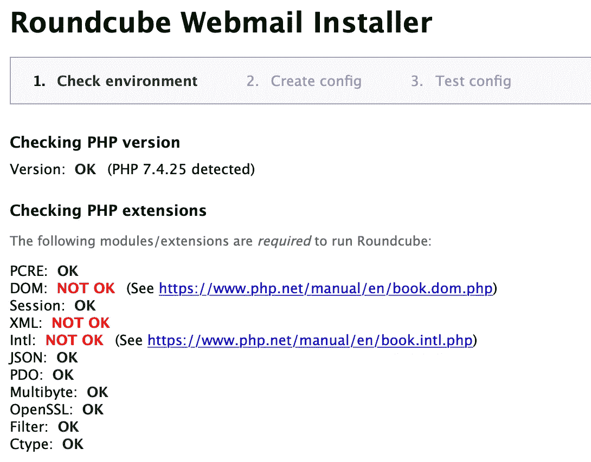
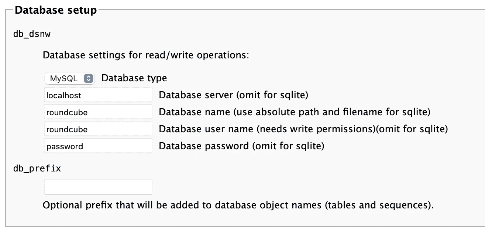
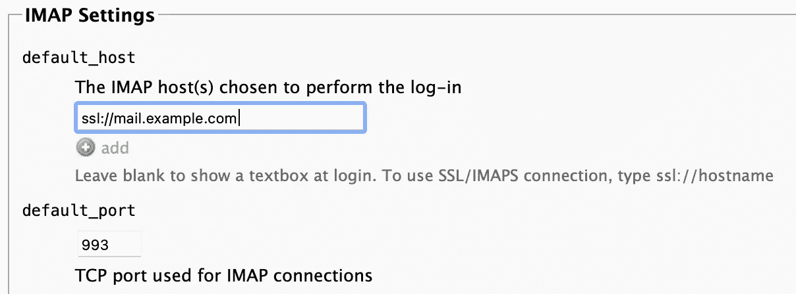
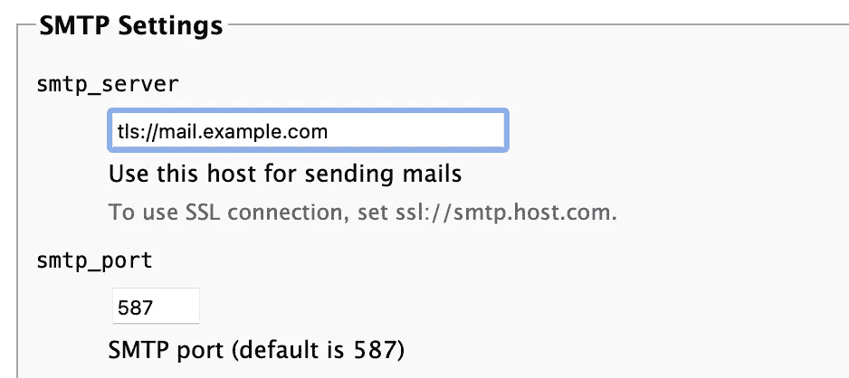
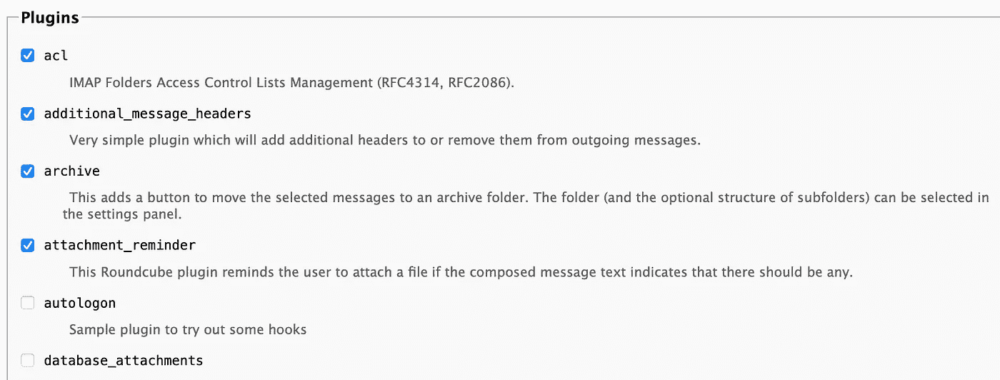
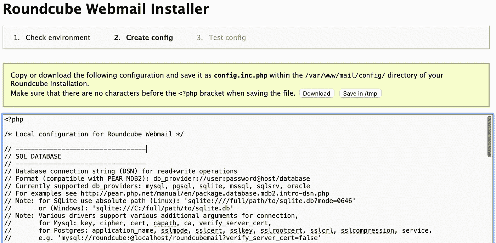
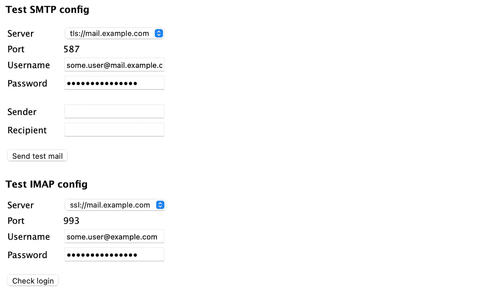
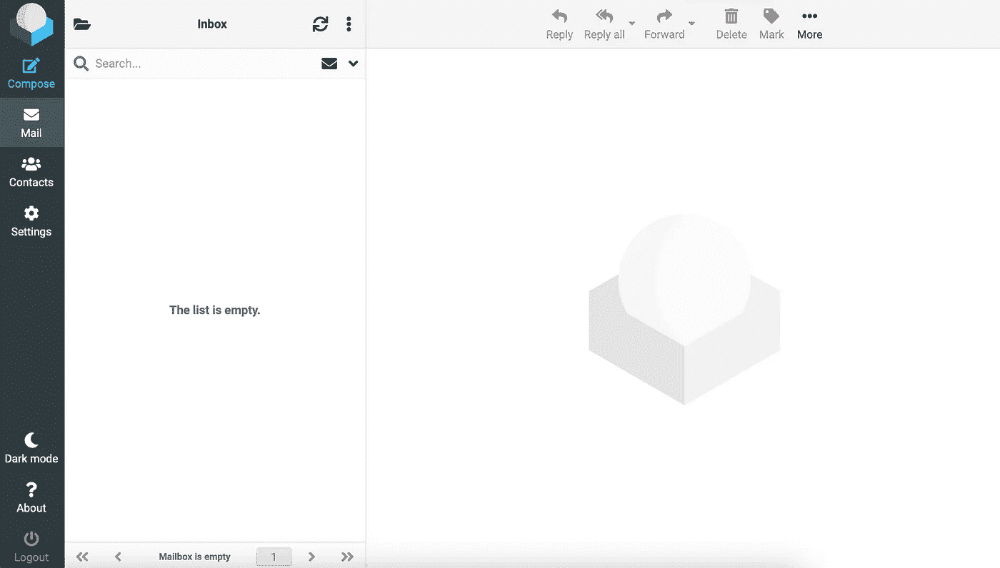

# 如何在 Google Cloud 上托管个人邮件服务器(免费！):第五部分

> 原文：<https://medium.com/geekculture/how-to-host-a-personal-email-server-on-google-cloud-for-free-part-v-f9a4b3643622?source=collection_archive---------6----------------------->

## 使用 Roundcube 托管网络邮件


# 本系列文章

1.  [简介& GCP 设置](https://lp3.medium.com/how-to-host-a-personal-email-server-on-google-cloud-for-free-part-i-8124d65d1d25)
2.  [配置后缀、邮件枪、& DNS 记录](https://lp3.medium.com/how-to-host-a-personal-email-server-on-google-cloud-for-free-part-ii-20aaeb0ae9eb)
3.  [配置鸽笼&加密](https://lp3.medium.com/how-to-host-a-personal-email-server-on-google-cloud-for-free-part-iii-15e2db1f1f8e)
4.  [使用 MariaDB & Postfixadmin](https://lp3.medium.com/how-to-host-a-personal-email-server-on-google-cloud-for-free-part-iv-1b5142cab9c) 管理虚拟邮箱
5.  ***用 Roundcube 托管 Webmail***
6.  [用 Rspamd &筛子过滤垃圾邮件](/geekculture/how-to-host-a-personal-email-server-on-google-cloud-for-free-part-vi-6ea09f18d7df)

如果您还没有阅读本系列的前几篇文章，请按照上面的链接进行阅读。现在，我们已经将运行在 GCP 上的服务器配置为通过 SMTP 协议发送和接收电子邮件，并允许 IMAP 连接，同时使用 TLS 加密流量。我们的 DNS 记录配置正确，以确保电子邮件发送到我们，我们使用虚拟邮箱，因此每个邮箱不需要本地 unix 用户。这些文件存储在 MariaDB 数据库中，通过网络浏览器使用 Postfixadmin 进行管理。

我们已经从电子邮件客户端成功连接，但是如果我们无法访问个人设备，而需要访问我们的邮箱，该怎么办？拥有一个可以在浏览器中访问的网络邮件客户端肯定会很方便。 *Roundcube* 提供的正是这个！这是一个用 PHP 编写的免费的、功能齐全的开源 webmail 客户端。最重要的是，感谢我们已经投入的所有工作，这将是添加到我们的私人电子邮件解决方案的一块蛋糕！让我们开始吧。

# 安装 Roundcube

首先下载最新版本的 [Roundcube](https://roundcube.net/download/) 。

```
wget https://github.com/roundcube/roundcubemail/releases/download/*1.6.1*/roundcubemail-*1.6.1*-complete.tar.gz
```

提取归档文件，并将内容移动到站点的根目录。

```
tar -xf roundcubemail-1.6.1-complete.tar.gz
sudo mv roundcubemail-1.6.1/* /var/www/mail/
```

然后，确保 ***根*** 拥有该文件。例外是 ***www-data*** 需要拥有`temp/`和`logs/`目录的所有权。

```
sudo chown -R root:root /var/www/mail/
sudo chown -R www-data:www-data /var/www/mail/temp/ /var/www/mail/logs/
```

我们现在可以移除 Nginx 提供的默认*索引*文件。

```
sudo rm /var/www/mail/index.nginx-debian.html
```

# 为 Roundcube 创建数据库和用户

Roundcube 需要一个数据库来存储用户信息，与我们之前设置的虚拟邮箱数据库分开。我们还需要为 Roundcube 创建一个具有适当权限的用户来访问数据库。运行`mysql`。

```
sudo mysql
```

然后，运行以下命令来创建数据库和具有权限的用户。用您选择的密码替换*密码*。

```
CREATE DATABASE roundcube;
CREATE USER roundcube@localhost IDENTIFIED BY '*password*';
GRANT ALL PRIVILEGES ON roundcube.* TO roundcube@localhost;
flush privileges;
exit;
```

之后，将 Roundcube 提供的初始表导入数据库。

```
sudo mysql roundcube < /var/www/mail/SQL/mysql.initial.sql
```

# 在浏览器中完成安装

现在导航到 https://*mail.example.com*/installer 来完成安装，用你的邮件子域替换*mail.example.com*。如果您已经阅读了本系列的所有内容，您会发现我们缺少了 Roundcube 所需的三个 PHP 扩展。



我们可以使用以下命令安装它们:

```
sudo apt install php-xml php-intl -y
```

刷新页面后，我们现在可以向下滚动到底部，并选择下一个继续安装。在大多数情况下，默认选择是好的，但是如果您想进一步定制您的安装，您可以在这里了解关于参数[的更多信息。我们将不得不编辑一些部分，从*数据库设置*开始。填写用于设置我们的数据库的详细信息。](https://github.com/roundcube/roundcubemail/wiki/Configuration)



接下来，我们需要告诉 Roundcube 在与 Dovecot & Postfix 通信时使用安全的 IMAP & SMTP 连接。使用您的邮件子域，在 *IMAP 设置*部分输入以下内容。



然后，按如下方式配置 *SMTP 设置*。



我们必须在这里使用我们的子域，但是没有理由浪费宝贵的资源查询公共 DNS 来找到我们自己的服务器！让我们在`localhost`旁边为我们的子域添加一个本地 DNS 条目。更新第一行`/etc/hosts`。

```
127.0.0.1       localhost *mail.example.com*
```

有各种很棒的插件可以给 Roundcube 增加功能。向下滚动查看*插件*部分，在结束之前启用一些。



**注意:**有些插件可能需要额外的步骤才能正常启动和运行。一个简单的谷歌搜索插件将很容易找到关于如何做的信息。

完成后，选择*创建配置*创建配置。如下一页所述，我们需要复制配置并保存到`/var/www/mail/config/config.inc.php`。



之后，点击*继续*。现在我们可以测试我们的 SMTP 和 IMAP 配置是否正确。



如果任一测试失败，您可以使用页面顶部的链接返回并编辑配置。一旦成功，请务必从我们网站的根目录删除`installer`目录，因为这是一个安全风险。

```
sudo rm -R /var/www/mail/installer/
```

现在在浏览器中导航到您的子域(即*https:*//【mail.example.com)并登录。



Roundcube Webmail Interface

# 结论

我们现在可以从任何带有网络浏览器的设备上访问我们的邮箱了！让我们回顾一下我们是如何做到这一点的。

*   我们将 Roundcube 下载到邮件站点的根目录下，并对所有文件设置适当的所有权。
*   我们为 Roundcube 创建了一个具有正确权限的数据库& user。
*   我们按照 web 浏览器中的 Roundcube 安装程序提供的说明进行操作，然后删除了安装程序。
*   我们还为我们的子域创建了一个本地 DNS 条目，以防止 Roundcube 在与 Postfix & Dovecot 通信时查询公共 DNS。

只剩一篇文章了！从技术上来说，如果你觉得自己足够幸运，能够让自己的电子邮件地址不落入坏人之手，那么你可以离开这里。我警告你，这不是我们生活的世界。垃圾邮件最终会找到你藏在云中的电子邮件服务器，当它出现时，我们会做好准备。在本系列的最后一篇文章中，我们将安装 *Rspamd* & *筛子*，以便检测垃圾邮件并将其拒绝或发送到垃圾文件夹。

感谢您的阅读！如果你觉得这个系列或文章有帮助，请鼓掌，并在最后一篇文章发表后继续关注。