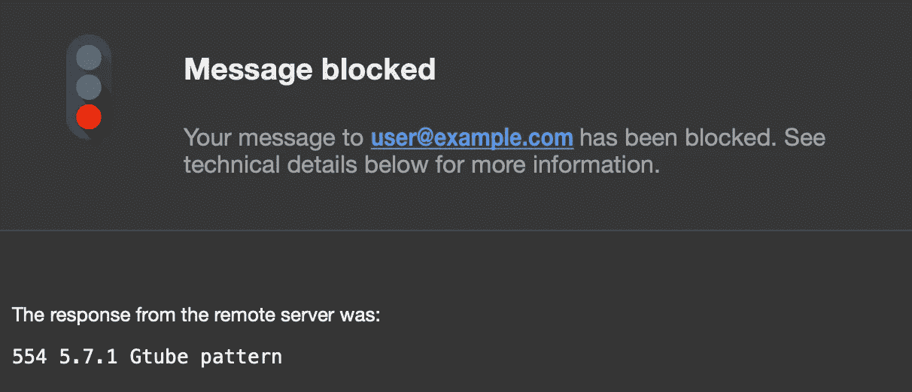
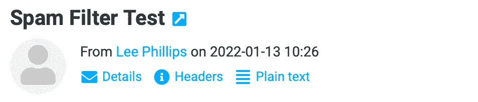
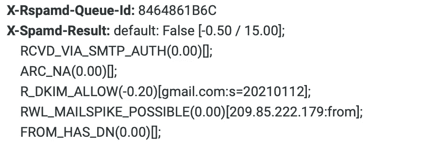

# 如何在 Google Cloud 上托管个人邮件服务器(免费！):第六部分

> 原文：<https://medium.com/geekculture/how-to-host-a-personal-email-server-on-google-cloud-for-free-part-vi-6ea09f18d7df?source=collection_archive---------8----------------------->

## 用 Rspamd & Sieve 过滤垃圾邮件


# 本系列文章

1.  [简介& GCP 设置](https://lp3.medium.com/how-to-host-a-personal-email-server-on-google-cloud-for-free-part-i-8124d65d1d25)
2.  [配置后缀、邮件枪、& DNS 记录](https://lp3.medium.com/how-to-host-a-personal-email-server-on-google-cloud-for-free-part-ii-20aaeb0ae9eb)
3.  [配置鸽笼&加密](https://lp3.medium.com/how-to-host-a-personal-email-server-on-google-cloud-for-free-part-iii-15e2db1f1f8e)
4.  [使用 MariaDB & Postfixadmin](https://lp3.medium.com/how-to-host-a-personal-email-server-on-google-cloud-for-free-part-iv-1b5142cab9c) 管理虚拟邮箱
5.  [使用 Roundcube 托管网络邮件](https://lp3.medium.com/how-to-host-a-personal-email-server-on-google-cloud-for-free-part-v-f9a4b3643622)
6.  ***用 Rspamd &筛子*** 过滤垃圾邮件

如果您还没有阅读本系列的前几篇文章，请按照上面的链接进行阅读。现在，我们已经将运行在 GCP 上的服务器配置为通过 SMTP 协议发送和接收电子邮件，并允许 IMAP 连接，同时使用 TLS 加密流量。我们的 DNS 记录配置正确，以确保电子邮件发送到我们，我们使用虚拟邮箱，因此每个邮箱不需要本地 unix 用户。这些文件存储在 MariaDB 数据库中，通过网络浏览器使用 Postfixadmin 进行管理。我们可以从电子邮件客户端或通过 Roundcube webmail 在浏览器中访问我们的邮箱。

剩下的唯一步骤是处理垃圾邮件。我们将安装 *Rspamd* 来检测垃圾邮件。 *Rspamd* 扫描邮件的模式以确定垃圾邮件分数。分数越高，越有可能是垃圾邮件。具有高垃圾邮件分数的邮件将被直接拒绝，但是具有中等垃圾邮件分数的邮件仍将被发送，因为我们希望确保不会因误报而拒绝合法邮件。在这些情况下，会在消息中添加一个`***X-Spam***`头。因此，我们可以使用 Dovecot 的 *Sieve* 插件将带有此标题的邮件过滤到垃圾文件夹中。太棒了，对吧？我们开始吧！

# 安装 Rspamd

Rspamd 使用 *Redis* 来存储数据，所以我们必须两者都安装。

```
sudo apt install rspamd redis-server -y
```

## 配置 Redis

因为我们的 RAM 预算紧张，所以让我们限制 Redis 可以使用的内存。当需要释放内存时，我们还会告诉 Redis 删除最接近到期的密钥。将这些行添加到`/etc/redis/redis.conf`。

```
maxmemory 256mb
maxmemory-policy volatile-ttl
```

保存并重启 Redis。

```
sudo service redis restart
```

## 配置 Rspamd

Postfix 通过***milter***(**m**ail f**filter**)协议与 Rspamd 通信。由于我们在同一台机器上运行 Postfix & Rspamd，所以我们可以使用 unix 套接字更有效地在两者之间进行通信，所以在`/etc/rspamd/worker-proxy.inc`中添加下面一行。

```
bind_socket = "/var/spool/postfix/var/run/rspamd/milter.sock mode=0666 owner=_rspamd";
```

我们还可以将*代理工作器*设置为`self_scan`模式，这允许我们禁用*普通工作器*，释放我们宝贵的资源。编辑同一个文件的`upstream`部分以启用`self_scan`。

```
upstream "local" {
  default = yes;
  hosts = "localhost";
  self_scan = yes;
}
```

然后，给`/etc/rspamd/worker-normal.inc`加上下面一行。

```
enabled = false;
```

我们需要创建套接字目录，并将所有权赋予 ***_rspamd*** 用户& ***后缀*** 组。

```
sudo mkdir -p /var/spool/postfix/var/run/rspamd/ && sudo chown -R _rspamd:postfix /var/spool/postfix/var/run/rspamd/
```

接下来，我们需要告诉我们的 Rspamd bayes 分类器使用 Redis。我们将继续打开自动学习，这只是 Rspamd 将完成其工作的许多方式之一。要查看它过滤垃圾邮件的所有方式的列表，请阅读 [this](https://rspamd.com/about.html) 。创建`/etc/rspamd/local.d/classifier-bayes.conf`并添加以下行:

```
servers = "127.0.0.1";
backend = "redis";
autolearn = true;
```

我们还应该告诉 Rspamd，一旦用户回复，就不要将主题中的电子邮件标记为垃圾邮件，因此创建`/etc/rspamd/local.d/replies.conf`并添加:

```
action = "no action";
```

然后重新启动 Rspamd。

```
sudo service rspamd restart
```

Rspamd 现在可以检测垃圾邮件，并通过学习进行改进。如果你想从一开始就有所提升，你可以找一些电子邮件来训练。由于这不是必要的，我不会在这里讨论它。如果有兴趣的话，也许它值得一篇自己的后续文章。现在我们需要将我们的电子邮件软件连接到 Rspamd。

# 将 Postfix 连接到 Rspamd

将下面几行添加到`/etc/postfix/main.cf`来连接两者。

```
smtpd_milters = unix:/var/run/rspamd/milter.sock
milter_default_action = accept
```

`milter_default_action`告诉 Postfix 在出现阻止到达 Rspamd 的问题时应该做什么。重新启动 Postfix 以应用更改。

```
sudo service postfix restart
```

Rspamd 现在将扫描传入的消息。得分高的垃圾邮件将被拒绝，得分中等的垃圾邮件将以`X-Spam`标题发送。现在我们需要配置 Dovecot，将带有此标题的邮件分类到垃圾文件夹中。

# 使用筛子处理垃圾邮件

Sieve 是一种用于过滤电子邮件的脚本语言。要使用它，我们首先需要安装`dovecot-sieve`插件。让我们也创建一个目录来存储我们的筛选脚本。

```
sudo apt install dovecot-sieve
sudo mkdir /etc/dovecot/sieve/
```

## 将垃圾邮件移至垃圾邮件文件夹

我们必须通过编辑`/etc/dovecot/conf.d/20-lmtp.conf`底部的`protocol lmtp`部分来告诉 Dovecot 使用这个插件。

```
protocol lmtp {
  mail_plugins = $mail_plugins sieve
}
```

接下来，我们需要编写一个简短的脚本，告诉 Dovecot 将包含`X-Spam`标题的电子邮件移动到垃圾文件夹中。创建`/etc/dovecot/sieve/move-spam-to-junk.sieve`并将下面的脚本复制到文件中。

```
require ["fileinto"];if header :is "X-Spam" "Yes" {
        fileinto "Junk";
}
```

然后我们必须使用`sievec`工具编译这个脚本。

```
sudo sievec /etc/dovecot/sieve/move-spam-to-junk.sieve
```

最后，打开`/etc/dovecot/conf.d/90-sieve.conf`并编辑以下行:

```
sieve_after = /etc/dovecot/sieve/move-spam-to-junk.sieve
```

这告诉 Dovecot 在运行任何用户定义的脚本之后运行`move-spam-to-junk`脚本。

## 从用户操作中学习

当用户将邮件移入或移出垃圾文件夹时，我们可以训练 Rspamd。为此，我们必须激活 IMAP 的 Sieve 插件。打开`/etc/dovecot/conf.d/20-imap.conf`并编辑文件末尾的`protocol imap`部分。

```
protocol imap {
  mail_plugins = $mail_plugins imap_sieve
}
```

现在，让我们编写报告垃圾邮件和火腿的筛选脚本。

创建`/etc/dovecot/sieve/report-spam.sieve`并复制以下脚本:

```
require ["vnd.dovecot.pipe", "copy", "imapsieve"];
pipe :copy "learn-spam.sh";
```

然后用下面的脚本创建`/etc/dovecot/sieve/report-ham.sieve`:

```
require ["vnd.dovecot.pipe", "copy", "imapsieve"];
pipe :copy "learn-ham.sh";
```

这些脚本调用我们将要编写的 shell 脚本。shell 脚本将依次调用 Rspamd 的`learn_spam`或`learn_ham`函数。让我们继续编译它们。

```
sudo sievec /etc/dovecot/sieve/report-spam.sieve && sudo sievec /etc/dovecot/sieve/report-ham.sieve
```

接下来，创建包含以下内容的`/etc/dovecot/sieve/learn-spam.sh`:

```
#!/bin/sh
exec /usr/bin/rspamc learn_spam
```

然后，用下面几行创建`/etc/dovecot/sieve/learn-ham.sh`:

```
#!/bin/sh
exec /usr/bin/rspamc learn_ham
```

我们还需要使我们的 shell 脚本可执行。

```
sudo chmod u=rwx,go= /etc/dovecot/sieve/learn-{spam,ham}.sh
```

现在再次打开`/etc/dovecot/conf.d/90-sieve.conf`并编辑下面一行来启用 IMAP 的 Sieve 插件。

```
sieve_plugins = sieve_imapsieve sieve_extprograms
```

然后，在同一文件的`plugin`部分中添加以下行。

```
# Move to Junk folder
imapsieve_mailbox1_name = Junk
imapsieve_mailbox1_causes = COPY FLAG
imapsieve_mailbox1_before = file:/etc/dovecot/sieve/report-spam.sieve# Move from Junk folder
imapsieve_mailbox2_name = *
imapsieve_mailbox2_from = Junk
imapsieve_mailbox2_causes = COPY
imapsieve_mailbox2_before = file:/etc/dovecot/sieve/report-ham.sievesieve_pipe_bin_dir = /etc/dovecot/sieve
sieve_global_extensions = +vnd.dovecot.pipe
```

这些规则告诉 Dovecot，当用户将邮件移入或移出垃圾文件夹时，应该运行哪些筛选脚本。`sieve_pipe_bin_dir`告诉 Dovecot 在哪里可以找到我们的 shell 脚本，我们的`sieve_global_extension`设置启用了`pipe`插件，使我们能够将电子邮件传递给外部命令。

最后，重启 Dovecot 来应用我们所有的更改。

```
sudo service dovecot restart
```

就是这样！我们的服务器已经准备好处理垃圾邮件，并从用户交互中学习！

仅供参考，Rspamd 有许多配置选项，超出了本文的范围。可以调整评分参数，配置训练等。您还可以通过编写 Sieve 脚本或使用 Sieve manager 客户端(如 Roundcube 的插件)来进一步配置邮件过滤。要了解更多信息，请从这里开始[。](http://sieve.info)

现在让我们来测试一下。

# 测试垃圾邮件过滤

## 测试拒绝

我们可以使用未经请求的批量电子邮件通用测试(GTUBE)模式来测试我们的垃圾邮件过滤。为此，只需向自己发送一封包含以下字符串的电子邮件(从另一个帐户发送):

```
*XJS*C4JDBQADN1.NSBN3*2IDNEN*GTUBE-STANDARD-ANTI-UBE-TEST-EMAIL*C.34X*
```

您应该会收到以下电子邮件被阻止的发送状态通知。不错！



我们可以通过启用额外的邮件头并检查它们来检查 Rspamd 是否正在扫描和记录所有进入我们邮箱的邮件。为此，用下面一行创建文件`/etc/rspamd/local.d/headers.conf`:

```
enable_test_patterns = true;
```

然后重新启动 Rspamd。

```
sudo service rspamd restart
```

**注意:**我选择在我部署的服务器上关闭它，只留下用于分类的`X-Spam`头。但是，如果你选择让它开着，并没有什么负面影响。

现在给自己发一封邮件。在 Roundcube 中，我们可以很容易地检查标题。



如果我们点击*标题*，一个弹出窗口将显示所有的消息标题。我们可以向下滚动，找到由 Rspamd 添加的头。下面显示了可用信息的一小部分。



如果你愿意，你也可以使用任何电子邮件客户端来查找邮件头。方法会有所不同，因此您可能希望在线搜索您的首选客户端的说明。如果邮件被确定为垃圾邮件，那么`X-Spam: Yes`标题将会被添加，我们的筛选脚本将会把邮件移动到我们的垃圾文件夹中。

# 结论

我们成功了！无论是字面上还是象征性的。这是一次漫长而乏味的旅程，希望是一次有趣的旅程！我们从一个梦想，也许是一个域名，到在云端托管我们自己的私人电子邮件服务器，始终可以可靠地访问我们的邮箱。为了让我们的成就更加甜美，我们可以让它免费运行！

随意向你的家人和朋友吹嘘你的成就。你应得的！但是你不想让他们嫉妒，所以跳上你的管理门户，给他们创建一个邮箱@你的域名。很简单！

让我们快速回顾一下我们是如何结束个人云电子邮件之旅的:

*   我们安装了 Rspamd，将其配置为使用 Redis 来存储数据和学习。
*   我们配置了 Rspamd 和 Redis 来限制资源的使用。
*   我们将 Postfix 连接到 Rspamd 来扫描和分类收到的消息。
*   我们使用 Sieve 脚本配置 Dovecot，将垃圾邮件移动到我们的垃圾文件夹中，并在我们将邮件移入和移出垃圾邮件时训练 Rspamd。

再次祝贺！我希望你在这个旅程中学到了一些很酷的东西，我真的希望你喜欢你的新个人电子邮件！

一如既往的感谢您的阅读！如果您发现这个系列或文章有帮助，请鼓掌并跟随。也欢迎评论！