# 如何在网上托管您的 Unity 游戏

> 原文：<https://medium.com/geekculture/how-to-host-unity-games-on-the-web-16be49449b10?source=collection_archive---------7----------------------->

一旦你的游戏完成并准备好了，你会想和尽可能多的人分享它。让全世界的人体验你的游戏的最简单的方法就是把它放在网上。而用 Unity 分享的过程就是这么轻松！

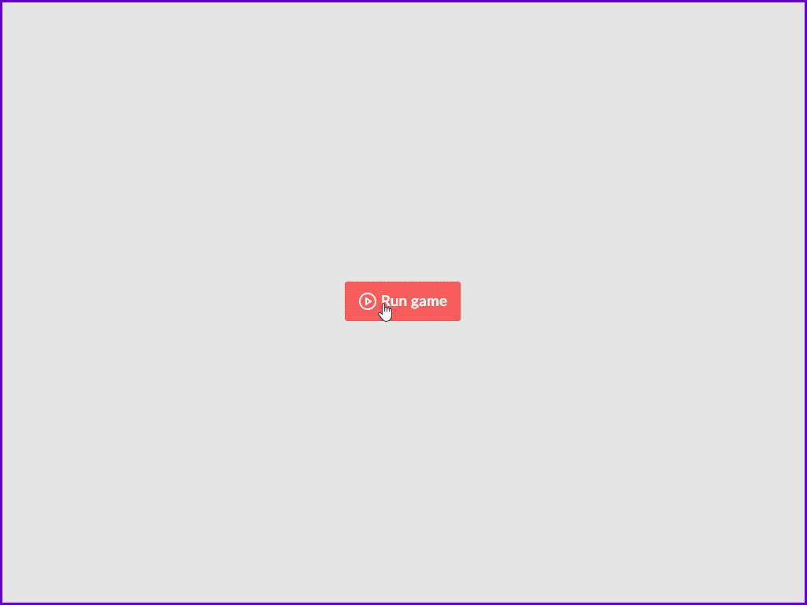

首先，我们将看看你如何使用 WebGL 来构建你的游戏，和前面的文章 中的 [**一样，你首先必须打开*【文件】>【构建设置】***](/geekculture/how-to-build-and-test-your-game-in-unity-1eeab1b7937e)

接下来，你需要将*‘平台’*从*‘PC，Mac&Linux Standalone’*切换到*‘web GL’* -如果您是第一次这样做，这可能需要安装。

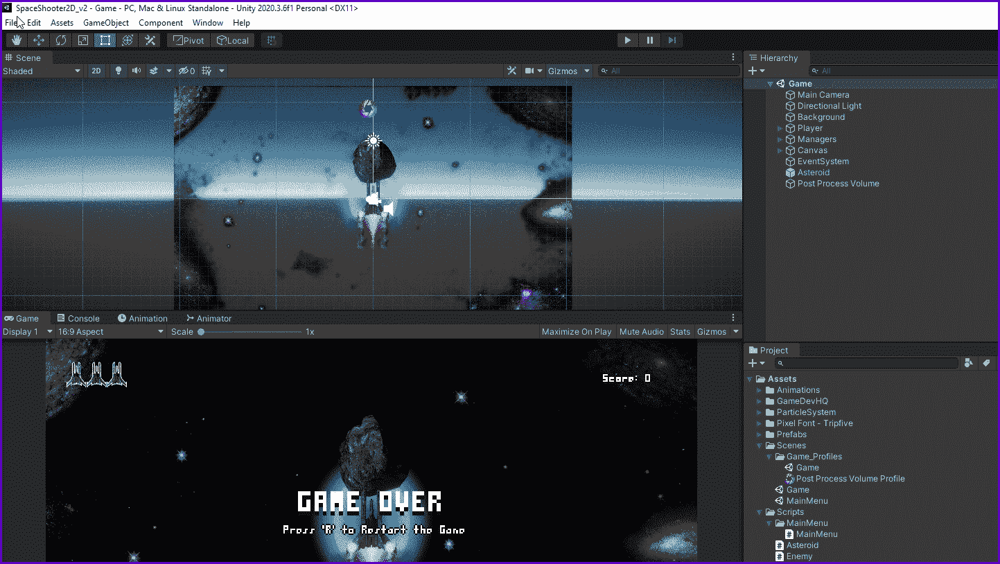

模块下载完成后，您就可以继续构建过程了。再次打开*“构建设置”*，点击*“web GL”*，点击*“切换平台”*按钮。

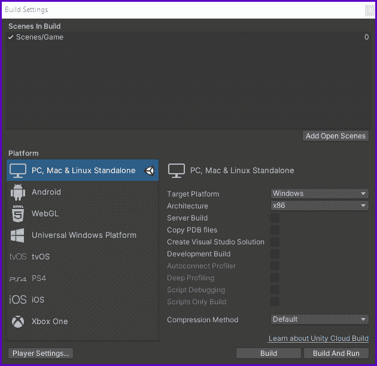

一旦完成，你可以注意到显示了一条错误消息——这是由于我们的 [**后处理**](https://matej-marek94.medium.com/boost-up-your-game-with-post-processing-in-unity-6062833bc318) 的改变。

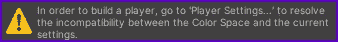

为此，我们需要将*【播放器设置】*中的*【色彩空间】从*更改为*【Gamma】***

*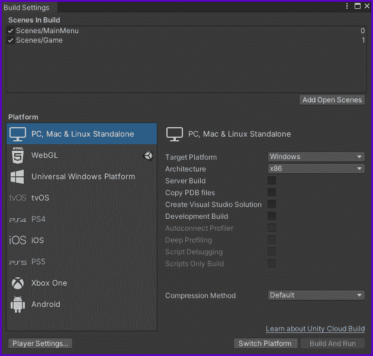*

*有了这些变化之后，我们需要对**的后期处理效果做一些调整，使其看起来与 [' **Windows 版**](/geekculture/how-to-build-and-test-your-game-in-unity-1eeab1b7937e) 差不多。***

***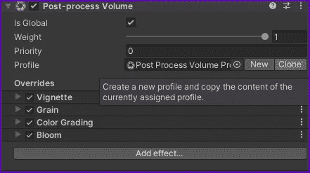******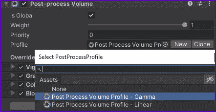***

*   ***在这里，我克隆了之前的配置文件，并将其重命名为*“…-Gamma。”****
*   ***我还重新命名了之前的配置文件，并将其重命名为*“…-线性。”****
*   ***我已经将卷中的配置文件切换到新的 Gamma one，并稍微调整了一下效果以匹配新的外观。***

*****构建 WebGL*****

***一旦项目为构建做好准备，再次打开*‘构建设置’*，点击*‘构建’*按钮。接下来，指定您想要放置构建的文件夹，并单击*‘选择文件夹’*按钮。***

***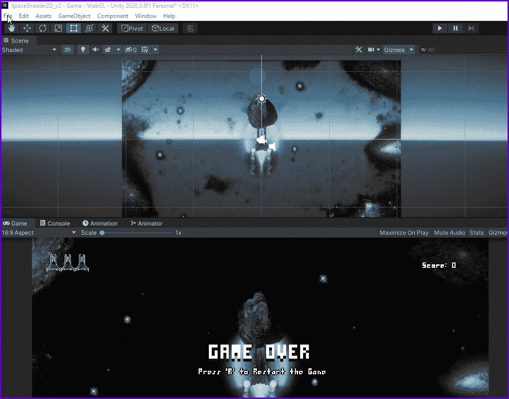***

***Unity 现在将开始构建您的项目。***

***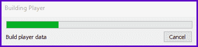***

***一旦构建完成，您将拥有在网络上运行游戏所需的所有文件！你现在可以把这些文件上传到你自己的网络服务器上，或者，你可以把它们上传到任何一个为你的游戏提供主机的网络平台上；例如:***

*   *****Itch.io*****
*   *****煨. io*****

***让我们来看看 *'Itch.io.'* 你首先需要注册——一旦注册，登录，你就可以上传你的游戏了。首先点击*“创建新项目按钮”*！***

******

***在这里，插入关于您的项目的所有信息，并上传您的项目文件。***

***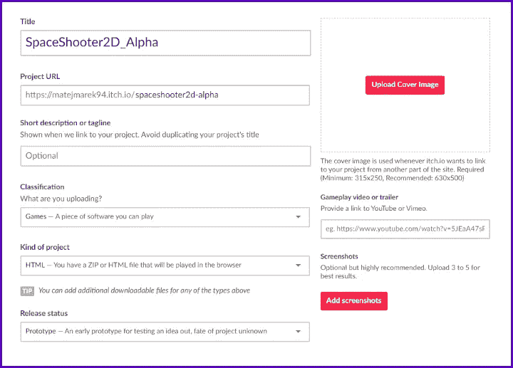***

> ***请注意，您的文件需要存档，以便您的游戏工作！***

***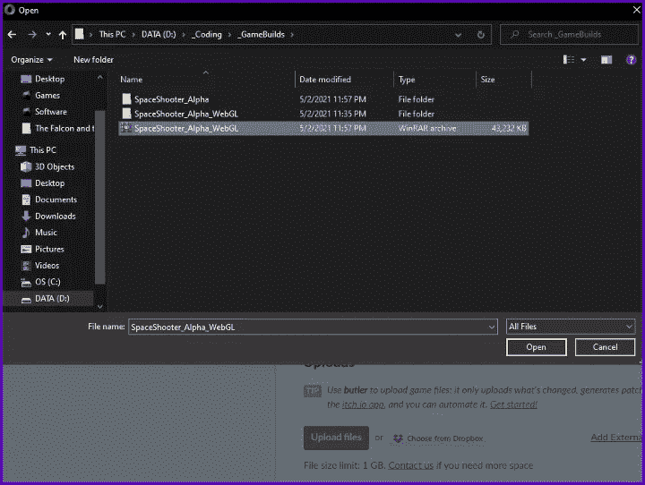***

***一旦上传完毕，点击*‘保存&查看页面’*-你的游戏现在已经上传完毕&可以开始玩了！***

***但是现在就这些了，感谢您的阅读，并随时关注我的更多文章-和往常一样，祝您好运，下次再见！***