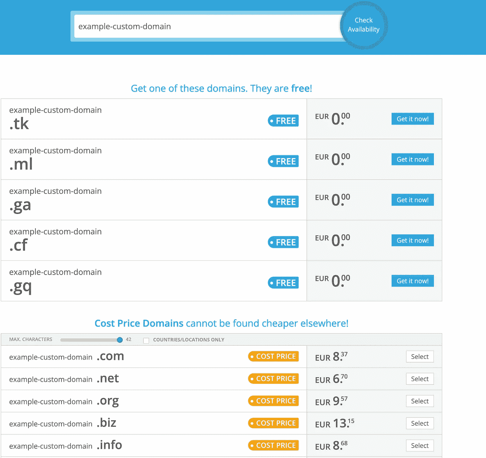
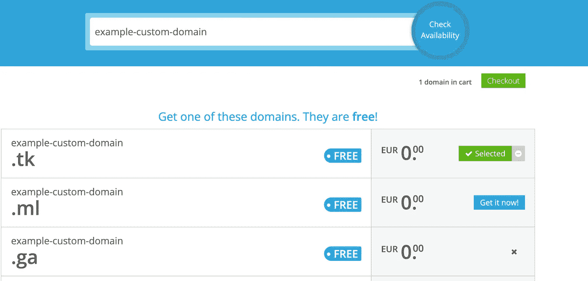
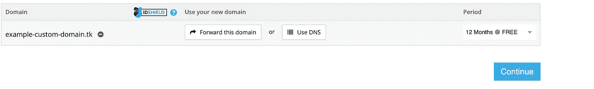
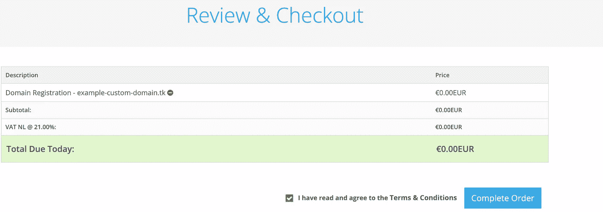
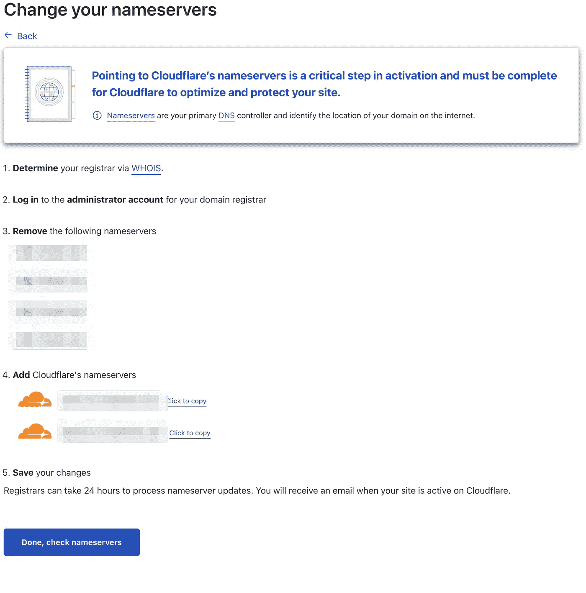
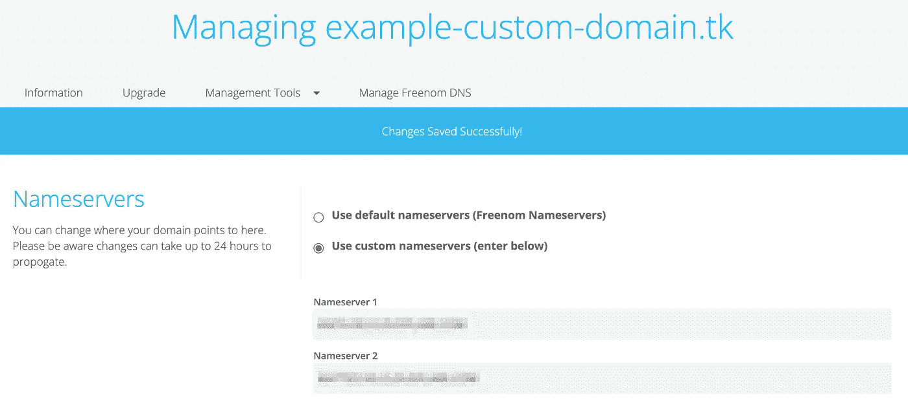
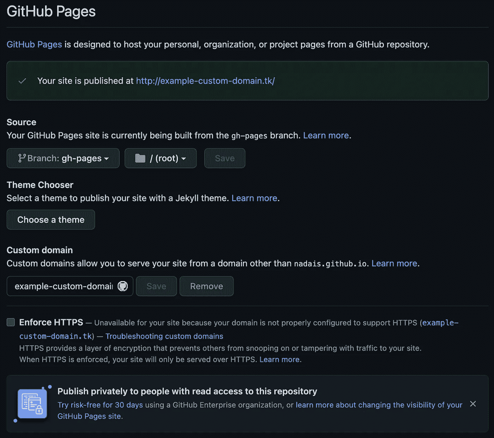
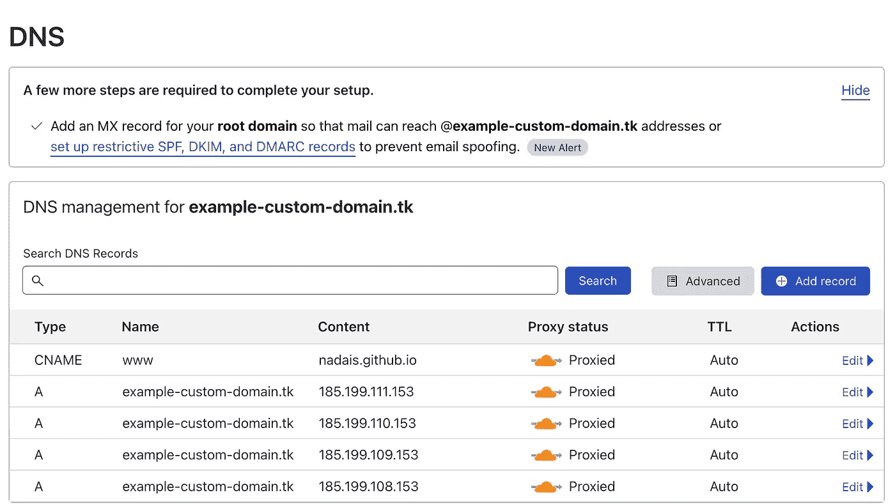

# 如何免费托管自己的自定义域名前端

> 原文：<https://medium.com/geekculture/how-to-host-your-own-frontend-with-a-custom-domain-for-free-3e8fd0dc4ac3?source=collection_archive---------6----------------------->

## 使用 cloudflare 在 GitHub 页面上免费定制域名

## 让我们构建一个 React 应用程序，并用我们自己的免费自定义域将它托管在 GitHub 页面上

Photo by [Ian Battaglia](https://unsplash.com/@ianjbattaglia?utm_source=medium&utm_medium=referral) on [Unsplash](https://unsplash.com?utm_source=medium&utm_medium=referral)

大家好！

虽然我已经看到了许多关于如何用 GitHub 页面托管自己的应用程序的独立文章，但我还没有看到一篇文章指导创建存储库、部署代码、获得自己的域，然后在自己的项目中设置它的整个过程。所以给你！

要阅读本文，您需要:

*   GitHub 账户
*   你自己的自定义域名(我将使用 [Freenom](https://www.freenom.com/) 免费获得我自己的域名)
*   一个 [Cloudflare](https://www.cloudflare.com/en-gb/) 帐户，以便设置您的自定义域名

都明白了吗？所以让我们开始吧！

# 基础状态

为了更好地关注本文，我们在起点做了一些假设。所以我们有:

1.  名为 example-custom-domain 的 GitHub 存储库
2.  使用创建-反应-应用程序生成的应用程序
3.  gh-pages NPM 软件包安装时配置了部署和预部署任务，因此可以从一开始就部署到 GH pages
4.  主页在 package.json 中被设置为/example-custom-domain，所以它可以呈现 create-react-app

你可以在这里看到基本状态[的代码](https://github.com/nadais/example-custom-domain/tree/base-state)

# 获得您自己的域名

有多种方法可以获得自己的域名，例如像 [godaddy](https://www.godaddy.com/) 这样的网站，这反过来可以帮助你设置其他东西，如你自己的自定义电子邮件地址和服务器。然而，有时你不想或不需要付费域名。所以免费的替代品就派上了用场。在这种情况下，可以使用 [Freenom](https://www.freenom.com/) 。

为了使用 Freenom 获得您自己的域名，您需要创建一个帐户。幸运的是，Freenom 支持社交网站登录，所以这一步只需要几秒钟

一旦您的帐户被创建，您现在可以搜索您的域名。在我的例子中，我使用了域示例-custom-domain，它与我的 repo 的名称相匹配，并提供了以下选项:

你可以选择前 5 个中的任何一个作为免费域名，而下面的域名将需要每年付费。因为我只看免费的，所以我将选择 example-custom-domain.tk。正如你在下面的图片中看到的，我首先尝试进入 example-custom-domain.ga，但是它不可用，所以我选择了另一个

一旦你准备好去按下结帐(绿色右上角的按钮)，你应该前进到以下屏幕:

该域名的默认值为 3 个月，但可以免费延长至 12 个月，所以我们可以延长。我们还将配置以后的 DNS 规则和域转发，因此您现在可以忽略这些按钮。

按下继续按钮后，将出现以下屏幕:

如果一切都符合您的预期，请按“完成订单”按钮。

搞定了。现在你有了自己的域名，我们可以用它在 Github 页面上设置我们的应用程序

# 配置 DNS 规则和安全性

虽然 Freenom 在如何设置 DNS 规则方面提供了一些灵活性，但您可以利用其他服务来定制您的域，如 Cloudflare。Cloudflare 是许多企业级应用程序中使用的一种应用程序，在防止拒绝服务器攻击以及确保您的域的安全性方面有着良好的记录

一旦您使用 Cloudflare 创建了一个帐户并验证了您的电子邮件，我们就可以开始向其中添加我们的新域。下图示例:

点击右上角添加您的域。应该会出现下面的图像。

选择免费计划并点击开始。Cloudflare 现在应该显示您需要从 Freenom 中删除名称服务器，并使用 cloudflare 的名称服务器。图像是模糊的，因为在你做的时候，精确的值可能是不同的

为此，回到你的 Freenom 账户，在右上角选择服务->我的域名。一旦你的域名出现，点击管理域名。在“域”页面上，选择“管理工具”->“名称服务器”。您应该有一个如下所示的页面

选择使用自定义名称服务器，然后插入 Cloudflare 提供的值。完成后，您就可以继续使用 Cloudflare 了，因此您可以单击“完成”,检查名称服务器

您的域现在已经使用 Cloudflare 设置好了！现在是时候回到 Github 并设置你的页面使用新的自定义域了！

# 在 GitHub 上设置您的自定义域

为了设置你的自定义域，你需要在你的应用程序的**公共**文件夹中有一个 CNAME 文件。如果它不在公共文件夹，这个文件将不会被采取的内容，它应该只是你的域名

现在您可以将它推送到您的存储库并运行部署命令`npm run deploy`。如果您使用的是 GitHub pages 的默认设置，请确保也删除了您的`package.json`文件中的`homepage`标签，因为它现在将从根目录而不是从路径提供服务。

我们快到了！对于最终的配置，请访问 GitHub，进入设置->页面。您应该会看到如下所示的屏幕:

现在最后一步！要设置您的域，您需要将 IP 设置为指向 GitHub IPs。为此，您需要返回到 Cloudflare，选择您的域，然后选择 DNS。一旦你到了那里，你应该会看到一个像下面这样的屏幕

你需要设置一个 CNAME 规则指向你的 github 页面的根目录(我的是 nadais.github.io)并设置一个规则，GitHub 提供的每个 IP 一个规则。在撰写本文时，这些是 IP，但是要获得最新的信息，您应该从 Github 文档[这里](https://docs.github.com/en/pages/configuring-a-custom-domain-for-your-github-pages-site/managing-a-custom-domain-for-your-github-pages-site)查看它们。

现在你知道了！您的自定义域现已设置并得到保护！

# 结论

本文旨在作为一个文档教程，以防有人也想为他们的网站建立自己的自定义域，并想为它提供一站式服务

一如既往，任何意见或建议都可以在评论中留下，我很乐意讨论它们！

希望你喜欢，下次再见！