# 如何使用 SSL 在旧的 Mac mini 上托管您的网站

> 原文：<https://medium.com/geekculture/how-to-host-your-website-on-an-old-mac-mini-with-ssl-4f7c8125cc8c?source=collection_archive---------5----------------------->

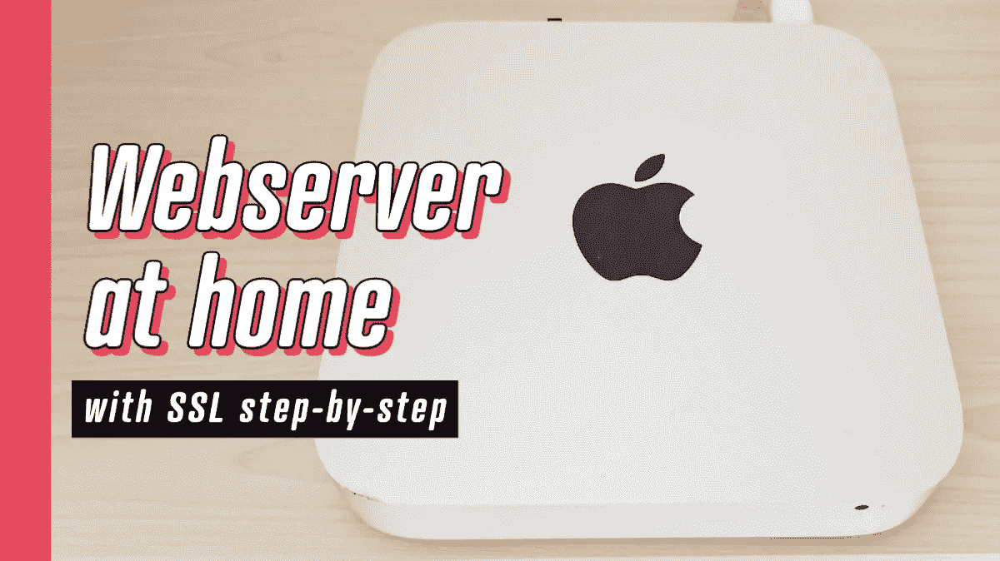

Set up your own web server and host your sites virtually for free

你好。有一段时间，我考虑在我的家庭服务器上托管我的网站。原因包括好奇心、在环境设置中容易做出改变、完全访问和学习体验。

# **硬件**

在这个实验中，我用了一台旧的 Mac mini 来向你展示它不需要尖端技术。我在 Facebook Marketplace 上花了高达 30(！)考虑到规格，这可能是我迄今为止最幸运的一次购买。

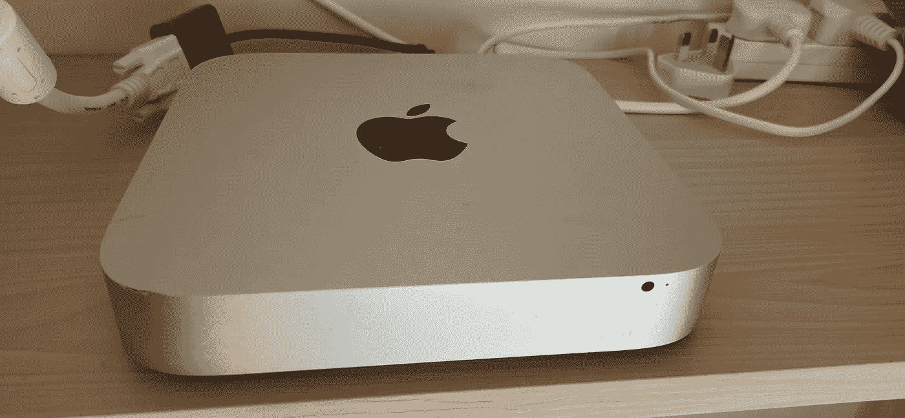

2009 Mac Mini with SSD, 2.66Ghz Core 2 Duo cpu and 16Gb of ram for £30

这是一台 2009 年的机器，有 256Gb 的 SSD 和 16gb 的 ram，以及 2.66Ghz 的 Core 2 Duo 处理器。运行 Apache 和服务一个简单的 React 单页面应用程序绰绰有余！

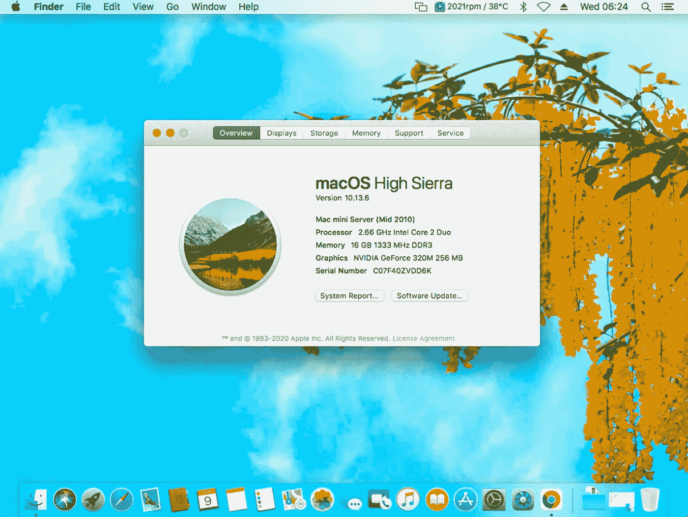

2009 mac mini from Facebook Marketplace… Perfect!

# **关于网站需要考虑的事情**

因此，在这一点上，我准备创建网站。虽然不是每个网站都是平等的。值得一提的是，高流量和资源密集型网站可能不是这种类型的托管解决方案的最佳候选。

## 另一方面，它非常适合以下任何情况:

*   个人网站或作品集
*   促销网站
*   调查
*   封闭访问 web 应用程序

*也就是说，我已经决定以这种方式托管我自己的个人网站。*

# 原因是:

*   我预计交通流量适中
*   这是一个静态的 React 应用程序

要在我客厅的旧 Mac Mini 上直接访问我的网站，请浏览:[https://thecaringdeveloper.com](https://thecaringdeveloper.com)

# 准备

## 创建网站

首先，我建议不要在家里托管 WordPress 网站，然而这是完全可能的。Wordpress 有一种混合的方式来存储页面数据。尽管您可以创建静态模板部件，其中硬编码的部分几乎不会改变，但仍有大量数据是从数据库中加载的。因此，在页面加载之前，每个浏览器请求都会触发大量昂贵的 php 逻辑和数据库查询。这种类型的 web 应用程序需要一些能量才能快速工作。这并不可怕，但你可以获得更好的结果去廉价的共享主机。

所以我的网站是静态的。这意味着页面是自包含的，因此不从数据库加载数据。它实际上没有任何数据库连接。如果你不熟悉 React:它的工作方式是在你的机器上创建你的站点，然后构建它。在构建阶段，代码会被大量缩减和优化，所以你的代码已经准备好投入使用了。

## 设计

这项工作从实际规划和设计网站内容开始。这个我用的是 Adobe XD。对于有设计背景的人来说，这是一个相对容易的任务。我只花了一个早上。为了准备好你的网站设计，我建议从内容开始。拿一张空白的(谷歌文档)纸，把你要对访问你网站的人说的话倒在上面。当然，说起来容易做起来难，但是你能做到的容易程度是你的信息有多清晰的一个强有力的指标。

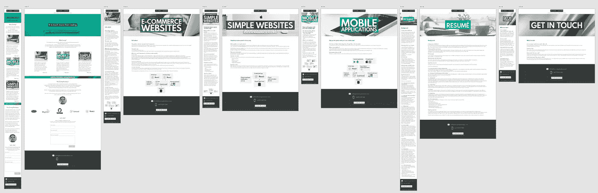

I used Adobe XD to create the website design

## 编码

正如我提到的，我使用 React 进行编码。过多地谈论如何做到这一点超出了范围，所以我尽量简短:

编码并编译它:)

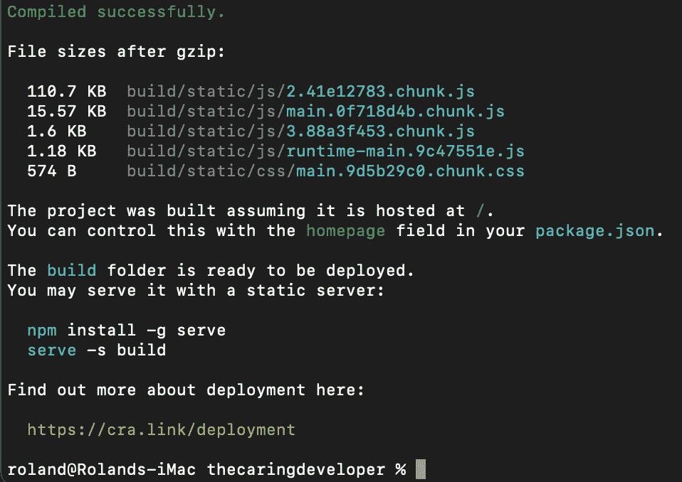

此时，您已经准备好了应用程序。我强烈建议将代码库存储在 Github 中，但这并不是绝对必要的。你可以简单地把它复制到你的服务器上。

就我而言，我建立了一个回购协议，以便更容易跟踪变化。

## 回到你的服务器

此时，我已经准备好了站点代码，等待部署。让我们来看看在您的浏览器中为站点提供服务需要哪些步骤。

在下面几节中，我将详细介绍以下步骤:

*   在路由器设置中打开端口 80 和 443
*   安装 brew
*   安装 Apache
*   配置域 DNS
*   设置由 Apache 提供服务的站点
*   获取 SSL 证书
*   正在为站点安装 SSL 证书
*   优化

## 在路由器设置中打开端口 80 和 443

我是维珍媒体的客户，所以我的路由器可以在本地网络的 192.168.0.1 上访问。检查您的路由器使用什么 ip。如果是由您的 ISP 提供的，可以在他们的网站上找到这些信息。

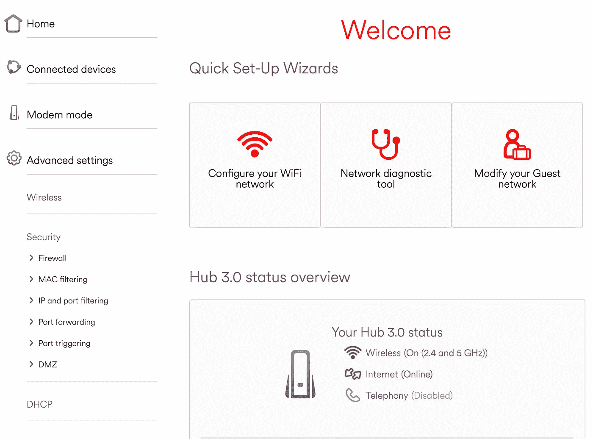

Access your router settings (most common ip-s are 192.168.0.1 or 192.168.1.1)

> 我们感兴趣的是**港的货代**。

当您在浏览器的地址栏中键入 url 时，您可以通过端口 80 或 443 访问域后面的服务器，而无需指定端口。(http 为 80，https 为 443)

如果您尝试任何其他端口，服务器很可能根本没有响应。【http://thecaringdeveloper.com:412】这将挂起并最终超时:

在您的浏览器中键入您自己的公共 ip 地址将试图访问您的路由器或调制解调器的 80 端口。这取决于设置会发生什么。默认情况下，不多。

当您的路由器被配置为将一个端口转发给在您机器上监听的任何设备时，奇迹就开始了。

让我们详细说明一下现阶段到底发生了什么:

*   一个请求从端口 80 传入
*   你的路由器说:好的，所以任何从端口 80 进来的东西都应该被转发到本地网络的端口 80。
*   有人在听吗？阿帕奇？Nginx？你们是来拿起电话回应的吗？好吧，那好吧。—>错误

## 让我们安装 Apache(但在此之前，让我们安装 homebrew)

由于我的机器是擦写的，没有用于任何其他用途(除了连接到投影仪和偶尔网飞)，它还没有完成这项工作所需的软件包。

如果你在 Mac 上，你的软件包管理工具是[家酿](https://brew.sh/)。

这需要一段时间，完成后，我就可以安装 Apache 了。

使用此命令:

```
brew install httpd
```

你可以阅读[这篇文章](https://tecadmin.net/install-apache-macos-homebrew/)来排除故障，如果你的系统有缺省的 apache 安装，就去激活它。

一旦它完成，你可以确认它正在工作，你可以通过在地址栏输入你的公共 ip 地址来测试它。你应该看到“它工作了！”(或除 500 错误之外的类似内容)

现在还不是庆祝的时候，但是确实端口 80 正在被转发，Apache 在另一端响应 ok。半路上:)

## 配置域 DNS

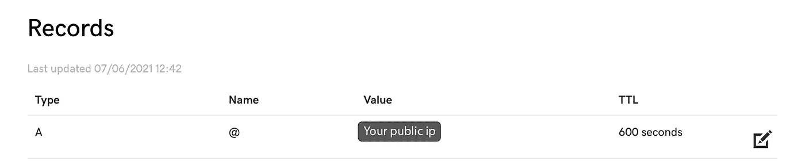

Point your domain to your public ip

您的公共 ip 是您的计算机在互联网上可以联系到的地方。它很像一个电话号码。为了使用户更容易理解，它可以被替换为人类可读的地址，如 google.com。它会把你的电话转到合适的 ip 地址。

因此，在这种情况下，我的下一个逻辑步骤是购买域名。你可以在很多网站上购买域名。为了简单起见，我选择了 [Godaddy](https://godaddy.com) 。

一旦我的域名购买完成，我就把它所指向的 ip 地址改成了我的公共 ip 地址，这样当有人输入这个 url 时，它就会出现在我路由器的 80 端口上，并被转发给 Apache 进行响应。

DNS 设置更新需要一些时间，所以这是我和家人一起喝咖啡吃早餐的绝佳机会。当我吃完烤面包和鸡蛋时，我可以看到“它起作用了！”在任何网络或设备上的浏览器中输入 http://thecaringdeveloper.com 时。

## 设置由 Apache 提供服务的站点

好的，到目前为止很容易，不是吗？事实上，在网上找到合适的机器花了我最大的努力。设计和编码很有趣，其他的就是安装软件和调整设置。:)

Apache 的工作方式是，您需要通过配置文件指定所有内容。

我们现在感兴趣的是让它监听端口 80(不安全的连接)并为它被告知的网站提供服务。

我不得不看的第一个文件是:
`/private/etc/apache2/https-vhosts.conf`。这些文件的位置可能因您的系统和版本而异。

顾名思义，这个文件是 vhosts(虚拟主机)的 home，所以是时候添加一个了。

```
<VirtualHost *:80>
    ServerName thecaringdeveloper.com
    ProxyPreserveHost On
    ProxyRequests Off
    ProxyPass / [http://localhost:8082/](http://localhost:8082/)
    ProxyPassReverse / [http://localhost:8082/](http://localhost:8082/)
    ErrorLog "/private/var/log/apache2/[YOUR SITE]-error_log"
    CustomLog "/private/var/log/apache2/[YOUR SITE]-access_log" 
</VirtualHost>
```

**关于反向代理的说明**

因为我希望在同一台机器上托管其他网站(或者至少保持开放的可能性)，所以我需要一种方式让 Apache 知道不同的文件应该基于域提供服务。

为了解决这个问题，我们有反向代理。简单地说，它保留请求主机并将调用转发到您指定的任何端口上的本地主机。

由于这发生在内部，这个港口不需要对世界开放。

因此需要一些额外的配置，以便我的站点在本地主机的端口 8082 上提供服务。

为此，我创建了以下配置文件:

```
$ /private/etc/apache2/extra/thecaringdeveloper.conf
```

要使用这个文件，我必须通过添加下面一行将它包含在`https.conf`文件中:

```
Include /private/etc/apache2/extra/thecaringdeveloper.conf
```

实际的配置包含了在浏览器中提供什么的细节。在我的例子中，它看起来像这样:

```
Listen 8082
<VirtualHost *:8082>
    DocumentRoot "[YOUR SITE DIRECTORY]" <Directory [YOUR SITE DIRECTORY]>
      Options Indexes FollowSymLinks MultiViews
      AllowOverride All
      Require all granted
    </Directory>
</VirtualHost>
```

要观察变化，需要重新启动 Apache。

为了确认我的配置工作正常，我尝试在本地机器的端口 8082 上访问站点。

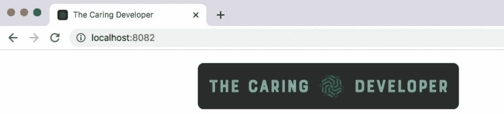

Once the files are on the server, having the virtual host in place, I could access the site locally on port 8082

更好的是，有了指向我的 ip 地址的域名，我也可以访问这个域名上的站点了！

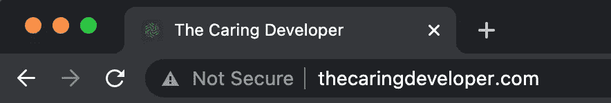

It is available but not secure :(

# 获取 SSL 证书

正如你所看到的，这个网站有一个问题:缺少挂锁或缺少锁或缺少锁…好吧好吧，这是一个笑话滑坡，所以让我们就此打住。:)

## 生成 CSR

```
openssl req -newkey rsa:2048 -keyout thecaringdeveloper.key -out thecaringdeveloper.csr
```

我已经使用上面的命令生成了一个证书签名请求(CSR)和一个密钥文件。它会问几个问题。你应该准确回答。

如果一切顺利，它将在您的系统中以指定的名称保存一个新文件。

## 购买 SSL 证书

在我的情况下，我永远不会通过我的小册子网站处理付款，所以我感兴趣的是挂锁。因此我选择了最便宜最简单的方案，在我看来就是 [GoGetSSL](https://www.gogetssl.com/) 。

一旦您完成了购买证书的步骤，将要求您通过输入 CSR 来完成您的证书。

将您在上一步中创建的`.csr`文件的内容复制到适当的框中。

然后需要验证证书。有几个选项可以做到这一点。我选择了 http，因为我知道该网站通过 http 工作，我可以很容易地复制文件夹中的文件。

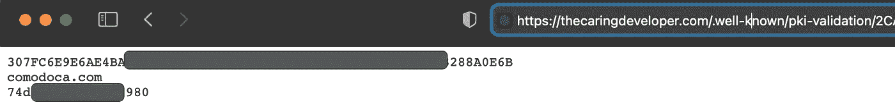

The http validation is simply checking that a file they give you can be accessed on the server.

在我的例子中，这就是验证的样子。对你来说可能不一样。

验证成功后，我收到了一封电子邮件，所以我准备安装证书。

完成该任务需要 3 个文件:

*   密钥文件
*   证书
*   CA 包文件

这个密钥文件是在 CSR 的同时生成的，所以你可以在它旁边找到它。它的扩展名是`.key`。另外两个在邮件里。

# 正在为站点安装 SSL 证书

我已经创建了 3 个空文件来开始。地点完全由你决定。我喜欢把它们保存在我的项目文件夹中。

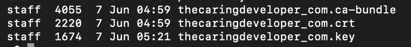

The files I needed to install the certificate.

在下一步中，我从适当的文件中复制了内容。

## SSL Apache 配置

到目前为止，我的网站在 http 上服务得很好，所以我对端口 80 的配置肯定是有效的。

现在需要的是另一个配置，它可以做基本相同的事情，但是也使用 Apache 的 SSL 引擎和我的证书文件。

所以我在`/etc/apache2/extra`文件夹中添加了一个名为`httpd-ssl.conf`的新虚拟主机。

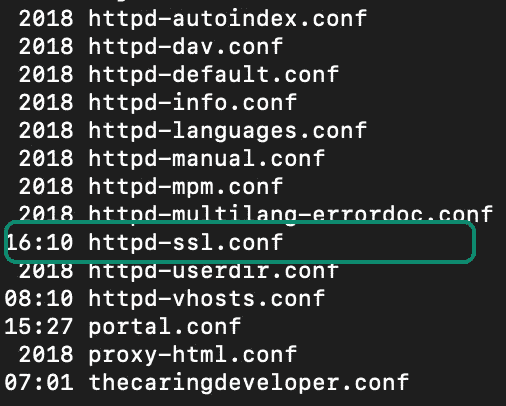

There are predefined config files for a range of use cases. You can also create your own ones.

我的配置文件如下所示:

```
<VirtualHost *:443>
ServerName [https://thecaringdeveloper.com](https://portal.thecaringdeveloper.com)
DocumentRoot "[LOCATION OF THE WEBSITE]"<Proxy *>
  Order deny,allow
  Allow from all
</Proxy>SSLEngine on
SSLProxyEngine On
ProxyPreserveHost On
SSLProxyVerify none
ProxyRequests OffSSLCertificateFile [PATH TO THE CERTIFICATE FILE]
SSLCertificateKeyFile  [PATH TO THE CERTIFICATE KEY FILE]
SSLCertificateChainFile [PATH TO THE CA BUNDLE FILE]ProxyPass / [http://localhost:8082/](http://localhost:8083/)
ProxyPassReverse / [http://localhost:8082/](http://localhost:8083/)
RequestHeader set X-Forwarded-Proto "https"
RequestHeader set X-Forwarded-Port "443"ErrorLog "/private/var/log/apache2/thecaringdeveloper-ssl-error_log"
CustomLog "/private/var/log/apache2/thecaringdeveloper-ssl-access_log" common<Directory [LOCATION OF THE WEBSITE]>
  Options Indexes FollowSymLinks MultiViews
  AllowOverride All
  Require all granted
</Directory>
```

重启 Apache 后，我可以通过 https 观察站点加载了！耶，庆祝的时间到了吗？嗯差不多，但是没有:)

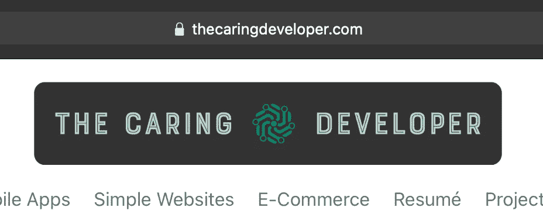

# 优化

该网站实际上也是通过 http 和 https 加载的。我认为这不是很专业，所以让我们确保它总是通过 https 加载，这样就不会向用户显示“不安全”。

**不可编辑。htaccess！**

我犯了一个错误，在做适当的研究之前就进入了这一点，所以我希望在这里可以节省你一些时间。

如果您试图在您的。htaccess 文件，它将导致重定向循环。为什么？因为在我的例子中，站点请求被内部重定向到 [http://localhost:8082](http://localhost:8082) 。注意这里的 **http** 。ssl 证书适用于特定的域，因此不能安装到本地主机。的。htaccess 是在命中目录中的实际文件时触发的，所以它会尝试重定向到 [https://localhost:8082](https://localhost:8082) 而失败。(我不能 100%确定这就是发生的事情，如果我错了，请纠正我。这是我通过症状和日志了解到的。如果失败的方式有所不同，那也没什么区别，因为失败就是失败。)

因此，解决方案是在`httpd.conf`文件中添加到虚拟主机的重定向，因为它是第一个联系点。一旦 Apache 收到请求，它就应该知道需要重定向到 https。

在`DocumentRoot`之后添加的额外行:

```
RewriteEngine On
RewriteCond %{SERVER_PORT} !443
RewriteRule ^/(.*) https://%{HTTP_HOST}/$1 [R=301,L]
```

你也可以删除它后面的内容，但我建议不要这样做。如果您出于某种原因需要临时再次通过 http 服务站点(最常见的是一个新的证书需要通过 http 进行验证)，您只需将这 3 行注释掉就可以了。

# 结论

这就对了。你拿到了！这就是如何在一台旧的 Mac Mini 上用 SSL 证书建立一个简单的宣传册网站。

要在 linux 机器或 raspberry pi(！)差不太多。试试看！我真的很满意这个设置，因为我可以添加更多的网站，我想，以及机器本身是安静的，并融入室内的其余部分。

如果您有任何问题，请随时联系 hello@thecaringdeveloper.com

祝您愉快，并与您自己的家庭网络服务器玩得开心！