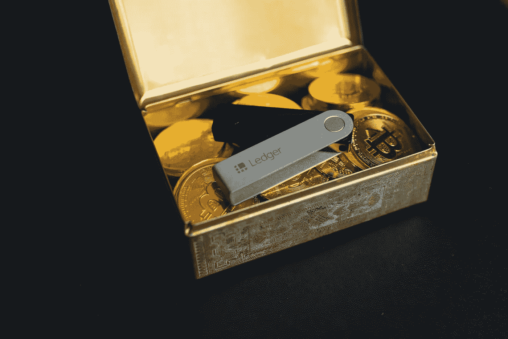

# 如何识别骗局密码？

> 原文：<https://medium.com/geekculture/how-to-identify-scam-crypto-201845b7bee1?source=collection_archive---------15----------------------->

Photo by [olieman.eth](https://unsplash.com/es/@moneyphotos?utm_source=unsplash&utm_medium=referral&utm_content=creditCopyText) on [Unsplash](https://unsplash.com/s/photos/scam?utm_source=unsplash&utm_medium=referral&utm_content=creditCopyText)

每天都有大量新的代币出现。它们大多被称为“MemeCoins/ShitCoins”。但问题是大部分都是骗局。

你可以在投资前先看看这些。这样你就不会被抓到。

1.去[https://bscscan.com/](https://bscscan.com/)粘贴代币合同地址。

2.点击“**持有人**，查看持有人列表，Top wallet 看起来应该是“0x00…DEAD”(这叫死钱包，里面的东西永远烧光了)。否则，这是一个危险信号。

3.如果持卡人的钱包地址旁边有一个“**纸币图标**”(这称为契约钱包，通常用于流动性池)。这个 LP 钱包地址应该被锁定(这意味着即使是令牌的创建者也不能从这个钱包中获得令牌)，要进行检查，请转到[https://poocoin.app/](https://poocoin.app/)现在查看信息部分，如果有任何警告，这是一个大红旗。

4.如果任何一个普通钱包持有超过 10%的总供应量，这是一个危险信号，因为这可能是一个 RugPull(当一个大钱包抛售代币，使价格暴跌接近零)

5.令牌应该有一个网站和路线图。大多数骗局代币创造者甚至懒得创建一个网站。

6.他们应该有社交档案。(不和/电报/推特)

这是你的钱。谨慎投资！！

干杯！！