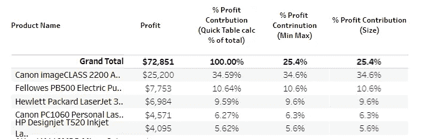
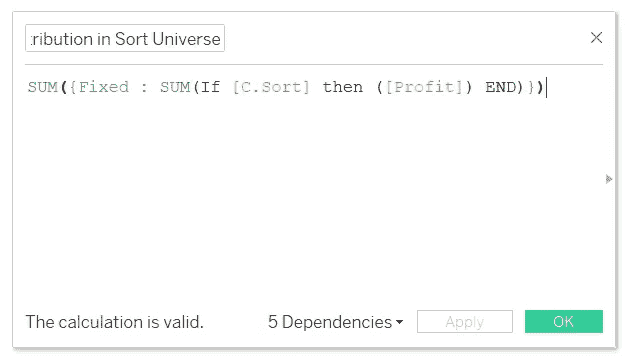
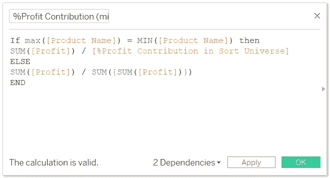
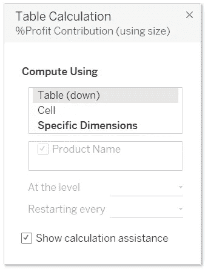
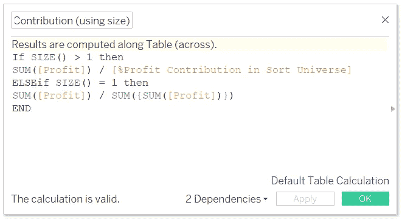

# 如果总计计算在表格中不一样怎么办？

> 原文：<https://medium.com/geekculture/how-to-if-grand-total-calculation-is-different-in-tableau-d8c411ca0ad7?source=collection_archive---------11----------------------->

Grand Total (Pic Credit: Author)

您是否遇到过这样的情况，您的总计计算可能与行中指定的略有不同？让我给你一个背景。为此，让我们考虑一下我们良好的 ol' Tableau 超市数据集。

对于这个数据集，我们将使用可以按利润排序的“产品名称”列。该列可以进一步按三个值排序——前 N、后 N 和全部——其中用户选择的变量“N”是可见的排序行数，例如，**前 10 位**、**后 20 位**等等。

*(这里，我将假设读者知道如何使用集合来排序和显示参数中输入的行数。如果没有，请参考博客末尾给出的工作簿链接。)*

此外，对于显示的每个产品名称行，要求是首先在选择的 N 个产品中显示该产品的“利润贡献百分比”;其次，在数据集中的所有产品中。

对于那些不知情的人来说，产品的利润贡献百分比是通过将产品的利润除以所选产品或数据集中的产品的总利润来评估的。

当我选择“所有”行时，总计将是 100%。但是当选择顶部/底部时，总计将显示“N”参数中指定的可见产品(记录)的利润贡献百分比。让我们来看看实现这一目标的两种方法。

首先，找到所选可见产品(记录)的利润贡献百分比。将此计算命名为“%排序范围中的利润贡献”。此计算将用于进一步的计算。

%Profit Contribution in Sort universe (Pic Credit: Author)

## 方法 1

第一种方法是我们使用最小值和最大值函数。我更喜欢这个，因为这是一个简单的方法。但是这种方法有一个问题，这个问题将在本博客后面讨论。创建以下名为“%利润贡献(最小最大值)”的计算字段。

% Profit Contribution (min max) (Pic Credit: Author)

## 方法 2

第二种方法是使用 Size 函数。在详图标记中放置一个名为“SIZE”的计算字段，包含以下文本:Size()。

这里要确保两件事。在工作表中放置“大小”字段之前，在工作表中放置计算“%利润贡献”时需要考虑的所有维度。然后，右键单击计算字段“大小”，并选择“编辑表格计算”。在这种情况下，它将是表(下)。

Table Calculations (Pic Credit: Author)

但是您在上述对话框的所有可见选项中选择什么取决于场景。有一些要求，其中有一个行总计和“跨表”需要选择。或者需要执行行总计，然后是列总计，需要选择选项“表格(横向然后向下)”。您甚至可以选择特定的维度，按照您希望的特定顺序进行计算。因此，简而言之，评估场景，将维度放在行/列栏中，然后相应地选择选项。

完成此步骤后，检查“总计”列中出现的“大小”值，并在下面的计算中使用该值。现在用下面的文本创建一个名为“%利润贡献(大小)”的字段。

% Profit Contribution (size) (Pic Credit: Author)

将此计算字段放在工作表上后，右键单击计算字段并选择“编辑表格计算”，然后对上面的“大小”计算字段执行相同的设置。

要全面理解这一点，请再添加一列利润，右键单击并选择速算表计算下的总百分比。您会注意到，总计将始终是 100%，因为它将是所有可见产品的利润贡献百分比的总和。在我们的谈话中，除了客观地看待事物和进行比较之外，我们没有其他用处。

因此，这就结束了要采取的步骤，但人们不知道最小最大函数的问题是什么。

## 使用最小最大函数的问题

当我们在“N”参数中输入 1 时，我们使用 MIN MAX 函数的列中的总计显示错误。因此，为了避免这种情况，将“N”参数的最小值限制为 2。

我建议访问这个[链接](https://public.tableau.com/app/profile/priya.yogendra/viz/HowtoifGrandTotalFormulaisdifferent/DifferentGrandTotalFormula?publish=yes)，以便更好地了解它。我把这些放在一个仪表板上，你可以在那里测试，甚至可以下载工作簿。下次见。再见。