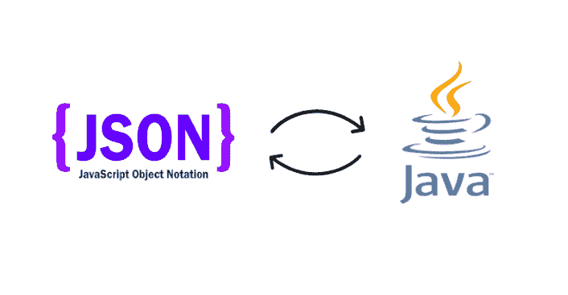

# 如何在使用 Jackson ObjectMapper 解组 JSON 时忽略属性

> 原文：<https://medium.com/geekculture/how-to-ignore-properties-when-unmarshalling-a-json-using-the-jackson-objectmapper-b2343244b07a?source=collection_archive---------9----------------------->

Photo from: [https://blog.fossasia.org/tag/jackson/](https://blog.fossasia.org/tag/jackson/)

你曾经在 Java 项目中使用过 ***ObjectMapper*** 类(来自*com . faster XML . Jackson . databind . object mapper*)来将 REST 调用的响应映射到你的本地模型中吗？

我经常这样做，我发现自己陷入了麻烦，比我希望承认的还要多，然后服务提供者改变了响应对象。