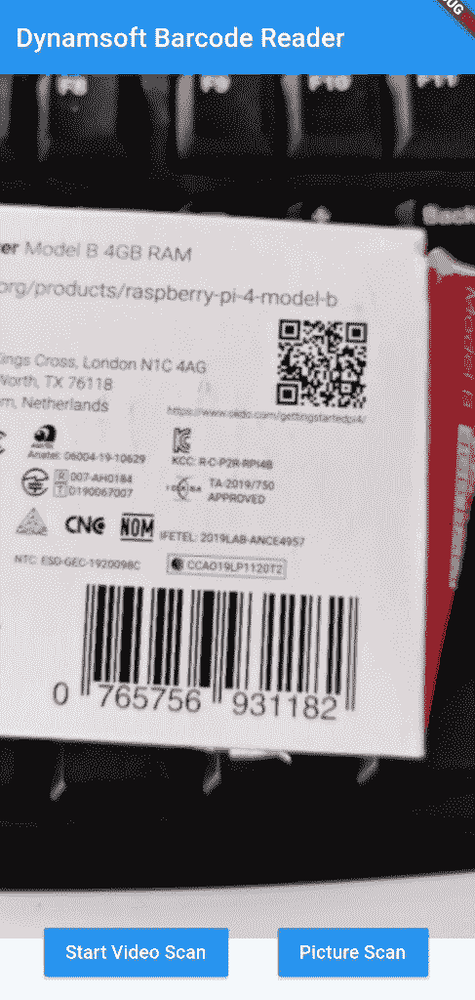
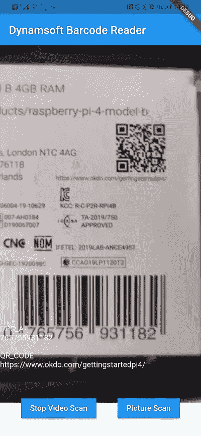
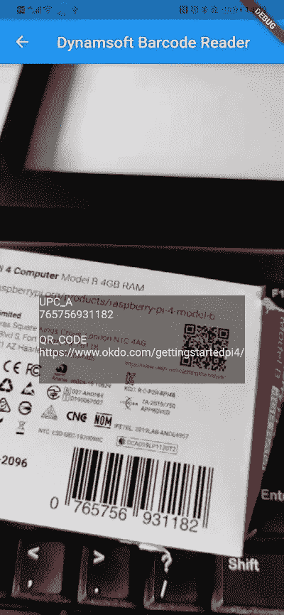

# 如何从零开始实现 Flutter 条形码扫描仪

> 原文：<https://medium.com/geekculture/how-to-implement-flutter-barcode-scanner-from-scratch-d936a7ed3fa0?source=collection_archive---------20----------------------->

大约两年前，我写过一篇文章，分享如何一步一步用 [Dynamsoft 条码阅读器](https://www.dynamsoft.com/barcode-reader/overview/)构建一个 [Flutter 条码插件](https://www.dynamsoft.com/codepool/flutter-barcode-plugin.html)。当时 Flutter 还在开发中，只支持 Android 和 iOS。如今，谷歌发布了 Flutter 2，允许开发人员从单一代码库构建移动、web 和桌面应用程序。如果你想建立跨平台的应用程序，从现在开始在 Flutter 上投入更多的努力是值得的。由于新的 Flutter 与旧的不兼容，我决定重构 Flutter 条形码插件的 API，并添加一个新的方法来支持通过视频流实时扫描条形码。



# Flutter 条形码 SDK 插件

在下面的段落中，我将演示如何开发一个支持从图像文件和图像缓冲区读取条形码的 Flutter 条形码插件，以及如何将该插件发布到 pub.dev。

# 用 Dynamsoft 条码阅读器开发 Flutter 条码 SDK 插件

我目前的计划是让这个插件适用于 Android。因此，我创建插件包如下:

要向插件项目中添加其他平台(如 iOS)的代码，我可以运行:

插件 API 在`lib/flutter_barcode_sdk.dart`文件中定义，它是 Dart 代码和特定于平台的代码之间的桥梁。生成一个`android/src/main/java/com/dynamsoft/flutter_barcode_sdk/FlutterBarcodeSdkPlugin.java`文件作为 Android 入口点。

## Dart 代码

让我们从`lib/flutter_barcode_sdk.dart`开始吧。

第一步是定义一个`BarcodeResult`类，它包含条形码格式、结果和坐标点，用于反序列化从平台特定代码返回的 JSON 数据:

```
**class** **BarcodeResult** {
  **final** **String** format;
  **final** **String** text;
  **final** **int** x1;
  **final** **int** y1;
  **final** **int** x2;
  **final** **int** y2;
  **final** **int** x3;
  **final** **int** y3;
  **final** **int** x4;
  **final** **int** y4;

  BarcodeResult(**this**.format, **this**.text, **this**.x1, **this**.y1, **this**.x2, **this**.y2,
      **this**.x3, **this**.y3, **this**.x4, **this**.y4);

  BarcodeResult.fromJson(Map<**dynamic**, **dynamic**> json)
      : format = json['format'],
        text = json['text'],
        x1 = json['x1'],
        y1 = json['y1'],
        x2 = json['x2'],
        y2 = json['y2'],
        x3 = json['x3'],
        y3 = json['y3'],
        x4 = json['x4'],
        y4 = json['y4'];

  Map<**String**, **dynamic**> toJson() => {
        'format': format,
        'text': text,
        'x1': x1,
        'y1': y1,
        'x2': x2,
        'y2': y2,
        'x3': x3,
        'y3': y3,
        'x4': x4,
        'y4': y4,
      };
}
```

分别为图片和视频流场景创建方法`decodeFile()`和`decodeImageBuffer()`:

```
List<BarcodeResult> _convertResults(List<Map<**dynamic**, **dynamic**>> ret) {
    **return** ret.map((data) => BarcodeResult.fromJson(data)).toList();
}

Future<List<BarcodeResult>> decodeFile(**String** filename) async {
    List<Map<**dynamic**, **dynamic**>> ret = List<Map<**dynamic**, **dynamic**>>.from(
        await _channel.invokeMethod('decodeFile', {'filename': filename}));
    **return** _convertResults(ret);
}

Future<List<BarcodeResult>> decodeImageBuffer(
      Uint8List bytes, **int** width, **int** height, **int** stride, **int** format) async {
    List<Map<**dynamic**, **dynamic**>> ret = List<Map<**dynamic**, **dynamic**>>.from(
        await _channel.invokeMethod('decodeImageBuffer', {
      'bytes': bytes,
      'width': width,
      'height': height,
      'stride': stride,
      'format': format
    }));
    **return** _convertResults(ret);
}
```

`_convertResults()`功能用于将`List<Map<dynamic, dynamic>>`类型转换为`<List<BarcodeResult>>`类型。

## Java 代码

调用 Flutter API 时，会触发 Android `onMethodCall()`功能:

```
@Override
**public** **void** onMethodCall(@NonNull **MethodCall** call, @NonNull **Result** result) {
    **switch** (call.method) {
        **case** "getPlatformVersion":
            result.success("Android " + android.os.Build.VERSION.RELEASE);
            **break**;
        **case** "decodeFile": {
            **final** **String** filename = call.argument("filename");
            **List**<**Map**<**String**, **Object**>> results = mBarcodeManager.decodeFile(filename);
            result.success(results);
        }
        **break**;
        **case** "decodeFileBytes": {
            **final** **byte**[] bytes = call.argument("bytes");
            **List**<**Map**<**String**, **Object**>> results = mBarcodeManager.decodeFileBytes(bytes);
            result.success(results);
        }
        **break**;
        **case** "decodeImageBuffer": {
            **final** **byte**[] bytes = call.argument("bytes");
            **final** **int** width = call.argument("width");
            **final** **int** height = call.argument("height");
            **final** **int** stride = call.argument("stride");
            **final** **int** format = call.argument("format");
            **final** **Result** r = result;
            mExecutor.execute(**new** **Runnable**() {
                @Override
                **public** **void** run() {
                    **final** **List**<**Map**<**String**, **Object**>> results = mBarcodeManager.decodeImageBuffer(bytes, width, height, stride, format);
                    mHandler.post(**new** **Runnable**() {
                        @Override
                        **public** **void** run() {
                            r.success(results);
                        }
                    });

                }
            });
        }
        **break**;
        **default**:
            result.notImplemented();
    }
}
```

以下是特定于平台的代码的基本步骤:

1.  从 Dart 框架中提取参数。
2.  处理图像数据。
3.  返回结果。

`decodeImageBuffer`方法是为摄像机流设计的。为了避免阻塞主线程，我使用`SingleThreadExectuor`来处理工作线程中的 CPU 密集型工作。

# 将 Flutter 条形码 SDK 插件发布到 Pub.dev

在发布插件之前，您最好运行以下命令通过分析:

如果没有错误，您可以将包发布到 pub.dev:

我已经成功发布了颤振条码 SDK 到[https://pub.dev/packages/flutter_barcode_sdk](https://pub.dev/packages/flutter_barcode_sdk)。

# 颤动条形码扫描仪

插件完成后，就该用几行 Dart 代码构建一个条形码扫描仪应用程序了。

首先，我将 Flutter 相机插件和 flutter_barcode_sdk 添加到`pubspec.yaml`文件中:

```
dependencies:
  camera:
  flutter_barcode_sdk:
```

然后，初始化`main.dart`中的摄像头和条码阅读器对象:

```
CameraController _controller;
Future<**void**> _initializeControllerFuture;
FlutterBarcodeSdk _barcodeReader;
**bool** _isScanAvailable = **true**;
**bool** _isScanRunning = **false**;
**String** _barcodeResults = '';
**String** _buttonText = 'Start Video Scan';

@override
**void** initState() {
  **super**.initState();

  _controller = CameraController(
    widget.camera,
    ResolutionPreset.medium,
  );

  _initializeControllerFuture = _controller.initialize();
  _initializeControllerFuture.then((_) {
    setState(() {});
  });
  _barcodeReader = FlutterBarcodeSdk();
}
```

该应用程序由一个摄像头视图、一个文本小部件和两个按钮小部件组成:

```
@override
Widget build(BuildContext context) {
  **return** Column(children: [
    Expanded(child: getCameraWidget()),
    Container(
      height: 100,
      child: Row(children: <Widget>[
        Text(
          _barcodeResults,
          style: TextStyle(fontSize: 14, color: Colors.white),
        )
      ]),
    ),
    Container(
      height: 100,
      child: Row(
          mainAxisAlignment: MainAxisAlignment.spaceEvenly,
          children: <Widget>[
            MaterialButton(
                child: Text(_buttonText),
                textColor: Colors.white,
                color: Colors.blue,
                onPressed: () async {
                  **try** {
                    *// Ensure that the camera is initialized.*
                    await _initializeControllerFuture;

                    videoScan();
                    *// pictureScan();*
                  } **catch** (e) {
                    *// If an error occurs, log the error to the console.*
                    print(e);
                  }
                }),
            MaterialButton(
                child: Text("Picture Scan"),
                textColor: Colors.white,
                color: Colors.blue,
                onPressed: () async {
                  pictureScan();
                })
          ]),
    ),
  ]);
}
```

在`videoScan()`函数中，我调用 [startImageStream()](https://pub.dev/documentation/camera/latest/camera/CameraController/startImageStream.html) 连续获取最新的视频帧，并调用条码解码 API:

```
**void** videoScan() async {
  **if** (!_isScanRunning) {
    setState(() {
      _buttonText = 'Stop Video Scan';
    });
    _isScanRunning = **true**;
    await _controller.startImageStream((CameraImage availableImage) async {
      **assert**(defaultTargetPlatform == TargetPlatform.android ||
          defaultTargetPlatform == TargetPlatform.iOS);
      **int** format = FlutterBarcodeSdk.IF_UNKNOWN;

      **switch** (availableImage.format.group) {
        **case** ImageFormatGroup.yuv420:
          format = FlutterBarcodeSdk.IF_YUV420;
          **break**;
        **case** ImageFormatGroup.bgra8888:
          format = FlutterBarcodeSdk.IF_BRGA8888;
          **break**;
        **default**:
          format = FlutterBarcodeSdk.IF_UNKNOWN;
      }

      **if** (!_isScanAvailable) {
        **return**;
      }

      _isScanAvailable = **false**;

      _barcodeReader
          .decodeImageBuffer(
              availableImage.planes[0].bytes,
              availableImage.width,
              availableImage.height,
              availableImage.planes[0].bytesPerRow,
              format)
          .then((results) {
        **if** (_isScanRunning) {
          setState(() {
            _barcodeResults = getBarcodeResults(results);
          });
        }

        _isScanAvailable = **true**;
      }).catchError((error) {
        _isScanAvailable = **false**;
      });
    });
  } **else** {
    setState(() {
      _buttonText = 'Start Video Scan';
      _barcodeResults = '';
    });
    _isScanRunning = **false**;
    await _controller.stopImageStream();
  }
}
```

`pictureScan()`功能从图像中读取条形码，并将图像和结果显示在[画面](https://flutter.dev/docs/cookbook/plugins/picture-using-camera)上:

```
**void** pictureScan() async {
  **final** image = await _controller.takePicture();
  List<BarcodeResult> results = await _barcodeReader.decodeFile(image?.path);

  Navigator.push(
    context,
    MaterialPageRoute(
      builder: (context) => DisplayPictureScreen(
          imagePath: image?.path,
          barcodeResults: getBarcodeResults(results)),
    ),
  );
}
```

最后，我可以构建并运行应用程序:

```
flutter run
```

树莓派包装盒上 1D 条形码和二维码的识别测试。

**视频条形码扫描**



**图片条形码扫描**



# 待办事项

iOS、Web 和 Windows。

# 源代码

[https://github.com/yushulx/flutter_barcode_sdk](https://github.com/yushulx/flutter_barcode_sdk)

*原载于 2021 年 4 月 21 日 https://www.dynamsoft.com**T21*[。](https://www.dynamsoft.com/codepool/flutter-barcode-scanner-plugin.html)