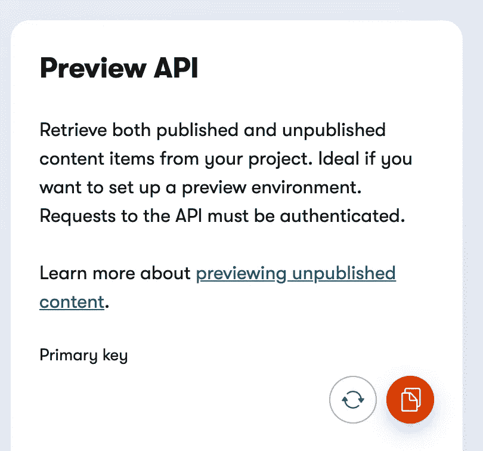
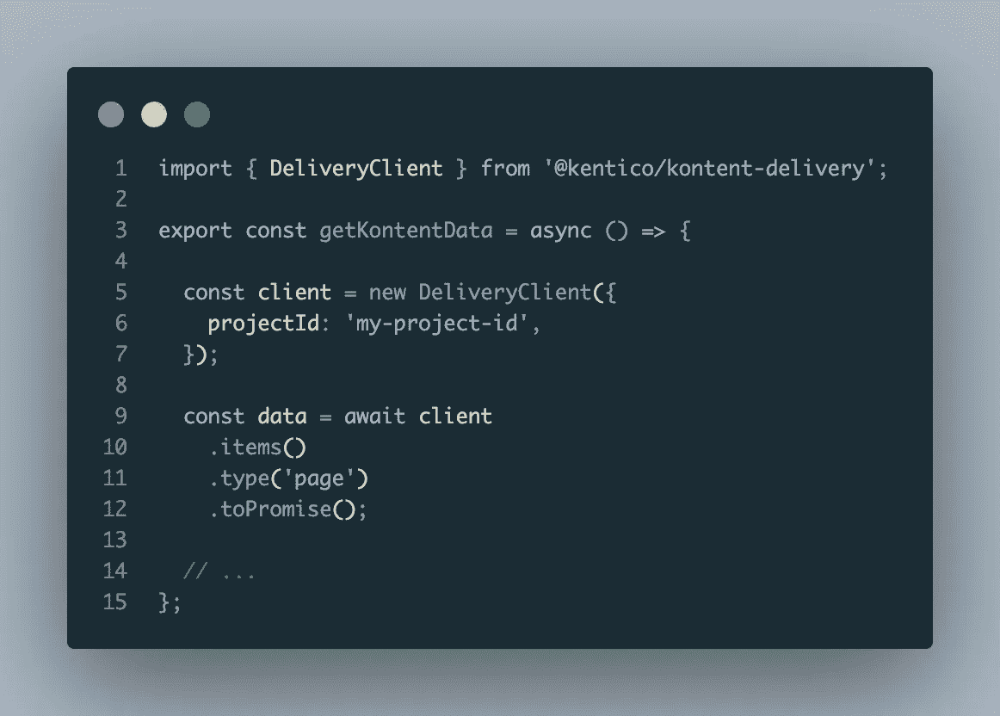
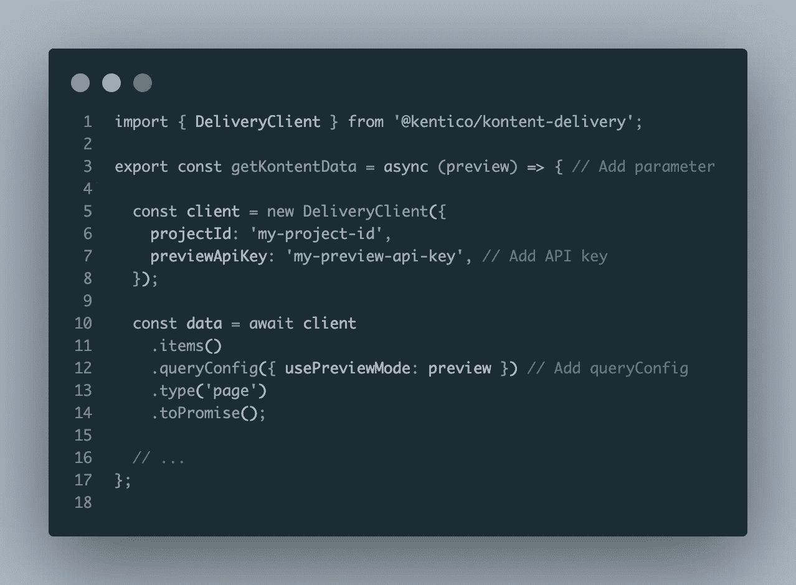
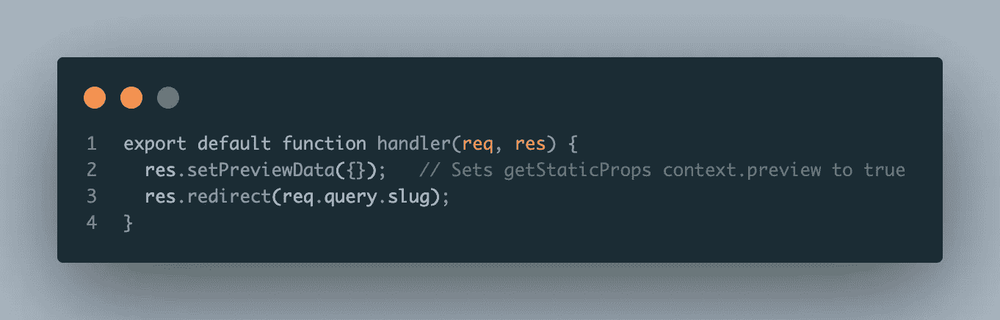
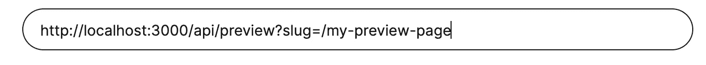
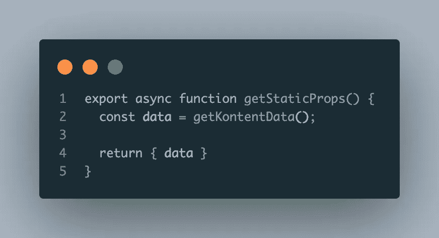
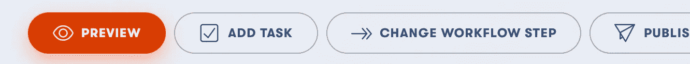

# 如何在 Next.js 中实现 Kontent 预览

> 原文：<https://medium.com/geekculture/how-to-implement-kontent-previews-in-next-js-c2ad58f8243e?source=collection_archive---------18----------------------->

Photo by [Roman Synkevych](https://unsplash.com/@synkevych?utm_source=medium&utm_medium=referral) on [Unsplash](https://unsplash.com?utm_source=medium&utm_medium=referral)

他们说前端开发就是很好地展示数据。我相信这是真的，将数据/内容从代码中分离出来是朝着这个方向迈出的一大步。使用像 Kontent 这样的 CMS 可以将内容编辑和网站架构分离开来，特别是在像营销网站或博客这样的内容密集型网站中。

从 CMS 获取内容是好的，但是让你的内容编辑能够预览他们的修改更好(也可以防止破坏网站)。以下是如何用 Kontent CMS 和一个 Next.js 应用程序来实现。

Photo by [Florian Klauer](https://unsplash.com/@florianklauer?utm_source=medium&utm_medium=referral) on [Unsplash](https://unsplash.com?utm_source=medium&utm_medium=referral)

我们如何实现这一目标？令人欣慰的是，Next.js 提供了开箱即用的特性，即 API 路由，是为静态网站量身定制的。

本质上，我们将通过自定义 API 路由“捕捉”预览请求，并重定向到要预览的页面，但页面将被告知它应该从 Kontent 的预览 API 而不是常规的交付 API 获取。

本教程有几个假设:你已经在你的 Next.js 应用中实现了 Kontent，你想要预览的页面已经在其 *getStaticProps* 函数中获取了内容(你也有 Next.js 的工作知识)。

首先，获取你的项目的预览 API 密匙，位于 Kontent 上你的项目的**项目设置**中。使用主键:

我们将把它放在我们的*中。env* 文件，并将其命名为 KONTENT_PREVIEW_KEY。

现在，让我们修改我们的数据获取函数，使其也能够从预览 API 中获取数据。现在，这个函数应该看起来像这样:

我们将向它添加一个预览布尔参数，并相应地配置我们的查询:

Kontent data fetching function, with preview logic

现在，当我们给这个函数传递一个“true”参数时，它将获取我们内容的预览版本。但首先，我们需要做一点设置。

在 Next.js 项目中，在 **src** 文件夹中，创建一个名为 **api** 的文件夹。在 **src/api** 内部，创建一个名为 **preview.js** 的文件。现在这是一个 API 路由，因此，我们可以通过使用一个处理函数来处理来自它(来自 Kontent)的请求:

The handler function, setting a preview cookie on the page

上面代码的第 3 行设置了预览 cookies，我们将在页面内部使用它来知道获取哪种数据(如 [Next.js 文档](https://nextjs.org/docs/advanced-features/preview-mode#step-1-create-and-access-a-preview-api-route)中所解释的)。第 4 行利用请求中的查询参数来了解要显示哪个页面。

既然我们已经设置了 API 路由，我们需要向它发送 Kontent 请求。在本例中，我们要预览的页面位于*yourdomain.com*T20/我的预览页面

我们只需要在**项目设置/预览 URL**中设置 Kontent 预览。找到与您的页面对应的内容模型，并指定 URL:

In production, replace localhost with your actual domain name

这将调用我们的 API 路径(位于 **/api/preview** )并为处理函数提供我们希望在预览中看到的页面的名称。

最后，现在我们只需要编辑页面本身的数据获取逻辑，以获取预览数据或发布数据。在预览之前，逻辑应该如下所示:

getStaticProps code before without preview logic

同样，为了简单起见，这个例子是人为设计的。现在，当处于预览模式时，我们的页面将从我们的 API 路由处理函数传递一个上下文对象，该对象将具有一个预览布尔值。我们只需要将该参数传递给我们的数据获取函数，当处于预览模式时，它将从预览 API 中获取数据:

getStaticProps with preview logic

Next.js 的预览模式会在运行时出现异常并获取数据。其余时间，Next.js 将照常在构建时获取发布的数据。

这就对了。你现在可以利用 Kontent 的预览功能。只需导航到您在**预览网址**中设置的内容，然后点击“预览”按钮。

Next.js Kontent 示例:[https://github . com/ver cel/next . js/tree/canary/examples/CMS-Kontent](https://github.com/vercel/next.js/tree/canary/examples/cms-kontent)

Next.js 预览文件:[https://nextjs.org/docs/advanced-features/preview-mode](https://nextjs.org/docs/advanced-features/preview-mode)

kontent docs on preview:[https://docs . kontent . ai/tutorials/develop-apps/build-strong-foundation/setup-preview](https://docs.kontent.ai/tutorials/develop-apps/build-strong-foundation/set-up-preview)