# 如何从头开始实现链表

> 原文：<https://medium.com/geekculture/how-to-implement-linked-lists-from-scratch-14a2416053b6?source=collection_archive---------26----------------------->

## 单向和双向链表的语言无关指南

链表是最基本的数据结构之一。在本文中，我们将定义与链表相关的术语，探索单链*和双链*链表之间的区别，并看看我们如何从头开始实现它们。**

# **内容**

1.  **定义、操作和术语；**
2.  **单链表:实现与分析:**
3.  **双向链表:操作，实现，异或链接。**

****

**Photo credit: John Barkiple on Unsplash**

# **定义和术语**

**类型为`T`的*单链表*(通常简称为*链表*，甚至*链表*)可以定义为一个二元组( *h* ， *t* )，其中 *h* 是类型为`T`的元素， *t* 是指向另一个类型为`T`的链表的指针。 *h* 被称为列表的头部——这是它的第一个值——t 被称为它的尾部。t 可以是 null(或者指向一个空列表)，在这种情况下，列表只有一个元素:它的头。链表中节点的数量可以称为它的长度或大小。**

**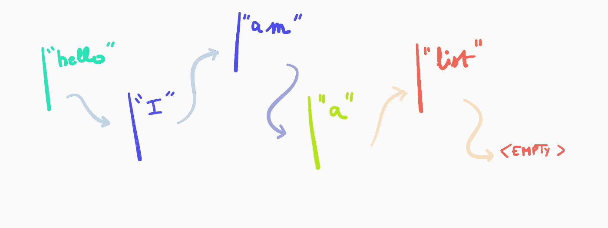**

**Figure A | Representation of a list of length 5.**

**与数组不同，列表不是连续存储在内存中的:这就是为什么我们需要跟踪每个节点的后继节点。**

**列表通常支持以下操作:**

*   **遍历，即以正确的顺序将列表的每个值传递给例程，**
*   **前置，即在列表的开头插入一个新节点，**
*   **追加，即在列表末尾插入一个新节点，**
*   **插入，即在某个任意节点之后插入，**
*   **索引，即检索给定索引的值，**
*   **斩首，即删除列表中的第一个元素，**
*   **移除，即移除任意节点。**
*   **连接，即附加另一个列表 A 的所有元素，保持 A 的节点的排序，**
*   **反转，即从 *A* 创建一个新的列表*A’*，使得*A’*包含与 *A* 出现次数完全相同的值，如果 *y* 是 *A* 中 *x* 的后继，那么 *x* 是*中 *y* 的后继***

*一个*双向链表*是一个三元组( *p* ， *v* ， *n* )，其中 *p* 表示前一个元素， *v* 表示值， *n* 表示下一个元素:它有两个指针，而不是一个，这在某些应用中可能很方便。*

# *实现单链表*

*我们将使用受函数启发的伪代码来实现列表及其操作。*

*下面是我们的列表结构:*

*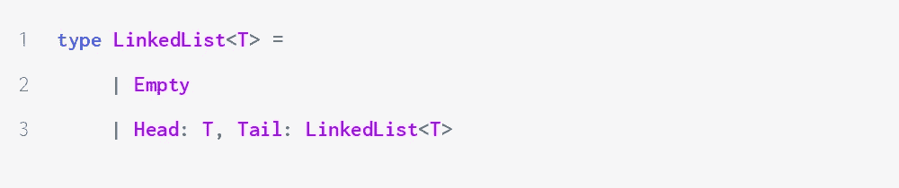*

*它被实现为依赖于类型 t 的有区别的联合。它可以取两个不同值中的一个:空，表示一个空列表，或者一对(Head，Tail)适当的类型。头部和尾部可以在恒定时间内立即被检索，例如使用从面向对象语言继承的点语法:`myBeautifulList.Head`、`myBeautifulList.Tail`。单链表通常由其第一个节点来表征。*

*最简单的操作是那些只处理列表头的操作，因为它们不需要遍历列表。*

*让我们从*前置*开始:*

*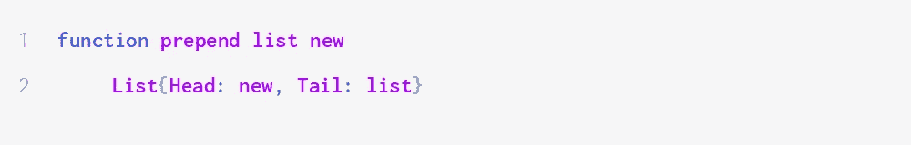*

*它创建一个新列表，列表头是新值，列表尾是原始列表。这个函数相对于列表的长度明显地在θ(1)时间内运行。*

**斩首*更简单:*

*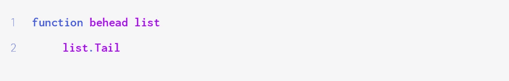*

*这又需要θ(1)时间。在实际应用中，我们可能需要在检索尾部之前检查列表是否为非空，如果不是，则失败。但是这太特定于语言和范式了，不值得在这里讨论。*

**在给定节点后插入*类似于*前置*。它获取一个列表的节点 *X* 以及一个新值，创建一个包含新值的节点，并将其设置为 *X* 的后继节点。*

*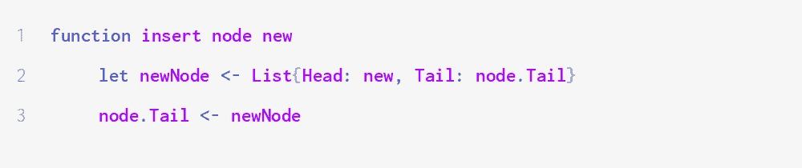*

*`node`的先前后继者成为新节点的后继者，并且新节点成为`node`的后继者，从而列表保持连接。一切仍在不变的时间里发生。*

*我们报道的下一个行动是*穿越*。它采用一个例程`f`和一个列表`list`并遍历`list`，从头到尾将每个值传递给`f`。*

*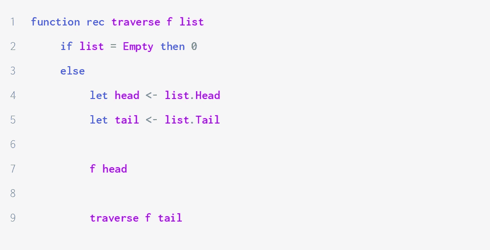*

*只要列表非空，该函数就会运行，检索头部以将其传递给例程，并递归调用列表的尾部。当我们消耗完所有节点后，我们只需通过返回某个常量值来终止。*

*遍历相对于列表的长度在θ(N)时间内运行。*

*我们可以使用相同的原理实现*索引*:*

*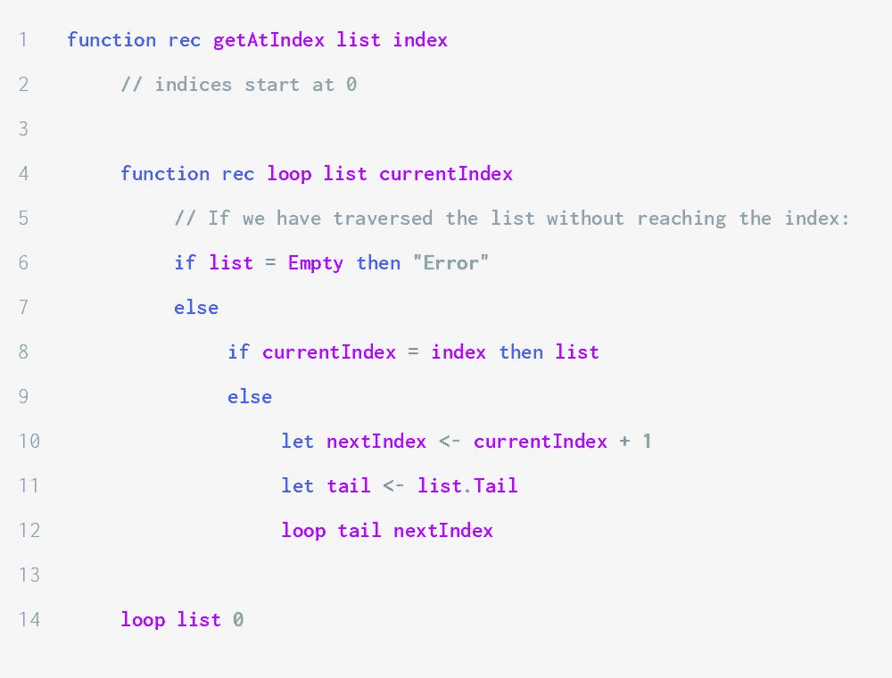*

*我们递归地检查列表中的每个元素，从 0 开始，只要列表中还有元素，并且我们还没有到达目标索引，就递增。如果索引超出范围，则函数失败，如果存在，则返回第(`index` + 1)个节点。*

*相对于列表的长度，该函数在 O( *N* )时间内运行。如果指数在范围内，那么`getAtIndex`在θ(`index`)时间内运行。这就是为什么当你经常需要索引元素时，依靠列表不是一个好主意。*

**追加*实现如下:*

*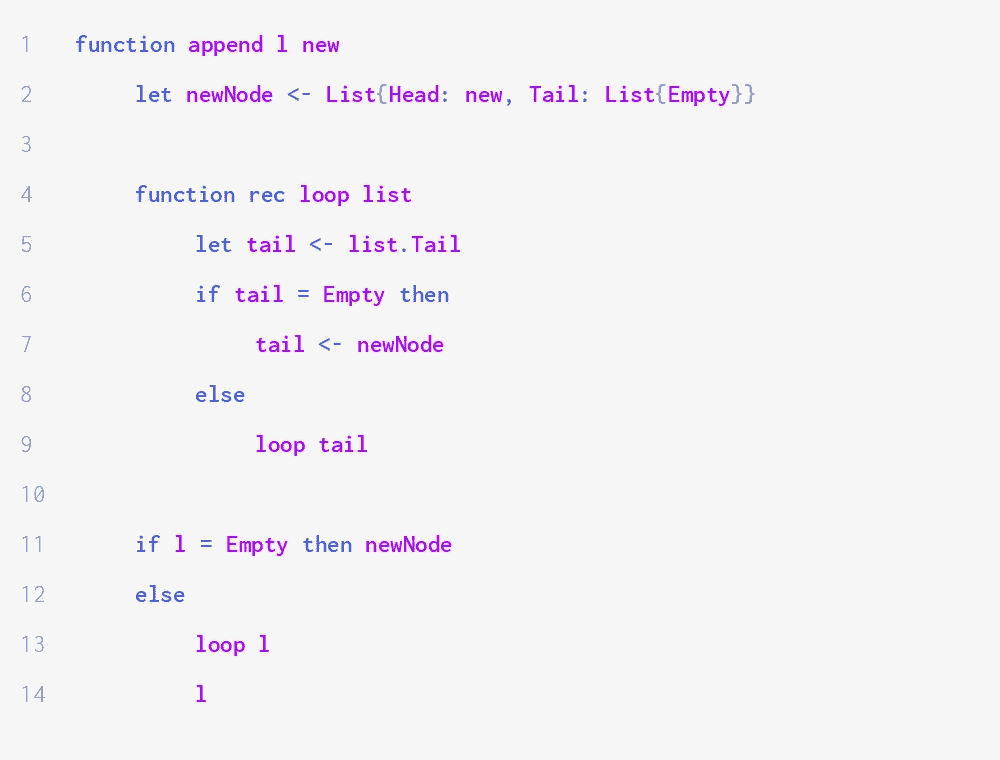*

*我们首先创建我们想要添加的节点，`new`。然后我们检查列表是否为空。如果是，那么更新后的列表只有一个节点，即第 2 行中创建的节点。如果不是，我们遍历列表，直到找到最后一个节点，即尾部为空的第一个节点。当我们找到它时，我们更新它，使它现在指向`newNode`，它成为列表的最后一个节点。最后，我们返回初始列表，`l`。*

**删除*一个节点也需要 O(N)时间。这是因为我们需要更新节点的前身，这需要使用类似于我们在前面的线性时间操作中采用的方法来检索。*

*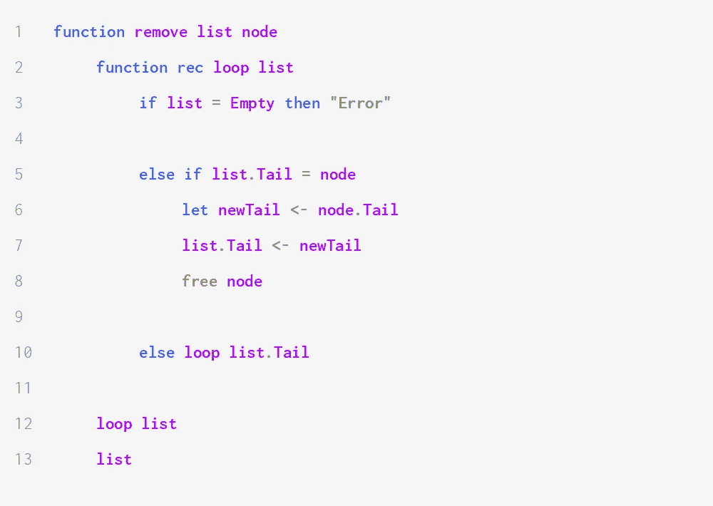*

*我们递归地遍历列表，直到找到我们想要删除的节点的前身。一旦我们找到了它(即当第 5 行中的条件评估为`true`，我们通过将`node.Tail`赋值给`list.Tail`将节点的尾部连接到它的前一个节点的尾部。在某些语言中，我们会将节点从内存中删除，如第 8 行所示。*

*我们可以考虑另一种实现方式，其中我们取想要删除的节点的值(即头),而不是对该节点的引用。在这种情况下，我们需要检查`List.Tail`是否非空，然后检查`List.Tail.Head`是否对应于我们想要删除的值。如果我们想要删除某个值的所有出现，我们将递归调用被删除节点尾部的循环，继续遍历列表，直到它被全部消耗掉。*

**串联*实际上与追加几乎相同，相对于第一个列表的长度，花费线性时间。它归结为将第二个列表的第一个节点附加到第一个列表，这给出了以下可能的实现:*

*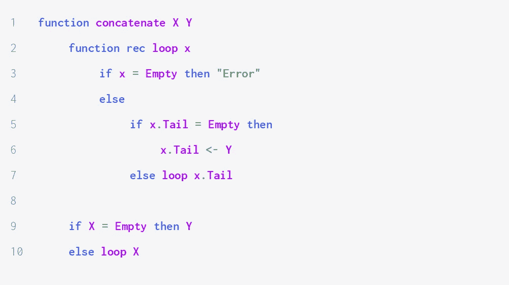*

*我们递归搜索 *X* 的最后一个元素，并将 *Y* 的第一个节点(即 *Y* 本身)赋给它的尾部。*

*实现*反转*比前面的操作要稍微复杂一点。没什么特别难的，但是它以一种乍一看很令人费解的方式操纵引用。可以这样做:*

*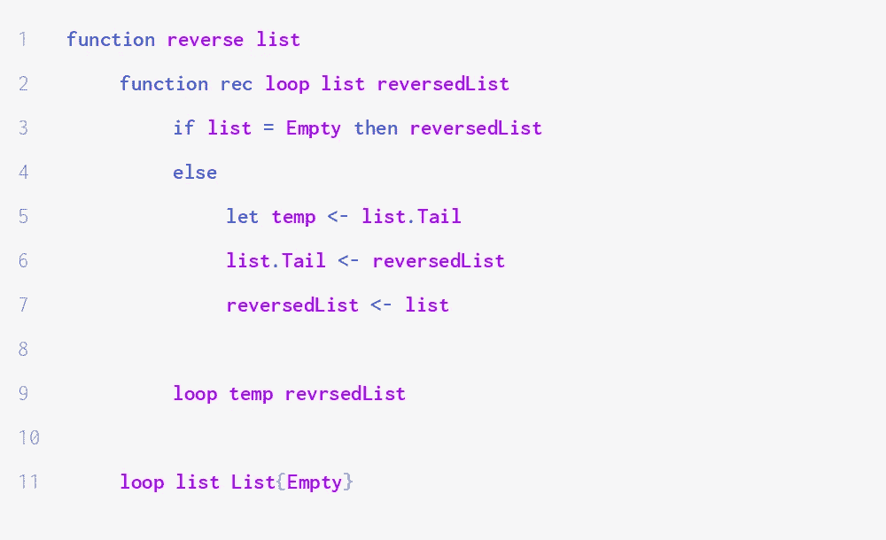*

*我们维护一个列表`reversedList`，它被初始化为一个空列表，当函数终止时对应于反向列表。递归函数`loop`接受一个列表和当前版本的反向列表。如果`list`为空，那么我们已经完成了对`reversedList`的计算，我们可以返回它。否则，我们执行以下操作:*

1.  *第 5 行:记住列表的尾部。它将在下一次递归调用中对应于`list`的值。*
2.  *第 6 行:相当于把`{Head: list.Head, Tail: reversedList}`赋给`list`。*
3.  *第 7 行:`reversedList`变成`{Head: list.Head, Tail: reversedList}`:这相当于把`list.Head`前置到`reversedList`。*

*最后，递归调用消耗列表的头部，将它添加到反向列表中，并在列表的尾部递归调用。当它已经消耗了整个列表时，`reversedList`显然对应于预期的解决方案。*

# *双向链表*

## *首次实现和一些特殊操作*

*我们递归地定义双向链表，使用两个公理:存在一个空双向链表，`Empty`，如果 *X* 和 *Y* 是相同类型的双向链表 *T* 和 *v* 是类型 *T* 那么三元组( *X* ， *v* ， *Y* )是双向链表。这给出了以下实现:*

*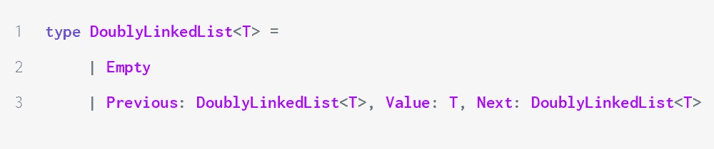*

*双向链表通常有两个引用:一个指向第一个节点，另一个指向最后一个节点。例如，这允许在不反转列表的情况下以相反的顺序遍历列表。`reversed-traversal`的实现与单链表遍历几乎相同:唯一的区别是它引用最后一个节点而不是第一个节点，并且它在`list.Previous`而不是`list.Tail`上递归。*

*我们还可以想出一个*反转*的新实现。它并不比我们看到的单链表更有效，但从技术角度来看很有趣。*

*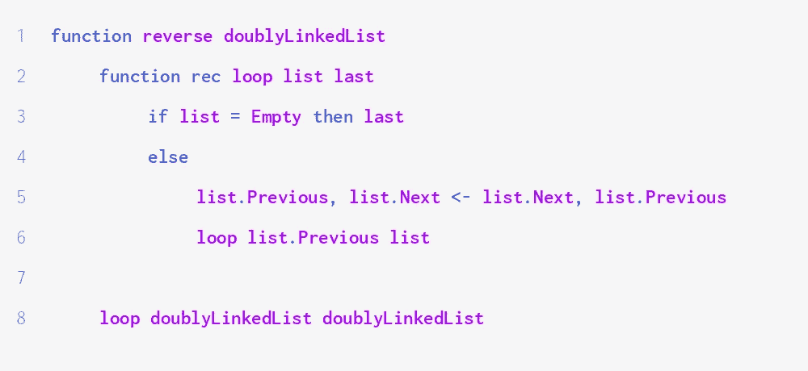*

*`loop` enables 的第二个参数是对我们访问过的最后一个元素的引用。特别地，当列表为空时，前一个元素是列表的最后一个元素，即反转列表的头部。它是函数返回的值。*

*第 5 行交换列表的两个引用:前一个节点成为下一个，前一个节点成为前一个。*

*我鼓励你试着用一个小样本列表在心里运行这个算法，以确保你理解它做什么，并给你一些直觉，为什么它是正确的。*

*图 B 显示了列表[1；2;3].*

*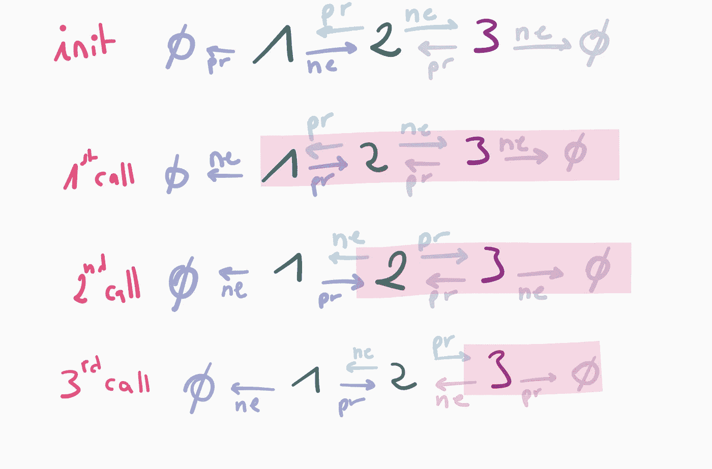*

*Figure B*

*第`n-th call`行显示了循环第 *n* 次调用结束时的列表。突出显示的部分对应于参数`list`。在第三次调用之后，`last`是值为 3 的节点。它对应于倒序列表的头部:3 的后继者是 2，2 的后继者是 1，1 没有后继者。*

*双向链表的一个很大的优点是我们可以在常数时间内删除任意节点，而不是线性的。*

*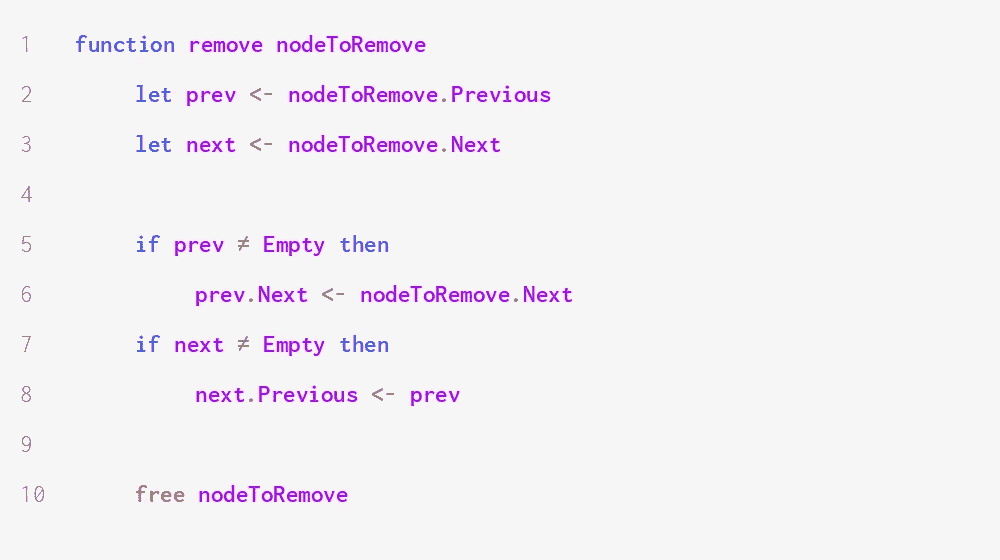*

*这是因为我们可以直接访问包含对`nodeToRemove`的引用的所有节点。这允许我们在恒定的时间内修改那些引用:`nodeToRemove`的继任者成为其前任的继任者，其前任成为其继任者的前任。*

*图 C 显示了在`nodeToRemove`、其前任和其继任者上执行的操作。红色指针对应于运行函数之前的状态，绿色指针对应于中间节点从列表中删除后的状态。*

*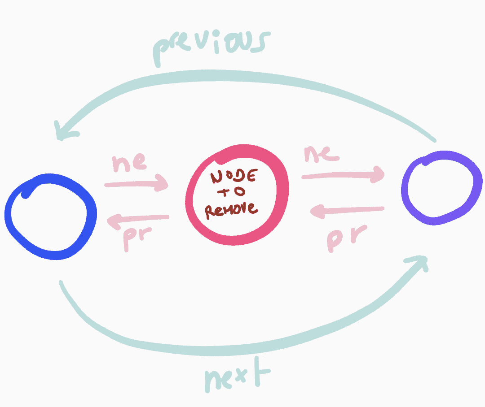*

*Figure C*

## *异或链接*

*XOR 链接是一种用于实现双向链表而不存储两个指针的方法。顾名思义，它利用了按位*异或*运算符 XOR。*

*每个节点都包含一个地址字段，而不是包含对其前任的引用和对其继任者的引用。地址字段的值为`pred XOR next`:这是两个引用的异或运算。*

*我们可以用伪代码定义一个 XOR 链表，如下所示:*

*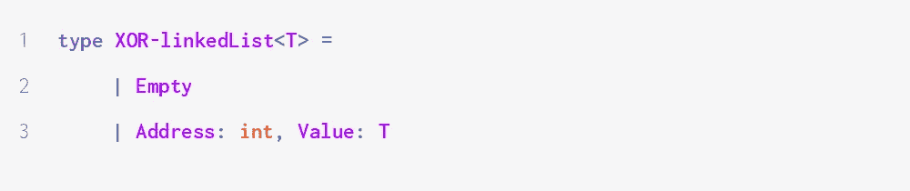*

*XOR 链接能够节省内存，但是使得实现操作更加困难和不直观。在这一节中，我们将看到一个操作是如何实现的:遍历。使用类似的规则可以导出其他实现。*

*在我们继续之前，您需要了解 XOR 的四个属性:*

*   *它是对称的，即对于所有的 *x* 、*y*:*x*XOR*y*=*y*XOR*x*；*
*   *0 是单位元，即对于所有的 *x* : *x* 异或 0 =*x*；*
*   *它是关联式的，即对于所有的 *x* 、 *y* 、*z*:*x*XOR(*y*XOR*z*)=(*x*XOR*y*XOR*z*；*
*   *对于所有的 *x* ， *x* 异或 *x* = 0。*

*让我们试着设计一个 XOR 链表遍历的算法。我们考虑一个有节点 A，B，C，…的列表。*

*我们从指向列表头部的指针开始，用`&A`表示(在本节中，我们将对指针使用与号符号)。A 的地址字段是`0 XOR &B = &B`。这使我们可以访问列表的第二个节点 b。*

*我们现在想得到一个指向节点 c 的指针。因为`B.Address = &A XOR &C`，`&A XOR B.Address = &A XOR &A XOR &C = 0 XOR &C = &C`:我们可以移动到 c*

*更一般地，指向第 *n* 个节点的指针是指向第( *n* -2)个节点的指针和第( *n* -1)个节点的`Address`字段的内容的异或。这使得能够实现如下遍历:*

*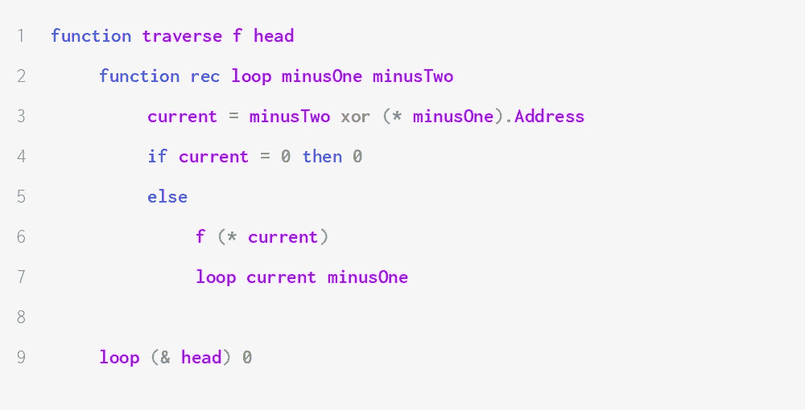*

*我们对指针使用 C 语法，即,“与”来获取指针，星号来取消引用。*

*我们首先使用前面导出的公式检索当前元素。基本情况是当它为 0 时，这表示我们已经访问了列表中的所有节点。*

*如果当前节点不为零，我们将它指向的节点传递给一个函数(不要忘记解引用！)并用`minusOne`和`minusTwo`的更新值递归调用。*