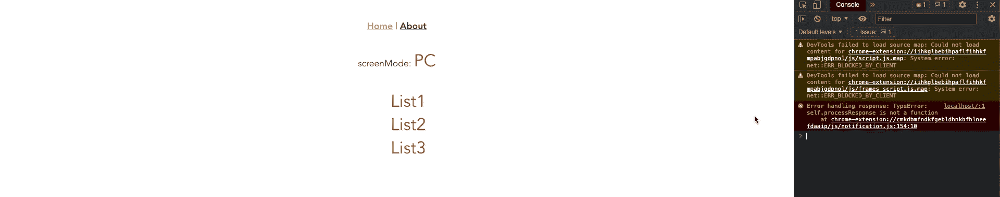

# 如何在 Vue CLI 中实现响应式设计

> 原文：<https://medium.com/geekculture/how-to-implement-responsive-design-in-vue-cli-344d497092dc?source=collection_archive---------8----------------------->

本文解释了如何用 vue3-mq × Vue CLI 开发响应式设计。vue3-mq 易于安装，任何人都可以快速开发响应设计。