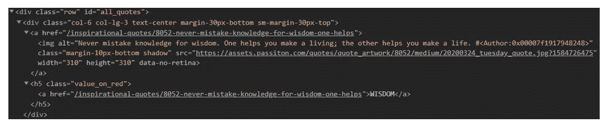

# 如何用 BeautifulSoup 和 Python 实现网页抓取？

> 原文：<https://medium.com/geekculture/how-to-implement-web-scraping-using-beautifulsoup-and-python-351610481dbe?source=collection_archive---------29----------------------->


**从网站上抓取数据主要有两种方式:**

使用网站 API:(如果已经存在)。例如，脸书有自己的[脸书](https://www.webscreenscraping.com/facebook-scraper.php)图形 API，允许检索脸书上发布的数据。

访问网页的 HTML，并从中抓取有用的数据。该方法被称为网络数据提取或网络采集或网络搜集。

这篇博客讨论了使用 Python 的 Web 抓取框架 BeautifulSoup 的实现进行数据抓取的相关步骤。

# 网页抓取的相关步骤:

*   将 HTTP 请求发送到您希望访问的网页 URL。服务器通过返回网页的 HTML 内容来响应请求。对于该任务，我们将利用第三方 HTTP 库来处理 Python 请求。
*   当我们获得 HTML 内容的访问权限时，我们的工作将是解析数据。由于大多数 HTML 数据是嵌套的，所以我们不能使用字符串处理来抓取数据。我们需要一个能够生成 HTML 数据的树结构的解析器。有许多 HTML 解析器库可用，但是最优秀的是 HTML5lib。
*   现在，我们需要导航和搜索我们所做的解析树，即树遍历。对于该任务，我们将使用其他名为 Beautiful Soup 的第三方 Python 库。这是一个从 XML 和 HTML 文件中提取数据的 Python 库。

# 步骤 1:安装必要的第三方库

在 [Python](https://www.webscreenscraping.com/hire-python-developers.php) 中安装外部库最简单的方法是使用 pip。Pip 是软件包管理系统，用于安装和管理用 Python 编写的软件包。

你只需要这样:

```
pip install requests pip install html5lib pip install bs4
```

# 步骤 2:从网页访问 HTML 内容

```
import requests URL = "https://www.geeksforgeeks.org/data-structures/" r = requests.get(URL) print(r.content)
```

是时候知道这段代码了。

*   最初，导入一个请求库。
*   之后，确定需要提取的网页网址。
*   将 HTTP 请求发送到任何指定的 URL，并将来自服务器的响应保存在名为 r 的响应对象中。
*   现在，让 print r.content 获取原始网页 HTML 内容。这是“字符串”类型。

# 步骤 3:解析 HTML 网页内容

```
#This will not run on online IDE import requests from bs4 import BeautifulSoup URL = "http://www.values.com/inspirational-quotes" r = requests.get(URL) soup = BeautifulSoup(r.content, 'html5lib') # If this line causes an error, run 'pip install html5lib' or install html5lib print(soup.prettify())
```

BeautifulSoup 库的一个优点是，它是在 HTML 解析库(如 html.parser、lxml、html5lib 等)的基础上创建的。因此，可以同时制作漂亮的对象和识别解析器库。

在给定的例子中，

```
soup = BeautifulSoup(r.content, 'html5lib')
```

我们通过传递两个不同的参数创建了一个 BeautifulSoup 对象:

这是一个原始的 HTML 内容。

html5lib:识别我们希望使用的 html 解析器。

现在，随着 soup.prettify()的产生，它提供了一个由原始 HTML 内容构成的解析树的可视化表示。

# 步骤 4:使用解析树进行搜索和导航

现在，我们想从 HTML 内容中获取一些有用的数据。soup 对象在嵌套结构中包含数据，这些数据可能是以编程方式收集的。在这个例子中，我们抓取了一个有一些引用的网页。因此，我们很想做一个程序来保存这些报价(以及所有相关数据)。

```
#Python program to scrape website #and save quotes from website import requests from bs4 import BeautifulSoup import csv URL = "http://www.values.com/inspirational-quotes" r = requests.get(URL) soup = BeautifulSoup(r.content, 'html5lib') quotes=[] # a list to store quotes table = soup.find('div', attrs = {'id':'all_quotes'}) for row in table.findAll('div', attrs = {'class':'col-6 col-lg-3 text-center margin-30px-bottom sm-margin-30px-top'}): quote = {} quote['theme'] = row.h5.text quote['url'] = row.a['href'] quote['img'] = row.img['src'] quote['lines'] = row.img['alt'].split(" #")[0] quote['author'] = row.img['alt'].split(" #")[1] quotes.append(quote) filename = 'inspirational_quotes.csv' with open(filename, 'w', newline='') as f: w = csv.DictWriter(f,['theme','url','img','lines','author']) w.writeheader() for quote in quotes: w.writerow(quote)
```

在我们继续之前，我们建议您体验我们通过 soup.prettify()技术打印的网页 HTML 内容，并尝试找到导航报价的模式或方法。

您可以看到所有的引号都在 div 容器中，该容器的 id 包括' all_quotes '。因此，我们通过 find()技术获得 div 组件(在给定代码中称为 table ):

```
table = soup.find('div', attrs = {'id':'all_quotes'})
```

第一个参数是您希望搜索的 HTML 标记，第二个参数是 dictionary kind 元素，用于指定与标记相关的额外属性。find()技术返回初始匹配元素 a。您可以尝试打印 table.prettify()来了解代码的作用。

现在，在这些表元素中，可以注意到每个引用都在 div 容器中，并且 class 被引用。因此，我们在引用该类的每个 div 容器中重复。

现在，我们利用 findAll()技术，它类似于查找参数的方法，但是它返回不同匹配元素的列表。每个引用都使用名为 row 的变量进行迭代。

这里给出了行 HTML 内容的示例，以便更好地理解:



现在，考虑这里给出的代码:

```
for row in table.find_all_next('div', attrs = {'class': 'col-6 col-lg-3 text-center margin-30px-bottom sm-margin-30px-top'}): quote = {} quote['theme'] = row.h5.text quote['url'] = row.a['href'] quote['img'] = row.img['src'] quote['lines'] = row.img['alt'].split(" #")[0] quote['author'] = row.img['alt'].split(" #")[1] quotes.append(quote)
```

我们制作了一个字典来保存关于报价的所有数据。它的嵌套结构可以与点符号一起使用。为了在 HTML 元素中使用文本，我们使用了。文本:

```
quote['theme'] = row.h5.text
```

我们可以添加、修改、访问或删除标签的功能。这是通过像对待字典一样对待标签来实现的:

```
quote['url'] = row.a['href']
```

最后，所有报价都被添加到名为 quotes 的列表中。

总之，我们希望将所有数据保存在 CSV 文件中。

```
filename = 'inspirational_quotes.csv' with open(filename, 'w', newline='') as f: w = csv.DictWriter(f,['theme','url','img','lines','author']) w.writeheader() for quote in quotes: w.writerow(quote)
```

我们已经创建了一个名为 inspirational_quotes.csv 的 CSV 文件，并将所有报价保存在该文件中以供将来使用。

因此，这是一个关于如何使用 Python 制作 web scraper 的简单例子。从那里，你可以试着删除你选择的其他网站。对于所有的查询，您可以使用评论部分。

*最初发表于*[*【https://www.webscreenscraping.com】*](https://www.webscreenscraping.com/how-to-implement-web-scraping-using-beautifulsoup-and-python.php)*。*