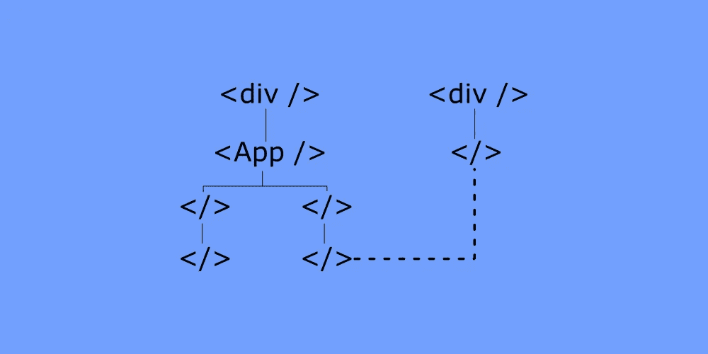
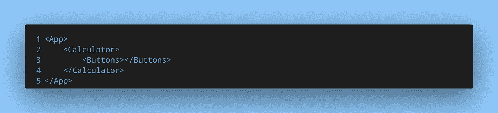
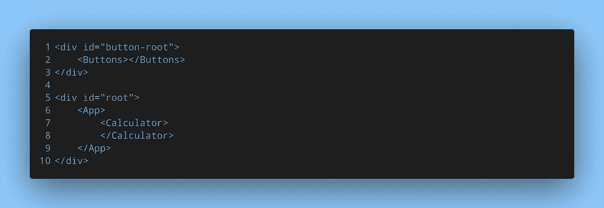
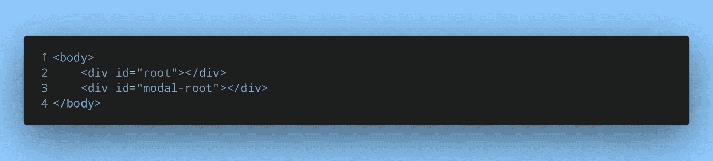
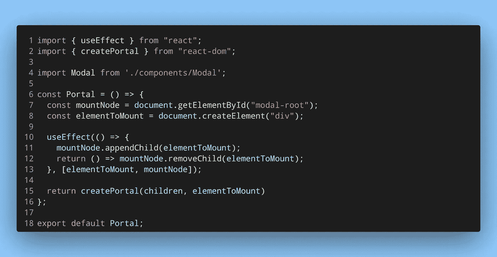
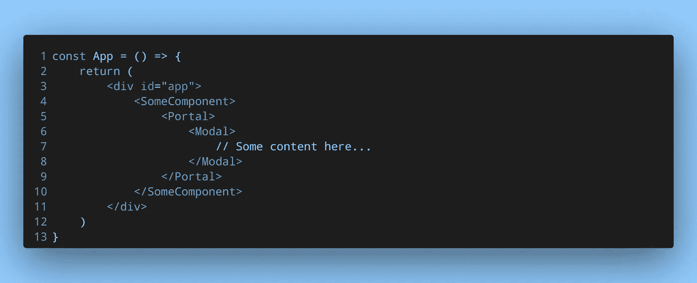
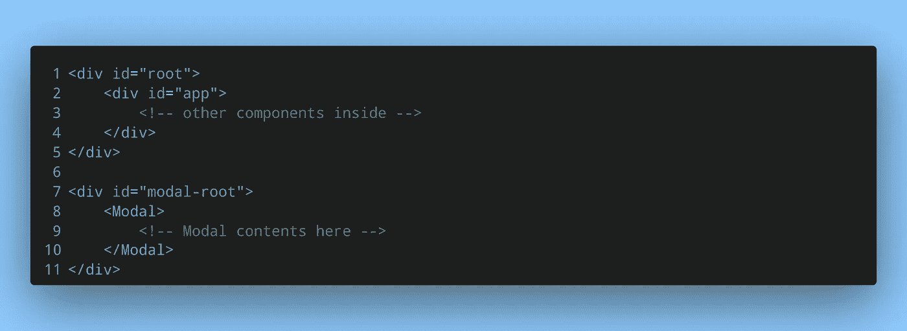

# 如何用 React Portal 改进 DOM 结构

> 原文：<https://medium.com/geekculture/how-to-improve-dom-structure-with-react-portal-6e6fe249bcc5?source=collection_archive---------4----------------------->

# 这是什么？

根据[官方 React 文档](https://reactjs.org/docs/portals.html)，

> *门户提供了一种一流的方式来将子组件呈现到位于父组件的 DOM 层次结构之外的 DOM 节点中。*

看一下这个例子——假设您有一个`Calculator`组件，其中有一个`Buttons`组件。它看起来会像这样:

根组件`App`及其所有子组件将呈现在一个 DOM 节点中(很可能是一个 id 为`#root`的 div)。使用 React Portal，可以在 id 为`#root`的 div 外部呈现像`Buttons`这样的子组件。您可以想象 DOM 的结构是这样的:

DOM structure after using React Portal

# 我为什么要知道这个？

在某些情况下，有必要在根元素之外呈现一些 JSX 或组件。这种情况的最好例子是模态。

模态通常会覆盖整个屏幕。人们会认为这也会反映在 DOM 结构中。然而，React 中不会发生这种情况。如果一个模态嵌套在一个组件中，这也是 DOM 结构看起来的样子。这可能会让使用屏幕阅读器的人感到困惑。从可访问性的角度来看，这是一个问题。

在普通的 JS 和 HTML 中解决这个问题可能有点容易，但是在 React 中就比较难了。因为 React 应用程序只有一个挂载点，所以将元素或组件放在这个挂载点之外是一个挑战。有了 React Portal，这变得很容易。

尽管元素或组件将被*移植到*一个不同的 DOM 节点，但它仍将作为一个常规的 React 元素。这意味着我们的模态与挂载点在不同的 DOM 节点中。但是它仍然可以接收属性和状态，并且表现得像一个常规的嵌套 React 元素。

# 我如何使用它？

让我们使用上一节中的模态例子。创建 React 门户并将其挂载到不同的 DOM 节点可以分两步完成:

# 第一步:

创建另一个 DOM 节点来挂载模型:

New div in the HTML file

React 应用程序将被挂载到 id 为`#root`的 div 中。模态将被安装到 id 为`#modal-root`的 div 上。

# 第二步:

创建门户包装组件:

Wrapper component that implements React Portal

这个包装器组件将接受一个子元素，并为它创建一个门户。`useEffect`挂钩安装元件，并在组件卸载时进行清理。

下面是它可能的样子:

Wrapping Modal with the wrapper component

即使`Modal`组件嵌套在应用程序层次结构中，它在 DOM 结构中看起来也会不同:

DOM structure after using React Portal on Modal

在真正的 DOM 结构中，你不会像这样直接看到`Modal`组件，而是看到一个 div。这只是一个演示。

# 额外资源

1.  [本文](https://blog.logrocket.com/learn-react-portals-by-example/)有另一个使用 React 门户的好用例。
2.  一个[对话框组件](https://malcoded.com/posts/react-portals/)也是一个很好的场景，React Portal 非常方便。
3.  你需要 React 门户网站的推荐人吗？那么【React 16 的这个解决方案可能会有帮助。
4.  了解如何使用 React 挂钩、上下文和门户创建模态组件。

*原载于* [*我的* *博客*](https://niharraoteblog.netlify.app/guide-to-react-portals) *。*