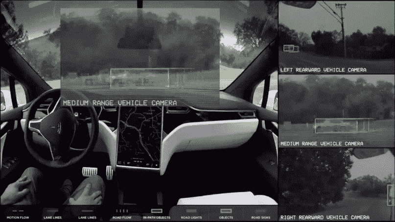
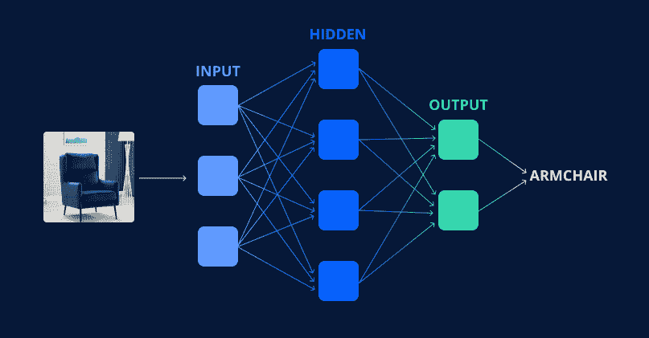
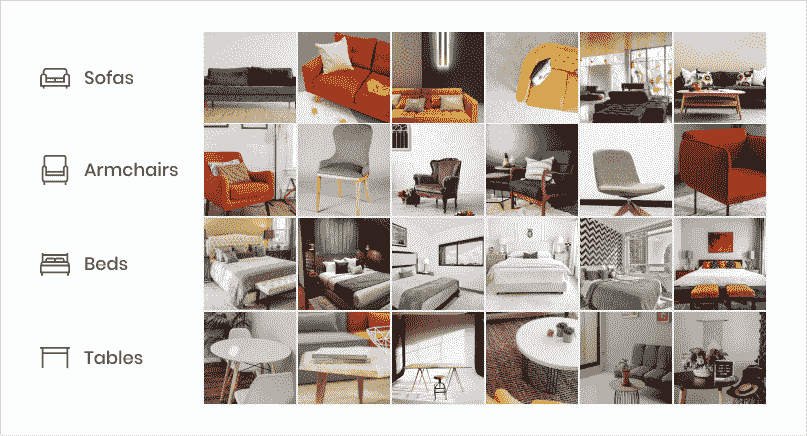
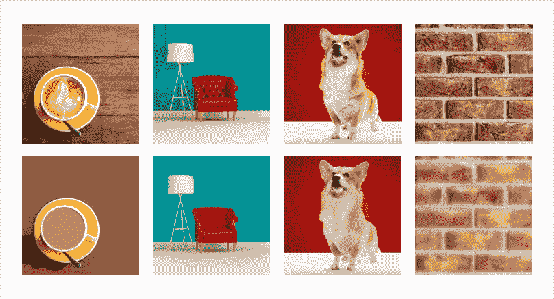
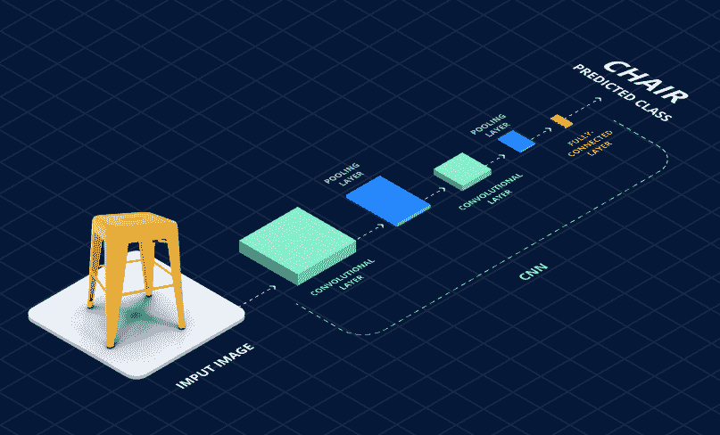
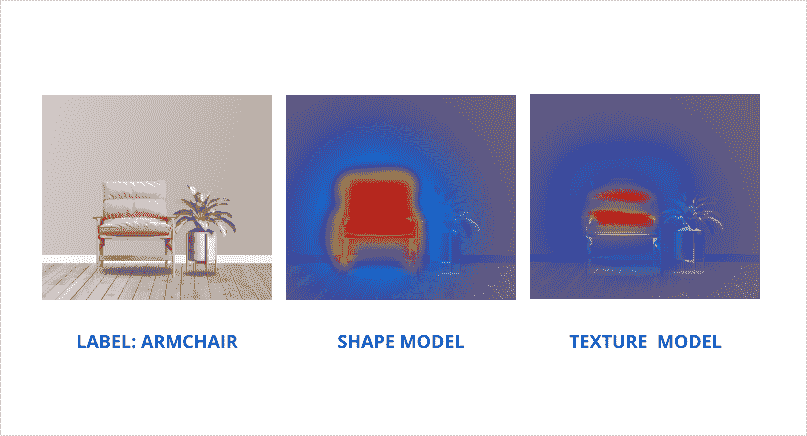
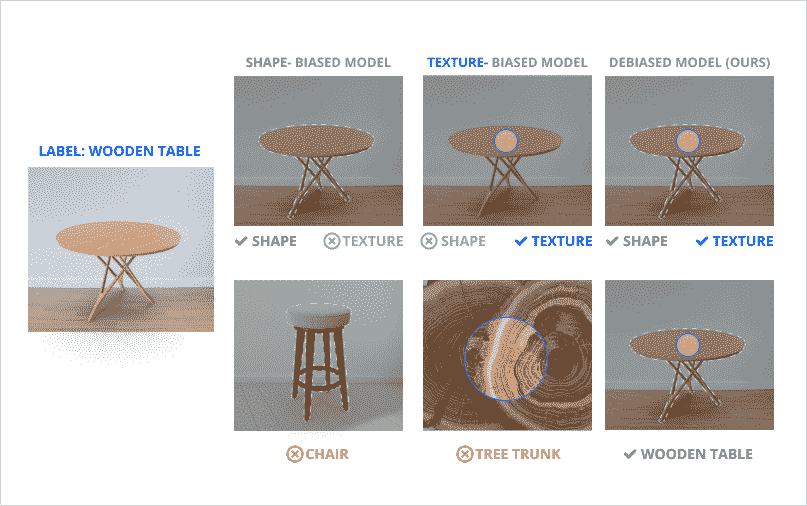

# 如何提高 2 倍训练神经网络的效率

> 原文：<https://medium.com/geekculture/how-to-improve-the-efficiency-of-training-neural-networks-2-times-8827f323d2a6?source=collection_archive---------14----------------------->

自 2019 年以来，[我们公司](https://jaydevs.com/)一直在为家具店开发解决方案——[佐拉克](https://zolak.tech/)。在它的帮助下，用户可以在室内试穿不同类型的家具。

一切看起来都很简单:旧家具消失了，新家具出现在它的位置上。然而，通常情况下，在明显的简单背后有更多的东西。在我们的例子中，这些是神经网络。他们是做所有粗活的人:他们定义物体，并在物体被移走后修复内部。

在两年与神经网络的合作中，我们学会了如何以更低的成本更快更好地训练它们。现在，我们想与你分享这一经历。

在本文中，我们将讨论:

*   什么是神经网络；
*   神经网络是如何工作的；
*   我们如何提高训练神经网络的效率。

# **神经网络如何为公司创造竞争优势，为什么数据是“新黄金”**

首先，我们需要理解——为什么值得关注神经网络。

计算机视觉技术以及一般的神经网络正变得越来越流行。它的用途可以在许多应用中找到。从 MSQRD 中的面具到试穿运动鞋，甚至是特斯拉，它需要从其车载摄像头中检测和跟踪物体，以实现自动驾驶。在每一种情况下，这样的功能都将应用程序与其竞争对手区分开来。

*Tesla’s autopilot detects objects*

公司利用人工智能作为竞争优势的例子还不止这些。

像网飞、优步和 Instagram 这样的应用程序的成功不是他们的想法。甚至在他们之前，就有视频流应用、出租车和社交网络。他们的成功，在于他们不为人知的技术。尤其是他们收集和使用的数据。

每一次点击、每一次滚动和每一个其他的“用户事件”都会进入他们的数据库，供以后分析。他们所有的活动都集中在确保你的用户体验接近完美。当然，这样大量的数据不是任何人都能够分析的，在这里，神经网络又来了。

考虑到所有这些例子，我们可以得出一个合乎逻辑的结论:今天，随着神经网络一起访问大量的用户数据是市场上最强的竞争优势之一。

# **什么是神经网络及其工作原理**

## 什么是神经网络

神经网络是一个数学模型，以及它的软件和硬件实现。该网络是在生物神经网络的基础上建模的，其中神经元通过突触相互连接。由于这一点，它得到了它的名字。

通常，神经网络由 3 层神经元组成:

*   输入层，输入信号通过该层被分配给其余的神经元；
*   将输入信号转换成中间结果的隐藏层；
*   和输出响应的输出层。

*Simple neural network diagram*

神经网络用于解决各种各样的问题。它们被用来做预测、识别物体、解决管理任务等等。他们每个人都有自己的特点。

> 在本文中，我们将更深入地了解神经网络在物体识别中的工作。

## 什么是数据集

就像生物网络一样，人工神经网络通过训练获得知识。对于这种训练，我们需要准备特殊的数据集。

数据集是为特定目的收集的一组数据。数据可以是各种格式。在我们的例子中，这是一组经过处理的照片，适合由机器学习算法进行处理。

*Example of a dataset*

需要这样的样本来训练神经网络，以便以后使用它来解决实际问题。

# 神经网络是如何训练的

神经网络可以比作一个学习新事物的孩子。一开始，它很难很好地解决问题，但一个网络的经验越多，它就做得越好。

为了学习，网络必须明白:什么对解决一个问题是“好的”，什么是“坏的”。为此，我们需要确定特征，基于这些特征，神经网络做出决策。

*The neural network learns like a child*

例如，要正确识别一个物体，网络必须了解这个物体是什么形状，它由什么材料组成，它如何与周围的空间相互作用等。

在训练神经网络的初始阶段，这些标志非常简单，例如，我们用四条腿和一个桌面来定义一张桌子。但是我们训练网络的时间越长，它运作的特征就越多。并且在某个阶段，我们不再能准确地说出神经网络是如何识别照片中的同一张桌子的。

考虑到搜索对象可能有数千甚至数百万个选项，对象的明确定义及其替换是极其困难的任务。当然，您希望您的应用程序能够检测到它们。在这种情况下，基础是神经网络的对象检测的准确性。

通常，这类任务只需通过扩大数据集即可解决。神经网络接收更多的输入数据，获得更多的“经验”，并相应地以更高的精度定义对象。

在某种程度上，这是可行的，但是项目越发展，需要的数据集就越大。数据集越大，对基础架构的投资和控制就越多。

在这样的时刻，你想知道当前的培训过程有多有效，是否可以改进。

# 如何提高神经网络的效率

> *效率是一个相对值，表示实现的结果和使用的资源之间的比率。*

## 从哪里开始

首先，我们需要了解我们是否需要它。是的，投入改进的资源并不总是带来积极的结果。

因此，开发人员通常会在改进不影响业务发展的技术特性上花费太多时间。同时，由于对技术任务的复杂性缺乏了解，业务代表的要求可能是不现实的。这就是为什么改进产品的决定总是由公司的技术和业务部门之间的对话做出的。

*Dialogue between the technical and business sides of the company*

在我们的案例中，我们设定了一个目标:用尽可能少的数据集来提高神经网络识别物体的准确率。

由于我们数据集的基础是图像，我们不得不深入到图像的最基础部分——它由什么组成。因此，我们开发了一种方法，可用于与计算机视觉和图像中的对象识别相关的各种任务。

## 结构和纹理

我们周围看到的所有物体都是由结构和纹理组成的。

结构层是图像的平滑版本，没有称为纹理的“次要”细节。

纹理是物体结构中规则或不规则分布的重复图案。纹理的例子:桌子表面不同的粗糙度、光的反射、阴影等。

*Images with and without texture*

经过多年的进化，人类的视觉系统已经学会了巧妙地过滤纹理层。因此，心理学研究表明，一般结构特征是人类感知的主要数据。我们只是对质地不够重视。

对电脑来说就不一样了。

结构和纹理在物体识别中起着重要的作用。十年前，计算机视觉研究人员手工开发了许多基于结构和纹理的功能来识别物体。此外，他们发现，两者的正确组合可以提高识别能力，证明了这两种特征各自的优势。

目前，由于卷积神经网络(CNN)的普及，用于对象识别的特征是自动确定的，而不是手动开发的。

> *卷积神经网络——一种特殊的神经网络架构，旨在实现高效的图像识别。*

*How a convolutional neural network works*

这一变化不仅促进了人类设计识别算法的努力，还显著提高了神经网络的性能。没有必要让一个人考虑每一个特定的情况，神经网络现在可以识别特征本身。

然而，自动化也对物体识别进行了负面调整。证明了 CNN 研究的函数倾向于偏向于结构或纹理，这取决于数据集的内容。

对于神经网络来说，在与结构和纹理相关的特征之间找到平衡变得更加困难。因此，它无法实现其最大性能。

以上这些都促使我们在定义物体时，更仔细地审视纹理和结构的相互作用。

## 定义对象时，结构和纹理如何相互作用

为了理解纹理和结构是如何相互作用的，我们准备了分别偏向两个方向的模型。

为此，我们使用一种特殊的算法，将图像中的纹理与结构分离，然后准备相应的数据集并在其上训练模型。

结果，正如预期的那样，偏向于纹理和结构的模型比传统的、较少偏向的模型具有更差的识别准确性。该模型专注于结构确定的对象，准确率为 91.7%，该模型训练纹理，准确率为 91.5%。而原始模型的准确率为 92%。

尽管如此，我们发现它们是高度互补的。如图所示，偏向于结构和纹理的模型使用不同的信号进行预测。

*The attention of biased models is focused on different features*

例如，在中间的照片中，偏向于结构的模型主要集中在扶手椅的外边缘，而强调扶手椅材料纹理的模型分别使用扶手椅的形状和纹理。

这允许我们假设当前的模型可以被改进，该模型自动偏向于结构或纹理。为此，我们需要教会模型在纹理和结构之间找到平衡。

## 我们如何提高神经网络训练的效率

为了教会模型在纹理和结构之间找到平衡，我们准备了一个基于给图像分配标签的新框架。

为此，我们提前准备了一个数据集，在其中我们分配了特殊的标签:s——用于具有结构的图像，t——用于具有纹理的图像。然后，在训练神经网络的过程中，我们尝试使用以下公式来确定第三个“理想”标签“y ”:

> y=k*s+(1-k)*t

其中 k 是从 0 到 1 之间手动选择的系数，它允许您在定义对象时控制纹理和结构的相对重要性。

通过将系数 k 从 0 变为 1，我们可以将模型从关注纹理(其中 k=0)发展到关注结构(其中 k=1)的模型。尽管这两种极端情况都会导致模型性能不佳，但我们已经确定，在该线段上存在一个“理想”点，允许我们在定义对象时找到结构和纹理之间的平衡。

*How our model defines objects*

因此，这种方法使我们能够将家具项目的识别率从 92%提高到 93.2%，同时训练所需的数据集数量从 97500 个样本大幅减少到 39000 个样本。这使我们能够将数据集管理和培训时间的成本减少 40–50%。

# 结论

在我们这个时代，一家公司的成功与它的技术先进程度密切相关。产品越好，完成任务的效率越高，公司就越有可能赢得市场竞争。

这就是为什么像谷歌和微软这样的巨头会雇佣那些不仅从表面上，而且从内部了解产品工作原理的人。只有了解基础是如何工作的，你才能实现质的飞跃，创造出真正创新的产品。

在我们的例子中，我们已经展示了即使如此小的效率改进也能带来显著的效果。这种方法可以用来解决与图像中对象的定义以及随后对它们的处理相关的各种问题。

*最初发表于*【Jaydevs.com】