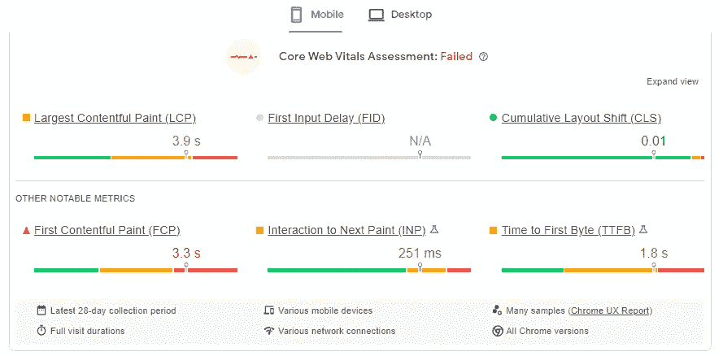
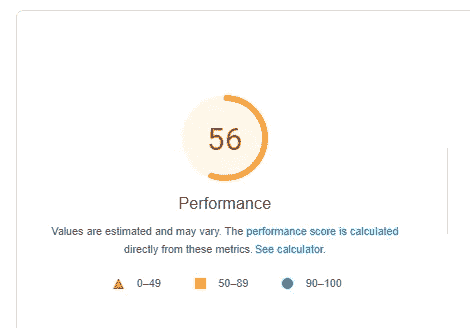
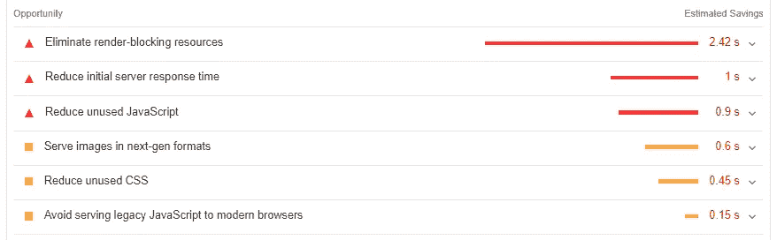
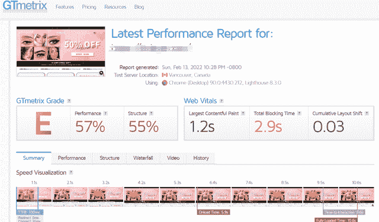
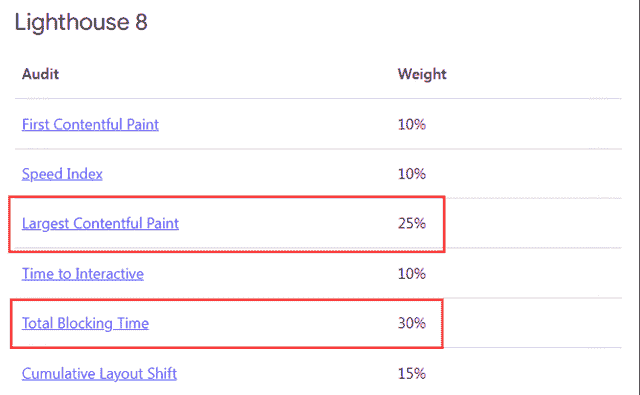
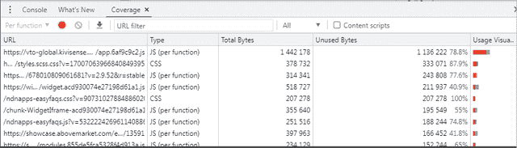
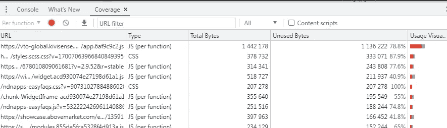
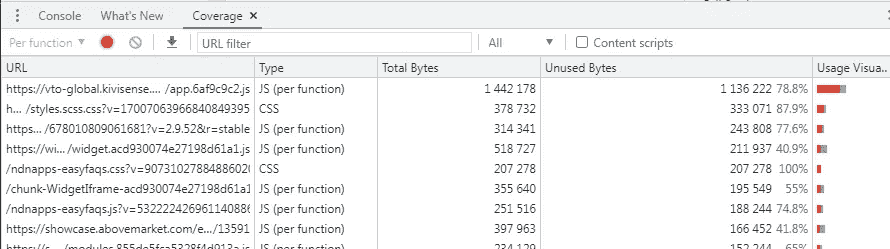

# 如何提高网站加载速度

> 原文：<https://medium.com/geekculture/how-to-improve-website-loading-speed-cd0259b505a6?source=collection_archive---------8----------------------->

**为什么要关注网站加载速度**

页面加载时间过长会严重影响跳出率

谷歌的报告指出:

如果页面加载时间从 1 秒增加到 3 秒，跳出率会增加 32%

如果页面加载时间从 1 秒增加到 6 秒，跳出率会增加 106%

**二、如何检测网站加载速度**

**1。页面速度洞察**

在这里可以查看移动端和桌面端的加载速度，以及优化建议，并根据优化建议优化相应的页面。

[Page speed insights](https://pagespeed.web.dev/)

这里的分数显示了你的网站的加载速度等级:红色表示差，橙色表示中等，绿色表示好。

[Page performance](https://pagespeed.web.dev/)

下面会有优化建议。按照这里的优化建议来优化可以优化的 URL 页面。

[Optimization suggestions](https://pagespeed.web.dev/)

**2.gtmetrix.com**

这里可以看到我们网站在桌面端的加载速度，并给出一些优化建议。红色差，橙色中等，绿色好。

[Page performance](https://gtmetrix.com/)

**三、网站加载速度慢的原因**

我们的一些桌面和移动页面加载问题可以在 GSC 的核心网络指标中看到:

**1。FCP 问题**(第一个内容绘制——从页面加载开始到用户看到页面第一个内容元素的时间)；

**2。LCP 问题**(最大内容渲染——用户打开网站看到页面最大元素所需的时间)

**3。FID 问题**(首次输入延迟——用户第一次与网页交互时，浏览器的响应时间)

**4。CLS 问题**(累积布局偏移——网页元素的意外偏移)等。

在网站加载速度的评分中，LCP 和 TBT (FID)的权重最高，我们可以重点关注这两个指标。

[Page loading issues](https://support.google.com/)

LCP 不佳的原因有:

(1)服务器响应速度慢；(2) JavaScript 和 CSS 增加渲染时间；(3)资源加载速度慢；(4)客户端渲染慢等。

技术性贸易壁垒(FID)低的原因是:

Google inspect element

图片来源:google 开发工具(1)重 JavaScript 执行；(JavaScript 的执行时间；(3)第三方代码阻碍主线程执行等。

**4。如何提高网站加载速度**

**(1)优化 LCP**

**1。提高服务器响应速度(优化首字节时间)**

(1)优化的服务器，使得服务器可以在浏览器请求时立即提供静态页面。

(2)使用 CDN 将用户分散到附近的 CDN，靠近的服务器网络可以加快网速。

(3)浏览器缓存，使用浏览器缓存可以减少首字节时间，缓存优先用于提供 HTML 页面。

(4)尽快建立第三方连接。第三方域的服务器请求也会影响 LCP。使用 rel="preconnect "通知浏览器您的页面打算尽快建立连接。

**2。减少渲染阻塞的 JavaScript 和 CSS**

(1)减少 CSS 阻塞时间，减少 CSS；惰性加载非关键 CSS

(2)减少 JavaScript 阻塞时间，剪切压缩 JavaScript 文件；惰性加载未使用的 JavaScript

(3)尽量减少未使用的聚合填料。

**3。提高资源加载速度**

(1)优化和压缩图像

a.首先考虑不用图像。如果图片与内容无关，删除；b .将图像压缩到一定大小(使用 Imagemin)；c .将图像转换为较新的格式(JPEG 2000、JPEG XR 或 WebP)；d .使用响应图像，自适应桌面和移动图像；e .考虑使用图像 CDN 内容交付网络。

(2)预加载重要资源。用于更及时地获取此资源。

(3)压缩文本文件。Gzip 和 Brotli 压缩 HTML，CSS，JavaScript。

(4)适应性服务。根据网络连接的具体情况，显示不同的界面内容。

(5)使用服务工作器来缓存内容。

**4。改善客户端渲染**

如果是搭建客户端渲染网站，要注意优化客户端渲染时间。

a.减少 JavaScript 阻塞时间；b .使用服务器端渲染；c .使用预渲染；

**(2)优化 FID (TBT)**

FID 的优化指南是改善总阻塞时间(TBT)

**1。减少第三方代码的影响**

a.按需加载第三方代码；b .减少不必要的第三方代码和脚本；

**2。减少页面的 JavaScript 代码**

a.减少单个页面上的 JavaScript 量；b .长任务拆分 JavaScript

b.减少 javaScript 的执行时间

c.懒加载不用的 JavaScript

Chrome DevTools 中的 Code Coverage 选项卡可以告诉你页面上有多少未使用的 JavaScript。

[Google Dev Tools](https://developer.chrome.com/docs/devtools/)

b.最小化未使用的 JavaScript。

**4。使用网络工人**

Web workers 允许 JavaScript 在后台线程上运行。将非 UI 操作转移到单独的工作线程，这样可以减少主线程的阻塞时间。

**5。最小化主线程工作**

当一个网站忙于处理主线程时，它可能无法快速响应用户交互，从而导致糟糕的用户体验。

a.优化第三方 JavaScript 避免大而复杂的布局；c. Minify CSS，defer 非关键字 CSS；d .拆分以减少 JavaScript 负载；e .删除未使用的代码。

**(3)优化网站加载速度的重要途径**

**1。优化图像**

(1)使用正确的图像格式，PNG、JPEG 或 WebP 更好；

(2)使用合适大小的图像，使用“Imagein”对图像进行压缩，或者使用其他图像压缩插件进行压缩；

(3)用视频代替 GIF。如果网页上有 GIF，尽量转换成视频。GIF 动画可能会占很大的流量；

(4)使用响应图像在不同设备上浏览；

(5)使用 CDN 图片减少图片文件的传输大小；

(6)延迟加载离屏图片，使用 lazy sizes codelab 延迟加载离屏图片。

**2。优化视频**

(1)延迟加载视频，页面上的视频，尤其是离屏视频，可以延迟加载，可以提高页面的加载速度；

(2)使用外部视频托管平台，如 YouTube、Vimeo 或 Wistia，以节省空间和加快加载速度。

**3。优化 CSS**

(1)无键 CSS 的懒加载；

(2)缩小 CSS

(3)删除不用的 CSS

(4)提取关键 CSS。

使用 Chrome DevTools 中的 Coverage 选项卡来识别非关键的 CSS 和 JS。绿色(关键)，红色(非关键)。

[Chrome DevTools](https://developer.chrome.com/docs/devtools/)

**4。优化 JavaScript**

(1)大型 JavaScript 文件的延迟加载，这确保了您的其余内容可以立即加载；

(2)通过代码拆分降低 JavaScript 负载，任务长的 JavaScript 会占据更长的加载速度；

(3)删除不用的代码；

使用 Chrome DevTools 中的 Coverage 选项卡来确定哪些代码是关键的，哪些是未使用的。单击查看区段代码。

[Chrome DevTools](https://developer.chrome.com/docs/devtools/)

(4)使用现代代码加速页面加载。

**5。预加载重要资源**

(1)内容传送网络的使用；

(2)预加载关键资源；

(3)提前建立网络链接。

**6。优化第三方资源**

(1)减少不必要的第三方代码，如各种插件、聊天工具等。；

(2)屏蔽缓慢的第三方 JavaScript

(3)高速加载必要的第三方 JavaScript。

**7。优化网站字体**

使用不同浏览器和设备通用的系统字体，减少字体下载时间。

**8。避免多次页面重定向，重定向会降低页面加载速度**

用 screamingfrog.co.uk 检查我们重定向的页面，看看哪些页面是需要重定向的(包含的，有反向链接的，显示的点击)，不必要的可以直接删除，减少重定向额外的 HTTP 请求。

**9。使用 Facade 延迟加载第三方资源**

视频嵌入、社交按钮小部件、聊天小部件都可以使用 facade 模式来延迟加载这些第三方元素，提高页面加载速度，而不是直接在 HTML 中添加第三方嵌入。

**10。启用浏览器缓存**

启用浏览器缓存。当用户第一次浏览您的网站时，网站的数据将被缓存在浏览器的临时存储库中。当用户再次访问时，浏览器可以加载页面，而无需向服务器发送另一个 HTTP 请求。